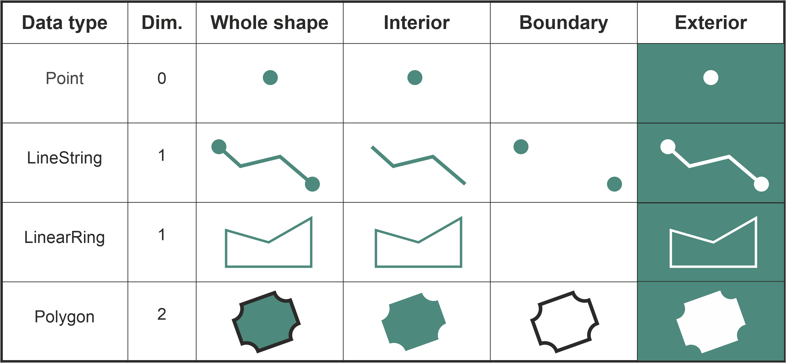
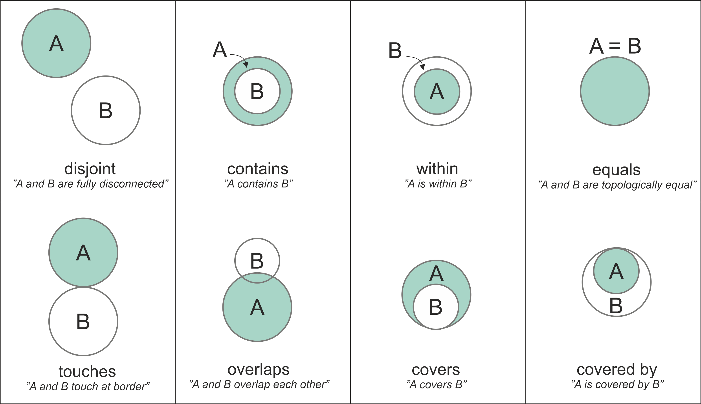
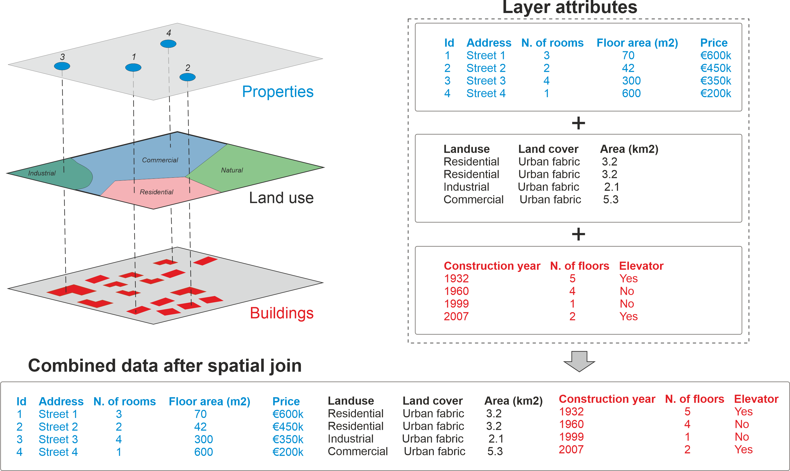
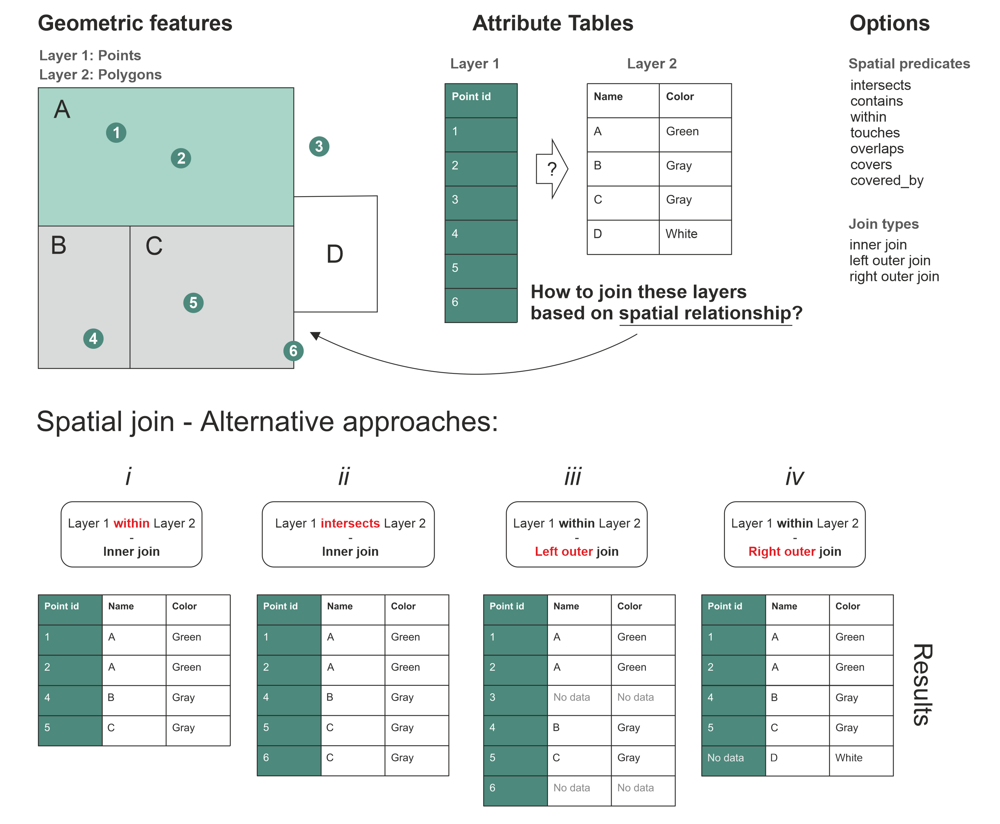
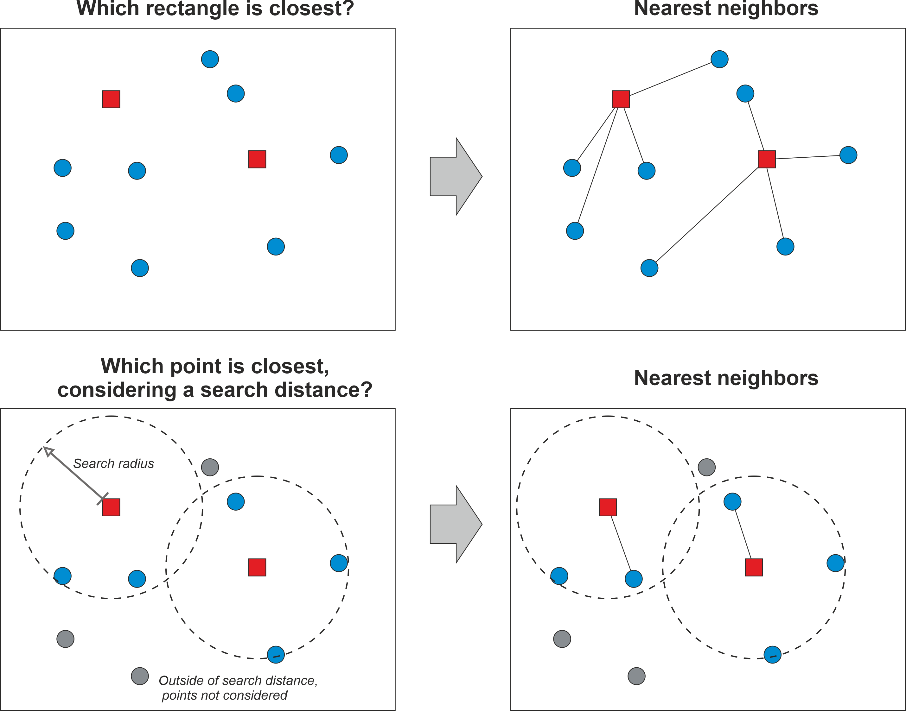

## Spatial relationships
:::{.callout-tip icon=false}
## Overview

Question: how the data layers are located in relation to each other?

- finding out if a certain point is located inside an area
- or whether a line intersects with another line or a polygon
:::

:::{.callout-note icon=false}

- These kind of queries are commonly called as *`spatial queries`*.
- Spatial queries are conducted based on the *`topological spatial relations`* 
  - *contains*
  - *touches*
  - *intersects* 
:::

## Topological spatial relations
:::{.callout-tip icon=false}
## DE-9IM

- There are different ways to compute these queries
- Most GIS software rely on *`Dimensionally Extended 9-Intersection Model`* ([DE-9IM](https://en.wikipedia.org/wiki/DE-9IM)).
- DE-9IM defines the topological relations based on the **interior**, **boundary**, and **exterior** of two geometric shapes and how they intersect with each other.
- DE-9IM also considers the dimensionality of the objects. 
  - The `Point` objects are 0-dimensional
  - `LineString` and `LinearRing` are 1-dimensional
  - `Polygon` objects are 2-dimensional.   
:::

## Topological spatial relations



## Topological spatial relations
:::{.callout-tip icon=false}
## Spatial predicates
When testing how two geometries relate to each other, the DE-9IM model gives a result which is called *`spatial predicate`* (also called as *`binary predicate`)*. 

- intersects,
- within,
- contains,
- overlaps
- touches

There are plenty of topological relations: altogether 512 with 2D data.
:::

## Topological spatial relations


## Topological spatial relations
:::{.callout-tip icon=false}
## Types
- When the geometries have at least one point in common, the geometries are said to be *intersecting* with each other.
- When two geometries *touch* each other, they have at least one point in common (at the border in this case), but their interiors do not intersect with each other.
- When the interiors of the geometries A and B are partially on top of each other and partially outside of each other, the geometries are *overlapping* with each other.
- The spatial predicate for *covers* is when the interior of geometry B is almost totally within A, but they share at least one common coordinate at the border.
- Similarly, if geometry A is almost totally contained by the geometry B (except at least one common coordinate at the border) the spatial predicate is called *covered by*. 
:::

## Topological spatial relations
:::{.callout-tip icon=false}
## Making spatial queries in Python

In Python, all the basic spatial predicates are available from `shapely` library, including:
 
 - `.intersects()`
 - `.within()`
 - `.contains()`
 - `.overlaps()`
 - `.touches()`
 - `.covers()`
 - `.covered_by()`
 - `.equals()`
 - `.disjoint()`
 - `.crosses()`
:::

## Topological spatial relations
:::{.callout-tip icon=false}
## Making spatial queries in Python: `within()`

Create a couple of `Point` objects and one `Polygon` object which we can use to test how they relate to each other: 

```{python}
#| echo: true
from shapely import Point, Polygon

# Create Point objects
point1 = Point(24.952242, 60.1696017)
point2 = Point(24.976567, 60.1612500)

# Create a Polygon
coordinates = [
    (24.950899, 60.169158),
    (24.953492, 60.169158),
    (24.953510, 60.170104),
    (24.950958, 60.169990),
]
polygon = Polygon(coordinates)
```
:::

## Topological spatial relations
:::{.callout-tip icon=false}
## Making spatial queries in Python
We can check the contents of the new variables by printing them to the screen, for example, in which case we would see

```{python}
#| echo: true
print(point1)
print(point2)
print(polygon)
```

If you want to test whether these `Point` geometries stored in `point1` and `point2` are within the `polygon`, you can call the `.within()` method as follows:

```{python}
#| echo: true
point1.within(polygon)
```

```{python}
#| echo: true
point2.within(polygon)
```
:::

## Topological spatial relations {.scrollable}
:::{.callout-tip icon=false}
## Making spatial queries in Python

One of the most common spatial queries is to see if a geometry intersects or touches another one. Again, there are binary operations in `shapely` for checking these spatial relationships:

- `.intersects()` - Two objects intersect if the boundary or interior of one object intersect in any way with the boundary or interior of the other object.
- `.touches()` - Two objects touch if the objects have at least one point in common and their interiors do not intersect with any part of the other object.
:::   

## Topological spatial relations {.scrollable}
:::{.callout-tip icon=false}
## Making spatial queries in Python
Let's try these by creating two `LineString` geometries and test whether they intersect and touch each other:

```{python}
#| echo: true
from shapely import LineString, MultiLineString

# Create two lines
line_a = LineString([(0, 0), (1, 1)])
line_b = LineString([(1, 1), (0, 2)])
```

```{python}
#| echo: true
line_a.intersects(line_b)
```

```{python}
#| echo: true
line_a.touches(line_b)
```
:::

## Topological spatial relations {.scrollable}
:::{.callout-tip icon=false}
## Making spatial queries in Python

As we can see, it seems that our two `LineString` objects are both intersecting and touching each other. We can confirm this by plotting the features together as a `MultiLineString`:

```{python}
#| echo: true
# Create a MultiLineString from line_a and line_b
multi_line = MultiLineString([line_a, line_b])
multi_line
```
:::

## Topological spatial relations {.scrollable}
:::{.callout-warning icon=false}
## Making spatial queries in Python
If the lines are fully overlapping with each other they don't touch due to the spatial relationship rule in the DE-9IM. We can confirm this by checking if `line_a` touches itself:

```{python}
#| echo: true
line_a.touches(line_a)
```

No it doesn't. However, `.intersects()` and `.equals()` should produce `True` for a case when we compare the `line_a` with itself:

```{python}
#| echo: true
print("Intersects?", line_a.intersects(line_a))
print("Equals?", line_a.equals(line_a))
```
:::
<!--
## Topological spatial relations
:::{.callout-tip icon=false}
## Exercise

Use python to prove that `line_a` and `line_b` are not identical.

```python
# Solution

print("Line a is equal to line b: ", line_a.equals(line_b))
```
:::
-->

## Topological spatial relations {.scrollable}
:::{.callout-tip icon=false}
## Making spatial queries in Python
The following prints results for all predicates between the `point1` and the `polygon` which we created earlier: 

```{python}
#| echo: true
print("Intersects?", point1.intersects(polygon))
print("Within?", point1.within(polygon))
print("Contains?", point1.contains(polygon))
print("Overlaps?", point1.overlaps(polygon))
print("Touches?", point1.touches(polygon))
print("Covers?", point1.covers(polygon))
print("Covered by?", point1.covered_by(polygon))
print("Equals?", point1.equals(polygon))
print("Disjoint?", point1.disjoint(polygon))
print("Crosses?", point1.crosses(polygon))
```
:::

## Topological spatial relations {.scrollable}
:::{.callout-note}
## `within` vs `contains`

-  if you have many points and just one polygon and you try to find out which one of them is inside the polygon: You might need to check the separately for each point to see which one is `.within()` the polygon.
-  if you have many polygons and just one point and you want to find out which polygon contains the point: You might need to check separately for each polygon to see which one(s) `.contains()` the point.
:::

## Spatial relations {.scrollable}
:::{.callout-tip icon=false}
## Spatial queries using geopandas
Let's check which points are located within specific areas of Helsinki:

```{python}
#| echo: true
import geopandas as gpd

points = gpd.read_file("../_data/Helsinki/addresses.shp")
districts = gpd.read_file("../_data/Helsinki/Major_districts.gpkg")
```

```{python}
#| echo: true
print("Shape:", points.shape)
print(points.head())
```

```{python}
#| echo: true
print("Shape:", districts.shape)
print(districts.tail(5))
```

The data contains 34 address points and 23 district polygons.
:::

## Spatial relations {.scrollable}
:::{.callout-tip icon=false}
## Spatial queries using geopandas

Let's find all points that are within two areas in Helsinki region, namely `Itäinen` and `Eteläinen` (*'Eastern'* and *'Southern'* in English). 

```{python}
#| echo: true
selection = districts.loc[districts["Name"].isin(["Itäinen", "Eteläinen"])]
print(selection.head())
```
:::

## Spatial relations {.scrollable}
:::{.callout-tip icon=false}
## Spatial queries using geopandas

Let's now plot the layers on top of each other. The areas with [red]{style="color:red"} color represent the districts that we want to use for testing the spatial relationships against the point layer (shown with [blue]{style="color:blue"} color):

```{python}
#| echo: true
base = districts.plot(facecolor="gray")
selection.plot(ax=base, facecolor="red")
points.plot(ax=base, color="blue", markersize=5)
```
:::

## Spatial relations {.scrollable}
:::{.callout-tip icon=false}
## Spatial queries using geopandas

We should check which Points in the `points` GeoDataFrame are *within* the selected polygons stored in the `selection` geodataframe.

We will use a *`spatial join`* as an efficient way to conduct spatial queries in `geopandas`. 

```{python}
#| echo: true
selected_points = points.sjoin(selection.geometry.to_frame(), predicate="within")
```

```{python}
#| echo: true
ax = districts.plot(facecolor="gray")
ax = selection.plot(ax=ax, facecolor="red")
ax = selected_points.plot(ax=ax, color="gold", markersize=2)
```
:::

## Spatial relations {.scrollable}
:::{.callout-tip icon=false}
## `to_frame()`

Using `to_frame()` allows us to avoid attaching any extra attributes from the `selection` geodataframe to our data, which is what `.sjoin()` method would normally do (and which it is actually designed for). 
`.geometry.to_frame()` will:

- first select the geometry column from the `selection` layer
- and then convert it into a `GeoDataFrame` (which would otherwise be a GeoSeries).

An alternative approach for doing the same thing is to use `selection[[selection.active_geometry_name]]`, which also returns a `GeoDataFrame` containing only a column with the geodataframe's active geometry.
:::

## Spatial relations {.scrollable}
:::{.callout-tip icon=false}
## `sjoin()` examples
By default, the `.sjoin()` uses `"intersects"` as a spatial predicate, but it is easy to change this. For example, we can investigate which of the districts *contain* at least one point. 

```{python}
#| echo: true
districts_with_points = districts.sjoin(
    points.geometry.to_frame(), predicate="contains"
)
```

```{python}
#| echo: true
ax = districts.plot(facecolor="gray")
ax = districts_with_points.plot(ax=ax, edgecolor="gray")
ax = points.plot(ax=ax, color="red", markersize=2)
```
:::

## Spatial relations {.scrollable}
:::{.callout-tip icon=false}
## `sjoin()` examples
To find all possible spatial predicates for a given GeoDataFrame you can call:

```{python}
#| echo: true
districts.sindex.valid_query_predicates
```

What is `.sindex`?

```{python}
#| echo: true
districts.sindex
```
:::

## Spatial relations {.scrollable}
:::{.callout-tip icon=false}
## `sindex`
`SpatialIndex` object contains the *`spatial index`* for our data.

- A spatial index is a special data structure that allows for efficient querying of spatial data.
- `geopandas` uses a spatial index called R-tree which is a hierarchical, tree-like structure that divides the space into nested, overlapping rectangles and indexes the bounding boxes of each geometry.
- Hence, when selecting data based on topological relations, we recommend using `.sjoin()` instead of directly calling `.within()`, `.contains()` that come with the `shapely` geometries (as shown previously). 
:::

## Spatial relations
:::{.callout-tip icon=false}
## Exercise

How many addresses are located in each district? You can find out the answer by grouping the spatial join result based on the district name. 

<!--
```python editable=true slideshow={"slide_type": ""} tags=["remove_book_cell", "hide-cell"]
# Solution

# Check column names in the spatial join result
print(districts_with_points.columns.values)

# Group by district name
grouped = districts_with_points.groupby("Name")

# Count the number of rows (adress locations) in each district
grouped.index_right.count()
```
-->

:::


## Spatial join {.scrollable}
:::{.callout-note icon=false}
## Description
Spatial join retrieves table attributes from one layer and transfers them into another layer based on their spatial relationship. For example, one can join the attributes of a polygon layer into a point layer where each point would get the attributes of a polygon that `intersects` with the point. 

It is good to remember that spatial join is always conducted between two layers at a time. 
:::

## Spatial join {.scrollable}


## Spatial join {.scrollable}
:::{.callout-note icon=false}
## sjoin details
In spatial join, there are two set of options that you can control, which ultimately influence how the data is transferred between the layers: 

1) How the spatial relationship between geometries should be checked (i.e. spatial predicates), and
2) What type of table join you want to conduct (inner, left, or right outer join)
:::

:::{.callout-important icon=false}
## Spatial predicates

- The spatial predicates control how the spatial relationship between the geometries in the two data layers is checked.
- Only those cases where the spatial predicate returns `True` will be kept in the result. 
:::

## Spatial join {.scrollable}


## Spatial join {.scrollable}
:::{.callout-note icon=false}
## sjoin type
The other parameter that you can use to control how the spatial join is conducted is the spatial join type. There are three different join types that influence the outcome of the spatial join:

1. `inner join`
2. `left outer join`
3. `right outer join`
:::

## Spatial join {.scrollable}
:::{.callout-note icon=false}
## Spatial join with Python

Spatial join can be done easily with `geopandas` using the `.sjoin()` method. Next, we will learn how to use this method to perform a spatial join between two layers:

1) `addresses` which are the locations that we geocoded previously;
2) `population grid` which is a 250m x 250m grid polygon layer that contains population information from the Helsinki Region (source: Helsinki Region Environmental Services Authority).
:::

## Spatial join {.scrollable}
:::{.callout-note icon=false}
## Spatial join with Python
Let's start by reading the data:

```{python}
#| echo: true
import geopandas as gpd

addr_fp = "../_data/Helsinki/addresses.shp"
addresses = gpd.read_file(addr_fp)
addresses.head(2)
```

As we can see, the `addresses` variable contains address Points which represent a selection of public transport stations in the Helsinki Region.
:::

## Spatial join {.scrollable}
:::{.callout-note icon=false}
## Spatial join with Python
```{python}
#| echo: true
pop_grid_fp = "../_data/Helsinki/Population_grid_2021_HSY.gpkg"
pop_grid = gpd.read_file(pop_grid_fp)
pop_grid.head(2)
```

The `pop_grid` dataset contains few columns, namely a unique `id`, the number of `inhabitants` per grid cell, and the `occupancy_rate` as percentage. 
:::

## Spatial join {.scrollable}
:::{.callout-note icon=false}
## Preparations for spatial join

The basic requirement for a successful spatial join is that the layers should overlap with each other in space. If the geometries between the layers do not share the same CRS, it is very likely that the spatial join will fail and produces an empty `GeoDataFrame`. 

```{python}
#| echo: true
print("Address points CRS:", addresses.crs)
print("Population grid CRS:", pop_grid.crs.name)
```

To fix this issue, let's reproject the geometries in the `addresses` `GeoDataFrame` to the same CRS as `pop_grid` using the `.to_crs()` method.

```{python}
#| echo: true
# Reproject
addresses = addresses.set_crs(epsg=4326)
addresses = addresses.to_crs(crs=pop_grid.crs)

# Validate match
addresses.crs == pop_grid.crs
```

```{python}
#| echo: true
addresses.head(2)
```
:::

## Spatial join {.scrollable}
:::{.callout-note icon=false}
## Preparations for spatial join
As a last preparatory step, let's visualize both datasets on top of each other to see how the inhabitants are distributed over the region, and how the address points are located in relation to the grid:

```{python}
# Plot the population data classified into 5 classes
ax = pop_grid.plot(
    column="inhabitants",
    cmap="Greens",
    scheme="naturalbreaks",
    k=5,
    legend=True,
    legend_kwds={"loc": "lower right"},
    figsize=(10, 8),
)

# Add address points on top using blue "Diamond" markers
ax = addresses.plot(ax=ax, color="blue", markersize=7, marker="D")
```
:::


## Spatial join {.scrollable}
:::{.callout-note icon=false}
## Join the layers based on spatial relationship

The aim here is to get information about

*How many people live in a given polygon that contains an individual address-point*?

Thus, we want to join the attribute information from the `pop_grid` layer into the `addresses` Point layer using the `.sjoin()` method. 

```{python}
#| echo: true
join = addresses.sjoin(pop_grid, predicate="within", how="inner")
join
```
:::


## Spatial join {.scrollable}
:::{.callout-note icon=false}
## Join the layers based on spatial relationship

- We received information about `inhabitants` and `occupancy_rate`
- We got columns `index_right` and `id_right` which tell the index and id of the matching polygon in the right-side member of the spatial join
- The `id` column in the left-side member of the spatial join was renamed as `id_left`.
- The suffices `_left` and `_right` are appended to the column names to differentiate the columns in cases where there are identical column names present in both `GeoDataFrames`. 
:::

## Spatial join {.scrollable}
:::{.callout-note icon=false}
## Join the layers based on spatial relationship
Let's also visualize the joined output. In the following, we plot the points using the `inhabitants` column to indicate the color:
<!-- #endregion -->

```{python}
#| echo: true
ax = join.plot(
    column="inhabitants",
    cmap="Reds",
    markersize=15,
    scheme="quantiles",
    legend=True,
    figsize=(10, 6),
)
ax.set_title("Amount of inhabitants living close to the point");
```
:::

## Spatial join {.scrollable}
:::{.callout-note icon=false}
## Join the layers based on spatial relationship
It is useful to investigate if we lost any data while doing the spatial join. Let's check this by comparing the number of rows in our result to how many addresses we had originally:

```{python}
#| echo: true
len(addresses) - len(join)
```

We can investigate where the points outside of polygons are located:

```{python}
#| echo: true
m = pop_grid.explore(color="blue", style_kwds=dict(color="blue", stroke=False))
addresses.explore(m=m, color="red")
```
:::

## Spatial join {.scrollable}
:::{.callout-note icon=false}
## Join the layers based on spatial relationship

We might want to keep the information for the points that did not get a match based on the spatial relationship. 

```{python}
#| echo: true
left_join = addresses.sjoin(pop_grid, predicate="within", how="left")
left_join
```
:::

## Spatial join {.scrollable}
:::{.callout-note icon=false}
## Join the layers based on spatial relationship
Let's investigate a bit more to see which rows did not have a matching polygon in the population grid. 

```{python}
#| echo: true
left_join.loc[left_join["inhabitants"].isnull()]
```
:::

## Spatial join {.scrollable}
:::{.callout-note icon=false}
## Exercise

Do the spatial join another way around, i.e. make a spatial join where you join information from the address points into the population grid. How does the result differ from the version where we joined information from the grids to the points? What would be the benefit of doing the join this way around?
<!--
```{python}
#| echo: true
# Solution

# Join information from address points to the grid
result = pop_grid.sjoin(addresses)

# Check the structure
print(result.head(2))

# Visualize the result
result.explore()

# see reflection about this solution in the back matter
```
-->
:::


## Nearest neighbour analysis
:::{.callout-note icon=false}
## Description

- a fundamental concept in geographic data analysis and modelling.
- many of these techniques rely on the idea that proximity in geographic space typically indicates also similarity in attribute space.
:::

:::{.callout-important}
## First Law of Geography
Everything is related to everything, but near things are more related than distant things.
:::

## Nearest neighbour analysis



## Nearest neighbour analysis
:::{.callout-note icon=false}
## Why limit?

- computational limitations
- we have specific reasoning that makes it sensible to limit the search area. 
:::

## Nearest neighbour analysis in Python
:::{.callout-tip icon=false}
## Overview

Typical tasks:

- find the nearest neighbors for all Point geometries in a given `GeoDataFrame` based on `Point`objects from another `GeoDataFrame`
- find nearest neighbor between two Polygon datasets
- use `scipy` library to find K-Nearest Neighbors (KNN) with Point data.
:::

## Nearest neighbour analysis in Python {.scrollable}
:::{.callout-tip icon=false}
## Practical example
Where is the closest public transport stop from my place of residence?

- Our aim is to search for each building point in the Helsinki Region the closest public transport stop.
- In `geopandas`, we can find nearest neighbors for all geometries in a given `GeoDataFrame` using the `.sjoin_nearest()` method. 

```{python}
#| echo: true
import geopandas as gpd
import matplotlib.pyplot as plt

stops = gpd.read_file("../_data/Helsinki/pt_stops_helsinki.gpkg")
building_points = gpd.read_file("../_data/Helsinki/building_points_helsinki.zip")

print("Number of stops:", len(stops))
stops.head(2)
```

```{python}
#| echo: true
print("Number of buildings:", len(building_points))
building_points.head(2)
```
:::

## Nearest neighbour analysis in Python {.scrollable}
:::{.callout-tip icon=false}
## Practical example: visualize

```{python}
#| echo: true
fig, (ax1, ax2) = plt.subplots(nrows=1, ncols=2, figsize=(15, 10))

# Plot buildings
building_points.plot(ax=ax1, markersize=0.2, alpha=0.5)
ax1.set_title("Buildings")

# Plot stops
stops.plot(ax=ax2, markersize=0.2, alpha=0.5, color="red")
ax2.set_title("Stops");
```
:::

## Nearest neighbour analysis in Python
:::{.callout-tip icon=false}
## sjoin_nearest

- merges in a similar way to `.sjoin()` method
- however, in this case the method is actually searching for the closest geometries instead of relying on spatial predicates, such as *within*
- the method uses a *`spatial index`* called `STRTree`  which is an efficient implementation of the *`R-tree`* dynamic index structure for spatial searching.
:::

## Nearest neighbour analysis in Python
:::{.callout-tip icon=false}
## Reproject
Let's start by reprojecting our latitude and longitude values into a metric system using the national EUREF-FIN coordinate reference system (EPSG code 3067) for Finland:

```{python}
#| echo: true
stops = stops.to_crs(epsg=3067)
building_points = building_points.to_crs(epsg=3067)

stops.head(2)
```
:::


## Nearest neighbour analysis in Python {.scrollable}
:::{.callout-tip icon=false}
## Use sjoin_nearest
Because we are interested to find the closest stop geometry for each building, the `buildings` `GeoDataFrame` is on the left hand side of the command.

Note that we give a name for a column which is used to store information about the distance between a given building and the closest stop (this is optional):

```{python}
#| echo: true
%time
closest = building_points.sjoin_nearest(stops, distance_col="distance")
closest
```
:::

## Nearest neighbour analysis in Python
:::{.callout-tip icon=false}
## sjoin_nearest 

- The last column in the table shows the distance in meters between a given building and the closest stop.
- The distance is only returned upon request as we did by specifying `distance_col="distance"`.
- The column `index_right` provides information about the index number of the closest stop in the `stops` `GeoDataFrame`.
- number of rows in our result has actually increased, because for some geometries in the `buildings` `GeoDataFrame`, the distance between the building and two (or more) stops have been exactly the same (i.e. they are equidistant).
- In such cases, the `sjoin_nearest()` will store both records into the results by duplicating the building information and attaching information from the stops into separate rows accordingly. 
:::

## Nearest neighbour analysis in Python {.scrollable}
:::{.callout-tip icon=false}
## sjoin_nearest 
We can make computations faster by specifying a `max_distance` parameter that specifies the maximum search distance:

```{python}
#| echo: true
%time
closest_limited = building_points.sjoin_nearest(
    stops, max_distance=100, distance_col="distance"
)
closest_limited
```
:::


## Nearest neighbour analysis in Python {.scrollable}
:::{.callout-tip icon=false}
## Connect with a line

- we need to merge also the Point geometries from the other layer into our results, which can then be used to create a LineString connecting the points to each other.
- for merging the closest stop geometries into our results, we can take advantage of the `index_right` column in our table and conduct a normal table join using the `.merge()` method
- we only keep the `geometry` columns from the `stops` `GeoDataFrame` because all the other attributes already exist in our results: 

```{python}
#| echo: true
closest = closest.merge(
    stops[[stops.active_geometry_name]], left_on="index_right", right_index=True
)
closest.head()
```
:::


## Nearest neighbour analysis in Python {.scrollable}
:::{.callout-tip icon=false}
## Connect with a line

- In order to create a connecting `LineString` between the buildings and the closest stops, we can use the `linestrings()` function of the `shapely` library
- To extract the point coordinates from the `Point` objects stored in the `geometry_x` and `geometry_y` columns, we use the `.get_coordinates()` method of `geopandas` that returns the `x` and `y` coordinates as `Series` objects/columns.
- Then we convert these into `numpy` arrays using the `to_numpy()` method which we pass to the `linestrings()` function.
- Finally, we store the resulting `LineStrings` into a column `geometry` which we set as the active geometry of the `GeoDataFrame`:    

```{python}
#| echo: true
from shapely import linestrings

closest["geometry"] = linestrings(
    closest.geometry_x.get_coordinates().to_numpy(),
    closest.geometry_y.get_coordinates().to_numpy(),
)

closest = closest.set_geometry("geometry")
closest.head()
```
:::

## Nearest neighbour analysis in Python {.scrollable}
:::{.callout-tip icon=false}
## Connect with a line
Let's create a map that visualizes the buildings, stops and the connecting lines between the buildings and the closest stops in a single figure: 

```{python}
#| echo: true
ax = closest.plot(lw=0.5, color="blue", figsize=(10, 10))
ax = building_points.plot(ax=ax, color="red", markersize=2)
ax = stops.plot(ax=ax, color="black", markersize=8.5, marker="s")
# Zoom to specific area
ax.set_xlim(382000, 384100)
ax.set_ylim(6676000, 6678000);
```
:::

## Nearest neighbour analysis in Python
:::{.callout-tip icon=false}
## Connect with a line
It is easy to do some descriptive analysis based on this data providing information about levels of access to public transport in the region: 

```{python}
#| echo: true
closest["distance"].describe()
```
:::

## Nearest neighbour analysis in Python {.scrollable}
:::{.callout-tip icon=false}
## Nearest neighbors with Polygon and LineString data

Let's find the closest urban park to building polygons in a neighborhood called Kamppi, which is located in Helsinki, Finland. Then, we'll find the closest drivable road (LineString) to each building.

```{python}
#| echo: true
import geopandas as gpd

buildings = gpd.read_file("../_data/Helsinki/Kamppi_buildings.gpkg")
parks = gpd.read_file("../_data/Helsinki/Kamppi_parks.gpkg")
roads = gpd.read_file("../_data/Helsinki/Kamppi_roads.gpkg")
buildings
```
:::

## Nearest neighbour analysis in Python {.scrollable}
:::{.callout-tip icon=false}
## Nearest neighbors with Polygon and LineString data

```{python}
#| echo: true
# Plot buildings, parks and roads
ax = buildings.plot(color="gray", figsize=(10, 10))
ax = parks.plot(ax=ax, color="green")
ax = roads.plot(ax=ax, color="red")
```
:::

## Nearest neighbour analysis in Python {.scrollable}
:::{.callout-tip icon=false}
## Nearest neighbors with Polygon and LineString data
We find the nearest park for each building Polygon and store the distance into the column `distance`:

```{python}
#| echo: true
nearest_parks = buildings.sjoin_nearest(parks, distance_col="distance")
nearest_parks
```

```{python}
#| echo: true
print("Maximum distance:", nearest_parks["distance"].max().round(0))
print("Average distance:", nearest_parks["distance"].mean().round(0))
```
:::

## Nearest neighbour analysis in Python {.scrollable .font8}
:::{.callout-tip icon=false}
## Nearest neighbors with Polygon and LineString data
In a similar manner, we can also find the nearest road from each building as follows:

```{python}
#| echo: true
nearest_roads = buildings.sjoin_nearest(roads, distance_col="distance")
nearest_roads
```
:::

## Nearest neighbour analysis in Python {.scrollable .font8}
:::{.callout-tip icon=false}
## Nearest neighbors with Polygon and LineString data
To better understand how the spatial join between the buildings and roads have been conducted, we can again visualize the nearest neighbors with a straight line. To do this, we first bring the geometries from the `roads` `GeoDataFrame` into the same table with the buildings: 

```{python}
#| echo: true
nearest_roads = nearest_roads.merge(
    roads[["geometry"]], left_on="index_right", right_index=True
)
nearest_roads.head(3)
```
:::

## Nearest neighbour analysis in Python {.scrollable .font8}
:::{.callout-tip icon=false}
## Nearest neighbors with Polygon and LineString data
We can use `shortest_line()` from the `shapely` library that returns a LineString object between the input geometries showing the shortest distance between them. 

```{python}
#| echo: true
from shapely import shortest_line


# Generate LineString between nearest points of two geometries
connectors = nearest_roads.apply(
    lambda row: shortest_line(row["geometry_x"], row["geometry_y"]), axis=1
)

# Create a new GeoDataFrame out of these geometries
connectors = gpd.GeoDataFrame({"geometry": connectors}, crs=roads.crs)
connectors["distance"] = connectors.length
connectors.head()
```
:::


## Nearest neighbour analysis in Python {.scrollable .font8}
:::{.callout-tip icon=false}
## Nearest neighbors with Polygon and LineString data
We can visualize the buildings, roads and these connectors to better understand the exact points where the distance between a given building and the closest road is shortest:

```{python}
#| echo: true
m = buildings.explore(color="gray", tiles="CartoDB Positron")
m = roads.explore(m=m, color="red")
m = connectors.explore(m=m, color="green")
m
```
:::

## Nearest neighbour analysis in Python
:::{.callout-tip icon=false}
## Exercise

- What is the closest road to each park?
- Use the `parks` and `roads` `GeoDataFrames` and follow the approaches presented above to find the closest road to each park.
- What is the highest (maximum) distance between parks and roads present in our datasets?
:::
<!--
```{python}
#| echo: true
# Solution

# Find the nearest road
nearest_park_roads = parks.sjoin_nearest(roads, distance_col="distance")

# What is the maximum distance?
max_dist = nearest_park_roads["distance"].max()
print(f"Maximum distance is {max_dist:.2f} meters.")
```

-->


## K-Nearest Neighbor search
:::{.callout-tip icon=false}
## Objectives

- we will learn how to find *k* number of closest neighbors based on two `GeoDataFrames`.
- we will first aim to find the three nearest public transport stops for each building in the Helsinki Region
- then we will see how to make a *`radius query`* to find all neighbors within specific distance apart from a given location.
:::

## K-Nearest Neighbor search
:::{.callout-tip icon=false}
## Details

- K-Nearest Neighbor search techniques are also typically built on top of *`spatial indices`* to make the queries more efficient.
- We need to use another tree structure called *`KD-Tree`* (K-dimensional tree) that can provide us information about K-nearest neighbors (i.e. not only the closest).
- KD-tree is similar to R-tree, but the data is ordered and sorted in a bit different manner (see Appendices for further details). 
:::

## K-Nearest Neighbor search
:::{.callout-note icon=false}
## KNN search in Python

- we will use `scipy` library
- before we can do the actual query, we need to build the `KD-Tree` spatial index.
- in scipy, we can use the `KDTree` to build the spatial index which is available from the `scipy.spatial` submodule.
:::

## K-Nearest Neighbor search {.scrollable}
:::{.callout-tip icon=false}
## KNN search in Python
In the following, we use the `building_points` and `stops` `GeoDataFrames` that we already used earlier to find three closest public transport stops for each building.

Let's start by reading the data and reproject the data into a metric coordinate reference system (EPSG:3067) so that the distances will be presented as meters:

```{python}
#| echo: true
import geopandas as gpd

# Read the files and reproject to EPSG:3067
stops = gpd.read_file("../_data/Helsinki/pt_stops_helsinki.gpkg").to_crs(epsg=3067)
building_points = gpd.read_file("../_data/Helsinki/building_points_helsinki.zip").to_crs(
    epsg=3067
)

building_points.head(2)
```
:::

## K-Nearest Neighbor search {.scrollable}
:::{.callout-tip icon=false}
## KNN search in Python
```{python}
#| echo: true
stops.head(2)
```

```{python}
#| echo: true
stops.shape
```
:::

## K-Nearest Neighbor search {.scrollable}
:::{.callout-tip icon=false}
## KNN search in Python

- As a first step, we need to build a `KDTRee` index structure based on the Point coordinates.
- The `KDTree` class expects the Point coordinates to be in `array` format, i.e. not as shapely `Point` objects which we have stored in the `geometry` column.
- Luckily, it is very easy to convert the shapely geometries into `numpy.array` format by chaining a method `.get_coordinates()` with the `.to_numpy()` method as follows: 

```{python}
#| echo: true
building_coords = building_points.get_coordinates().to_numpy()
stop_coords = stops.geometry.get_coordinates().to_numpy()

stop_coords
```
:::

## K-Nearest Neighbor search
:::{.callout-tip icon=false}
## KNN search in Python
We can now create a KD-Tree index structure as follows: 

```{python}
#| echo: true
from scipy.spatial import KDTree

stop_kdt = KDTree(stop_coords)
stop_kdt
```

Now we have initialized a `KDTree` index structure by populating it with stop coordinates.
:::

## K-Nearest Neighbor search {.scrollable}
:::{.callout-tip icon=false}
## KNN search in Python
We can now use the `.query()` method which goes through all the input coordinates (i.e. buildings) and very quickly calculates which of them is the closest, 2nd closest etc.

The method returns the distances to the K-number of nearest neighbors as well as the index of the closest `stop` to the given building.

By passing an argument `k=3`, we can specify that we want to find three closest neighbors for each building: 

```{python}
#| echo: true
# Find the three nearest neighbors from stop KD-Tree for each building
k_nearest_dist, k_nearest_ix = stop_kdt.query(building_coords, k=3)

len(k_nearest_dist)
```
:::

## K-Nearest Neighbor search {.scrollable}
:::{.callout-note icon=false}
## KNN search in Python
```{python}
#| echo: true
# Distances to 3 nearest stops
k_nearest_dist
```

```{python}
#| echo: true
# Index values of the 3 nearest stops
k_nearest_ix
```
:::


## K-Nearest Neighbor search {.scrollable}
:::{.callout-tip icon=false}
## KNN search in Python

- Next, we will attach this information back to our `GeoDataFrame` so that it is easier to do further analyses with the data and create some nice maps out of the data.
- The data which is returned by the `stop_kdt.query()` command comes out as an array of lists, where each item (list) contains three values that show the distances between three nearest stops and the given building.
- To be able to easily merge this data with the original `GeoDataFrame` containing the building data, we need to transpose our arrays.
- After the transpose, the data will be restructured in a way that there will be three arrays and each of these arrays contains the distances/stop-ids for all the buildings in a single list. 
:::

## K-Nearest Neighbor search {.scrollable}
:::{.callout-tip icon=false}
## KNN search in Python
```{python}
#| echo: true
# Make a copy
k_nearest = building_points.copy()

# Add indices of nearest stops
k_nearest["1st_nearest_idx"] = k_nearest_ix.T[0]
k_nearest["2nd_nearest_idx"] = k_nearest_ix.T[1]
k_nearest["3rd_nearest_idx"] = k_nearest_ix.T[2]

# Add distances
k_nearest["1st_nearest_dist"] = k_nearest_dist.T[0]
k_nearest["2nd_nearest_dist"] = k_nearest_dist.T[1]
k_nearest["3rd_nearest_dist"] = k_nearest_dist.T[2]
```

```{python}
#| echo: true
k_nearest.head()
```
:::

## K-Nearest Neighbor search {.scrollable}
:::{.callout-tip icon=false}
## KNN search in Python

- In the following, we create three separate `GeoDataFrames` that correspond to the nearest, second nearest and third nearest stops from the buildings.
- We start by storing the `stop_index` as a column which allows us to easily merge the data between `stops` and `k_nearest` (buildings) GeoDataFrames.
- For making the table join, we can use the pandas `.merge()` function in which we use the `1st_nearest_idx`,  `2nd_nearest_idx` and `3rd_nearest_idx` as the key on the left `GeoDataFrame`, while the `stop_index` is the key on the right `GeoDataFrame`.
- We also pass the `suffixes=('', '_knearest)` argument to the `.merge()` method 

```{python}
#| echo: true
# Store the stop index for making the table join
stops["stop_index"] = stops.index
```

```{python}
#| echo: true
# Merge the geometries of the nearest stops to the GeoDataFrame
k_nearest_1 = k_nearest.merge(
    stops[["stop_index", "geometry"]],
    left_on="1st_nearest_idx",
    right_on="stop_index",
    suffixes=("", "_knearest"),
)
k_nearest_1.head(2)
```
:::

## K-Nearest Neighbor search {.scrollable}
:::{.callout-tip icon=false}
## KNN search in Python
```{python}
#| echo: true
# Merge the geometries of the 2nd nearest stops to the GeoDataFrame
k_nearest_2 = k_nearest.merge(
    stops[["stop_index", "geometry"]],
    left_on="2nd_nearest_idx",
    right_on="stop_index",
    suffixes=("", "_knearest"),
)
k_nearest_2.head(2)
```
:::

## K-Nearest Neighbor search {.scrollable}
:::{.callout-tip icon=false}
## KNN search in Python
```{python}
#| echo: true
# Merge the geometries of the 3rd nearest stops to the GeoDataFrame
k_nearest_3 = k_nearest.merge(
    stops[["stop_index", "geometry"]],
    left_on="3rd_nearest_idx",
    right_on="stop_index",
    suffixes=("", "_knearest"),
)
k_nearest_3.head(2)
```
:::

## K-Nearest Neighbor search {.scrollable}
:::{.callout-tip icon=false}
## KNN search in Python
Now we can create `LineString` geometries connecting these `Point` objects to each other:

```{python}
#| echo: true
from shapely import LineString

# Generate LineStrings connecting the building point and K-nearest neighbor
k_nearest_1["geometry"] = k_nearest_1.apply(
    lambda row: LineString([row["geometry"], row["geometry_knearest"]]), axis=1
)
k_nearest_2["geometry"] = k_nearest_2.apply(
    lambda row: LineString([row["geometry"], row["geometry_knearest"]]), axis=1
)
k_nearest_3["geometry"] = k_nearest_3.apply(
    lambda row: LineString([row["geometry"], row["geometry_knearest"]]), axis=1
)

k_nearest_1.head(2)
```
:::

## K-Nearest Neighbor search {.scrollable}
:::{.callout-tip icon=false}
## KNN search in Python
In the following, we select a specific building and the closest stops from that building. The `name` column contains information about the names of the buildings which we can use to choose a building of our interest for visualization:

```{python}
#| echo: true
# Find unique building names
k_nearest.name.unique()
```
:::

## K-Nearest Neighbor search {.scrollable}
:::{.callout-note icon=false}
## KNN search in Python

Thus, let's filter the data for `Hartwall Arena` and create an interactive map out of the results, showing the three closest stops indicated with different colors:

```{python}
#| echo: true
# Visualize 3 nearest stops to
selected_name = "Hartwall Arena"

m = k_nearest_1.loc[k_nearest_1["name"] == selected_name].explore(
    color="red", tiles="CartoDB Positron", max_zoom=16
)
m = k_nearest_2.loc[k_nearest_2["name"] == selected_name].explore(m=m, color="orange")
m = k_nearest_3.loc[k_nearest_3["name"] == selected_name].explore(m=m, color="blue")
m = stops.explore(m=m, color="green")
m
```
:::

## K-Nearest Neighbor search
:::{.callout-tip icon=false}
## Nearest neighbors within radius

- We aim to find and calculate the number of buildings that are within 200 meters from a given public transport stop.
- Finding all neighbors within a specific search radius can also be done using the KD-Tree spatial index.
- However, in this case we actually build the `KDTree` index for both datasets (buildings and stops) and then use a `.query_ball_tree()` method to find all neighbors within the radius `r`: 

```{python}
#| echo: true
from scipy.spatial import KDTree

# Build KDTree indices
stop_kdt = KDTree(stop_coords)
building_kdt = KDTree(building_coords)

# Find the three nearest neighbors from stop KD-Tree for each building
k_nearest_ix = stop_kdt.query_ball_tree(building_kdt, r=200)
```

```{python}
len(k_nearest_ix)
```
:::
## K-Nearest Neighbor search
:::{.callout-tip icon=false}
## Nearest neighbors within radius
Now we have found all the building points within 200 meters from the stops (n=8377).

The following shows all the indices for the first stop at index 0:

```python
k_nearest_ix[0]
```

```
[1129,
 1130,
 1155,
 2054,
 2055,
 2056,
... (output truncated)
```
:::

## K-Nearest Neighbor search {.scrollable}
:::{.callout-tip icon=false}
## Nearest neighbors within radius

Now we can easily store the building indices as a new column to the `stops` `GeoDataFrame`:

```{python}
#| echo: true
stops["building_ids_within_range"] = k_nearest_ix
stops.head()
```
:::

## K-Nearest Neighbor search {.scrollable}
:::{.callout-tip icon=false}
## Nearest neighbors within radius
With this information, we can for example calculate the number of buildings within 200 meters from each stop. To do this, we can create a simple `lambda` function that checks the length of the id-list and store the result into column `building_cnt`:

```{python}
#| echo: true
stops["building_cnt"] = stops["building_ids_within_range"].apply(
    lambda id_list: len(id_list)
)
stops.head()
```
:::

## K-Nearest Neighbor search {.scrollable}
:::{.callout-tip icon=false}
## Nearest neighbors within radius
```{python}
#| echo: true
print("Max number of buildings:", stops["building_cnt"].max())
print("Average number of buildings:", stops["building_cnt"].mean().round(1))
```
:::

## K-Nearest Neighbor search {.scrollable}
:::{.callout-tip icon=false}
## Nearest neighbors within radius
By calculating simple statistics from the `building_cnt` column, we can see that on average there are 32.2 buildings within 200 meters from the public transport stops and the maximum number of buildings within this distance is whopping 181 buildings.

- This indicates very dense neighborhood having numerous buildings in a small area.
- To better understand, where this kind of neighborhood is located and what does it look like, we can make a map by selecting the rows with highest number of buildings and then plotting the stop and building points within radius:

```{python}
#| echo: true
filtered = stops["building_cnt"] == stops["building_cnt"].max()
building_ids = stops.loc[filtered].building_ids_within_range.values[0]

m = stops.loc[filtered].explore(
    tiles="CartoDB Positron", color="red", marker_kwds={"radius": 5}, max_zoom=16
)
building_points.loc[building_ids].explore(m=m)
```
:::

## K-Nearest Neighbor search
:::{.callout-warning icon=false}
## Exercise
There is also an alternative approach for making a radius query by calculating a buffer around the stop points and then making a spatial join between these Polygon geometries and the buildings. This approach also allows to make queries between other type of geometries than Points.

- Test and try to find all buildings within 200 meters from the transit stops by creating a 200 meter buffer around the stops and then making a spatial join between the buffers and building points.
- Calculate the number of buildings per `stop_id.`
- Did it take longer to find the nearest buildings using this approach?
:::
<!--
```python editable=true slideshow={"slide_type": ""} tags=["remove_book_cell", "hide-cell"]
# Solution

# Create a 200 meter buffer
stop_buffer = stops.copy()
stop_buffer["geometry"] = stops.buffer(200)

# Find all the building points intersecting with the buffer
buffer_buildings = stop_buffer.sjoin(building_points, predicate="intersects")

# Calculate the number of buildings per stop by grouping
building_count = (
    buffer_buildings.groupby("stop_id").stop_name.count().to_frame().reset_index()
)

# Now the "stop_name" column contains information about building count, rename
building_count = building_count.rename(columns={"stop_name": "building_cnt_buffer"})

# Join the information into the stops
stop_buffer = stop_buffer.merge(building_count, on="stop_id")

# As a result, we should have identical number of buildings identified per stop (see the last two columns)
stop_buffer.head()
```
-->
