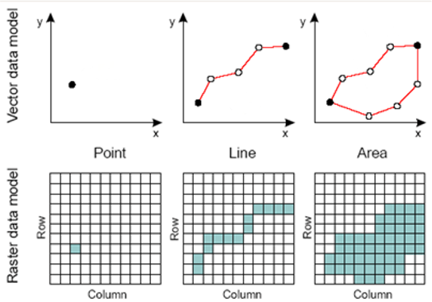
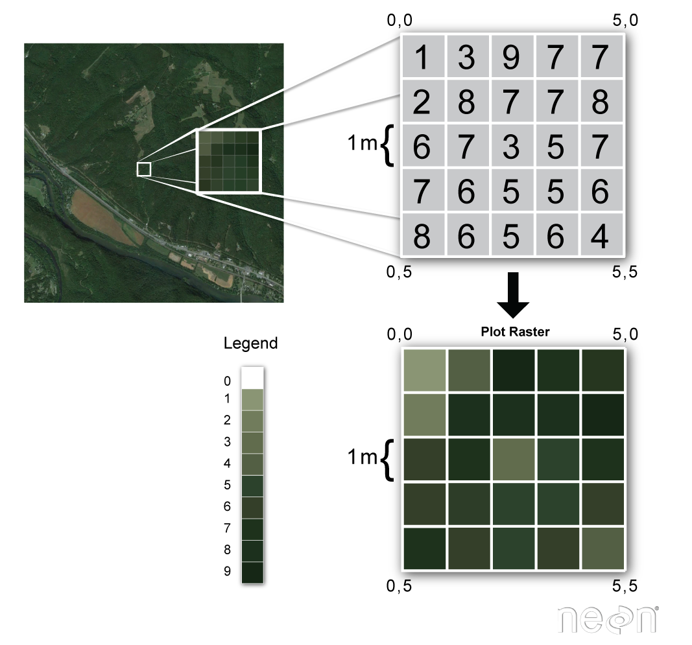
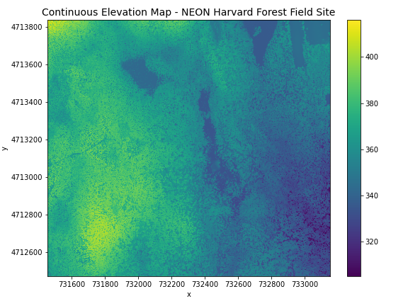
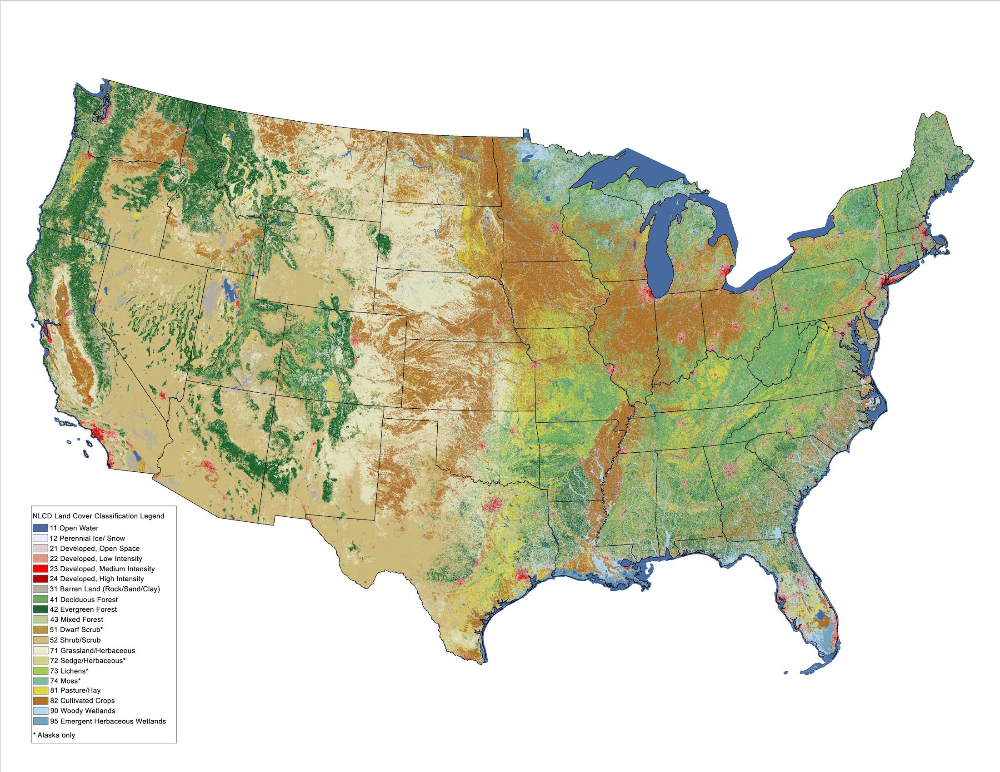
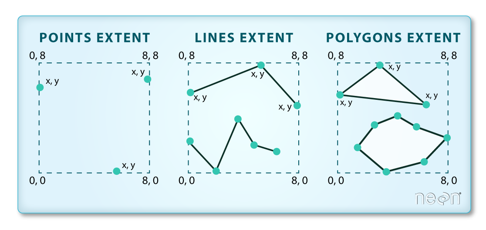
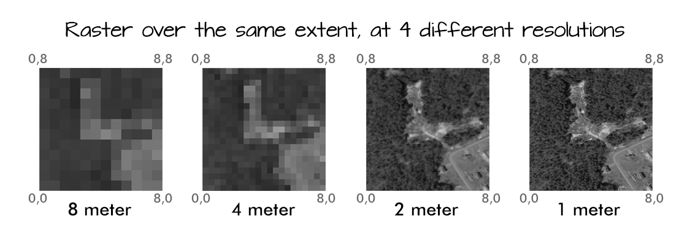
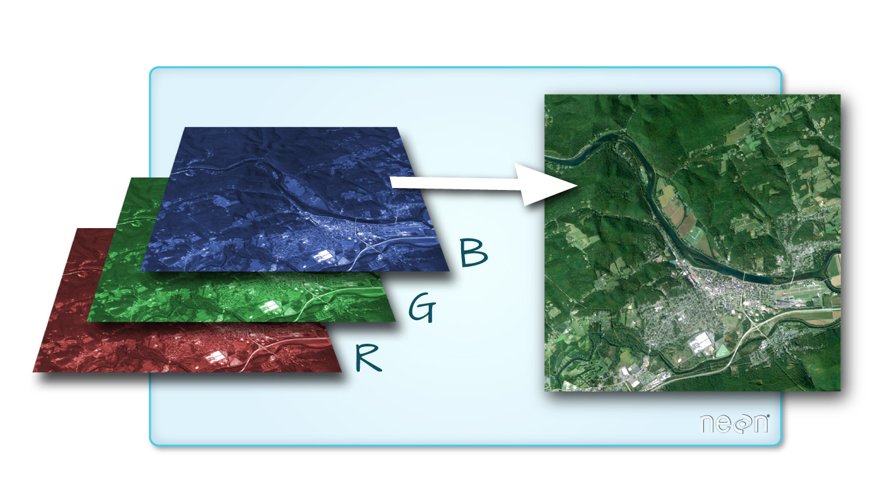
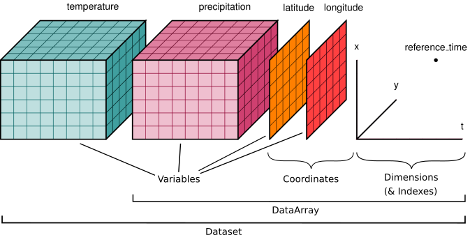

## Rasters
:::{.callout-tip icon=false}
## Overview

- The raster data model represents the real-world features (e.g. temperature) as arrays of cells, commonly known as pixels.
- Raster data is widely used to represent and store data about continuous surfaces, in which each pixel contain specific information, about a specific area of the Earth (e.g. 10x10 meter square) :
  - characteristics
  - radiance
  - reflectance
  - spectral signatures
:::

## Rasters
:::{.callout-tip icon=false}
## Reasons
There are various reasons why you might want to store your data in raster format:

- It is a simple data structure: A matrix of cells with values representing information about the observed surface/phenomena
- It is an efficient way to store data from large continuous surfaces
- It is a powerful format that can be used for various spatial and statistical analysis
- You can perform fast overlays with multiple layers 
:::

## Rasters

:::{.callout-tip icon=false}
## Raster Data Overview

Raster data is a digital image format that represents data as a grid of individual pixels, with each pixel containing a specific value or color information.

-   Square grid of pixels.
-   Pixel values can represent continuous or categorical variables:
    -   Divides 2-D space into regular cells - pixels
    -   Each cell has a single value
-   Values assigned according to value at mean, centre point, or some other rule
- The value of a pixel can be continuous (e.g. elevation) or categorical (e.g. land use).

:::

## Rasters
{width="60%"}

## Rasters

:::{.callout-tip icon=false}
## Difference from digital photos
It is accompanied by spatial information that connects the data to a particular location:

- raster’s extent 
- cell size
- number of rows and columns
- coordinate reference system (or CRS).

:::

## Rasters


## Rasters
:::{.callout-tip icon=false}
## Sensors

Many sensors (especially satellite sensors) measure the electromagnetic radiation at specific ranges (i.e. bands) which is why they are called `Multispectral sensors` or `Hyperspectral sensors`. Most typically the raster data produced by these sensors can vary based on their:

- *`spatial resolution`*, i.e. the size of a single pixel
- *`temporal resolution`*, i.e. how frequently the data is captured from the same area of the Earth
- *`spectral resolution`*, i.e. the number and location of spectral bands in the electromagnetic spectrum
- *`radiometric resolution`*, i.e. the range of available brightness values (bit depth), usually measured in bits (binary digits)
- *`spatial extent`*, i.e. how large area of the world a single image represents
- *`coordinate reference system`*, i.e. in what CRS the data is represented 

:::

## Rasters
:::{.callout-tip icon=false}
## Data Types

- Grayscale Rasters (**Nightlights Data**)
- Multispectral Rasters (**Landsat Satellite Imagery**)
- Color Rasters (**Digital Photographs**)
- Elevation Rasters (**Digital Elevation Models (DEMs)**)
:::

## Rasters

:::{.callout-tip icon=false}
## Continuous rasters

  - Precipitation maps.
  - Maps of tree height derived from LiDAR data.
  - Elevation values for a region.

:::



## Rasters
:::{.callout-tip icon=false}
## Categorical rasters

Some rasters contain categorical data where each pixel represents a discrete class such as a landcover type (e.g., “forest” or “grassland”) rather than a continuous value such as elevation or temperature. Some examples of categorical maps include:

1. Landcover / land-use maps.
2. Tree height maps classified as short, medium, and tall trees.
3. Elevation maps classified as low, medium, and high elevation.

:::

## Rasters


## Rasters {.scrollable}

:::{.callout-tip icon=false}
## Attributes: Extent

The spatial extent is the geographic area that the raster data covers. It represents the geographic edge or location that is the furthest north, south, east and west. 


:::

## Rasters {.scrollable}

:::{.callout-tip icon=false}
## Attributes: Resolution
A resolution of a raster represents the area on the ground that each pixel of the raster covers. The image below illustrates the effect of changes in resolution.


:::

## Rasters
:::{.callout-tip icon=false}
## Multi-band raster data

A raster can contain one or more bands. One type of multi-band raster dataset is a color image. A basic color image consists of three bands: red, green, and blue. Each band represents light reflected from the red, green or blue portions of the electromagnetic spectrum.
:::


## Rasters
:::{.callout-tip icon=false}
## Multi-band raster data
Multi-band raster data might also contain:

1. **Time series:** the same variable, over the same area, over time.
2. **Multi or hyperspectral imagery:** image rasters that have 4 or more (multi-spectral) or more than 10-15 (hyperspectral) bands.
:::

# Working with raster data in Python

## Rasters
:::{.callout-tip icon=false}
## Working with raster data in Python

There are a number of libraries that are widely used when working with raster data in Python:

- `numpy` has a big influence on how the other raster libraries function and can be used to generate multidimensional arrays from scratch.
- `xarray` provides a user-friendly and intuitive way to work with multidimensional raster data with coordinates and attributes (somewhat similar to `geopandas` that is used for vector data processing),
- `rasterio` core library for working with GIS raster data,
- `rioxarray` provides methods to conduct GIS-related operations with raster data (e.g. reading/writing, reprojecting, clipping, resampling). It is an extension of `rasterio` library that brings the same functionalities on top of `xarray` library,
- `xarray-spatial` provides methods for analysing raster data (e.g. focal/zonal operations, surface analysis, path finding).
:::

## Rasters
:::{.callout-tip icon=false}
## Creating a simple raster layer using `numpy`
Create an empty layer:

```{python}
import numpy as np
import matplotlib.pyplot as plt

raster_layer = np.zeros((10, 10))
raster_layer
```
:::

## Rasters
:::{.callout-tip icon=false}
## Creating a simple raster layer using `numpy`
Add a "mountain" in the middle:
```{python}
raster_layer[4:7, 4:7] = 5
raster_layer[5, 5] = 10
raster_layer
```
:::

## Rasters {.scrollable/
:::{.callout-tip icon=false}
## Creating a simple raster layer using `numpy`
Display:

```{python}
plt.imshow(raster_layer, cmap='terrain')
plt.colorbar(label='Elevation')
plt.title('Simple Raster Layer representing a Hill')
plt.show()
```
:::

## Working with xarray/rioxarray

:::{.callout-tip icon=false}
## What is xarray?

- `xarray` library is a highly useful tool for storing, representing and manipulating raster data
- `rioxarray` provides various raster processing (GIS) capabilities on top of the `xarray` data structures, such as reading and writing several different raster formats and conducting different geocomputational tasks
- `rioxarray` uses another Python library called `rasterio` (that works with N-dimensional `numpy` arrays)
:::

:::{.callout-important}
## Temporal dimensions
You may have longitudinal (repetitive) observations from the same area, constituting time series data.

One of the greatest benefits of `xarray` is that you can easily store, combine and analyze all these different layers via a single object, i.e. a `Dataset`.
:::

## Working with xarray/rioxarray
:::{.callout-tip icon=false}
## Key xarray datastructures: Dataset and DataArray 

- `DataArray` is a labeled N-dimensional array, like `pandas.Series` but for raster data 
- `Dataset` is a multi-dimensional in-memory array database that contains multiple `DataArray` objects. Contains observed variables, `x` and `y` coordinates of the observations stored in separate layers, as well as metadata (CRS/time/etc.). 
:::



## Working with xarray/rioxarray
:::{.callout-tip icon=false}
## `xarray` advantages

- A more intuitive and user-friendly interface to work with multidimensional arrays (compared e.g. to `numpy`)
- The possibility to select and combine data along a dimension across all arrays in a `Dataset` simultaneously
- Compatibility with a large ecosystem of Python libraries that work with arrays / raster data
- Tight integration of functionalities from well-known Python data analysis libraries, such as `pandas`, `numpy`, `matplotlib`, and `dask`
:::

## Working with xarray/rioxarray {.scrollable}
:::{.callout-tip icon=false}
## Reading a file into Dataset

Let's investigate a simple elevation dataset using `xarray` that represents a DEM of Kilimanjaro area in Tanzania.

By importing the `rioxarray` library, we can extend the functionalities of the `xarray` and use the `engine="rasterio"` parameter when reading the data. 

```{python}
import os
import urllib.request
import xarray as xr
import rioxarray

bucket_url = "https://a3s.fi/swift/v1/AUTH_0914d8aff9684df589041a759b549fc2/PythonGIS"
remote_url = bucket_url + "/elevation/kilimanjaro/ASTGTMV003_S03E036_dem.tif"
local_path = "../_data/Kilimanjaro/kilimanjaro_elevation.tif"

os.makedirs(os.path.dirname(local_path), exist_ok=True)
if not os.path.exists(local_path):
    tmp_path = local_path + ".tmp"
    urllib.request.urlretrieve(remote_url, tmp_path)
    os.replace(tmp_path, local_path)  # atomic: never leaves a half-downloaded file behind

data = xr.open_dataset(local_path, engine="rasterio", masked=True)
data
```
:::

## Working with xarray/rioxarray

:::{.callout-note}
## Attributes

- `Dimensions` show the number of `bands` (in our case 1), and the number of cells (3601) on the `x` and `y` axis
- `Coordinates` is a container that contains the actual `x` and `y` coordinates of the cells, the Coordinate Reference System information stored in the `spatial_ref` attribute, and the `band` attribute that shows the number of bands in our data.
- `Data variables` contains the actual data values of the cells (e.g. elevations as in our data)
:::

## Working with xarray/rioxarray {.scrollable}
:::{.callout-warning icon=false}
## Drop unneeded stuff
Because our `Dataset` only consists of a single `band` (i.e. the elevation values), we can drop the `"band"` dimension:

```{python}
data = data.squeeze("band", drop=True)
data
```
As a result, now the `Dimensions` and `Coordinates` only shows the data for `x` and `y` axis, meaning that the unnecessary data was successfully removed.

An alternative way to deal with this issue is to use `band_as_variable=True` parameter directly when reading the raster file with `xr.open_dataset()`:

```python
xr.open_dataset(url, engine="rasterio", masked=True, band_as_variable=True)
```
:::

## Working with xarray/rioxarray {.scrollable}
:::{.callout-tip icon=false}
## Renaming data variables

We can easily change the name of an attibute by using the `.rename()` method as follows which wants a dictionary with syntax `{"old_name": "new_name"}`:

```{python}
data = data.rename({"band_data": "elevation"})
data
```
:::

## Working with xarray/rioxarray {.scrollable}
:::{.callout-tip icon=false}
## Plotting a data variable

In the following, we create a simple map out of the `"elevation"` data variable: 

```{python}
import matplotlib.pyplot as plt

# Plot the values
mesh = data["elevation"].plot(cmap="terrain")

# Add a title
plt.title("Elevation in meters");
```
:::

## Working with xarray/rioxarray {.scrollable}
:::{.callout-tip icon=false}
## Contour maps

We can create a contour map based on the input data by calling the `.plot.contour()` method in `xarray`:

```{python}
contours = data["elevation"].plot.contour()
plt.title("Contour map based on the elevation");
```
:::

## Working with xarray/rioxarray {.scrollable}
:::{.callout-tip icon=false}
## Surface maps
A 3D surface map is a 3D representation of a terrain or surface, created by plotting elevation or depth data as a continuous surface. These can be done by:

```{python}
surface = data["elevation"].plot.surface(cmap="Greens")
plt.title("A surface map representing the elevation in 3D");
```
:::

## Working with xarray/rioxarray {.scrollable}
:::{.callout-tip icon=false}
## Extracting basic raster dataset properties

```{python}
data["elevation"].max()
```

Get numerical values:

```{python}
data["elevation"].min().item()
```

```{python}
data["elevation"].max().item()
```
:::

## Working with xarray/rioxarray
:::{.callout-tip icon=false}
## Extracting basic raster dataset properties

```{python}
print(data.rio.shape)
print(data.rio.width)
print(data.rio.height)
```

*`Spatial resolution`*:

```{python}
data.rio.resolution()
```
:::


## Working with xarray/rioxarray

:::{.callout-tip icon=false}
## Coordinate reference system

We can easily access the coordinate reference system (CRS) information of our raster dataset via the `.rio.crs` attribute:

```{python}
data.rio.crs
```

`Transform`: affine transformation matrix that maps pixel coordinates to geographic coordinates. It defines how the raster data is aligned in space, including information on scaling, rotation, and translation relative to a coordinate reference system. You can access the `transform` attribute as follows:

```{python}
data.rio.transform()
```
:::

## Working with xarray/rioxarray
:::{.callout-tip icon=false}
## Spatial extent

To extract information about the *`spatial extent`* of the dataset, we can use the `.rio.bounds()` method:

```{python}
data.rio.bounds()
```
:::

## Working with xarray/rioxarray {.scrollable}
:::{.callout-tip icon=false}
## NoData value

To investigate whether your data contains `NaN` values, you can access the NoData value of the `DataArray` as follows:

```{python}
data["elevation"].rio.nodata
```

To find out what value has been used in the raster file to code the NoData value, we can use `rio.encoded_nodata` which returns the NoData value as it is represented in the actual source data: 

```{python}
data["elevation"].rio.encoded_nodata
```

In our case, we dealt with the NaN values already when reading the data into `xarray` with `xr.open_dataset()` by specifying `masked=True`. 

The information about NoData can be can be stored with different keys, and you should look for values stored in keys, such as `_FillValue`, `missing_value`, `fill_value` or `nodata`. 
In our raster file, this metadata has not been stored as part of the file, and thus, we cannot access the `.attrs` attribute:

```python
data["elevation"].rio.attrs
```
will give `AttributeError: 'RasterArray' object has no attribute 'attrs'`.
:::

## Working with xarray/rioxarray
:::{.callout-tip icon=false}
## Radiometric resolution (bit depth)

Lastly, we can extract information about the *`radiometric resolution`* (i.e. bit depth) of our `Dataset` by calling `.dtypes`:

```{python}
data.dtypes
```
:::


## Working with xarray/rioxarray
:::{.callout-tip icon=false}
## Size of the data: Memory footprint in bytes

We can extract information about the memory footprint of our `DataArray` or `Dataset` via the `.nbytes` attribute:

```{python}
# Memory consumption of a single DataArray
bytes_to_MB = 1000 * 1000
footprint_MB = data["elevation"].nbytes / bytes_to_MB
print(f"DaraArray memory consumption: {footprint_MB:.2f} MB.")
```

```{python}
# Memory consumption of the whole Dataset
footprint_MB = data.nbytes / bytes_to_MB
print(f"Dataset memory consumption: {footprint_MB:.2f} MB.")
```
:::


## Working with xarray/rioxarray {.scrollable}
:::{.callout-tip icon=false}
## Converting data type (bit depth)

In the following, we will convert the elevation values (32-bit floats) into 16-bit unsigned integer numbers by calling `.astype("uint16")`. 

```{python}
# Convert the data into integers
data16 = data.copy()
data16["elevation"] = data16["elevation"].astype("uint16")
```

We can check the memory consumption of our updated `DataArray` as follows:

```{python}
# Memory consumption of the updated DataArray
footprint_MB = data16["elevation"].nbytes / bytes_to_MB
print(f"DaraArray memory consumption: {footprint_MB:.2f} MB.")
```

```{python}
data16["elevation"].max().item()
```
:::

## Working with xarray/rioxarray
:::{.callout-tip icon=false}
## Memory examples
```{python}
print(
    "Memory consumption 16-bit:",
    data["elevation"].astype("float16").nbytes / bytes_to_MB,
    "MB.",
)
print(
    "Memory consumption 32-bit:",
    data["elevation"].astype("float32").nbytes / bytes_to_MB,
    "MB.",
)
print(
    "Memory consumption 64-bit:",
    data["elevation"].astype("float64").nbytes / bytes_to_MB,
    "MB.",
)
```
:::


## Working with xarray/rioxarray {.scrollable}
:::{.callout-tip icon=false}
## Saving too much
In our data the value range is between 568-2943. Thus, we need to use at least 16-bits to store these values. However, nothing stops you from changing the data type into 8-bit integers which will significantly alter our data:

```{python}
low_bit_depth_data = data["elevation"].astype("uint8")
print("Min value: ", low_bit_depth_data.min().item())
print("Max value: ", low_bit_depth_data.max().item())
```

```{python}
low_bit_depth_data.plot(cmap="terrain")
plt.title("Data presented with 8-bit integers");
```
:::

## Working with xarray/rioxarray {.scrollable}
:::{.callout-tip icon=false}
## Creating a new data variable

Let's calculate the relative height (i.e. relief) based on our data which tells how much higher the elevations (e.g. the highest peak) are relative to the lowest elevation in the area:

```{python}
min_elevation = data["elevation"].min().item()

# Calculate the relief
data["relative_height"] = data["elevation"] - min_elevation
data
```

As a result, we now can see that a new data variable called `"relative_height"` was created and stored into our `Dataset`. We can confirm the data type of our data variable by typing: 

```{python}
type(data["relative_height"])
```
:::

## Working with xarray/rioxarray
:::{.callout-tip icon=false}
## Creating a new data variable
Ultimately, you can store as many data variables to your dataset as you like. In case you are interested to explore all the data variables that are presented in your `Dataset`, you can do this by calling `.data_vars` attribute as follows: 

```{python}
data.data_vars
```

In case you are only interested to find out the names of the data variables, you can extract them as a list as follows:

```{python}
list(data.data_vars)
```
:::

## Working with xarray/rioxarray
:::{.callout-tip icon=false}
## Raster file formats

| Name    | Extension   | Description                                                                                  |
|:--------|:-----------:|:---------------------------------------------------------------------------------------------|
| GeoTIFF | .tif, .tiff | Widely used to store individual raster layers to disk (i.e. a single `xarray.DataArray`).    |
| netCDF  | .nc         | Widely used to store a whole `xarray.Dataset` that can contain multiple variables.           |
| Zarr    | .zarr       | Newer format for storing `xarray.Dataset`. Supports storing large data in compressed chunks. |
:::

## Working with xarray/rioxarray
:::{.callout-tip icon=false}
## Raster compression methods


| Name      | Type        | Compress Ratio | Encoding / Decoding Speed | Common Raster Formats   |
|:----------|:-----------:|:--------------:|:-------------------------:|:------------------------|
|`LZW`      | Lossless    | Moderate       | Medium / Fast             | GeoTIFF, PNG            |
|`DEFLATE`  | Lossless    | High           | Slow / Medium             | GeoTIFF, PNG            |
|`ZSTD`     | Lossless    | High           | Fast / Fast               | Cloud-optimized GeoTIFF |
|`JPEG`     | Lossy       | Very High      | Fast / Fast               | JPEG, GeoTIFF (YCbCr)   |
|`JPEG2000` | Both avail. | Very High      | Slow / Medium             | JP2, GeoTIFF (JP2)      |
:::

## Working with xarray/rioxarray {.scrollable}
:::{.callout-tip icon=false}
## GeoTIFF
When writing data into `GeoTIFF` format you can use the `.rio.to_raster()` method that comes with the `rioxarray` library. As mentioned earlier, `GeoTiff` only allows you to write a single `DataArray` at a time into a file:

```{python}
data["elevation"].rio.to_raster("../_data/temp/elevation.tif")
data["relative_height"].rio.to_raster("../_data/temp/relative_height.tif")
```

To read a `GeoTIFF` file, you can use the `xr.open_dataset()` with engine `"rasterio"`:

```{python}
xr.open_dataset("../_data/temp/relative_height.tif", engine="rasterio", masked=True)
```
:::

## Working with xarray/rioxarray {.scrollable}
:::{.callout-tip icon=false}
## Cloud Optimized GeoTIFF (COG)

Writing a cloud optimized `GeoTIFF` (`COG`) can be done in a similar manner as writing a regular `GeoTIFF` file, but here we define that the `driver` for our output dataset is `"COG"`. Here, we also compress our data using the `LZW` compression method that reduces the file size of the output:

```{python}
data["elevation"].rio.to_raster(
    "../_data/temp/elevation_cog.tif", driver="COG", compress="LZW"
)
```

To read the `COG` file, we can use the `xr.open_dataset()` method in a similar way as before:

```{python}
xr.open_dataset("../_data/temp/elevation_cog.tif", engine="rasterio", masked=True)
```
:::

## Working with xarray/rioxarray {.scrollable}
:::{.callout-tip icon=false}
## netCDF

With `netCDF` format you can write (and read) a whole `xarray.Dataset` at a time which can be very convenient especially when you have multiple relevant variables that you want to store. When saving a `Dataset` to `netCDF`, you can use the `.to_netcdf()` method of `xarray`:

```{python}
netcdf_fp = "../_data/temp/kilimanjaro_dataset.nc"
data.to_netcdf(netcdf_fp)
```

To read the `netCDF` file, you can use `xarray.open_dataset()` method that picks the correct file format based on the file extension. Here, it is important to use the parameter `decode_coords="all"` to ensure that the metadata (CRS information) is also read appropriately:

```{python}
ds = xr.open_dataset(netcdf_fp, decode_coords="all")
ds
```
:::

## Working with xarray/rioxarray {.scrollable}
:::{.callout-tip icon=false}
## Zarr

To write the data into `Zarr` file format, you can use the `.to_zarr()` method. To be able to write to `Zarr` format you need to have `zarr` Python library. Here, we write our dataset using writing `mode="w"` which will overwrite an existing `Zarr` file if it exist:

```{python}
zarr_fp = "../_data/temp/kilimanjaro_dataset.zarr"
data.to_zarr(zarr_fp, mode="w")
```

To read the `Zarr` file, you can again use the `xr.open_dataset()`. Here, we specify also the `engine` to tell the `xarray` that we want specifically to read `Zarr` file format and similarly as with `netCDF` we use `decode_coords="all" to ensure that the coordinate reference system metadata is correctly read from the data:

```{python}
ds = xr.open_dataset(zarr_fp, engine="zarr", decode_coords="all")
ds
```
:::

## Working with xarray/rioxarray {.scrollable}
:::{.callout-tip icon=false}
## Zarr chunking
`Zarr` allows to write a given `Dataset` into disk by dividing the data into chunks of specific size. To write a `Dataset` into `Zarr` using chunks, we can specify specific `encoding` settings that tells how the data should be chunked:

```{python}
zarr_fp = "../_data/temp/kilimanjaro_dataset_chunked.zarr"

# Provide the size of a single chunk per variable
encoding = {
    "elevation": {"chunks": (256, 256)},
    "relative_height": {"chunks": (256, 256)},
}

data.to_zarr(zarr_fp, mode="w", encoding=encoding)
```

To read the chunked `Zarr` file, we can use the `xarray.open_dataset()` function in a similar manner as before:

```{python}
ds = xr.open_dataset(zarr_fp, engine="zarr", decode_coords="all")
ds
```
:::

## Working with xarray/rioxarray {.scrollable}
:::{.callout-tip icon=false}
## Zarr
If it happens that during the reading the CRS information (`spatial_ref`) is not properly read as part of the `Coordinates` information alongside with `x` and `y` coordinates (as in our case here), you can fix this as follows:

```{python}
ds.coords["spatial_ref"] = ds["spatial_ref"]
ds
```

Now the CRS information in the `spatial_ref` variable is in correct place so that the `rioxarray` functionalities work as should. We can now for example correctly access the `.crs` attribute via the `.rio` accessor:

```{python}
ds.rio.crs
```
:::

# Common raster operations

## Common raster operations

:::{.callout-tip icon=false}
## Examples

- selecting
- clipping
- masking raster to include only pixels that are located in a given area or at given indices
- merging multiple raster tiles into a single raster mosaic
- converting raster data into vector format (and vice versa)
- resampling the raster pixels into higher or lower spatial resolution (upscaling, downscaling). 
:::

## Common raster operations {.scrollable}
:::{.callout-tip icon=false}
## Selecting data

We can select data based on indices or certain criteria (e.g. all values above specific threshold). 

There are various ways how you can select data from `DataArray` and `Dataset`, but some of the most commonly used methods include:

- `.isel()`
- `.sel()`
- `.where()`

Let's start by reading the `elevation` dataset that we used earlier:

```{python}
import xarray as xr
import matplotlib.pyplot as plt

fp = "../_data/temp/kilimanjaro_dataset.nc"

data = xr.open_dataset(fp, decode_coords="all")
data
```
:::

## Common raster operations {.scrollable}
:::{.callout-tip icon=false}
## Selecting data
Let's also plot the data to see how our values and coordinates (x and y) distribute over a map:

```{python}
data["elevation"].plot()
plt.title("Elevation in meters");
```
:::

## Common raster operations {.scrollable}
:::{.callout-tip icon=false}
## Selecting data by index values

To select data based on specific index values, we can take advantage of the `.isel()` method:

```{python}
selected_cell = data.isel(x=0, y=0)
selected_cell
```

To access the `elevation` or `relative_height` value at this given position, we can use the `.item()` which will return the value as a regular number (as learned in Chapter 7.2):

```{python}
selected_cell["elevation"].item()
```

```{python}
selected_cell["relative_height"].item()
```
:::

## Common raster operations {.scrollable}
:::{.callout-tip icon=false}
## Selecting data by index values
If we want to select a range of values:

```{python}
selection = data.isel(x=slice(0, 1000), y=slice(0, 1000))
selection
```

```{python}
selection["elevation"].plot()
plt.title("Elevation in meters for the selected cells");
```

As we can see, now the shape of our output `Dataset` is 1000x1000 cells and the selection covers to top-left corner of our input `Dataset`. 

:::

## Common raster operations {.scrollable}
:::{.callout-tip icon=false}
## Selecting data based on coordinates

We often want to select data based on coordinates, we use `.sel()` method.

Next, we will do the selection for an area that covers the following area: 
- x-coordinates: `36.4` - `36.6`
- y-coordinates: `-2.4` - `-2.6`

```{python}
area_of_interest = data.sel(x=slice(36.4, 36.6), y=slice(-2.4, -2.6))
```

```{python}
area_of_interest["elevation"].plot()
plt.title("Elevation in meters for the selected area of interest");
```
:::


## Common raster operations {.scrollable}

:::{.callout-tip icon=false}
## Selecting data based on logical conditions

A third way to select data from a given raster is based on a specific criteria. For this we can use the `.where()` method. For instance, we might be interested to select only such pixels from the raster where the elevation is above 2000 meters:

```{python}
moderate_altitudes = data.where(data["elevation"] > 2000)
```

```{python}
moderate_altitudes["elevation"].plot()
plt.title("Moderate altitude areas in the region");
```
:::

## Common raster operations {.scrollable}

:::{.callout-tip icon=false}
## Selecting data based on logical conditions
As a result, we now have a map that highlights the areas where the elevation is above 2 kilometers. In a similar manner, we can also combine multiple conditions to a single selection. In the following, we will select all pixels where the elevation is above 1000 meters and below or equal to 1500 meters:

```{python}
condition = (data["elevation"] > 1000) & (data["elevation"] <= 1500)
low_altitudes = data.where(condition)
```

```{python}
low_altitudes["elevation"].plot()
plt.title("Low altitude areas in the region");
```

:::

## Common raster operations {.scrollable}

:::{.callout-tip icon=false}
## Clipping raster

Clipping is one of the common raster operations in which you clip a given raster `Dataset` by another layer. This process allows you to crop the data in a way that only the cells that are e.g. within a given Polygon are selected for further analysis. 

To be able to clip this `xarray.Dataset`, we first need to create a `geopandas.GeoDataFrame` that contains the geometry that we want to use as our clipping features:

```{python}
import geopandas as gpd
from shapely.geometry import box

# Bounding box coordinates
minx = 36.1
miny = -3
maxx = 36.3
maxy = -2.77

# Create a GeoDataFrame that will be used to clip the raster
bbox_geometry = box(minx, miny, maxx, maxy)
clipping_gdf = gpd.GeoDataFrame(geometry=[bbox_geometry], crs="epsg:4326")

# Explore the extent on a map
clipping_gdf.explore()
```
:::

## Common raster operations {.scrollable}

:::{.callout-tip icon=false}
## Clipping
Now after we have created the `GeoDataFrame` we can use it to clip the `xarray.Dataset`:

```{python}
# Check that the CRS matches between layers (only continues if True)
assert clipping_gdf.crs == data.elevation.rio.crs

# Clip the raster
kitumbene = data.rio.clip(geometries=clipping_gdf.geometry, crs=data.elevation.rio.crs)
```

Let's make a map out of our results to see how our data looks like:

```{python}
kitumbene["elevation"].plot()
plt.title("Elevations around Mt Kitumbene");
```
:::

## Common raster operations {.scrollable}

:::{.callout-tip icon=false}
## Clipping
Notice that the operations clipped all the variables in our `Dataset` simultaneously. We can extract basic statistics from `elevation` and inspect the relative height in this area as follows:

```{python}
# Mean elevation
kitumbene["elevation"].mean().item()
```

```{python}
# Update the relative height considering the minimum elevation on this area
kitumbene["relative_height"] = kitumbene["elevation"] - kitumbene["elevation"].min()

# Mean of the relative height
kitumbene["relative_height"].max().item()
```

We can see that the mean elevation in this area is approximately 1470 meters while the maximum relative height is ~2100 meters. We needed to recalculate the relative height because the baseline minimum elevation in the landscape changed significantly after the clipping operation.
:::

## Common raster operations {.scrollable}

:::{.callout-tip icon=false}
## Masking a raster

Another commonly used approach when working with raster data is to mask the data based on certain criteria or using another geographical layer as a mask. lakes or oceans) from the terrain when doing specific analyses. Let's mask out the lakes from our raster dataset that exist in our study area. 

Let's start by downloading data from OpenStreetMap (OSM) about existing lakes in our study area. To do this, we first extract the bounds of our raster `Dataset` and then use `osmnx` library to fetch all OSM elements that have been tagged with key `"water"` and `"lake"` (read more about `osmnx` from Chapter 9.1):

```{python}
import osmnx as ox

# Extract the bounding box based on the extent of the raster
data_bounds_geom = box(*data["elevation"].rio.bounds())

# Retrieve lakes from the given area
lakes = ox.features_from_polygon(data_bounds_geom, tags={"water": ["lake"]})

# Plot the raster and lakes on top of each other
fig, ax = plt.subplots(figsize=(12, 8))
data["elevation"].plot(ax=ax)
lakes.plot(ax=ax, facecolor="lightblue", edgecolor="red", alpha=0.4);
```
:::

## Common raster operations {.scrollable}

:::{.callout-tip icon=false}
## Masking a raster
we can use the same `.rio.clip()` method which we used in the previous example. However, in this case, we do not want to totally remove those cells from our `Dataset` but only mask them out, so that the values on those areas are replaced with NaN values.

By using parameters `drop=False` and `invert=True`, the cells that are intersecting with the lake geometries will be masked with NaNs: 

```{python}
masked_data = data.rio.clip(
    geometries=lakes.geometry,
    drop=False,
    invert=True,
    crs=data.elevation.rio.crs,
)
```

```{python}
masked_data["elevation"].plot()
plt.title("Elevation data with a mask");
```
:::

## Common raster operations {.scrollable}

:::{.callout-tip icon=false}
## Masking a raster
As a result, we now have a new `Dataset` where the elevation values overlapping with the lakes have been converted to NaNs. We can now compare whether e.g. the mean land surface elevation differs from the original one where the lakes were still included:

```{python}
print("Mean elevation with lakes:", data["elevation"].mean().round().item())
print("Mean elevation without lakes:", masked_data["elevation"].mean().round().item())
```
:::

## Common raster operations {.scrollable}
:::{.callout-tip icon=false}
## Creating a raster mosaic by merging datasets

<!-- One very common operation when working with raster data is to combine multiple individual raster layers (also called as tiles) into a single larger raster dataset, often called as raster mosaic. This can be done easily with the `merge_datasets()` -function in `rioxarray`. -->
Here, we will create a mosaic based on DEM files (altogether 4 files) covering Kilimanjaro region in Tanzania. The files live in an S3 bucket, so we download each of them once into a local directory and reuse those copies afterwards. This way the tiles are fetched over the network only on the first run:

```{python}
import os
import urllib.request
import xarray as xr
import rioxarray

# S3 bucket containing the data
bucket = "https://a3s.fi/swift/v1/AUTH_0914d8aff9684df589041a759b549fc2/PythonGIS"

filenames = [
    "ASTGTMV003_S03E036_dem.tif",
    "ASTGTMV003_S03E037_dem.tif",
    "ASTGTMV003_S04E036_dem.tif",
    "ASTGTMV003_S04E037_dem.tif",
]

# Local directory where the downloaded tiles are kept
tile_dir = "../_data/temp/kilimanjaro_tiles"
os.makedirs(tile_dir, exist_ok=True)

filepaths = []
for filename in filenames:
    local_path = os.path.join(tile_dir, filename)
    if not os.path.exists(local_path):
        remote_url = f"{bucket}/elevation/kilimanjaro/{filename}"
        tmp_path = local_path + ".tmp"
        urllib.request.urlretrieve(remote_url, tmp_path)
        os.replace(tmp_path, local_path)  # atomic: never leaves a half-downloaded file behind
    filepaths.append(local_path)

# Show the first path
filepaths[0]
```

```{python}
datasets = [
    xr.open_dataset(filepath, engine="rasterio", masked=True, band_as_variable=True)
    for filepath in filepaths
]
```

Now we have stored all the `xarray.Dataset` layers inside the list `datasets`. We can investigate the contents of the first `Dataset` in our list as follows:

```{python}
datasets[0]
```

```{python}
datasets[0].rio.shape
```

:::


## Common raster operations
:::{.callout-tip icon=false}
## Creating a raster mosaic by merging datasets
Let's visualize these four raster tiles in separate maps to see how they look like. We use `vmax` parameter to specify a same value scale for each layer that makes the colors in the map comparable:

```{python}
import matplotlib.pyplot as plt

fig, axes = plt.subplots(2, 2, figsize=(16, 16))

# Plot the tiles to see how they look separately
datasets[0]["band_1"].plot(ax=axes[0][0], vmax=5900, add_colorbar=False)
datasets[1]["band_1"].plot(ax=axes[0][1], vmax=5900, add_colorbar=False)
datasets[2]["band_1"].plot(ax=axes[1][0], vmax=5900, add_colorbar=False)
datasets[3]["band_1"].plot(ax=axes[1][1], vmax=5900, add_colorbar=False);
```
:::

## Common raster operations
:::{.callout-tip icon=false}
## Creating a raster mosaic by merging datasets
To merge multiple `xarray.Dataset`s together, we can use the `.merge_datasets()` function from `rioxarray`:

```{python}
from rioxarray.merge import merge_datasets

mosaic = merge_datasets(datasets)
mosaic
```
:::

## Common raster operations
:::{.callout-tip icon=false}
## Creating a raster mosaic by merging datasets
Let's now rename our data variable to a more intuitive one and plot the result to see how the end result looks like:

```{python}
mosaic = mosaic.rename({"band_1": "elevation"})
```

```{python}
mosaic["elevation"].plot(figsize=(12, 12))
plt.title("Elevation values covering larger area in the region close to Kilimanjaro");
```
:::

## Common raster operations
:::{.callout-tip icon=false}
## Raster to vector conversion (vectorize)

To convert `xarray.DataArray` into vector format, you can use the `geocube` library that helps doing these kind of data conversions. Let's have a quick look on our input `DataArray` before continuing:
<!-- #endregion -->

```{python}
kitumbene["elevation"]
```

To vectorize a given variable in your `xarray.Dataset`, you can use the `vectorize` function from the `geocube` library as follows:

```{python}
from geocube.vector import vectorize

gdf = vectorize(kitumbene["elevation"].astype("float32"))
gdf.shape
```

```{python}
gdf.head()
```
:::

## Common raster operations {.scrollable}
:::{.callout-tip icon=false}
## Raster to vector conversion (vectorize)

When working with surface data (e.g. elevation), it is quite common that there are similar values close to each other in the raster cells and often there are specific regions where the elevation does not change. Therefore, after the vectorization operation it is a good idea to dissolve the geometries based on the data attribute which merges geometries with identical values into single geometries instead of representing all the values as separate polygons:


```{python}
gdf = gdf.dissolve(by="elevation", as_index=False)
gdf.shape
```

As we can see, the number of rows in our `GeoDataFrame` was reduced dramatically from more than 500 thousand rows into a bit over 2000 rows. Let's finally plot our `GeoDataFrame` to see how the data looks like:

```{python}
gdf.plot(column="elevation");
```
:::

## Common raster operations
:::{.callout-tip icon=false}
## Raster to vector conversion (vectorize)
Performance considerations:

- categorizing the data values of the surface into specific elevation classes (e.g. with 5 meter intervals)
- downscaling into lower resolution

:::


## Common raster operations {.scrollable}
:::{.callout-tip icon=false}
## Vector to raster conversion (rasterize)
Let's rasterize the lakes that we downloaded earlier from OpenStreetMap. Let's have a look how the data looks like:

```{python}
lakes = ox.features_from_polygon(data_bounds_geom, tags={"water": ["lake"]})

lakes.plot();
```

```{python}
lakes.shape
```

```{python}
lakes.tail(2)
```
:::

## Common raster operations {.scrollable}
:::{.callout-tip icon=false}
## Vector to raster conversion (rasterize)
As we can see the `lakes` `GeoDataFrame` contains polygons and have various attributes associated with them, although majority of these attributes do not contain any relevant data. Thus, let's just pick a few columns that are most interesting to us:

```{python}
lakes = lakes[["geometry", "water", "name"]].copy().reset_index()
lakes.shape
```
:::

## Common raster operations {.scrollable}
:::{.callout-tip icon=false}
## Vector to raster conversion (rasterize)
let's create one numerical attribute into our data and calculate the area of the lakes as something we will use as values in our raster:

```{python}
# Reproject to metric system
lakes_utm = lakes.to_crs(epsg=21037)

# Calculate the area in km2
lakes_utm["area_km2"] = lakes_utm.area / 1000000

# Join the area information with the original gdf
lakes = lakes.join(lakes_utm[["area_km2"]])
```

```{python}
lakes.head(5)
```
:::

## Common raster operations {.scrollable}
:::{.callout-tip icon=false}
## Vector to raster conversion (rasterize)

It appears that the `lakes` data contain some duplicate rows as the `Lake Natron` is present twice in our table. We want to remove all duplicate rows from the data before continuing:

```{python}
lakes = lakes.drop_duplicates()
lakes.shape
```

As a result, two duplicates were dropped from the `GeoDataFrame`. Now we are ready to rasterize our `GeoDataFrame` into `xarray`. To do this, we can use the `make_geocube()` function from the `geocube` library:

```{python}
from geocube.api.core import make_geocube

lakes_ds = make_geocube(
    vector_data=lakes,
    measurements=["id", "area_km2"],
    resolution=(-0.01, 0.01),
    output_crs="epsg:4326",
)
lakes_ds
```
:::

## Common raster operations {.scrollable}
:::{.callout-tip icon=false}
## Vector to raster conversion (rasterize)
We used `(-0.01, 0.01)` as the value for the `resolution` parameter. As we use WGS84 as the CRS, these mean decimal degrees - thus, resolution `0.01` indicates that the size of a single pixel in our raster is approximately 1x1 kilometers (1.11km). The negative sign for x-resolution is used because raster transformations often use negative values for the y-axis in many CRS systems, where the y-coordinates decrease as you move down the raster. Let's make a map out of our data to see how the result looks like:

```{python}
lakes_ds["area_km2"].plot()
plt.title("Rasterized lakes");
```
:::

## Common raster operations {.scrollable}
:::{.callout-tip icon=false}
## Vector to raster conversion (rasterize)
We'd like the output to to have identical resolution to an already existing `xarray.Dataset`. We can achieve this by using the `like` parameter in `make_geocube()` function:

```{python}
aligned_ds = make_geocube(vector_data=lakes, measurements=["id", "area_km2"], like=data)
aligned_ds
```

```{python}
aligned_ds["area_km2"].plot();
```

:::

## Common raster operations
:::{.callout-tip icon=false}
## Resampling raster data

Resampling refers to changing the cell values due to changes in the raster grid for example due to changing the effective cell size of an existing dataset. There are two ways to resample your raster data

- Upscaling (or upsampling) refers to cases in which convert the raster to higher resolution, i.e. smaller cells.
- Downscaling (or downsampling) is resampling to lower resolution, i.e. having larger cell sizes. 

it is important to decide the `resampling` method which determines how the data values are aggregated, e.g., use `average`, `min`, `sum`, or `mode` (this means the value which appears most often in the input raster cells is selected to the output raster cell).
<!-- #endregion -->
:::


## Common raster operations {.scrollable}
:::{.callout-tip icon=false}
# Downscaling: example

The `.rio.reproject()` method is used to downscale the data using the new `shape`. The `resampling` parameter defines the resampling method which in our case will be `Resampling.average`. The `Resampling` class from `rasterio` library provides the methods for resampling:

```{python}
from rasterio.enums import Resampling

# Define the new shape
downscale_factor = 50
new_width = int(round(data.rio.width / downscale_factor))
new_height = int(round(data.rio.height / downscale_factor))

# Downscale the data
data_downscaled = data.rio.reproject(
    dst_crs=data.rio.crs,
    shape=(new_height, new_width),
    resampling=Resampling.average,
)
```

```{python}
data_downscaled
```
:::

## Common raster operations {.scrollable}
:::{.callout-tip icon=false}
# Downscaling: example
As we can see, now the dimensions of the new downscaled `Dataset` is 72x72 cells on x and y axis which is 50 times smaller compared to the original `data` that we used as input:

```{python}
data.rio.shape
```

```{python}
print("Original resolution:", data.rio.resolution())
print("Downscaled resolution:", data_downscaled.rio.resolution())
```

```{python}
data_downscaled["elevation"].plot()
plt.title("Downscaled elevation data");
```

:::


## Common raster operations {.scrollable}
:::{.callout-tip icon=false}
## Upscaling

When upscaling, you are ultimately estimating values to new pixel cells based on the neighboring raster values of a given cell in the input raster. There are various ways to interpolate data:

| Resampling Method    | Description                                                                                                               |
|:---------------------|:--------------------------------------------------------------------------------------------------------------------------|
| `nearest`            | Selects the value of the closest pixel without interpolation. Fast but can produce blocky artifacts.                      |
| `bilinear`           | Performs linear interpolation using the four nearest pixels, creating a smoother result than nearest-neighbor.            |
| `cubic`              | Uses bicubic interpolation, considering 16 surrounding pixels. Smoother output than bilinear. Higher computational cost.  |
| `cubic_spline`       | Applies cubic spline interpolation for even smoother results, but requires more processing power.                         |
| `lanczos`            | Uses a sinc-based interpolation over a larger pixel neighborhood, producing resampling with significant smoothing.        |
| `average`            | Average resampling, computes the weighted average of all non-NODATA contributing pixels.                                  |
:::

## Common raster operations
:::{.callout-tip icon=false}
## Upscaling
In the following, we will take advantage of a `Resampling.bilinear` resampling method which determines the value of a new pixel by taking a weighted average of the four nearest input pixels:

```{python}
from rasterio.enums import Resampling

# Define the new shape
upscale_factor = 2
new_width = data.rio.width * upscale_factor
new_height = data.rio.height * upscale_factor

# Upscale the data
data_upscaled = data.rio.reproject(
    data.rio.crs,
    shape=(new_height, new_width),
    resampling=Resampling.bilinear,
)
```
:::

## Common raster operations {.scrollable}
:::{.callout-tip icon=false}
## Upscaling
Now we have successfully upscaled our data which we can confirm by comparing the shapes of the original and upscaled datasets:

```{python}
print("Shape - Original:", data.rio.shape)
print("Shape - Upscaled:", data_upscaled.rio.shape)
```

Let's finally confirm that our upscaled data looks correct also on a map:

```{python}
data_upscaled["elevation"].plot()
plt.title("Upscaled elevation data");
```
:::

## Common raster operations {.scrollable}

:::{.callout-tip icon=false}
## Filling missing data

Let'sfill missing data in a `Dataset` using `rioxarray`.

Our `masked_data` from the masking example above is a good test case: the pixels covered by lakes were replaced with NaN, so they now appear as white spots on the map. Let's select a slice around the large lake on the western edge of the study area to investigate this part of the `Dataset` more closely.

Note that `.rio.interpolate_na()` needs to know which value marks the missing data. Our elevation layer does not carry that information (the source `GeoTiff` had no NoData tag), so we declare it explicitly with `.rio.write_nodata()`. Without this step `rioxarray` raises `RioXarrayError: nodata not found`:

```{python}
data_missing = masked_data.sel(x=slice(36.0, 36.2), y=slice(-2.05, -2.65))

# Tell rioxarray that NaN marks the missing pixels
data_missing["elevation"] = data_missing["elevation"].rio.write_nodata(np.nan)

data_missing["elevation"].plot()
plt.title("Missing elevation values");
```
:::

## Common raster operations {.scrollable}

:::{.callout-tip icon=false}
## Filling missing data
We can use `.rio.interpolate_na()` method that can be used to predict values to locations that do not have data. By default, it predicts the values based on data observations that are nearest to the given NoData-pixel:

```{python}
filled = data_missing.rio.interpolate_na()
```

```{python}
filled["elevation"].plot()
plt.title("Filled NoData values based on 'nearest' method");
```
:::

## Common raster operations {.scrollable}

:::{.callout-tip icon=false}
## Filling missing data


The interpolation can be done with three different approaches:

- `"nearest"` (default, fastest)
- `"linear"` (more accurate, uses `Delanay triangulation`)
- `"cubic"`,


```{python}
filled_linear = data_missing.rio.interpolate_na(method="linear")
```

```{python}
filled_linear["elevation"].plot()
plt.title("Filled NoData values based on 'linear' method");
```
:::
