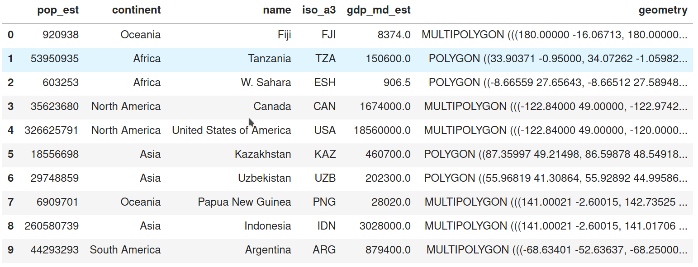
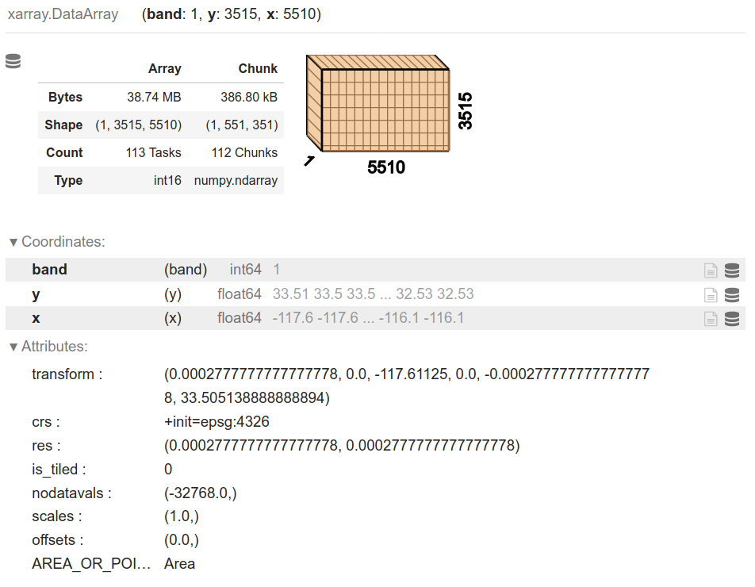
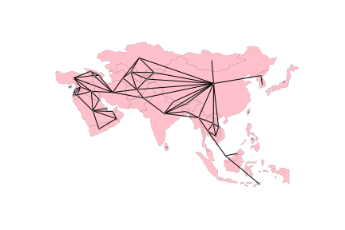

```{python}
#| include: false
import warnings

warnings.filterwarnings("ignore")

import matplotlib

matplotlib.rcParams["figure.figsize"] = (7, 4)
matplotlib.rcParams["figure.dpi"] = 110
matplotlib.rcParams["font.size"] = 8

GDS = "../_repos/gdsbook/data"

import os
import contextily


def _carto(variant):
    """CARTO basemaps now require an API key. Use it when CARTO_API_KEY is
    set; otherwise fall back to a keyless Esri equivalent so the render
    never shows the "API KEY REQUIRED" watermark."""
    key = os.environ.get("CARTO_API_KEY")
    return (
        variant(apikey=key)
        if key
        else contextily.providers.Esri.WorldGrayCanvas
    )


BASEMAP = _carto(contextily.providers.CartoDB.Voyager)
```

## Geographic thinking

:::{.callout-tip icon=false}
## Overview

**Geographic thinking**: the collected knowledge geographers have about why geographic information deserves special care and attention, especially when used in computations.
:::

:::{.callout-note}
## Two useful traits of geographic data

1. **Geographic data is ubiquitous.** Everything has a *location* in space-time, and that location can be used directly to make better predictions or inferences.

2. **Location gives you relations**: these let us **contextualise** our data.
:::

## Geographic thinking {.scrollable}

:::{.callout-important icon=false}
## Tobler's First Law

> Near things are likely to be more related than distant things — both in space and in time.
>
> — Waldo Tobler

If we learn from this contextual information appropriately, we may be able to build better models.
:::

:::{.callout-note icon=false}
## All models are wrong

> All models are wrong, but some are useful — George Box (1976)


**Simplification is necessary.**
:::

:::{.callout-note icon=false}
## All maps are wrong

> All maps are wrong, but some are useful — Keith Ord (2010)
:::


## Geographic thinking {.scrollable}

:::{.callout-tip icon=false}
## Concepts

- **data model** — how we *conceptually* represent a geographical process
- **data structure** — how geographic data is *represented in a computer*
:::

## Data models

:::{.callout-tip icon=false}
## The population density puzzle

Maps of population density: count people inside an "enumeration area", divide by the area. Density becomes a **constant value** over the whole unit.

But people are **discrete**: each of us exists at one specific point in space and time.

- At a sufficiently fine-grained scale (space *and* time), population density is **zero almost everywhere**!
- In a typical day, a person moves from home to work through several points in space-time.
- Shopping malls have few residents, yet a very high population density at specific times - drawn from elsewhere.
:::

## Data models

:::{.callout-important icon=false}
## The three classic data models

- **Objects** — discrete entities that occupy a specific position in space and time
- **Fields** — continuous surfaces that could, in theory, be measured at *any* location in space and time
- **Networks** — a set of *connections* between objects, or between positions in a field

In the population example:

- an *enumeration unit* is an object; so is a *person*
- the *field* view: density as a smooth continuous surface
- the *network* view: the inter-related system of places whose densities arise from people moving around
:::

## Data models

:::{.callout-tip icon=false}
## Why the distinction matters — it changes what *relations* are appropriate

**Objects** — relationships modelled with simple **distances**. Near objects are "strongly related", distant objects "weakly related".

**Networks** — must account for **topology**, the structure of connections between nodes. We cannot assume every node is connected, and connections cannot be derived from the nodes alone. (Example: two subway stations)

**Fields** — measurements can occur *anywhere*, so models must account for hypothetical realizations in the unobserved space between measurement points.
:::

:::{.callout-warning icon=false}
## Generative structure vs. measurement

*How a geographical process actually operates* (its "causal" or "generative" structure)
can be different from *how we are actually able to measure it*.
:::

## Data structures

:::{.callout-tip icon=false}
## From models to bytes

Data models are abstractions of reality that let us focus on the aspects of a process we care about.

But most of data and geographical science is **empirical** — analysis and interpretation of *measurements*. Object / field / network models are still too abstract for that.

**Data structures** are digital representations that connect data models to computer implementations. They form the **middle layer** between conceptual models and technology.

- At best: they express the data model's principles *and* what is technologically possible
- At worst: a bad match makes analysis awkward and forces conversion to another structure
:::

## Data structures
:::{.callout-warning icon=false}
## The relationship runs both ways

Once established, a technology or data structure can exert an important influence on **how we see and model the world**.

Example: desktop GIS in the 1990s–2000s made geographic information useful to a much wider audience, largely by standardizing the "geographic matrix" (Berry, 1964), which we now call a **geotable**.
:::

## Data structures
:::{.callout-important icon=false}
## "Disabling technology"

Mark Gahegan (1999) proposed the concept of *disabling technology*: the technological systems we use may affect the structure of our thinking.

**The eyeglasses metaphor:** technology is a pair of eyeglasses, data models are the "instructions" to build lenses.

If all we use to look at the world is the one pair we already have, we miss all the other ways of looking at the world that arise if we built lenses differently.

*(And even healthy eyes with perfect vision contain optical imperfections in their lenses!)*
:::

## Three standard data structures

:::{.callout-tip icon=false}
## What should the data scientist care about?

| Data model | Data structure | Python |
|---|---|---|
| Objects | Geographic tables | `geopandas.GeoDataFrame` |
| Fields | Surfaces / cubes | `xarray.DataArray` |
| Networks | Spatial graphs | `networkx` / `libpysal` `W` |

Each serves as a technological mirror for one of the conceptual models.
:::

## Geographic tables

:::{.callout-tip icon=false}
## Objects $\rightarrow$ rows

Tables are two-dimensional structures of rows and columns:

- each **row** = an independent object
- each **column** = an attribute (feature) of those objects
- one column stores the **geometry**

The tabular structure fits the object model well: it clearly partitions space into discrete entities and assigns a geometry to each.

Crucially, geographic tables **seamlessly combine geographic and non-geographic information** — geography becomes simply "one more attribute".
:::

## Geographic tables



## Surfaces

:::{.callout-tip icon=false}
## Fields $\rightarrow$ grids

For a field, there is (in theory) an **infinite** set of locations at which it may be measured. In practice, fields are measured at a **finite** set of locations.

Surfaces are recorded and stored in **uniform grids** — arrays whose dimensions are closely linked to the geographic extent they represent.

Unlike geographic tables, the arrays used in a surface use **both rows and columns to signify location**, and cell values to store information about that location.

*Example:* air pollution - each row is a latitude, each column a longitude.
:::

## Surfaces
:::{.callout-note icon=false}
## Cubes and volumes

To represent more than one phenomenon (air pollution *and* elevation), or the same phenomenon at different points in time, we need **several connected arrays**.

These multi-dimensional arrays are sometimes called **data cubes** or **volumes**.

An emerging standard in Python to represent surfaces and cubes is provided by the **`xarray`** library.
:::

## Surfaces



## Spatial graphs

:::{.callout-tip icon=false}
## Relationships mediated through space

Spatial graphs capture relationships between objects that are mediated through space — geographic *networks*, a data structure to store **topologies**.

Whichever rules we follow to define spatial relationships, spatial graphs encode them into a data structure that supports analytics.

Techniques that rely on these topologies span:

- exploratory statistics of spatial autocorrelation 
- regionalization
- spatial econometrics
:::

## Spatial graphs
:::{.callout-warning icon=false}
## One structure, many names

Several fields in computer science and mathematics came up with their own terminology for similar structures:

- spatial weights matrices
- adjacency matrices
- geo-graphs
- spatial networks

We are thinking of very similar fundamental structures deployed in different contexts.

We will use this terms: `networkX` graph objects, and the spatial weights objects in `pysal`, which rely on **sparse adjacency matrices** from `scipy`.
:::

## Spatial graphs



## Spatial graphs

:::{.callout-important}
## Graph or table? Streets and rivers

The streets of a city, or the interconnected rivers in a catchment area, are *usually called* networks — but often what is recorded is really a collection of objects in a geographic table.

- Interested in the **exact shape, length and location** of each segment?
  → a collection of independent lines/polygons that happen to touch at their ends $\rightarrow$ **geographic table**
- Interested in **who is connected to whom**, and how individual connections comprise a broader interconnected system?
  $\rightarrow$ **spatial graph**

The *right* link between data model and data structure depends not only on the phenomenon, but on our **analytical goal**.
:::

## Conceptual $\leftrightarrow$ computational

:::{.callout-tip icon=false}
## The traditional ("desktop") view

The main conceptual mapping is inherited from advances made in **computer graphics**:

- fields $\rightarrow$ **rasters**
- objects $\rightarrow$ **vector-based tables**
- networks $\rightarrow$ *no first-class structure*; computed on the fly

This separation stems from implementation decisions in one of the first commercially successful GIS: ESRI's **ARC/INFO**, a command-line precursor to QGIS and ArcGIS.

Some argue this association is fundamental to geographic representation and cannot be transcended.
:::

## This categorization is breaking up {.scrollable}

:::{.callout-note icon=false}
## 1. Statistical learning translates between representations

The rise of machine learning has produced extremely efficient "black box" prediction algorithms.

**Change of support problems** - moving data from one geographical data structure to another - are wholly focused on *accuracy*; the interpretation of a change-of-support algorithm is rarely of substantive interest.

So machine learning has made it much easier to move between data structures.

$\rightarrow$ The **"costs" of moving between data structures have been lowered**, reducing the importance of picking the "right" representation from the outset.
:::

## This categorization is breaking up {.scrollable}
:::{.callout-note icon=false}
## 2. The search for a "fundamental" scale

Largely grown out of corporate data science, where transferring all geographic data to a single underlying representation benefits storage, computation and visualization:

- Uber's **H3** — "Hierarchical Hexagonal Geospatial Index"
- Google's **S2** "Earth cube"
- **WorldPop** — population as worldwide rasters at varying resolutions

WorldPop shifts population from an object-based representation (census units + counts) to a **continuous field** over which counts can be presented.
:::

# Spatial data in Python

## Spatial data

:::{.callout-note icon=false}
## Plan

**Three fundamental structures**

- geographic tables
- surfaces
- spatial graphs

**Hybrid data structures**:

- surfaces as tables
- tables as surfaces
- networks as graphs *and* tables
:::

## Spatial data

```{python}
import pandas
import osmnx
import geopandas
import rioxarray
import xarray
import datashader
import contextily as cx
from shapely import geometry
import matplotlib.pyplot as plt
```

## Geographic tables

:::{.callout-tip icon=false}
## The structure

A geographic table is like a tab in a spreadsheet where one column records **geometric** information.

- one geographic object = one **row**
- each **column** records an attribute of the object
- a special column records the **geometry**

Systems using this structure add geography to a *relational database*: PostgreSQL (PostGIS), sqlite (spatialite). Data science languages have their own:

- R `sf`
- Julia `GeoTables.jl`
- Python `geopandas`.
:::

## Geographic tables
:::{.callout-warning icon=false}
## Terminology matters

- a **feature** = one measured trait pertaining to an observation: a **column**
- a **sample** = one set of measurements: a **row**

Historically, geographic information scientists used *"feature"* to mean an individual observation (an entity on a map), and *"attribute"* for its characteristics. Elsewhere a feature may be a "variable", a sample a "record".
:::

## Geographic tables

:::{.callout-tip icon=false}
## Reading a file

```{python}
gt_polygons = geopandas.read_file(
    f"{GDS}/countries/countries_clean.gpkg"
)
gt_polygons.head()
```

Each row is a single country, with two features: the administrative name (`ADMIN`, a Python `str`) and the country boundary (`geometry`).
:::

## Geographic tables {.scrollable}

:::{.callout-tip icon=false}
## The geometry column is special

```{python}
type(gt_polygons.geometry[0])
```

In `geopandas` the `geometry` column has traits a "normal" column such as `ADMIN` does not. When we plot the dataframe, `geometry` is used as the main shape:

```{python}
gt_polygons.plot();
```
:::

## Geographic tables {.scrollable}
:::{.callout-tip icon=false}
## Changing the geometric representation

Changing geometry must be done carefully. To represent each country by its **centroid** — the point minimizing average distance from all points on the boundary:

```{python}
gt_polygons["centroid"] = gt_polygons.geometry.centroid
gt_polygons[["ADMIN", "geometry", "centroid"]].head(3)
```

Despite starting with `POINT`, `centroid` is not yet the *active* geometry. Switch with `set_geometry()`.
:::

## Geographic tables {.scrollable}
:::{.callout-tip icon=false}
## Two representations of the same samples

```{python}
# Plot centroids
ax = gt_polygons.set_geometry("centroid").plot("ADMIN", markersize=5)
# Plot polygons without color filling
gt_polygons.plot(
    "ADMIN", ax=ax, facecolor="none", edgecolor="k", linewidth=0.2
);
```

Thematically colour each feature by passing a column name to `.plot()`.
:::

## Geographic tables

:::{.callout-important icon=false}
## Simple features (OGC, ISO 19125-1)

The Open Geospatial Consortium defined "abstract" types that can define any kind of geometry:

- **`Point`** — a zero-dimensional location with an x and y coordinate
- **`LineString`** — a path composed of more than one `Point`
- **`Polygon`** — a surface with at least one `LineString` that starts and stops at the same coordinate

All of these also have **`Multi`** variants, indicating a collection of multiple geometries of the same type.

There is **no formal requirement** that a geographic table has geometries all of the same type.
:::

## Geographic tables {.scrollable}

:::{.callout-tip icon=false}
## One polygon: Bolivia

```{python}
gt_polygons.query('ADMIN == "Bolivia"')
```

```{python}
gt_polygons.query('ADMIN == "Bolivia"').plot();
```
:::

## Geographic tables {.scrollable}
:::{.callout-tip icon=false}
## Many polygons: Indonesia

Indonesia is a `MultiPolygon` containing many `Polygons`, one per island:

```{python}
gt_polygons.query('ADMIN == "Indonesia"').plot();
```
:::

## Geographic tables {.scrollable}

:::{.callout-tip icon=false}
## Points hiding in a plain table

Points have no dimension — only a pair of coordinates. So they can be stored in a **non-geographic** table, one column per coordinate:

```{python}
gt_points = pandas.read_csv(f"{GDS}/tokyo/tokyo_clean.csv")
type(gt_points)
```

```{python}
gt_points.head(3)
```

No `geometry` column in sight.
:::

## Geographic tables {.scrollable}
:::{.callout-tip icon=false}
## Two steps to a `GeoDataFrame`

1. Turn the raw coordinates into geometries:

```{python}
pt_geoms = geopandas.points_from_xy(
    x=gt_points["longitude"],
    y=gt_points["latitude"],
    # x, y are Earth longitude & latitude
    crs="EPSG:4326",
)
```

2. Build the `GeoDataFrame`:

```{python}
gt_points = geopandas.GeoDataFrame(gt_points, geometry=pt_geoms)
gt_points[["user_id", "geometry"]].head(3)
```
:::

## Surfaces {.scrollable}

:::{.callout-tip icon=false}
## Grids of samples

In theory a field is continuous with infinitely many locations. In reality it is measured at a **finite sample** of locations that — to provide a sense of continuity — are **uniformly structured across space**.

A grid can be thought of as a table with rows and columns, but both are **directly tied to a geographic location**.

*Sharp contrast with geographic tables, where geography is confined to a single column.*
:::

:::{.callout-tip icon=false}
## Reading a GeoTIFF

A global population dataset extract for São Paulo, Brazil — population counts in equally-sized cells covering the Earth. GeoTIFF = TIF plus geographic information.

```{python}
pop = rioxarray.open_rasterio(f"{GDS}/ghsl/ghsl_sao_paulo.tif")
type(pop)
```

`xarray` works with **multi-dimensional labeled arrays**: an arbitrary number of dimensions, each "tracked" by an index. In `xarray` these indices are **coordinates**.
:::

:::{.callout-tip icon=false}
## Coordinates

```{python}
pop.coords
```

Our surface has **three** dimensions: `x`, `y` and `band`.
:::

## Surfaces

:::{.callout-note icon=false}
## What is a `band` for?

Here `band` has a single value (1) and is not very useful. But it is easy to imagine contexts where a third dimension matters:

- an optical colour image has three bands: **red, green, blue**
- more powerful sensors add near infrared (NIR) or radio bands
- a surface measured **over time** will have a band for each point in time

A geographic surface thus has two dimensions recording **location** (`x`, `y`) and at least one **`band`**.
:::

## Surfaces {.scrollable}

:::{.callout-tip icon=false}
## Metadata: `attrs`

```{python}
pop.attrs
```

This includes what is required to convert pixels into locations on the Earth's surface (`transform`, `crs`), the **spatial resolution** (250 m × 250 m), and other metadata.

```{python}
pop.shape
```
:::

## Surfaces {.scrollable}

:::{.callout-tip icon=false}
## Selecting and plotting

Reduce to the two geographic dimensions with `sel`, which selects by *coordinate value*:

```{python}
pop.sel(band=1).plot();
```
:::

## Surfaces {.scrollable}
:::{.callout-warning icon=false}
## Negative population?

Inspecting the map, we see **negative counts**. Missing data in surfaces is traditionally stored **not** as a class of its own (e.g. `NaN`) but with an *impossible value*.

From `attrs`: `nodatavals` is **-200**.

```{python}
pop.where(pop != -200).sel(band=1).plot(cmap="RdPu");
```

The colourbar now indicates *real* counts.
:::

## Spatial graphs

:::{.callout-tip icon=false}
## Connections through space

Spatial graphs store connections between objects through space, deriving from:

- geographical topology (e.g. contiguity)
- distance
- more sophisticated dimensions: interaction flows (commuting, trade, communication)

They differ from tables and surfaces in two ways:

1. In most cases they do **not record measurements** about a phenomenon — they store **relationships**
2. Because of that relational nature, the data is **unstructured**: one sample may have one link, another several
:::

## Spatial graphs
:::{.callout-note icon=false}
## Nodes and edges

A graph is composed of **nodes** linked together by **edges**.

In a *spatial* network:

- **nodes** may represent geographical places, so they have a location
- **edges** may represent geographical paths between those places

Networks require **both** nodes and edges to analyse their structure.

There are several Python data structures for spatial graphs, each optimized for a different context. For statistical methods, the most common are **spatial weights matrices**.
:::

## Spatial graphs {.scrollable}

:::{.callout-tip icon=false}
## Fetching a street network with `osmnx`

```python
graph = osmnx.graph_from_place(
    "Yoyogi Park, Shibuya, Tokyo, Japan"
)
```

This sends a query to the OpenStreetMap server and **requires internet connectivity**. A cached version is available:

```{python}
graph = osmnx.load_graphml(f"{GDS}/cache/yoyogi_park_graph.graphml")
type(graph)
```

A `MultiDiGraph` from `networkx`.
:::

:::{.callout-tip icon=false}
## Inspecting the structure

```{python}
osmnx.plot_graph(graph);
```
:::

:::{.callout-tip icon=false}
## Querying the graph

```{python}
len(graph.nodes)  # street intersections
```

```{python}
len(graph.edges)  # streets connecting them
```

```{python}
graph.nodes[1520546819]
```

```{python}
list(graph.adj[1520546819].keys())
```
:::

## Surfaces as tables

:::{.callout-important icon=false}
## The costs

Each cell of the surface/cube becomes a **row** in a table.

- we **lose the space-time reference** that comes "for free" from the position of values inside the array — or must rebuild it manually with auxiliary objects
- operating on this format is **less efficient** than bespoke algorithms built around surface structures
- conceptually: treating pixels as independent realizations of a process we *know* is continuous can be computationally inefficient and **statistically flawed**
:::

## Surfaces as tables
:::{.callout-tip icon=false}
## The benefits

1. **Sometimes we don't need location** — overall descriptive statistics, or an analysis that is entirely *atomic* (operates on each sample in isolation)

2. **We recast specialized spatial data into the most common data structure available** — the one for which a huge amount of commodity technology exists:
   - "big data" technologies (distributed systems) are far more common, robust and tested for tabular data
   - whole analytic toolboxes are built around tables: `scikit-learn`, most of the PySAL family
:::

## Surfaces as tables {.scrollable}

:::{.callout-tip icon=false}
## One pixel at a time

Going from surface to table = traversing from `xarray` to `pandas`:

```{python}
surface = rioxarray.open_rasterio(f"{GDS}/ghsl/ghsl_sao_paulo.tif")
t_surface = surface.to_series()
t_surface.head()
```

The result is a `pandas.Series` indexed on each dimension of the original `DataArray`.
:::

:::{.callout-tip icon=false}
## Everything we know about `pandas` applies

```{python}
t_surface = t_surface.reset_index().rename(columns={0: "Value"})
t_surface.head(3)
```

Finding cells with more than 1,000 people is just a `query()`:

```{python}
t_surface.query("Value > 1000").shape
```
:::

:::{.callout-tip icon=false}
## Back to geometries

The table has no geometries — only rows representing pixels. A small function turns a row plus the surface resolution into a polygon:

```{python}
def row2cell(row, res_xy):
    res_x, res_y = res_xy  # Extract resolution for each dimension
    # XY Coordinates are centered on the pixel
    minX = row["x"] - (res_x / 2)
    maxX = row["x"] + (res_x / 2)
    minY = row["y"] + (res_y / 2)
    maxY = row["y"] - (res_y / 2)
    poly = geometry.box(minX, minY, maxX, maxY)
    return poly

row2cell(t_surface.loc[0, :], surface.rio.resolution())
```
:::

## Surfaces as tables {.scrollable}

:::{.callout-tip icon=false}
## A benefit: no need for a *filled* surface

We can record pixels only where we have data:

```{python}
max_polys = (
    t_surface.query(
        "Value > 1000"
    )  # Keep only cells with more than 1k people
    .apply(  # Build polygons for selected cells
        row2cell, res_xy=surface.rio.resolution(), axis=1
    )
    .pipe(  # Convert into a GeoSeries
        geopandas.GeoSeries, crs=surface.rio.crs
    )
)
```
:::

:::{.callout-tip icon=false}
## Mapped with standard geo-table tooling

```{python}
ax = max_polys.plot(edgecolor="red", figsize=(7, 7))
cx.add_basemap(
    ax, crs=surface.rio.crs, source=BASEMAP
);
```
:::

:::{.callout-note icon=false}
## The return journey

The sister method of `to_series` is `from_series`:

```{python}
new_da = xarray.DataArray.from_series(
    t_surface.set_index(["band", "y", "x"])["Value"]
)
new_da.shape
```
:::

## Pixels to polygons {.scrollable}

:::{.callout-tip icon=false}
## Zonal statistics

The second route: move surfaces into geographic tables by **aggregating pixels into pre-specified geometries**.

Example: the average altitude of each San Diego neighbourhood, from a digital elevation model (DEM).

```{python}
dem = rioxarray.open_rasterio(f"{GDS}/nasadem/nasadem_sd.tif").sel(
    band=1
)
dem.where(dem > 0).plot.imshow();
```
:::

## Pixels to polygons {.scrollable}
:::{.callout-tip icon=false}
## The zones

```{python}
sd_tracts = geopandas.read_file(
    f"{GDS}/sandiego/sandiego_tracts.gpkg"
)
sd_tracts.plot();
```
:::

## Pixels to polygons {.scrollable}

:::{.callout-tip icon=false}
## Clipping one polygon

`rioxarray` can **clip** the part of the raster falling within a geometry, then we summarize that sub-raster. Start with the largest tract:

```{python}
largest_tract_id = sd_tracts.query(
    f"area_sqm == {sd_tracts['area_sqm'].max()}"
).index[0]

largest_tract = sd_tracts.loc[largest_tract_id, "geometry"]

dem_clip = dem.rio.clip(
    [largest_tract.__geo_interface__], crs=sd_tracts.crs
)
dem_clip.where(dem_clip > 0).mean()
```
:::

## Pixels to polygons {.scrollable}
:::{.callout-tip icon=false}
## Seeing the clip

```{python}
f, axs = plt.subplots(1, 2, figsize=(7, 3))
dem_clip.where(dem_clip > 0).plot(ax=axs[0], add_colorbar=True)
sd_tracts.loc[[largest_tract_id]].plot(
    ax=axs[1], edgecolor="red", facecolor="none"
)
axs[1].set_axis_off();
```
:::

## Pixels to polygons {.scrollable}

:::{.callout-tip icon=false}
## Scaling up, approach 1: `apply`

```{python}
def get_mean_elevation(row, dem):
    # Extract geometry object
    geom = row["geometry"].__geo_interface__
    # Clip the surface to extract pixels within `geom`
    section = dem.rio.clip([geom], crs=sd_tracts.crs)
    # Calculate mean elevation
    elevation = float(section.where(section > 0).mean())
    return elevation

sd_tracts.head().apply(get_mean_elevation, dem=dem, axis=1)
```

Plays well with `xarray`, scales to parallel/distributed form with `dask`, extends with arbitrary Python functions — but **slow on big data**.
:::

## Pixels to polygons {.scrollable}
:::{.callout-tip icon=false}
## Approach 2: `rasterstats`

A purpose-built library for zonal statistics. Generally faster, but harder to extend or adapt.

```{python}
from rasterstats import zonal_stats

elevations2 = zonal_stats(
    sd_tracts.to_crs(dem.rio.crs),  # Geotable with zones
    f"{GDS}/nasadem/nasadem_sd.tif",  # Path to surface file
)
elevations2 = pandas.DataFrame(elevations2)
elevations2.head()
```
:::

## Pixels to polygons {.scrollable}
:::{.callout-tip icon=false}
## Surface -> geography -> choropleth
Visualize:

```{python}
f, axs = plt.subplots(1, 3, figsize=(11, 4))

dem.where(  # Keep only pixels above sea level
    dem > 0
).rio.reproject(  # Reproject to CRS of tracts
    sd_tracts.crs
).plot.imshow(
    ax=axs[0], add_colorbar=False
)

sd_tracts.plot(ax=axs[1])

sd_tracts.assign(elevation=elevations2["mean"]).plot(
    "elevation", ax=axs[2]
);
```
:::

## Tables as surfaces

:::{.callout-tip icon=false}
## When there are too many points

Less controversial than the reverse. Useful when we care about the **overall distribution** of objects (usually points) and there are so many that:

- it is technically **more efficient** to represent them as a surface
- conceptually it is **easier** to think of the points as uneven measurements from a continuous field

This is the reverse of zonal statistics: instead of aggregating cells into objects, we aggregate **objects into cells**. Both reduce information to make the data more manageable.
:::

## Tables as surfaces {.scrollable}
:::{.callout-warning icon=false}
## Overplotting

```{python}
gt_points.plot();
```

Points *theoretically* have no width, but they **must** have some dimension for us to see them. Markers plot on top of one another, obscuring the true pattern and density in dense areas.
:::

## Tables as surfaces {.scrollable}

:::{.callout-tip icon=false}
## `datashader`

Two steps. First, set up the grid (canvas) into which to aggregate points:

```{python}
cvs = datashader.Canvas(plot_width=60, plot_height=60)
```

Then "transfer" the points into the grid:

```{python}
grid = cvs.points(gt_points, x="longitude", y="latitude")
type(grid)
```

The result is a standard `DataArray`.
:::

## Tables as surfaces {.scrollable}
:::{.callout-tip icon=false}
## Far more detail than the points alone

```{python}
f, axs = plt.subplots(1, 2, figsize=(11, 4))
gt_points.plot(ax=axs[0])
grid.plot(ax=axs[1]);
```
:::

## Networks as graphs *and* tables

:::{.callout-tip icon=false}
## Flipping between representations

Spatial analytics may use a graph to record the **topology** of a table of polygons; transport applications may treat the street network as a **set of objects** — lines.

Sometimes we want to operate on each component independently: map streets, calculate segment lengths, draw buffers around each intersection.

These operations do **not** require topological information, are standard for geo-tables, and are irrelevant to the graph structure.
:::

## Networks as graphs *and* tables {.scrollable}
:::{.callout-tip icon=false}
## Graph $\rightarrow$ two geo-tables

```{python}
gt_intersections, gt_lines = osmnx.graph_to_gdfs(graph)
gt_intersections.head(3)
```

```{python}
gt_lines.info()
```

And back again, with the sister method:

```python
new_graph = osmnx.graph_from_gdfs(gt_intersections, gt_lines)
```
:::

## Spatial data

:::{.callout-important icon=false}
## Take-aways

The Python ecosystem is vast, deep and ever-changing, and it is easy to create your own representations.

But by focusing on **shared representations** and the **interfaces between them**, you can conduct any analysis you need.

Bespoke representations might make your analysis more efficient — but they can also **isolate it** from other developers and render useful tools inoperable.

> A solid understanding of `GeoDataFrame`, `DataArray` and `Graph` will support nearly any analysis you need to conduct.
:::

# Spatial Weights

## Spatial weights

:::{.callout-tip icon=false}
## Overview

**Spatial weights** are one way to represent graphs in geographic data science and spatial statistics.

- They represent geographic relationships between the observational units in a spatially referenced dataset, connecting objects in a geographic table using the spatial relationships between them.
- By expressing geographical **proximity** or **connectedness**, spatial weights are the main mechanism through which spatial relationships are brought to bear in the analysis.
:::

## Spatial weights
:::{.callout-note icon=false}
## From questions to topology

Spatial weights express our knowledge about spatial relationships:

> *What neighbourhoods am I surrounded by?*
> *How many gas stations are within 5 miles of my stalled car?*

These target the spatial configuration of a **specific target** and its geographically connected relevant sites.

For statistical analysis we usually need these relationships **between all pairs of observations** — a **topology**, a mathematical structure expressing connectivity, letting us embed all observations in space together.
:::

## Spatial weights

```{python}
import contextily
import geopandas
import rioxarray
import seaborn
import pandas
import numpy
import matplotlib.pyplot as plt
from shapely.geometry import Polygon
from libpysal import cg as geometry
from libpysal import weights
```

:::{.callout-note icon=false}
## Plan

- contiguity / adjacency weights
- distance-based weights
- hybrid weights
- block weights and **set operations**
- a use case: boundary detection
:::

## Contiguity weights {.scrollable}

:::{.callout-tip icon=false}
## A three-by-three grid

A contiguous pair of spatial objects share a common border. Simple at first glance — in practice, more complicated.

```{python}
# Get points in a grid
l = numpy.arange(3)
xs, ys = numpy.meshgrid(l, l)
# Set up store
polys = []
# Generate polygons
for x, y in zip(xs.flatten(), ys.flatten()):
    poly = Polygon([(x, y), (x + 1, y), (x + 1, y + 1), (x, y + 1)])
    polys.append(poly)
# Convert to GeoSeries
polys = geopandas.GeoSeries(polys)
gdf = geopandas.GeoDataFrame(
    {
        "geometry": polys,
        "id": ["P-%s" % str(i).zfill(2) for i in range(len(polys))],
    }
)
```
:::

```{python}
#| code-fold: true
def label_grid(ax):
    for x, y, t in zip(
        [p.centroid.x - 0.25 for p in polys],
        [p.centroid.y - 0.25 for p in polys],
        [i for i in gdf["id"]],
    ):
        plt.text(
            x,
            y,
            t,
            verticalalignment="center",
            horizontalalignment="center",
        )

ax = gdf.plot(facecolor="w", edgecolor="k")
label_grid(ax)
ax.set_axis_off()
plt.show()
```

## Contiguity weights

:::{.callout-important icon=false}
## An analogy to chess

**Rook contiguity** requires the pair of polygons to share an **edge**.

- polygon $0$ is a Rook neighbour of $1$ and $3$
- polygon $1$ is a Rook neighbour of $0$, $2$ and $4$

**Queen contiguity** requires the pair to share **one or more vertices** — more inclusive.

*(A third, less used: **Bishop contiguity** — share a vertex but* not *an edge.)*
:::

## Contiguity weights {.scrollable}

:::{.callout-tip icon=false}
## Rook

```{python}
# Build a rook contiguity matrix from a regular 3x3
# lattice stored in a geo-table
wr = weights.contiguity.Rook.from_dataframe(gdf, use_index=False)
```

Note the pattern, consistent across the library: pick the **criterion** (`weights.contiguity.Rook`) and then the **constructor** (`from_dataframe`).
:::

```{python}
#| code-fold: true
f, ax = plt.subplots(1, 1, subplot_kw=dict(aspect="equal"))
gdf.plot(facecolor="w", edgecolor="k", ax=ax)
label_grid(ax)
wr.plot(gdf, edge_kws=dict(color="r", linestyle=":"), ax=ax)
ax.set_axis_off()
```

Grid cells connected by a red line are neighbours under the **Rook** rule.

## Contiguity weights {.scrollable}

:::{.callout-tip icon=false}
## The `neighbors` attribute

The *focal* observation is the dictionary **key**; its *neighbours* are the **value**:

```{python}
wr.neighbors
```

This exploits the **sparse** nature of contiguity weights by recording only non-zero weights.
:::

## Contiguity weights {.scrollable}
:::{.callout-note icon=false}
## Sparse vs. dense

Knowing that the neighbours of polygon $0$ are $1$ and $3$ implies $2, 4, 5, 6, 7, 8$ are **not** Rook neighbours. There is no reason to store non-neighbour information → significant memory savings.

But the fully dense matrix can be produced if needed:

```{python}
pandas.DataFrame(*wr.full()).astype(int)
```

```{python}
wr.nonzero  # out of 9**2 = 81 possible linkages
```
:::

## Contiguity weights

:::{.callout-warning icon=false}
## Geography has more than one dimension

Compared to representations of relationships *in time*:

- spatial relationships are **bi-directional**; temporal relationships are **unidirectional**
- the **ordering** of observations in the weights matrix is **arbitrary**

The first row is not first for a mathematical reason — it just happens to be first in the input. Any arbitrary rule would give a different-looking matrix, but the **graph would be isomorphic** and retain the mapping of relationships.
:::

## Contiguity weights
:::{.callout-note icon=false}
## A familiar object

Spatial weights matrices may look familiar to those acquainted with social networks and graph theory, where **adjacency matrices** express connectivity between nodes.

A spatial weights matrix *is* a graph adjacency matrix where each observation is a node and the weight is the edge weight. Sometimes called the **dual graph** of the input geographic data.

- geographic data science can borrow from the rich graph theory literature

- but spatial data has distinguishing characteristics that require specialized procedures
:::

## Contiguity weights {.scrollable}

:::{.callout-tip icon=false}
## Queen

Polygons $0$ and $5$ are *not* Rook neighbours, yet they do share a common border — via a common **vertex** rather than a shared **edge**.

```{python}
# Build a queen contiguity matrix from a regular 3x3
# lattice stored in a geo-table
wq = weights.contiguity.Queen.from_dataframe(gdf, use_index=False)
wq.neighbors
```

The neighbours of $0$ now include $4$ along with $1$ and $3$.

```{python}
#| code-fold: true
f, ax = plt.subplots(1, 1, subplot_kw=dict(aspect="equal"))
gdf.plot(facecolor="w", edgecolor="k", ax=ax)
label_grid(ax)
wq.plot(gdf, edge_kws=dict(color="r", linestyle=":"), ax=ax)
ax.set_axis_off()
```

Grid cells connected by a red line are neighbours under **Queen** contiguity.
:::

## Contiguity weights {.scrollable}
:::{.callout-tip icon=false}
## The `weights` attribute

While `neighbors` encodes *who*, `weights` encodes **how strongly**:

```{python}
wq.weights
```

For contiguity weights, observations are either "linked" or "not linked" — the matrix is **binary**.

`weights` and `neighbors` are **aligned**: the first neighbour in `neighbors` has the first weight in `weights`. This matters for distance-based weights, where the values differ.
:::

## Contiguity weights {.scrollable}

:::{.callout-tip icon=false}
## Cardinalities

The number of neighbours for each observation:

```{python}
wq.cardinalities
```

```{python}
wq.histogram
```

Four **corner** observations with 3 neighbours, four **edge** observations with 5, one **central** observation with 8. No observations with 4, 6 or 7.
:::

:::{.callout-tip icon=false}
## Visual check

```{python}
pandas.Series(wq.cardinalities).plot.hist(color="k");
```

Cardinalities help quickly spot **asymmetries** in the number of neighbours — relevant for spatial autocorrelation analysis and spatial regression.
:::

## Joins and density
:::{.callout-note icon=false}
## Joins and density

By convention, an ordered pair of contiguous observations is a **join**, represented by a non-zero weight.

```{python}
wq.s0  # the number of joins
```

```{python}
wq.pct_nonzero  # density (complement of sparsity)
```

which equals $100 \times (\text{w.s0} / \text{w.n}^2)$.
:::

## Weights from real geographic tables {.scrollable}

:::{.callout-tip icon=false}
## San Diego census tracts

Most spatial data formats (e.g. shapefiles) are **non-topological**: polygons are stored as a collection of vertices defining the boundary. No neighbour information is encoded — we must construct it.

Under the hood, `pysal` uses efficient **spatial indexing** structures.

```{python}
san_diego_tracts = geopandas.read_file(
    f"{GDS}/sandiego/sandiego_tracts.gpkg"
)
w_queen = weights.contiguity.Queen.from_dataframe(
    san_diego_tracts, use_index=False
)
print(w_queen.n)
print(w_queen.pct_nonzero)
```

A larger number of spatial units, and **much sparser** weights than the toy grid.

```{python}
#| code-fold: true
f, axs = plt.subplots(1, 2, figsize=(9, 4))
for i in range(2):
    ax = san_diego_tracts.plot(
        edgecolor="k", facecolor="w", ax=axs[i]
    )
    w_queen.plot(
        san_diego_tracts,
        ax=axs[i],
        edge_kws=dict(color="r", linestyle=":", linewidth=1),
        node_kws=dict(marker=""),
    )
    axs[i].set_axis_off()
axs[1].axis([-13040000, -13020000, 3850000, 3860000]);
```

The Queen contiguity graph — whole region (left) and zoomed detail (right).

:::

## Weights from real geographic tables {.scrollable}

:::{.callout-tip icon=false}
## A radically different cardinality distribution

```{python}
s = pandas.Series(w_queen.cardinalities)
s.plot.hist(bins=s.unique().shape[0]);
```

Minimum 1 neighbour; one polygon has **29** Queen neighbours. The most common number is 6.
:::

:::{.callout-tip icon=false}
## Rook, for comparison

```{python}
w_rook = weights.contiguity.Rook.from_dataframe(
    san_diego_tracts, use_index=False
)
print(w_rook.pct_nonzero)
s = pandas.Series(w_rook.cardinalities)
s.plot.hist(bins=s.unique().shape[0]);
```

The histogram shifts **downward**: all Rook neighbours are Queen neighbours, but not all Queen neighbours are Rook neighbours.
:::

## Weights from surfaces {.scrollable}

:::{.callout-tip icon=false}
## Blurring the boundary

The boundary between what gets stored as tables and what as surfaces is blurring, so analytics traditionally developed for tables are increasingly used on surfaces.

From version 2.4 onwards, `pysal` supports building spatial weights from `xarray.DataArray` objects:

```{python}
sao_paulo = rioxarray.open_rasterio(
    f"{GDS}/ghsl/ghsl_sao_paulo.tif"
)
w_sao_paulo = weights.contiguity.Queen.from_xarray(sao_paulo)
w_sao_paulo.n
```

Although the internals differ, once built the object is a sparse version of the same `W`.
:::

## Distance based weights {.scrollable}

:::{.callout-tip icon=false}
## Neighbours as a function of distance

Instead of contiguity, define neighbour relations as a function of the **distance** separating observations.

This usually requires a matrix of distances between all pairs of observations, which is then provided to a **kernel** function that models proximity as a smooth function of distance.

`pysal` implements a family of distance functions. We start with **nearest neighbour** weights.
:::

## Distance based weights {.scrollable}
:::{.callout-tip icon=false}
## The $k$ closest observations

The neighbour set of an observation contains its nearest $k$ observations, with $k$ chosen by the user.

Since we deal with *polygons*, a representative point is needed — `pysal` uses **inter-centroid distances**.

```{python}
wk4 = weights.distance.KNN.from_dataframe(san_diego_tracts, k=4)
wk4.islands
```

**No island problem** — *everyone* has at least one neighbour, by construction.
:::

:::{.callout-warning icon=false}
## A built-in feature — or a limitation

```{python}
wk4.histogram
```

**Everyone has the same number of neighbours.**

In some cases this is a desired feature. In other contexts it is undesirable — and then we turn to other types of distance-based weights.
:::

## Kernel weights

:::{.callout-tip icon=false}
## Continuously valued weights

The $k$-nearest neighbour rule assigns **binary** values. `pysal` also supports **continuous** weights, reflecting Tobler's first law more directly: observations close to a unit get **larger** weights than distant ones.

Kernel weights are the most commonly used kind of distance weights. The weight between $i$ and $j$ is based on their distance, further **modulated by a kernel function**.

All `pysal` kernels share the property of **distance decay**, but decay at different rates.
:::

## Kernel weights
:::{.callout-warning}
## A computational note

Distance-based decay functions require **more resources** than contiguity or KNN weights.

Contiguity and KNN embed *simple assumptions* about how shapes relate in space; kernel functions **relax** several of those assumptions.

> More flexibility, at the expense of computation.

:::

## Kernel weights
:::{.callout-tip icon=false}
## Two options: function and bandwidth

```{python}
w_kernel = weights.distance.Kernel.from_dataframe(gdf)
w_kernel.function
```

```{python}
# Show the first five values of bandwidths
w_kernel.bandwidth[0:5]
```

- the **kernel function** controls how distance is "modulated" into $w_{ij}$
- the **bandwidth** is the distance over which the kernel is applied; beyond it, weights are **zero**

Defaults: a **triangular** kernel, with bandwidth equal to the maximum `knn=2` distance for all observations — a **fixed** bandwidth.
:::

## Kernel weights {.scrollable}

:::{.callout-note icon=false}
## Fixed is not always best

When the **density of observations varies** over the study region, the same threshold everywhere gives some regions a high density of neighbours and leaves others very sparsely connected.

An **adaptive** bandwidth — varying by observation — can be preferred. It is picked with a KNN rule: the bandwidth is chosen so that once the $k$-nearest observation is considered, all remaining observations have zero weight.

```{python}
sub_30 = san_diego_tracts.query("sub_30 == True")
ax = sub_30.plot(facecolor="w", edgecolor="k")
sub_30.head(30).centroid.plot(color="r", ax=ax)
ax.set_axis_off();
```
:::

:::{.callout-tip icon=false}
## Adaptive bandwidths differ per observation

```{python}
# Build weights with adaptive bandwidth
w_adaptive = weights.distance.Kernel.from_dataframe(
    sub_30, fixed=False, k=15
)
# Print first five bandwidth values
w_adaptive.bandwidth[:5]
```
:::

## Kernel weights {.scrollable}

```{python}
#| code-fold: true
full_matrix, ids = w_adaptive.full()
f, ax = plt.subplots(
    1, 2, figsize=(10, 5), subplot_kw=dict(aspect="equal")
)
sub_30.assign(weight_0=full_matrix[0]).plot(
    "weight_0", cmap="plasma", ax=ax[0]
)
sub_30.assign(weight_18=full_matrix[17]).plot(
    "weight_18", cmap="plasma", ax=ax[1]
)
sub_30.iloc[[0], :].centroid.plot(
    ax=ax[0], marker="*", color="k", label="Focal Tract"
)
sub_30.iloc[[17], :].centroid.plot(
    ax=ax[1], marker="*", color="k", label="Focal Tract"
)
ax[0].set_title("Kernel centered on first tract")
ax[1].set_title("Kernel centered on 18th tract")
[ax_.set_axis_off() for ax_ in ax]
[ax_.legend(loc="upper left") for ax_ in ax];
```

The kernel is strongly affected by the local structure of spatial proximity.

## Kernel weights {.scrollable}
:::{.callout-warning icon=false}
## The cost of explicit distance decay

```{python}
w_kernel.pct_nonzero
```

Every pair of observations within the bandwidth is considered → **increased memory requirements**.

This may be at odds with the nature of the spatial interactions at hand, which often operate over a **limited range**. Expanding the neighbourhood set beyond it leads us to consider interactions that do not take place, or are inconsequential.

For both **substantive** and **computational** reasons, it often makes sense to keep impacts hyper-local.
:::

## Distance bands and hybrid weights {.scrollable}

:::{.callout-tip icon=false}
## Draw a circle

Consider as neighbours every observation falling within a circle around each observation — in GIS terms, a **buffer** plus a point-in-polygon operation.

```{python}
w_bdb = weights.distance.DistanceBand.from_dataframe(
    gdf, 1.5, binary=True
)
w_bdb.weights[4]
```

Inside the buffer → weight of one. Outside → zero.
:::

:::{.callout-tip icon=false}
## A "censored" kernel

Distance bands can also be **continuously weighted**: inverse distance weights up to a threshold, truncated to zero beyond.

```{python}
w_hy = weights.distance.DistanceBand.from_dataframe(
    gdf, 1.5, binary=False
)
```

The threshold **must use the same units of distance** as those used to define the matrix.
:::

## Distance bands and hybrid weights {.scrollable}
:::{.callout-tip icon=false}
## Comparing polygon 4 (the centre of the grid)

Queen — eight neighbours, uniform weight of one:

```{python}
wq.weights[4]
```

Hybrid — modulated, giving less relevance to further observations (here, those sharing only a point):

```{python}
w_hy.weights[4]
```
:::

## Great circle distances {.scrollable}

:::{.callout-warning icon=false}
## The Earth is not flat

Distance calculations should take the **curvature of the Earth's surface** into account.

Best: transform coordinates into a **projected** reference system before computing weights.

If that is not possible or convenient, `pysal` offers an approximation for non-projected (longitude/latitude) systems.

```{python}
# ignore curvature of the earth
knn4_bad = weights.distance.KNN.from_shapefile(
    f"{GDS}/texas/texas.shp", k=4
)
```
:::

:::{.callout-tip icon=false}
## Taking curvature into account

We need the **radius of the Earth** in a given metric; `pysal` provides it in miles and kilometres.

```{python}
radius = geometry.sphere.RADIUS_EARTH_MILES
radius
```

```{python}
knn4 = weights.distance.KNN.from_shapefile(
    f"{GDS}/texas/texas.shp", k=4, radius=radius
)
```

Distances are then expressed in the units used for the radius.
:::

:::{.callout-important icon=false}
## Ignoring curvature creates erroneous neighbour pairs

```{python}
print("with curvature:   ", sorted(knn4[0]))
print("without curvature:", sorted(knn4_bad[0]))
```

The four *correct* nearest neighbours of observation 0 are 3, 4, 5 and 6.

But observation 13 is **ever so slightly closer** when computing straight-line distance instead of the distance that accounts for curvature.
:::

## Block weights {.scrollable}

:::{.callout-tip icon=false}
## Membership defines the neighbourhood

Block weights connect **every observation that belongs to the same category** in a provided list.

- all members of a group are considered "near" one another $\rightarrow$ weight of one for every pair in the group
- all non-members are disconnected from the group $\rightarrow$ weight of zero

The resulting matrix looks like **blocks of 1s stacked on the diagonal** — hence the name.

```{python}
san_diego_tracts[["GEOID", "state", "county", "tract"]].head(3)
```
:::

## Block weights {.scrollable}
:::{.callout-tip icon=false}
## No spatial data required

Only the list of memberships is needed:

```{python}
# NOTE: since this is a large dataset, it might take a while to process
w_bl = weights.util.block_weights(
    san_diego_tracts["county"].values,
    ids=san_diego_tracts["GEOID"].values,
)
```

As a check — the first two tracts share a county, so they should be neighbours:

```{python}
"06073000201" in w_bl["06073000100"]
```
:::

## Block weights {.scrollable}
:::{.callout-note icon=false}
## An intermediate step

Block weights are useful as a building block in more involved analyses of "hybrid" spatial relationships.

*Suppose* a researcher wants to allow for Queen neighbours **within** counties, but not for tracts **across** counties.

That requires a combination of the Queen and block criteria — which `pysal` implements through **set operations**.
:::

## Set operations on weights

:::{.callout-tip icon=false}
## Combining existing matrices

So far we built weights matrices from a **single** neighbourhood rule. But sometimes a single rule is inapt, or guiding principles point to a **combination** of criteria.

`pysal` supports **set theoretic operations** on weights: union, intersection, difference, symmetric difference.

Two use cases follow:

1. reconnecting disconnected observations (islands)
2. blending block and contiguity structure
:::

## Editing disconnected observations {.scrollable}

:::{.callout-tip icon=false}
## The island problem

An observation with **no neighbours** creates issues in analytics built on spatial weights, so it is good practice to amend the matrix before use.

For the sake of the example, assume tract **103** were an island (it is not):

```{python}
w_queen[103]
```

The approach also applies outside islands — sometimes the process of interest requires manually editing the weights to capture connections we want.
:::

:::{.callout-tip icon=false}
## Find the nearest neighbour

Build the KNN graph with `k=1`, so each observation is assigned only to its single nearest neighbour:

```{python}
wk1 = weights.distance.KNN.from_dataframe(san_diego_tracts, k=1)
wk1.histogram
```

```{python}
wk1.neighbors[103]
```
:::

:::{.callout-tip icon=false}
## Patch the dictionary

Copy the `neighbors` dictionary, add the link in **both** directions, and rebuild:

```{python}
neighbors = w_rook.neighbors.copy()
neighbors[103].append(102)
neighbors[102].append(103)
w_new = weights.W(neighbors)
w_new[103]
```
:::

## Using the `union` of matrices

:::{.callout-tip icon=false}
## A more elegant approach

Connect any pair of observations if they are connected in **either** the Rook graph **or** the nearest-neighbour graph:

```{python}
w_fixed_sets = weights.set_operations.w_union(w_rook, wk1)
w_fixed_sets.n
```
:::

:::{.callout-warning}
## Not exactly the same

In principle this differs from the manual patch: the nearest observation might **not** have been a Rook neighbour, in which case the two matrices would differ.

A rare, but theoretically possible, situation.
:::

## Visualizing weight set operations {.scrollable}

:::{.callout-tip icon=false}
## The 32 states of Mexico

```{python}
mx = geopandas.read_file(f"{GDS}/mexico/mexicojoin.shp")

# Queen contiguity
mx_queen = weights.contiguity.Queen.from_dataframe(
    mx, use_index=False
)
# K-NN with four nearest neighbors
mx_knn4 = weights.KNN.from_dataframe(mx, k=4)
# Block weights at the federal region level
mx_bw = weights.util.block_weights(mx["INEGI2"].values)
# Block + Queen: contiguous neighbors *across* regions
mx_union = weights.set_operations.w_union(mx_bw, mx_queen)
```
:::

```{python}
#| code-fold: true
f, axs = plt.subplots(2, 2, figsize=(8, 8))

ax = axs[0, 0]
mx.plot(ax=ax)
mx_queen.plot(
    mx,
    edge_kws=dict(linewidth=1, color="orangered"),
    node_kws=dict(marker="*"),
    ax=ax,
)
ax.set_axis_off()
ax.set_title("Queen")

ax = axs[0, 1]
mx.plot(ax=ax)
mx_knn4.plot(
    mx,
    edge_kws=dict(linewidth=1, color="orangered"),
    node_kws=dict(marker="*"),
    ax=ax,
)
ax.set_axis_off()
ax.set_title("$K$-NN 4")

ax = axs[1, 0]
mx.plot(column="INEGI2", categorical=True, cmap="Pastel2", ax=ax)
mx_bw.plot(
    mx,
    edge_kws=dict(linewidth=1, color="orangered"),
    node_kws=dict(marker="*"),
    ax=ax,
)
ax.set_axis_off()
ax.set_title("Block weights")

ax = axs[1, 1]
mx.plot(column="INEGI2", categorical=True, cmap="Pastel2", ax=ax)
mx_union.plot(
    mx,
    edge_kws=dict(linewidth=1, color="orangered"),
    node_kws=dict(marker="*"),
    ax=ax,
)
ax.set_axis_off()
ax.set_title("Queen + Block")
f.tight_layout()
plt.show()
```

## Visualizing weight set operations {.scrollable}

:::{.callout-note icon=false}
## Reading the four graphs

**Queen vs. KNN** — relatively similar, but KNN is *sparser* where irregular polygons are dense (Queen connects each to more than four) and *denser* in sparse areas with fewer, larger polygons (e.g. the northwest).

**Queen vs. Block** — the Block graph is visually denser in particular areas:

```{python}
print("block:", mx_bw.pct_nonzero)
print("queen:", mx_queen.pct_nonzero)
```
:::

:::{.callout-important icon=false}
## Connected components

- The **Queen** graph has a **single** connected component: for all pairs of states there is at least one path of edges connecting them.
- The **Block** graph has **five** connected components, one per region. Each is *fully* connected internally, with **no edges between** states of different blocks.

Certain spatial analytical techniques **require a fully connected graph**.

The **Union** graph offers the best of both: a single connected component, with very dense *intra-regional* linkages and thinner *inter-regional* ones.
:::

## Use case: boundary detection {.scrollable}

:::{.callout-tip icon=false}
## Weights are useful in their own right

Spatial weights are not only inputs to other methods — they can be used to examine latent structures directly, or for descriptive analysis.

One clear use case in social data: characterizing latent **data discontinuities** — a border (or collection of borders) where a variable of interest changes **abruptly**.

These are used in models of inequality, and to adapt classic empirical outlier detection methods.

Below: one **model-free** way to identify empirical boundaries in your data.
:::

## Use case: boundary detection {.scrollable}
:::{.callout-tip icon=false}
## Median household income in San Diego

```{python}
f, ax = plt.subplots(1, 2, figsize=(10, 3.5))
san_diego_tracts.plot("median_hh_income", ax=ax[0])
ax[0].set_axis_off()
san_diego_tracts["median_hh_income"].plot.hist(ax=ax[1])
plt.show()
```

Some neighbouring areas show very stark differences; others appear to show none.
:::

## Use case: boundary detection {.scrollable}

:::{.callout-tip icon=false}
## The adjacency list

A different representation of a spatial graph:

```{python}
adjlist = w_rook.to_adjlist()
adjlist.head()
```

- `focal` — the origin of the link
- `neighbor` — the destination
- `weight` — how strong the link is

Since our weights are **symmetric**, the table contains **two entries per pair**.
:::

:::{.callout-tip icon=false}
## Joining structure to attributes

```{python}
adjlist_income = adjlist.merge(
    san_diego_tracts[["median_hh_income"]],
    how="left",
    left_on="focal",
    right_index=True,
).merge(
    san_diego_tracts[["median_hh_income"]],
    how="left",
    left_on="neighbor",
    right_index=True,
    suffixes=("_focal", "_neighbor"),
)

adjlist_income["diff"] = (
    adjlist_income["median_hh_income_focal"]
    - adjlist_income["median_hh_income_neighbor"]
)
adjlist_income.head(3)
```
:::

## Use case: boundary detection {.scrollable}

:::{.callout-tip icon=false}
## Neighbours vs. non-neighbours

Is the *distribution* of neighbouring differences distinct from that of non-neighbouring ones?

All-pairs differences via the "outer Cartesian product":

```{python}
all_pairs = numpy.subtract.outer(
    san_diego_tracts["median_hh_income"].values,
    san_diego_tracts["median_hh_income"].values,
)
```

Our weights are **binary**, so subtracting from a matrix of 1s gives the **complement**:

```{python}
complement_wr = 1 - w_rook.sparse.toarray()
non_neighboring_diffs = (complement_wr * all_pairs).flatten()
```
:::

## Use case: boundary detection {.scrollable}

```{python}
#| code-fold: true
f = plt.figure(figsize=(10, 3))
plt.hist(
    non_neighboring_diffs,
    color="lightgrey",
    edgecolor="k",
    density=True,
    bins=50,
    label="Nonneighbors",
)
plt.hist(
    adjlist_income["diff"],
    color="salmon",
    edgecolor="orangered",
    linewidth=3,
    density=True,
    histtype="step",
    bins=50,
    label="Neighbors",
)
seaborn.despine()
plt.ylabel("Density")
plt.xlabel("Dollar Differences ($)")
plt.legend();
```

Non-neighbouring tracts are **more dispersed** → neighbouring tracts have *smaller* differences in wealth.

:::{.callout-important icon=false}
## A first glimpse of spatial autocorrelation

Neighbouring tracts have **more small differences in wealth** than non-neighbouring tracts.

This is consistent with **spatial autocorrelation**: the tendency for observations to be statistically more similar to nearby observations than to distant ones.
:::

## Use case: boundary detection {.scrollable}
:::{.callout-tip icon=false}
## The most extreme observed differences

Since links are symmetric, we focus only on focal observations where the *focal* is higher — each has an equivalent negative back-link.

```{python}
extremes = adjlist_income.sort_values("diff", ascending=False).head()
extremes
```

Observation $473$ appears often on the `focal` side — it is quite distinct from its nearby polygons.
:::

## Use case: boundary detection {.scrollable}

:::{.callout-tip icon=false}
## Are these differences significant? Map randomization

**Shuffle** income values across the map and recompute the `diff` column. Now `diff` represents differences between *random* incomes rather than observed neighbouring ones.

```{python}
#| cache: true
n_simulations = 250
simulated_diffs = numpy.empty((len(adjlist), n_simulations))
for i in range(n_simulations):
    # Shuffle income values across locations
    random_income = (
        san_diego_tracts[["median_hh_income"]]
        .sample(frac=1, replace=False)
        .reset_index()
    )
    # Join income to adjacency
    adjlist_random_income = adjlist.merge(
        random_income, left_on="focal", right_index=True
    ).merge(
        random_income,
        left_on="neighbor",
        right_index=True,
        suffixes=("_focal", "_neighbor"),
    )
    # Store results from random draw
    simulated_diffs[:, i] = (
        adjlist_random_income["median_hh_income_focal"]
        - adjlist_random_income["median_hh_income_neighbor"]
    )
```
:::

```{python}
#| code-fold: true
f = plt.figure(figsize=(10, 3))
plt.hist(
    adjlist_income["diff"],
    color="salmon",
    bins=50,
    density=True,
    alpha=1,
    linewidth=4,
)
[
    plt.hist(
        simulation,
        histtype="step",
        color="k",
        alpha=0.02,
        linewidth=1,
        bins=50,
        density=True,
    )
    for simulation in simulated_diffs.T
]
plt.hist(
    adjlist_income["diff"],
    histtype="step",
    edgecolor="orangered",
    bins=50,
    density=True,
    linewidth=2,
)
seaborn.despine()
plt.ylabel("Density")
plt.xlabel("Dollar Differences ($)")
plt.show()
```

Observed differences (orange) against 250 randomly reshuffled maps (black).

## Use case: boundary detection {.scrollable}

:::{.callout-tip icon=false}
## Pooling the simulations into quantiles

```{python}
# Convert all simulated differences into a single vector
pooled_diffs = simulated_diffs.flatten()
# Calculate the 0.5th, 50th and 99.5th percentiles
lower, median, upper = numpy.percentile(
    pooled_diffs, q=(0.5, 50, 99.5)
)
# True if the value is "extreme"
outside = (adjlist_income["diff"] < lower) | (
    adjlist_income["diff"] > upper
)
adjlist_income[outside]
```

Two boundaries fall in the **top 1% most extreme** differences in neighbouring household incomes.

```{python}
#| code-fold: true
f, ax = plt.subplots(1, 3, figsize=(13, 4.5))

for i in range(2):
    san_diego_tracts.plot("median_hh_income", ax=ax[i])

first_focus = san_diego_tracts.iloc[[473, 157]]
ax[0].plot(first_focus.centroid.x, first_focus.centroid.y, color="red")
west, east, south, north = first_focus.buffer(1000).total_bounds
ax[0].axis([west, south, east, north])
ax[0].set_axis_off()

second_focus = san_diego_tracts.iloc[[473, 163]]
ax[1].plot(
    second_focus.centroid.x, second_focus.centroid.y, color="red"
)
ax[1].axis([west, south, east, north])
ax[1].set_axis_off()

san_diego_tracts.plot(
    facecolor="k", edgecolor="w", linewidth=0.5, alpha=0.5, ax=ax[2]
)
contextily.add_basemap(ax[2], crs=san_diego_tracts.crs)
area_of_focus = (
    pandas.concat((first_focus, second_focus)).buffer(12000).total_bounds
)
ax[2].plot(first_focus.centroid.x, first_focus.centroid.y, color="red")
ax[2].plot(
    second_focus.centroid.x, second_focus.centroid.y, color="red"
)
west, east, south, north = area_of_focus
ax[2].axis([west, south, east, north])
ax[2].set_axis_off()
```

Observation $473$ appears in **both** boundaries → likely an **outlier**, extremely unlike *all* of its neighbours.

:::

## Spatial weights - conclusion

:::{.callout-important icon=false}
## Take-aways

Spatial weights are central to how we **represent** spatial relationships in mathematical and computational environments.

- at their core they are a **"geo-graph"** - a network defined by geographical relationships between observations
- they form a kind of **spatial index**, recording which observations have a specific geographical relationship
- they are **fundamental** to geographic data science: exploratory statistics, regionalization, spatial regression all build on them
:::

## Exercises

:::{.callout-tip icon=false}
## Data structures

1. `explode()` converts `Multi-` type geometries into individual geometries. Using it, how many islands are in Indonesia?
2. Using `osmnx`, extract the street graph for your hometown.
3. `networkx` has many `to_` methods for non-geographical graph representations. How many are currently supported?
4. Using `networkx.to_edgelist()`, what "extra" information does `osmnx` include when building the edges dataframe?
5. Instead of *average* elevation per San Diego neighbourhood, find:
   - the neighbourhood(s) with the **highest average** elevation
   - the neighbourhood(s) with the **highest single point**
   - the neighbourhood(s) with the **largest elevation change**
:::

## Exercises

:::{.callout-tip icon=false}
## Spatial weights

1. Using the Rook and Queen matrices for San Diego and `Wsets.w_difference`, are there any **Bishop-contiguous** observations?
2. Comparing the `cardinalities` of Queen, Block, and Queen ∪ Block: which has the highest average cardinality? Which has more non-zero entries? Why?
3. Using `w.n_components`: how many components does the Queen graph for San Diego have? With KNN and $k=1$? Increase $k$ until `n_components` is 1 and plot the relationship.
4. Which graph in this chapter has the **most sparse** structure?
5. Compare `lat2W` and `hexLat2W` for lattices of size (3,3), (6,6), (9,9). Which has higher average cardinality? Higher variation? Why is there no `rook=True` option in `hexLat2W`?
:::

## Exercises

:::{.callout-tip icon=false}
## Going further

6. Build the **Voronoi diagram** for the centroids of Mexican states with `libpysal.cg.voronoi_frames`, then the `weights.Voronoi` weights. Compare their connections with the Queen weights, visually and with `weights.set_operations`.
7. Interoperability: convert the Mexico Queen+Block weights to a `networkx` graph with `w.to_networkx()` and compute eigenvector centrality. Using `w.sparse`, compute connected components and all-pairs shortest paths with `scipy.sparse.csgraph`.
8. **In-degree vs. out-degree** in a KNN graph: build `knn_6`, verify $k=6$ with a row sum over `knn_6.sparse`, then compute in-degree with a *column* sum. How evenly distributed is "hubbiness"? Does it reduce at $k=26$?
:::
