## 19,000 words

They say, "a picture is worth one thousand words."

The following 19 slides show what really happens when we run:

```bash
kubectl create deployment web --image=nginx
```

## Slideshow
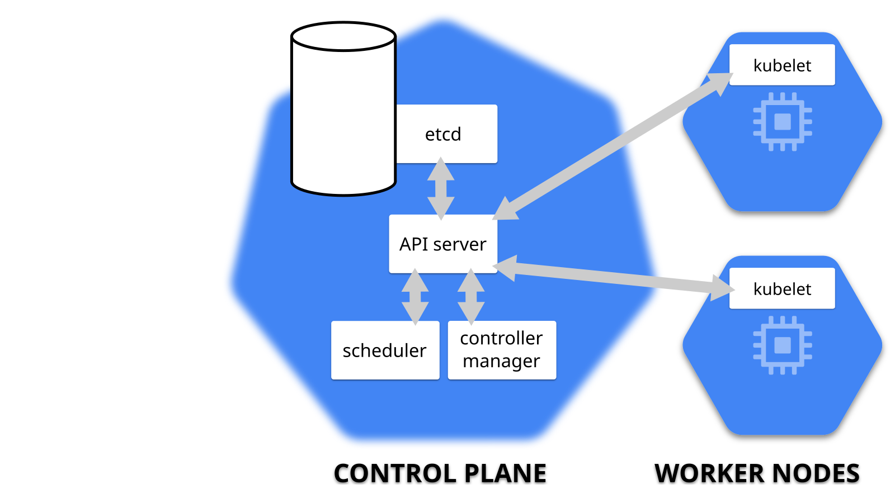

## Slideshow
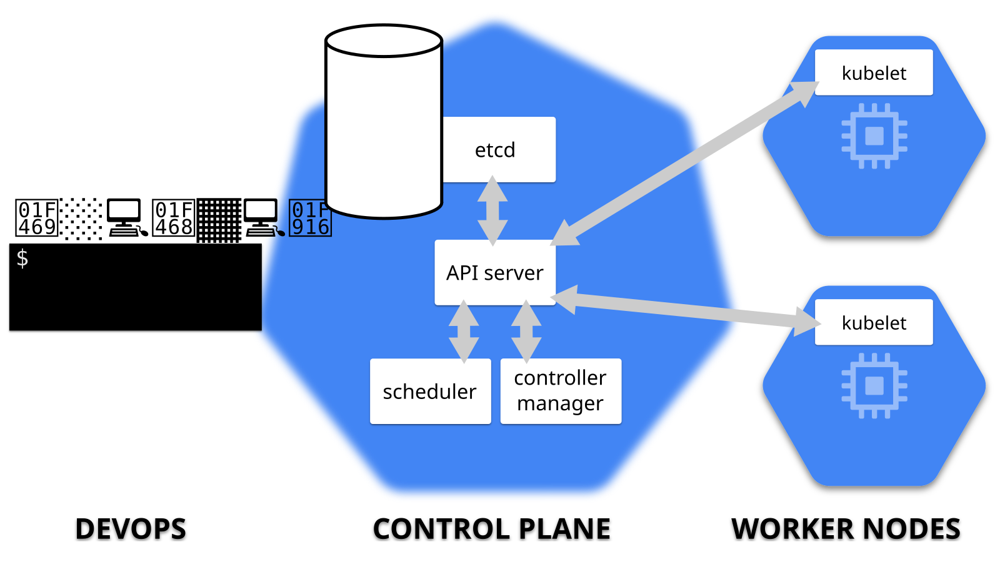

## Slideshow
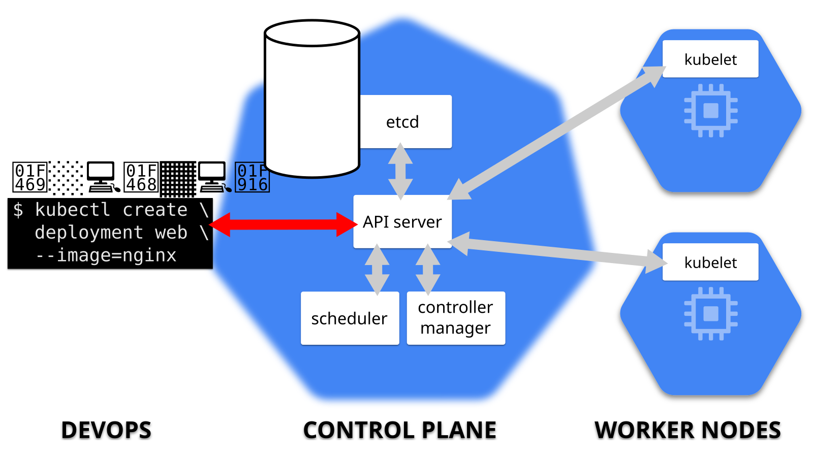

## Slideshow
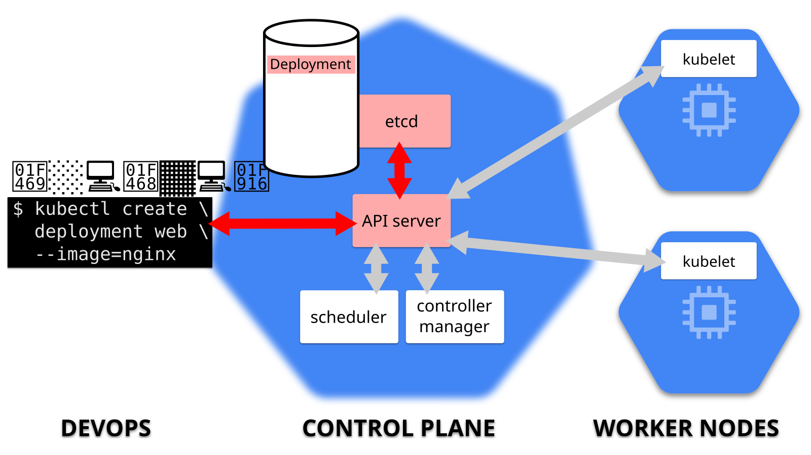

## Slideshow
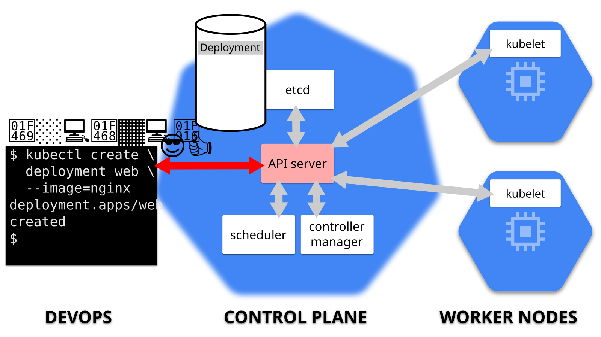

## Slideshow


## Slideshow
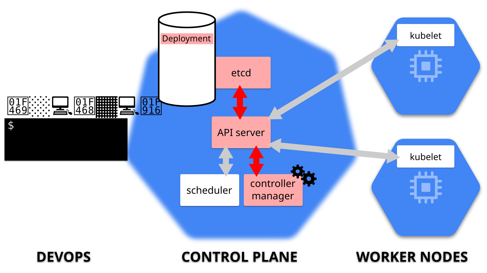

## Slideshow


## Slideshow


## Slideshow
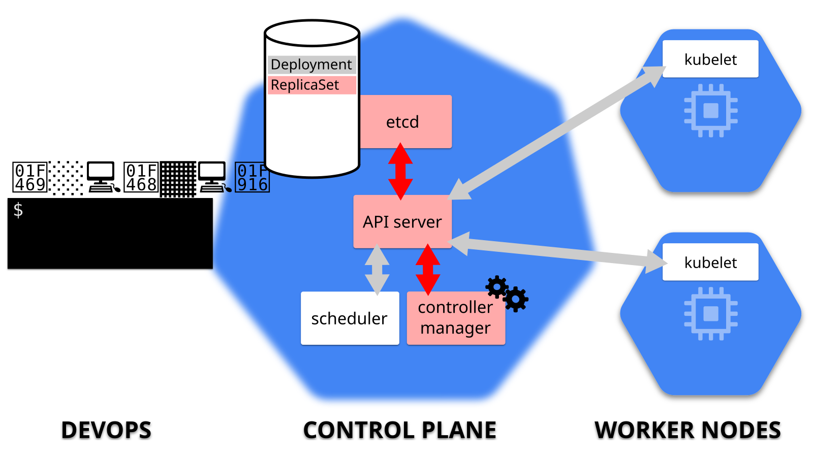

## Slideshow
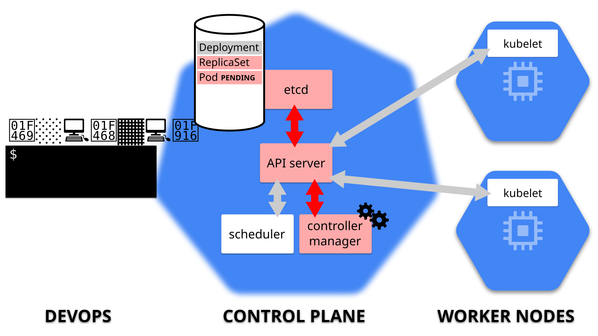

## Slideshow


## Slideshow
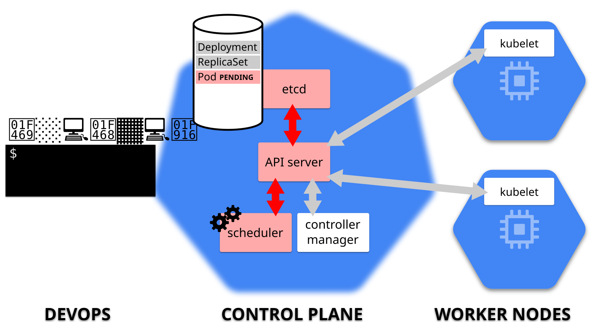

## Slideshow


## Slideshow
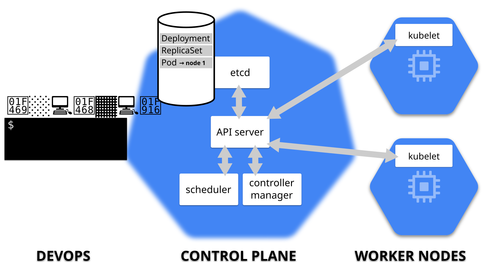

## Slideshow
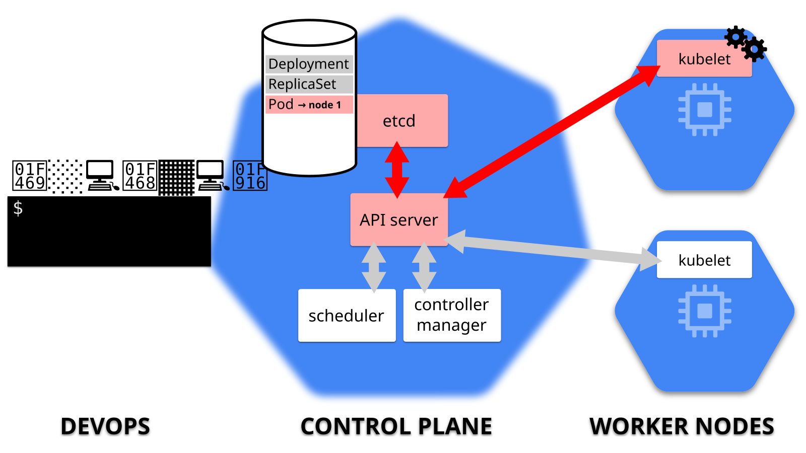

## Slideshow
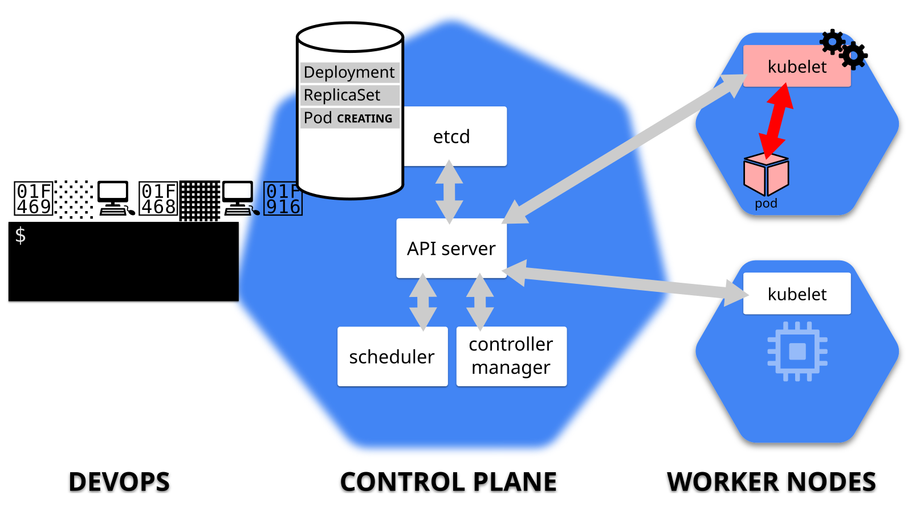

## Slideshow


## Slideshow
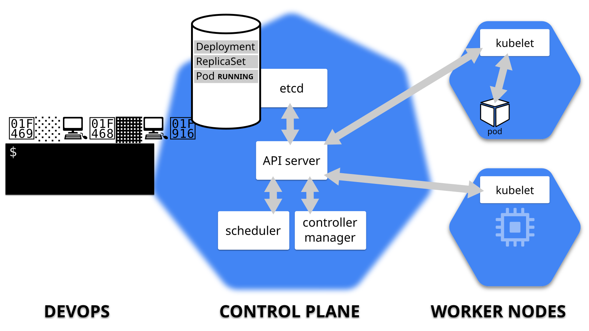

# Exposing containers

:::{.callout-tip icon=false}
## Exposing containers

- We can connect to our pods using their IP address

- Then we need to figure out a lot of things:

  - how do we look up the IP address of the pod(s)?

  - how do we connect from outside the cluster?

  - how do we load balance traffic?

  - what if a pod fails?

- Kubernetes has a resource type named *Service*

- Services address all these questions!

:::

## Exposing containers
:::{.callout-tip icon=false}
## Running containers with open ports

- Since `ping` doesn't have anything to connect to, we'll have to run something else

- We are going to use `jpetazzo/color`, a tiny HTTP server written in Go

- `jpetazzo/color` listens on port 80

- It serves a page showing the pod's name

  (this will be useful when checking load balancing behavior)

- We could also use the `nginx` official image instead

  (but we wouldn't be able to tell the backends from each other)

:::

## Exposing containers
:::{.callout-tip icon=false}
## Running our HTTP server

- We will create a deployment with `kubectl create deployment`

- This will create a Pod running our HTTP server

- Create a deployment named `blue`:
  ```bash
  kubectl create deployment blue --image=jpetazzo/color
  ```

:::

## Exposing containers {.scrollable}
:::{.callout-tip icon=false}
## Connecting to the HTTP server

- Let's connect to the HTTP server directly

  (just to make sure everything works fine; we'll add the Service later)

- Get the IP address of the Pod:
  ```bash
  kubectl get pods -o wide
  ```

- Send an HTTP request to the Pod:
  ```bash
  curl http://`IP-ADDRESSS`
  ```


You should see a response from the Pod.

:::

:::{.callout-important}
## Running with a local cluster

If you're running with a local cluster (Docker Desktop, KinD, minikube...),
the Pod isn't reachable directly from your local machine.

In that case, you can test the connection to the Pod by running a shell
*inside* the cluster:

```bash
kubectl run -it --rm my-test-pod --image=fedora
```

Then run `curl` in that Pod.

:::

## Exposing containers
:::{.callout-tip icon=false}
## The Pod doesn't have a "stable identity"

- The IP address that we used above isn't "stable"

  (if the Pod gets deleted, the replacement Pod will have a different address)

- Check the IP addresses of running Pods:
  ```bash
  watch kubectl get pods -o wide
  ```

- Delete the Pod:
  ```bash
  kubectl delete pod `blue-xxxxxxxx-yyyyy`
  ```

- Check that the replacement Pod has a different IP address


:::

## Exposing containers
:::{.callout-tip icon=false}
## Services in a nutshell

- Services give us a *stable endpoint* to connect to a pod or a group of pods

- An easy way to create a service is to use `kubectl expose`

- If we have a deployment named `my-little-deploy`, we can run:

  `kubectl expose deployment my-little-deploy --port=80`

  ... and this will create a service with the same name (`my-little-deploy`)

- Services are automatically added to an internal DNS zone

  (in the example above, our code can now connect to http://my-little-deploy/)

:::

## Exposing containers
:::{.callout-tip icon=false}
## Exposing our deployment

- Let's create a Service for our Deployment

- Expose the HTTP port of our server:
  ```bash
  kubectl expose deployment blue --port=80
  ```

- Look up which IP address was allocated:
  ```bash
  kubectl get service
  ```

- By default, this created a `ClusterIP` service

  (we'll discuss later the different types of services)

:::

## Exposing containers
:::{.callout-tip icon=false}
## Services are layer 4 constructs

- Services can have IP addresses, but they are still *layer 4*

  (i.e. a service is not just an IP address; it's an IP address + protocol + port)

- As a result: you *have to* indicate the port number for your service
    
  (with some exceptions, like `ExternalName` or headless services, covered later)

:::

## Exposing containers
:::{.callout-tip icon=false}
## Testing our service

- We will now send a few HTTP requests to our Pod

- Let's obtain the IP address that was allocated for our service, *programmatically:*
  ```bash
  CLUSTER_IP=$(kubectl get svc blue -o go-template='{{ .spec.clusterIP }}')
  ```

<!--
```hide kubectl wait deploy blue --for condition=available```
```key ^D```
```key ^C```
-->

- Send a few requests:
  ```bash
  for i in $(seq 10); do curl http://$CLUSTER_IP; done
  ```
:::

## Exposing containers
:::{.callout-tip icon=false}
## A *stable* endpoint

- Let's see what happens when the Pod has a problem

- Keep sending requests to the Service address:
  ```bash
  while sleep 0.3; do curl http://$CLUSTER_IP; done
  ```

- Meanwhile, delete the Pod:
  ```bash
  kubectl delete pod `blue-xxxxxxxx-yyyyy`
  ```

- There might be a short interruption when we delete the pod...

- ...But requests will keep flowing after that (without requiring a manual intervention)

:::

## Exposing containers
:::{.callout-tip icon=false}
## Load balancing

- The Service will also act as a load balancer

  (if there are multiple Pods in the Deployment)

- Scale up the Deployment:
  ```bash
  kubectl scale deployment blue --replicas=3
  ```

- Send a bunch of requests to the Service:
  ```bash
  for i in $(seq 20); do curl http://$CLUSTER_IP; done
  ```

- Our requests are load balanced across the Pods!

:::

## Exposing containers
:::{.callout-tip icon=false}
## DNS integration

- Kubernetes provides an internal DNS resolver

- The resolver maps service names to their internal addresses

- By default, this only works *inside Pods* (not from the nodes themselves)

- Get a shell in a Pod:
  ```bash
  kubectl run --rm -it --image=fedora test-dns-integration
  ```

- Try to resolve the `blue` Service from the Pod:
  ```bash
  curl blue
  ```

:::

<!--
## Exposing containers
:::{.callout-tip icon=false}
## Under the hood...

- Check the content of `/etc/resolv.conf` inside a Pod

- It will have `nameserver X.X.X.X` (e.g. 10.96.0.10)

- Now check `kubectl get service kube-dns --namespace=kube-system`

- ...It's the same address! 😉

- The FQDN of a service is actually:

  `<service-name>.<namespace>.svc.<cluster-domain>`

- `<cluster-domain>` defaults to `cluster.local`

- And the `search` includes `<namespace>.svc.<cluster-domain>`

:::
-->
## Exposing containers
:::{.callout-note}
## Advantages of services

- We don't need to look up the IP address of the pod(s)

  (we resolve the IP address of the service using DNS)

- There are multiple service types; some of them allow external traffic

  (e.g. `LoadBalancer` and `NodePort`)

- Services provide load balancing

  (for both internal and external traffic)

- Service addresses are independent from pods' addresses

  (when a pod fails, the service seamlessly sends traffic to its replacement)

:::

# Service Types

## Service Types
:::{.callout-tip icon=false}
## Service Types

- There are different types of services:

  `ClusterIP`, `NodePort`, `LoadBalancer`, `ExternalName`

- There are also *headless services*

- Services can also have optional *external IPs*

- There is also another resource type called *Ingress*

  (specifically for HTTP services)

- Wow, that's a lot! Let's start with the basics ...

:::

## Service Types
:::{.callout-tip icon=false}
## `ClusterIP`

- It's the default service type

- A virtual IP address is allocated for the service

  (in an internal, private range; e.g. 10.96.0.0/12)

- This IP address is reachable only from within the cluster (nodes and pods)

- Our code can connect to the service using the original port number

- Perfect for internal communication, within the cluster

:::

## Service Types


## Service Types


## Service Types
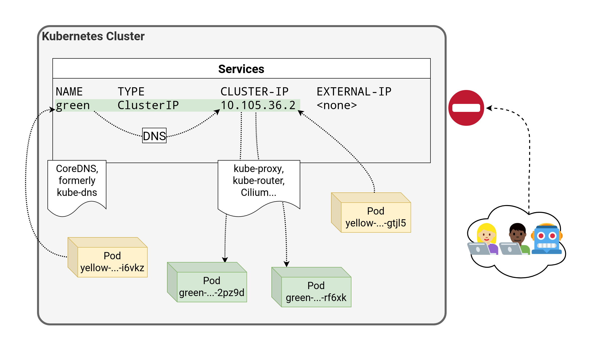

## Service Types
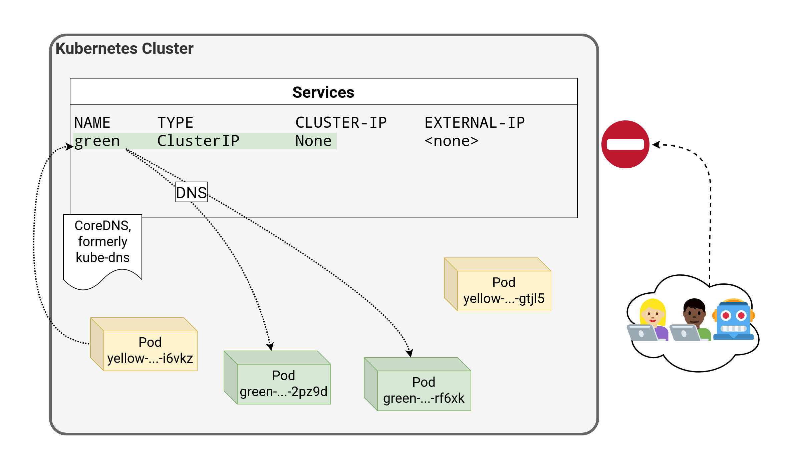

## Service Types
:::{.callout-tip icon=false}
## `LoadBalancer`

- An external load balancer is allocated for the service

  (typically a cloud load balancer, e.g. ELB on AWS, GLB on GCE ...)

- This is available only when the underlying infrastructure provides some kind of
  "load balancer as a service"

- Each service of that type will typically cost a little bit of money

  (e.g. a few cents per hour on AWS or GCE)

- Ideally, traffic would flow directly from the load balancer to the pods

- In practice, it will often flow through a `NodePort` first

:::

## `LoadBalancer`
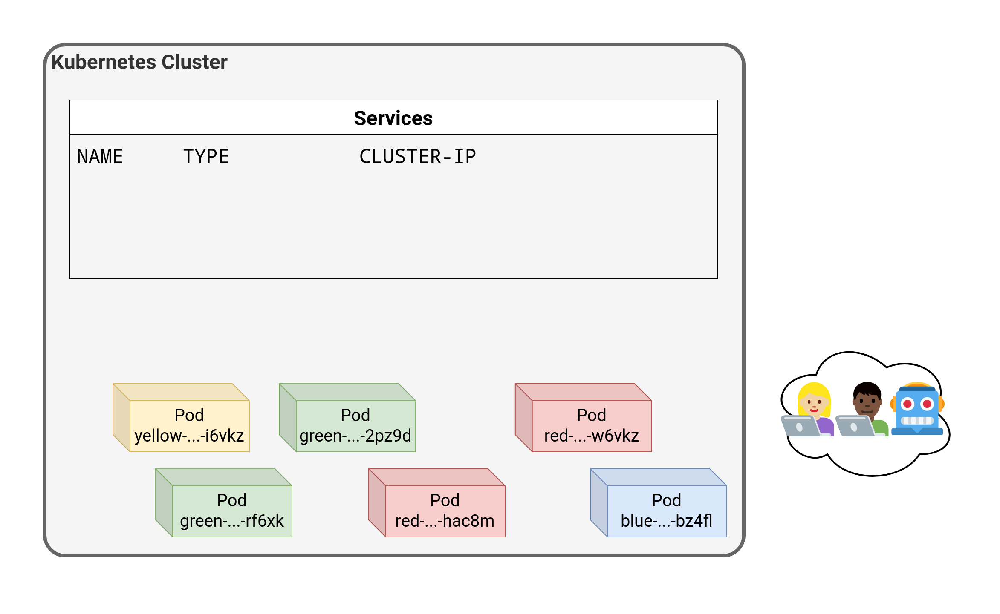

## `LoadBalancer`
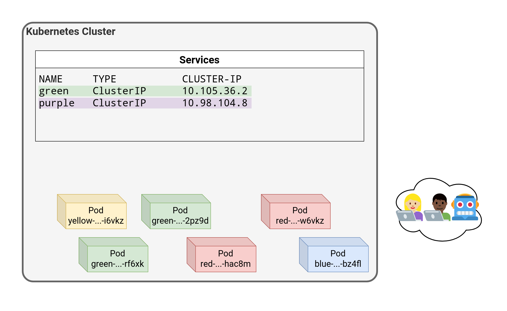

## `LoadBalancer`


## `LoadBalancer`
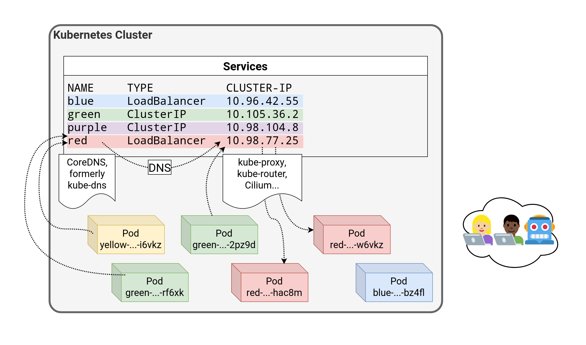

## `LoadBalancer`
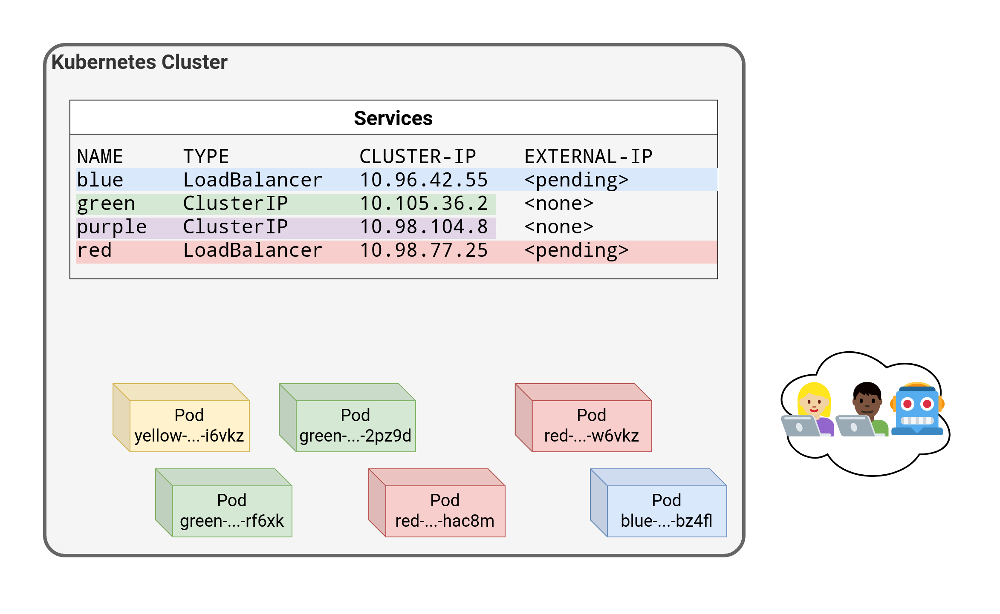

## `LoadBalancer`


## `LoadBalancer`


## `LoadBalancer`


## `LoadBalancer`
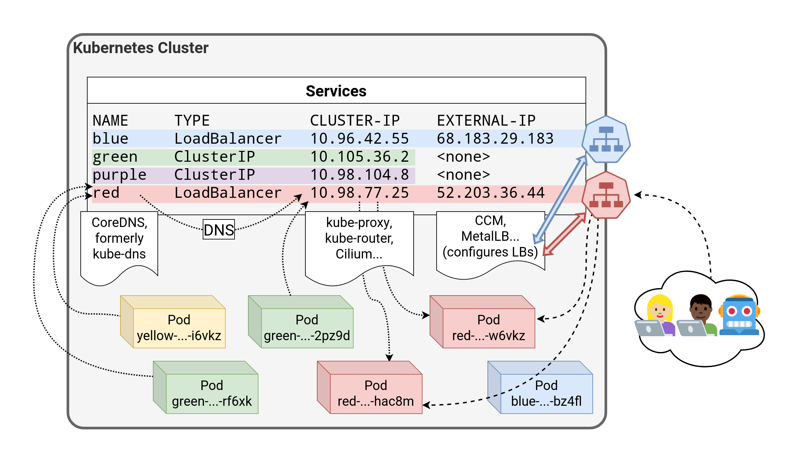

## `LoadBalancer`
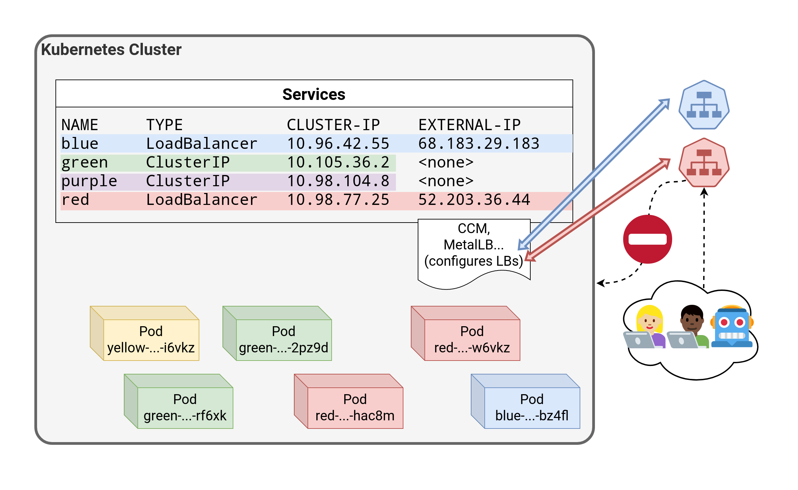

## `LoadBalancer`
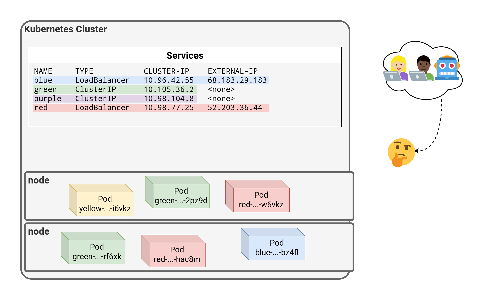

## `LoadBalancer`
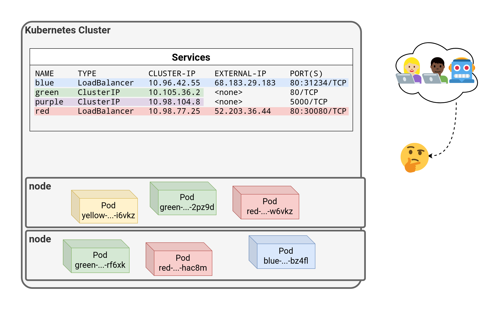

## `LoadBalancer`
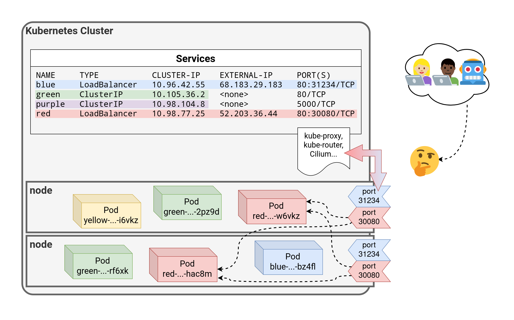

## `LoadBalancer`
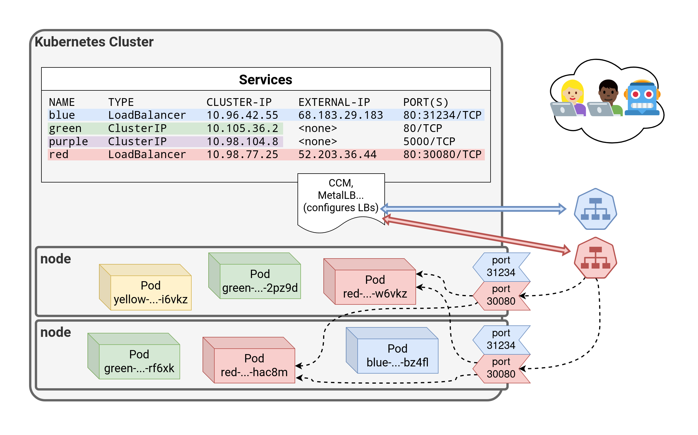

## `LoadBalancer`
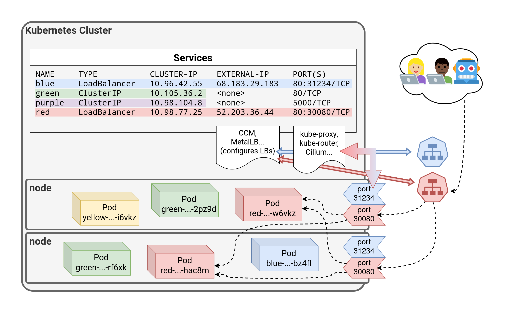

## `LoadBalancer`
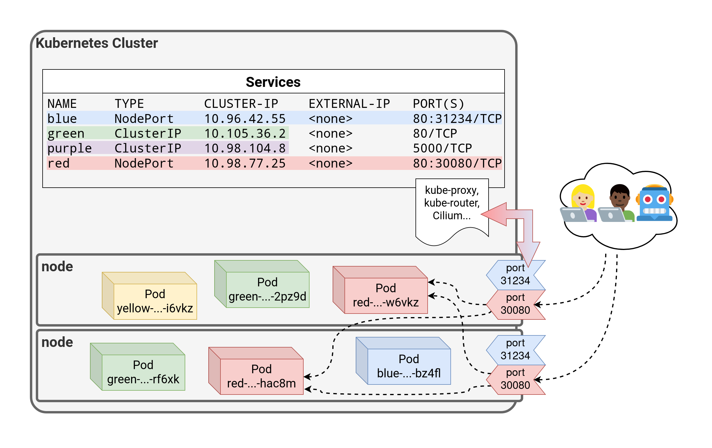

## Service Types
:::{.callout-tip icon=false}
## `NodePort`

- A port number is allocated for the service

  (by default, in the 30000-32767 range)

- That port is made available *on all our nodes* and anybody can connect to it

  (we can connect to any node on that port to reach the service)

- Our code needs to be changed to connect to that new port number

- Under the hood: `kube-proxy` sets up a bunch of `iptables` rules on our nodes

- Sometimes, it's the only available option for external traffic

  (e.g. most clusters deployed with kubeadm or on-premises)

:::

## Service Types
:::{.callout-tip icon=false}
## `ExternalName`

- Services of type `ExternalName` are quite different

- No load balancer (internal or external) is created

- Only a DNS entry gets added to the DNS managed by Kubernetes

- That DNS entry will just be a `CNAME` to a provided record

Example:
```bash
kubectl create service externalname k8s --external-name kubernetes.io
```
*Creates a CNAME `k8s` pointing to `kubernetes.io`*

:::

## Service Types
:::{.callout-tip icon=false}
## External IPs

- We can add an External IP to a service, e.g.:
  ```bash
  kubectl expose deploy my-little-deploy --port=80 --external-ip=1.2.3.4
  ```

- `1.2.3.4` should be the address of one of our nodes

  (it could also be a virtual address, service address, or VIP, shared by multiple nodes)

- Connections to `1.2.3.4:80` will be sent to our service

- External IPs will also show up on services of type `LoadBalancer`

  (they will be added automatically by the process provisioning the load balancer)

:::

## Service Types
:::{.callout-tip icon=false}
## Headless services

- Sometimes, we want to access our scaled services directly:

  - if we want to save a tiny little bit of latency (typically less than 1ms)

  - if we need to connect over arbitrary ports (instead of a few fixed ones)

  - if we need to communicate over another protocol than UDP or TCP

  - if we want to decide how to balance the requests client-side

  - ...

- In that case, we can use a "headless service"

:::

## Service Types
:::{.callout-tip icon=false}
## Creating a headless service

- A headless service is obtained by setting the `clusterIP` field to `None`

  (Either with `--cluster-ip=None`, or by providing a custom YAML)

- As a result, the service doesn't have a virtual IP address

- Since there is no virtual IP address, there is no load balancer either

- CoreDNS will return the pods' IP addresses as multiple `A` records

- This gives us an easy way to discover all the replicas for a deployment

:::

## Service Types
:::{.callout-tip icon=false}
## Services and endpoints

- A service has a number of "endpoints"

- Each endpoint is a host + port where the service is available

- The endpoints are maintained and updated automatically by Kubernetes

- Check the endpoints that Kubernetes has associated with our `blue` service:
  ```bash
  kubectl describe service blue
  ```

In the output, there will be a line starting with `Endpoints:`.

That line will list a bunch of addresses in `host:port` format.

:::

## Service Types
:::{.callout-tip icon=false}
## Viewing endpoint details

- When we have many endpoints, our display commands truncate the list
  ```bash
  kubectl get endpoints
  ```

- If we want to see the full list, we can use one of the following commands:
  ```bash
  kubectl describe endpoints blue
  kubectl get endpoints blue -o yaml
  ```

- These commands will show us a list of IP addresses

- These IP addresses should match the addresses of the corresponding pods:
  ```bash
  kubectl get pods -l app=blue -o wide
  ```

:::

## Service Types
:::{.callout-tip icon=false}
## `endpoints` not `endpoint`

- `endpoints` is the only resource that cannot be singular

```bash
$ kubectl get endpoint
error: the server doesn't have a resource type "endpoint"
```

- This is because the type itself is plural (unlike every other resource)

- There is no `endpoint` object: `type Endpoints struct`

- The type doesn't represent a single endpoint, but a list of endpoints

:::

## Service Types
:::{.callout-tip icon=false}
## `Ingress`

- Ingresses are another type (kind) of resource

- They are specifically for HTTP services

  (not TCP or UDP)

- They can also handle TLS certificates, URL rewriting ...

- They require an *Ingress Controller* to function

:::

## `Ingress`
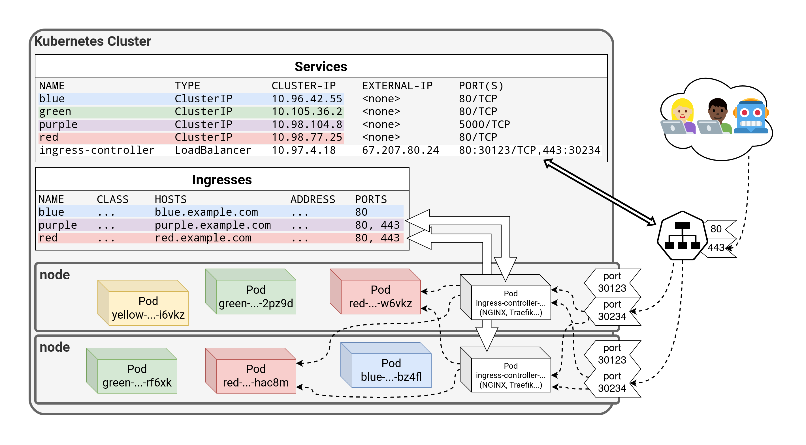

## `Ingress`
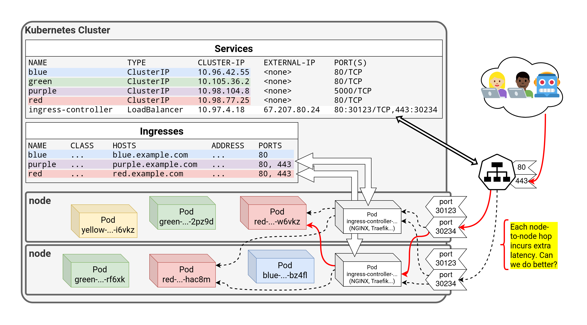

## `Ingress`
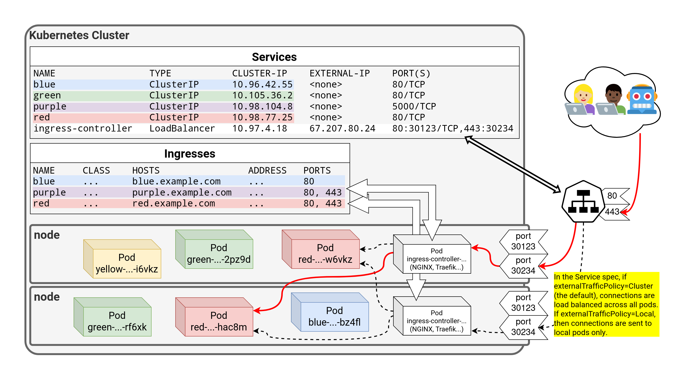

## `Ingress`
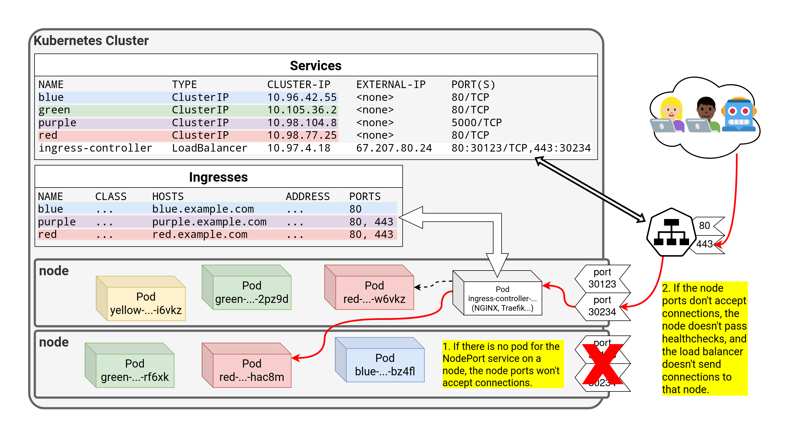

## Service Types
:::{.callout-tip icon=false}
## Traffic engineering

- By default, connections to a ClusterIP or a NodePort are load balanced
  across all the backends of their Service

- This can incur extra network hops (which add latency)

- To remove that extra hop, multiple mechanisms are available:

  - `spec.externalTrafficPolicy`

  - `spec.internalTrafficPolicy`

  - [Topology aware routing](https://kubernetes.io/docs/concepts/services-networking/topology-aware-routing/) annotation (beta)

  - `spec.trafficDistribution` (alpha in 1.30, beta in 1.31)

:::

## Service Types
:::{.callout-tip icon=false}
## `internal / externalTrafficPolicy`

- Applies respectively to `ClusterIP` and `NodePort` connections

- Can be set to `Cluster` or `Local`

- `Cluster`: load balance connections across all backends (default)

- `Local`: load balance connections to local backends (on the same node)

- With `Local`, if there is no local backend, the connection will fail!

  (the parameter expresses a "hard rule", not a preference)

- Example: `externalTrafficPolicy: Local` for Ingress controllers

  (as shown on earlier diagrams)

:::

## Service Types
:::{.callout-tip icon=false}
## Topology aware routing

- In beta since Kubernetes 1.23

- Enabled with annotation `service.kubernetes.io/topology-mode=Auto` 

- Relies on node label `topology.kubernetes.io/zone`

- Kubernetes service proxy will try to keep connections within a zone

  (connections made by a pod in zone `a` will be sent to pods in zone `a`)

- ...Except if there are no pods in the zone (then fallback to all zones)

- This can mess up autoscaling!

:::

## Service Types
:::{.callout-important icon=false}
## `spec.trafficDistribution`

- [KEP4444, Traffic Distribution for Services][kep4444]

- Supersedes topology aware routing

- Multiple values are supported

- `PreferClose` (alpha since K8S 1.30, beta since K8S 1.31, stable since K8S 1.33)

  "try to route traffic to endpoints in the same zone as the client"

- `PreferSameZone` (beta since K8S 1.34)

  "same as `PreferClose` but clearer about the intended semantics"

- `PreferSameNode` (beta since K8S 1.34)

  "try to route traffic to endpoints on the same node as the client"

[kep4444]: https://github.com/kubernetes/enhancements/issues/4444
:::

# Kubernetes network model

## Kubernetes network model
:::{.callout-tip icon=false}
## Kubernetes network model

- **TL,DR:**

  *Our cluster (nodes and pods) is one big flat IP network.*

- In detail:

  - all nodes must be able to reach each other, without NAT

  - all pods must be able to reach each other, without NAT

  - pods and nodes must be able to reach each other, without NAT

  - each pod is aware of its IP address (no NAT)

  - pod IP addresses are assigned by the network implementation

- Kubernetes doesn't mandate any particular implementation

:::

## Kubernetes network model
:::{.callout-tip icon=false}
## Kubernetes network model: the good

- Everything can reach everything

- No address translation

- No port translation

- No new protocol

- The network implementation can decide how to allocate addresses

- IP addresses don't have to be "portable" from a node to another

  (We can use e.g. a subnet per node and use a simple routed topology)

- The specification is simple enough to allow many various implementations

:::

## Kubernetes network model
:::{.callout-warning}
## Kubernetes network model: the less good

- Everything can reach everything

  - if you want security, you need to add network policies

  - the network implementation that you use needs to support them

- There are literally dozens of implementations out there

  (<https://github.com/containernetworking/cni/> lists more than 25 plugins)

- Pods have level 3 (IP) connectivity, but *services* are level 4 (TCP or UDP)

  (Services map to a single UDP or TCP port; no port ranges or arbitrary IP packets)

- `kube-proxy` is on the data path when connecting to a pod or container,
  <br/>and it's not particularly fast (relies on userland proxying or iptables)

:::

<!--
## Kubernetes network model
:::{.callout-tip icon=false}
## Kubernetes network model: in practice

- The nodes that we are using have been set up to use [Weave](https://github.com/weaveworks/weave)

- We don't endorse Weave in a particular way, it just Works For Us

- Don't worry about the warning about `kube-proxy` performance

- Unless you:

  - routinely saturate 10G network interfaces
  - count packet rates in millions per second
  - run high-traffic VOIP or gaming platforms
  - do weird things that involve millions of simultaneous connections
    <br/>(in which case you're already familiar with kernel tuning)

- If necessary, there are alternatives to `kube-proxy`; e.g.
  [`kube-router`](https://www.kube-router.io)

:::
-->

## Kubernetes network model
:::{.callout-tip icon=false}
## The Container Network Interface (CNI)

- Most Kubernetes clusters use CNI "plugins" to implement networking

- When a pod is created, Kubernetes delegates the network setup to these plugins

  (it can be a single plugin, or a combination of plugins, each doing one task)

- Typically, CNI plugins will:

  - allocate an IP address (by calling an IPAM plugin)

  - add a network interface into the pod's network namespace

  - configure the interface as well as required routes etc.

:::

## Kubernetes network model
:::{.callout-tip icon=false}
## Multiple moving parts

- The "pod-to-pod network" or "pod network":

  - provides communication between pods and nodes

  - is generally implemented with CNI plugins

- The "pod-to-service network":

  - provides internal communication and load balancing

  - is generally implemented with kube-proxy (or e.g. kube-router)

- Network policies:

  - provide firewalling and isolation

  - can be bundled with the "pod network" or provided by another component

:::

## Kubernetes network model
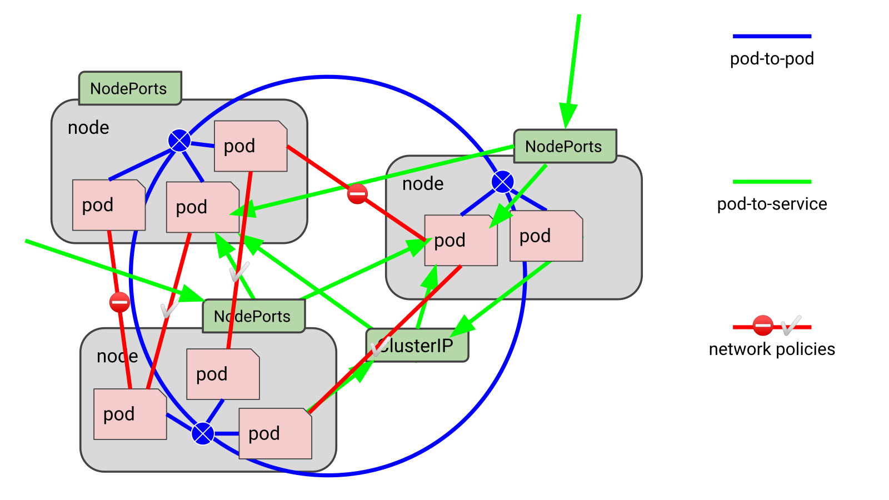

## Kubernetes network model
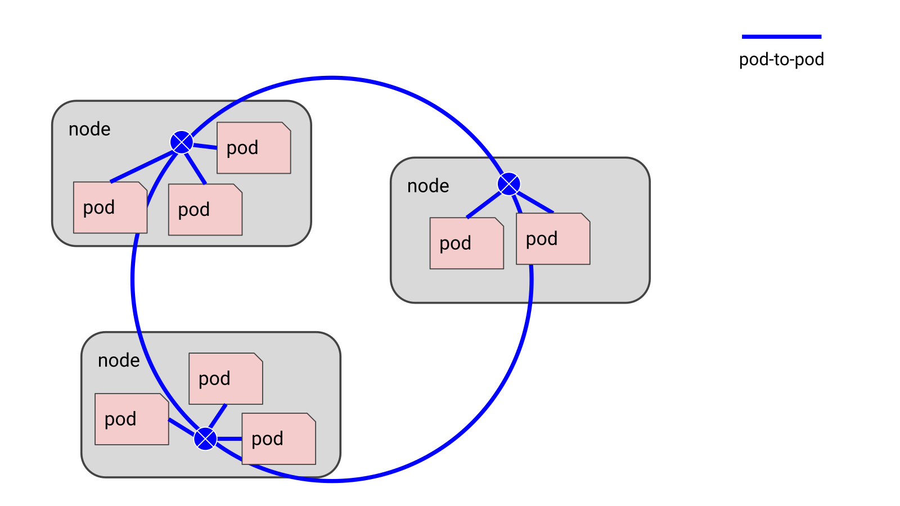

## Kubernetes network model
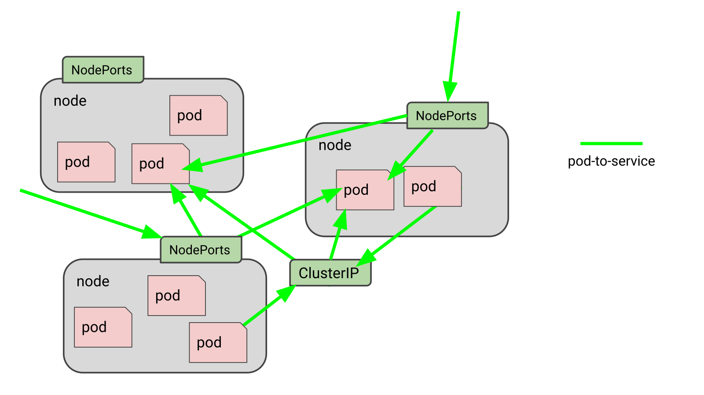

## Kubernetes network model
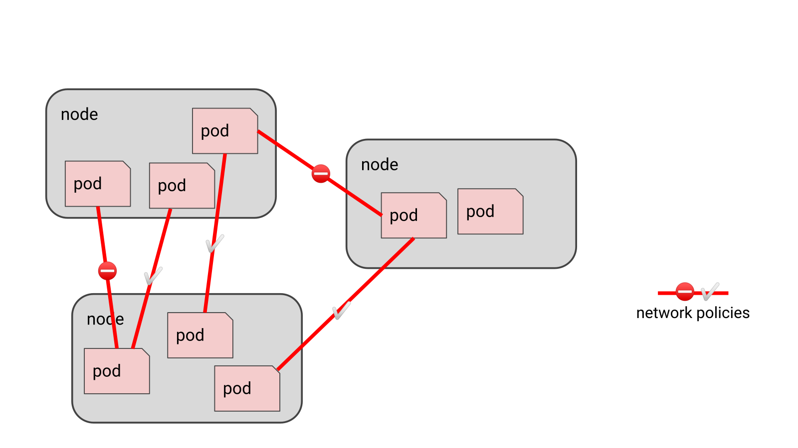

## Kubernetes network model
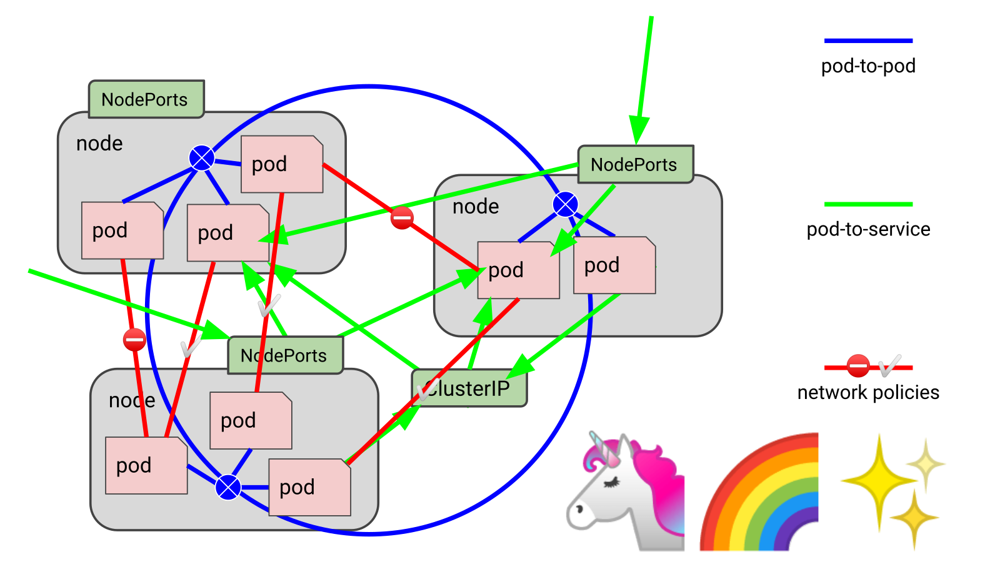

## Kubernetes network model
:::{.callout-tip icon=false}
## Even more moving parts

- Inbound traffic can be handled by multiple components:

  - something like kube-proxy or kube-router (for NodePort services)

  - load balancers (ideally, connected to the pod network)

- It is possible to use multiple pod networks in parallel

  (with "meta-plugins" like CNI-Genie or Multus)

- Some solutions can fill multiple roles

  (e.g. kube-router can be set up to provide the pod network and/or network policies and/or replace kube-proxy)

:::

# Shipping images with a registry

## Shipping images with a registry
:::{.callout-tip icon=false}
## Shipping images with a registry

- Initially, our app was running on a single node

- We could *build* and *run* in the same place

- Therefore, we did not need to *ship* anything

- Now that we want to run on a cluster, things are different

- The easiest way to ship container images is to use a registry

:::

## Shipping images with a registry
:::{.callout-tip icon=false}
## How Docker registries work (a reminder)

- What happens when we execute `docker run alpine` ?

- If the Engine needs to pull the `alpine` image, it expands it into `library/alpine`

- `library/alpine` is expanded into `index.docker.io/library/alpine`

- The Engine communicates with `index.docker.io` to retrieve `library/alpine:latest`

- To use something else than `index.docker.io`, we specify it in the image name

- Examples:
  ```bash
  docker pull gcr.io/google-containers/alpine-with-bash:1.0

  docker build -t registry.mycompany.io:5000/myimage:awesome .
  docker push registry.mycompany.io:5000/myimage:awesome
  ```

:::

## Shipping images with a registry
:::{.callout-tip icon=false}
## Running DockerCoins on Kubernetes

- Create one deployment for each component

  (hasher, redis, rng, webui, worker)

- Expose deployments that need to accept connections

  (hasher, redis, rng, webui)

- For redis, we can use the official redis image

- For the 4 others, we need to build images and push them to some registry

:::

## Shipping images with a registry
:::{.callout-tip icon=false}
## Building and shipping images

- There are *many* options!

- Manually:

  - build locally (with `docker build` or otherwise)

  - push to the registry

- Automatically:

  - build and test locally

  - when ready, commit and push a code repository

  - the code repository notifies an automated build system

  - that system gets the code, builds it, pushes the image to the registry

:::

## Shipping images with a registry
:::{.callout-tip icon=false}
## Which registry do we want to use?

- There are SAAS products like Docker Hub, Quay ...

- Each major cloud provider has an option as well

  (ACR on Azure, ECR on AWS, GCR on Google Cloud...)

- There are also commercial products to run our own registry

  (Docker EE, Quay...)

- And open source options, too!

- When picking a registry, pay attention to its build system

  (when it has one)

:::

## Shipping images with a registry
:::{.callout-tip icon=false}
## Building on the fly

- Conceptually, it is possible to build images on the fly from a repository

- Example: [ctr.run](https://ctr.run/)

  (deprecated in August 2020, after being aquired by Datadog)

- It did allow something like this:
  ```bash
  docker run ctr.run/github.com/jpetazzo/container.training/dockercoins/hasher
  ```

- No alternative yet

  (free startup idea, anyone?)

:::

## Shipping images with a registry
:::{.callout-tip icon=false}
## Using images from the Docker Hub

- For everyone's convenience, we took care of building DockerCoins images

- We pushed these images to the DockerHub, under the [dockercoins](https://hub.docker.com/u/dockercoins) user

- These images are *tagged* with a version number, `v0.1`

- The full image names are therefore:

  - `dockercoins/hasher:v0.1`

  - `dockercoins/rng:v0.1`

  - `dockercoins/webui:v0.1`

  - `dockercoins/worker:v0.1`
:::

# Running our application on Kubernetes

## Running our app on Kubernetes
:::{.callout-tip icon=false}
## Running our application on Kubernetes

- We can now deploy our code (as well as a redis instance)

- Deploy `redis`:
  ```bash
  kubectl create deployment redis --image=redis
  ```

- Deploy everything else:
  ```bash
  kubectl create deployment hasher --image=dockercoins/hasher:v0.1
  kubectl create deployment rng --image=dockercoins/rng:v0.1
  kubectl create deployment webui --image=dockercoins/webui:v0.1
  kubectl create deployment worker --image=dockercoins/worker:v0.1
  ```
:::

<!--
## Running our app on Kubernetes
:::{.callout-tip icon=false}
## Deploying other images

- If we wanted to deploy images from another registry ...

- ... Or with a different tag ...

- ... We could use the following snippet:

```bash
  REGISTRY=dockercoins
  TAG=v0.1
  for SERVICE in hasher rng webui worker; do
    kubectl create deployment $SERVICE --image=$REGISTRY/$SERVICE:$TAG
  done
```

:::
-->

## Running our app on Kubernetes
:::{.callout-tip icon=false}
## Is this working?

- After waiting for the deployment to complete, let's look at the logs!

  (Hint: use `kubectl get deploy -w` to watch deployment events)

<!-- ```hide
kubectl wait deploy/rng --for condition=available
kubectl wait deploy/worker --for condition=available
``` -->

- Look at some logs:
  ```bash
  kubectl logs deploy/rng
  kubectl logs deploy/worker
  ```

🤔 `rng` is fine ... But not `worker`.

💡 Oh right! We forgot to `expose`.

:::

## Running our app on Kubernetes
:::{.callout-tip icon=false}
## Connecting containers together

- Three deployments need to be reachable by others: `hasher`, `redis`, `rng`

- `worker` doesn't need to be exposed

- `webui` will be dealt with later

- Expose each deployment, specifying the right port:
  ```bash
  kubectl expose deployment redis --port 6379
  kubectl expose deployment rng --port 80
  kubectl expose deployment hasher --port 80
  ```
:::

## Running our app on Kubernetes
:::{.callout-tip icon=false}
## Is this working yet?

- The `worker` has an infinite loop, that retries 10 seconds after an error

- Stream the worker's logs:
  ```bash
  kubectl logs deploy/worker --follow
  ```

  (Give it about 10 seconds to recover)

<!--
```wait units of work done, updating hash counter```
```key ^C```
-->

We should now see the `worker`, well, working happily.

:::

## Running our app on Kubernetes
:::{.callout-tip icon=false}
## Exposing services for external access

- Now we would like to access the Web UI

- We will expose it with a `NodePort`

  (just like we did for the registry)

- Create a `NodePort` service for the Web UI:
  ```bash
  kubectl expose deploy/webui --type=NodePort --port=80
  ```

- Check the port that was allocated:
  ```bash
  kubectl get svc
  ```
:::

## Running our app on Kubernetes
:::{.callout-tip icon=false}
## Accessing the web UI

- We can now connect to *any node*, on the allocated node port, to view the web UI

- (minikube-specific) Enable port-forwarding:
  ```
  kubectl port-forward svc/webui 8080:80
  ```
  or use the url listed by this command:
  ```
  minikube service webui --url
  ```
- Open the web UI in your browser (http://node-ip-address:3xxxx/)

<!-- ```open http://node1:3xxxx/``` -->

Yes, this may take a little while to update.

*Alright, we're back to where we started, when we were running on a single node!*

:::

# Deploying with YAML

## Deploying with YAML
:::{.callout-tip icon=false}
## Deploying with YAML

- So far, we created resources with the following commands:

  - `kubectl run`

  - `kubectl create deployment`

  - `kubectl expose`

- We can also create resources directly with YAML manifests

:::

## Deploying with YAML
:::{.callout-tip icon=false}
## Why use YAML? (1/3)

- Some resources cannot be created easily with `kubectl`

  (e.g. DaemonSets, StatefulSets, webhook configurations...)

- Some features and fields aren't directly available

  (e.g. resource limits, healthchecks, volumes...)

:::

## Deploying with YAML
:::{.callout-tip icon=false}
## Why use YAML? (2/3)

- Create a complicated resource with a single, simple command:

  `kubectl create -f stuff.yaml`

- Create *multiple* resources with a single, simple command:

  `kubectl create -f more-stuff.yaml` or `kubectl create -f directory-with-yaml/`

- Create resources from a remote manifest:

  `kubectl create -f https://.../.../stuff.yaml`

- Create and update resources:

  `kubectl apply -f stuff.yaml`

:::

## Deploying with YAML
:::{.callout-tip icon=false}
## Why use YAML? (3/3)

- YAML lets us work *declaratively*

- Describe what we want to deploy/run on Kubernetes

  ("desired state")

- Use tools like `kubectl`, Helm, kapp, Flux, ArgoCD... to make it happen

  ("reconcile" actual state with desired state)

- Very similar to e.g. Terraform

:::

## Deploying with YAML
:::{.callout-tip icon=false}
## Overrides and `kubectl set`

Just so you know...

- `kubectl create deployment ... --overrides '{...}'`

  *specify a patch that will be applied on top of the YAML generated by `kubectl`*

- `kubectl set ...`

  *lets us change e.g. images, service accounts, resources, and much more*

:::

## Deploying with YAML
:::{.callout-tip icon=false}
## Various ways to write YAML

- From examples in the docs, tutorials, blog posts, LLMs...

  (easiest option when getting started)

- Dump an existing resource with `kubectl get -o yaml ...`

  (includes many extra fields; it is recommended to clean up the result)

- Ask `kubectl` to generate the YAML

  (with `kubectl --dry-run=client -o yaml create/run ...`)

- Completely from scratch with our favorite editor

  (black belt level😅)

:::

## Deploying with YAML
:::{.callout-tip icon=false}
## Writing a Pod manifest

- Let's use `kubectl --dry-run=client -o yaml`

- Generate the Pod manifest:
  ```bash
  kubectl run --dry-run=client -o yaml purple --image=jpetazzo/color
  ```

- Save it to a file:
  ```bash
  kubectl run --dry-run=client -o yaml purple --image=jpetazzo/color \
  > pod-purple.yaml
  ```

:::

## Deploying with YAML
:::{.callout-tip icon=false}
## Running the Pod

- Let's create the Pod with the manifest we just generated

- Create all the resources (at this point, just our Pod) described in the manifest:
  ```bash
  kubectl create -f pod-purple.yaml
  ```

- Confirm that the Pod is running
  ```bash
  kubectl get pods
  ```

:::

## Deploying with YAML
:::{.callout-tip icon=false}
## Comparing with direct `kubectl run`

- The Pod should be identical to one created directly with `kubectl run`

- Create a Pod directly with `kubectl run`:
  ```bash
  kubectl run yellow --image=jpetazzo/color
  ```

- Compare both Pod manifests and status:
  ```bash
  kubectl get pod purple -o yaml
  kubectl get pod yellow -o yaml
  ```

:::

## Deploying with YAML
:::{.callout-tip icon=false}
## Generating a Deployment manifest

- After a Pod, let's create a Deployment!

- Generate the YAML for a Deployment:
  ```bash
  kubectl create deployment purple --image=jpetazzo/color -o yaml --dry-run=client
  ```

- Save it to a file:
  ```bash
  kubectl create deployment purple --image=jpetazzo/color -o yaml --dry-run=client \
  > deployment-purple.yaml
  ```

- And create the Deployment:
  ```bash
  kubectl create -f deployment-purple.yaml
  ```
:::

## Deploying with YAML
:::{.callout-tip icon=false}
## Updating our Deployment

- What if we want to scale that Deployment?

- Option 1: `kubectl scale`

- Option 2: update the YAML manifest

- Let's go with option 2!

- Edit the YAML manifest:
  ```bash
  vim deployment-purple.yaml
  ```

- Find the line with `replicas: 1` and update the number of replicas

:::

## Deploying with YAML
:::{.callout-tip icon=false}
## Applying our changes

- Problem: `kubectl create` won't update ("overwrite") resources

- Try it out:
  ```bash
  kubectl create -f deployment-purple.yaml
  # This gives an error ("AlreadyExists")
  ```

- So, what can we do?

:::

## Deploying with YAML
:::{.callout-tip icon=false}
## Updating resources

- Option 1: delete the Deployment and re-create it

  (effective, but causes downtime!)

- Option 2: `kubectl scale` or `kubectl edit` the Deployment

  (effective, but that's cheating - we want to use YAML!)

- Option 3: `kubectl apply`

:::

## Deploying with YAML
:::{.callout-tip icon=false}
## `kubectl apply` vs `create`

- `kubectl create -f whatever.yaml`

  - creates resources if they don't exist

  - if resources already exist, don't alter them
    <br/>(and display error message)

- `kubectl apply -f whatever.yaml`

  - creates resources if they don't exist

  - if resources already exist, update them
    <br/>(to match the definition provided by the YAML file)

  - stores the manifest as an *annotation* in the resource

:::

## Deploying with YAML
:::{.callout-tip icon=false}
## Trying `kubectl apply`

- First, delete the Deployment:
  ```bash
  kubectl delete deployment purple
  ```

- Re-create it using `kubectl apply`:
  ```bash
  kubectl apply -f deployment-purple.yaml
  ```

- Edit the YAML manifest, change the number of replicas again:
  ```bash
  vim deployment-purple.yaml
  ```

- Apply the new manifest:
  ```bash
  kubectl apply -f deployment-purple.yaml
  ```

:::

## Deploying with YAML
:::{.callout-tip icon=false}
## `create` → `apply`

- What are the differences between `kubectl create -f` an `kubectl apply -f`?

  - `kubectl apply` adds an annotation
    <br/>
    (`kubectl.kubernetes.io/last-applied-configuration`)

  - `kubectl apply` makes an extra `GET` request
    <br/>
    (to get the existing object, or at least check if there is one)

- Otherwise, the end result is the same!

- It's almost always better to use `kubectl apply`

  (except when we don't want the extra annotation, e.g. for huge objects like some CRDs)

- From now on, we'll almost always use `kubectl apply -f` instead of `kubectl create -f`

:::

## Deploying with YAML
:::{.callout-tip icon=false}
## Adding a Service

- Let's generate the YAML for a Service exposing our Deployment

- Run `kubectl expose`, once again with `-o yaml --dry-run=client`:
  ```bash
  kubectl expose deployment purple --port 80 -o yaml --dry-run=client
  ```

- Save it to a file:
  ```bash
  kubectl expose deployment purple --port 80 -o yaml --dry-run=client \
  > service-purple.yaml
  ```

- Note: if the Deployment doesn't exist, `kubectl expose` won't work!

:::

## Deploying with YAML
:::{.callout-tip icon=false}
## What if the Deployment doesn't exist?

- We can also use `kubectl create service`

- The syntax is slightly different

  (`--port` becomes `--tcp` for some reason)

- Generate the YAML with `kubectl create service`:
  ```bash
  kubectl create service clusterip purple --tcp 80 -o yaml --dry-run=client
  ```

:::

## Deploying with YAML
:::{.callout-tip icon=false}
## Combining manifests

- We can put multiple resources in a single YAML file

- We need to separate them with the standard YAML document separator

  (i.e. `---` standing by itself on a single line)

- Generate a combined YAML file:
  ```bash
    for YAMLFILE in deployment-purple.yaml service-purple.yaml; do
      echo ---
      cat $YAMLFILE
    done > app-purple.yaml
  ```

:::

## Deploying with YAML
:::{.callout-tip icon=false}
## Resource ordering

- *In general,* the order of the resources doesn't matter:

  - in many cases, resources don't reference each other explicitly
    <br/>
    (e.g. a Service can exist even if the corresponding Deployment doesn't)

  - in some cases, there might be a transient error, but Kubernetes will retry
    <br/>
    (and eventually succeed)

- One exception: Namespaces should be created *before* resources in them!

:::

## Deploying with YAML
:::{.callout-tip icon=false}
## Using `-f` with other commands

- We can also use `kubectl delete -f`, `kubectl label -f`, and more!

- Apply the resulting YAML file:
  ```bash
  kubectl apply -f app-purple.yaml
  ```

- Add a label to both the Deployment and the Service:
  ```bash
  kubectl label -f app-purple.yaml release=production
  ```

- Delete them:
  ```bash
  kubectl delete -f app-purple.yaml
  ```

:::

## Deploying with YAML
:::{.callout-tip icon=false}
## Pruning resources

- We can also tell `kubectl` to remove old resources

- This is done with `kubectl apply -f ... --prune`

- It will remove resources that don't exist in the YAML file(s)

- But only if they were created with `kubectl apply` in the first place

  (technically, if they have an annotation `kubectl.kubernetes.io/last-applied-configuration`)

:::

## Deploying with YAML
:::{.callout-tip icon=false}
## Advantage of YAML

- Using YAML (instead of `kubectl create <kind>`) allows to be *declarative*

- The YAML describes the desired state of our cluster and applications

- YAML can be stored, versioned, archived (e.g. in git repositories)

- To change resources, change the YAML files

  (instead of using `kubectl edit`/`scale`/`label`/etc.)

- Changes can be reviewed before being applied

  (with code reviews, pull requests ...)

- Our version control system now has a full history of what we deploy

:::

## Deploying with YAML
:::{.callout-tip icon=false}
## GitOps

- This workflow is sometimes called "GitOps"

- There are tools to facilitate it, e.g. Flux, ArgoCD...

- Compares to "Infrastructure-as-Code", but for app deployments

:::

## Deploying with YAML
:::{.callout-tip icon=false}
## YAML in practice

- Get started with `kubectl create deployment` and `kubectl expose`

  (until you have something that works)

- Then, run these commands again, but with `-o yaml --dry-run=client`

  (to generate and save YAML manifests)

- Try to apply these manifests in a clean environment

  (e.g. a new Namespace)

- Check that everything works; tweak and iterate if needed

- Commit the YAML to a repo 💯🏆️

:::

## Deploying with YAML
:::{.callout-tip icon=false}
## "Day 2" YAML

- Don't hesitate to remove unused fields

  (e.g. `creationTimestamp: null`, most `{}` values...)

- Check your YAML with:

  [kube-score](https://github.com/zegl/kube-score) (installable with krew)

  [kube-linter](https://github.com/stackrox/kube-linter)

- Check live resources with tools like [popeye](https://popeyecli.io/)

- Remember that like all linters, they need to be configured for your needs!

:::

## Deploying with YAML
:::{.callout-tip icon=false}
## Specifying the namespace

- When creating resources from YAML manifests, the namespace is optional

- If we specify a namespace:

  - resources are created in the specified namespace

  - this is typical for things deployed only once per cluster

  - example: system components, cluster add-ons ...

- If we don't specify a namespace:

  - resources are created in the current namespace

  - this is typical for things that may be deployed multiple times

  - example: applications (production, staging, feature branches ...)

:::

# Namespaces

## Namespaces
:::{.callout-tip icon=false}
## Namespaces

- Resources like Pods, Deployments, Services... exist in *Namespaces*

- So far, we (probably) have been using the `default` Namespace

- We can create other Namespaces to organize our resources

:::

## Namespaces
:::{.callout-tip icon=false}
## Use-cases

- Example: a "dev" cluster where each developer has their own Namespace

  (and they only have access to their own Namespace, not to other folks' Namespaces)

- Example: a cluster with one `production` and one `staging` Namespace

  (with similar applications running in each of them, but with different sizes)

- Example: a "production" cluster with one Namespace per application

  (or one Namespace per component of a bigger application)

- Example: a "production" cluster with many instances of the same application

  (e.g. SAAS application with one instance per customer)

:::

## Namespaces
:::{.callout-tip icon=false}
## Pre-existing Namespaces

- On a freshly deployed cluster, we typically have the following four Namespaces:

  - `default` (initial Namespace for our applications; also holds the `kubernetes` Service)

  - `kube-system` (for the control plane)

  - `kube-public` (contains one ConfigMap for cluster discovery)

  - `kube-node-lease` (in Kubernetes 1.14 and later; contains Lease objects)

- Over time, we will almost certainly create more Namespaces!

:::

## Namespaces
:::{.callout-tip icon=false}
## Creating a Namespace

- Let's see two ways to create a Namespace!

- First, with `kubectl create namespace`:
  ```bash
  kubectl create namespace blue
  ```

- Then, with a YAML snippet:
  ```bash
    kubectl apply -f- <<EOF
    apiVersion: v1
    kind: Namespace
    metadata:
      name: green
    EOF
  ```

:::

## Namespaces
:::{.callout-tip icon=false}
## Using namespaces

- We can pass a `-n` or `--namespace` flag to most `kubectl` commands

- Create a Deployment in the `blue` Namespace:
  ```bash
  kubectl create deployment purple --image jpetazzo/color --namespace blue
  ```

- Check the Pods that were just created:
  ```bash
  kubectl get pods --all-namespaces
  kubectl get pods --all-namespaces --selector app=purple
  ```

:::

## Namespaces
:::{.callout-tip icon=false}
## Switching the active Namespace

- We can change the "active" Namespace

- This is useful if we're going to work in a given Namespace for a while

  - it is easier than passing `--namespace ...` all the time

  - it helps to avoid mistakes
    <br/>
    (e.g.: `kubectl delete -f foo.yaml` whoops wrong Namespace!)

- We're going to see ~~one~~ ~~two~~ three different methods to switch namespaces!

:::

## Namespaces
:::{.callout-tip icon=false}
## Method 1 (kubens/kns)

- To switch to the `blue` Namespace, run:
  ```bash
  kubens blue
  ```

- `kubens` is sometimes renamed or aliased to `kns`

  (even less keystrokes!)

- `kubens -` switches back to the previous Namespace

- Pros: probably the easiest method out there

- Cons: `kubens` is an extra tool that you need to install

:::

## Namespaces
:::{.callout-tip icon=false}
## Method 2 (edit kubeconfig)

- Edit `~/.kube/config`

- There should be a `namespace:` field somewhere

  - except if we haven't changed Namespace yet!

  - in that case, change Namespace at least once using another method

- We can just edit that file, and `kubectl` will use the new Namespace from now on

- Pros: kind of easy; doesn't require extra tools

- Cons: there can be multiple `namespace:` fields in that file; difficult to automate

:::

## Namespaces
:::{.callout-tip icon=false}
## Method 3 (kubectl config)

- To switch to the `blue` Namespace, run:
  ```bash
  kubectl config set-context --current --namespace blue
  ```

- This automatically edits the kubeconfig file

- This is exactly what `kubens` does behind the scenes!

- Pros: always works (as long as we have `kubectl`)

- Cons: long and complicated to type

  (but it's a good exercise for our fingers, maybe?)

:::

## Namespaces
:::{.callout-tip icon=false}
## What are contexts?

- Context = cluster + user + namespace

- Useful to quickly switch between multiple clusters

  (e.g. dev, prod, or different applications, different customers...)

- Also useful to quickly switch between identities

  (e.g. developer with "regular" access vs. cluster-admin)

- Switch context with `kubectl config set-context` or `kubectx` / `kctx`

- It is also possible to switch the kubeconfig file altogether

  (by specifying `--kubeconfig` or setting the `KUBECONFIG` environment variable)

:::

## Namespaces
:::{.callout-tip icon=false}
## What's in a context

- NAME is an arbitrary string to identify the context

- CLUSTER is a reference to a cluster

  (i.e. API endpoint URL, and optional certificate)

- AUTHINFO is a reference to the authentication information to use

  (i.e. a TLS client certificate, token, or otherwise)

- NAMESPACE is the namespace

  (empty string = `default`)

:::

## Namespaces
:::{.callout-tip icon=false}
## Namespaces, Services, and DNS

- When a Service is created, a record is added to the Kubernetes DNS

- For instance, for service `auth` in domain `staging`, this is typically:

  `auth.staging.svc.cluster.local`

- By default, Pods are configured to resolve names in their Namespace's domain

- For instance, a Pod in Namespace `staging` will have the following "search list":

  `search staging.svc.cluster.local svc.cluster.local cluster.local`

:::

## Namespaces
:::{.callout-tip icon=false}
## Pods connecting to Services

- Let's assume that we are in Namespace `staging`

- ... and there is a Service named `auth`

- ... and we have code running in a Pod in that same Namespace

- Our code can:

  - connect to Service `auth` in the same Namespace with `http://auth/`

  - connect to Service `auth` in another Namespace (e.g. `prod`) with `http://auth.prod`

  - ... or `http://auth.prod.svc` or `http://auth.prod.svc.cluster.local`

:::

## Namespaces
:::{.callout-tip icon=false}
## Deploying multiple instances of a stack

If all the containers in a given stack use DNS for service discovery,
that stack can be deployed identically in multiple Namespaces.

Each copy of the stack will communicate with the services belonging
to the stack's Namespace.

Example: we can deploy multiple copies of DockerCoins, one per
Namespace, without changing a single line of code in DockerCoins,
and even without changing a single line of code in our YAML manifests!

This is similar to what can be achieved e.g. with Docker Compose
(but with Docker Compose, each stack is deployed in a Docker "network"
instead of a Kubernetes Namespace).

:::

## Namespaces
:::{.callout-tip icon=false}
## Namespaces and isolation

- Namespaces *do not* provide isolation

- By default, Pods in e.g. `prod` and `staging` Namespaces can communicate

- Actual isolation is implemented with *network policies*

- Network policies are resources (like deployments, services, namespaces...)

- Network policies specify which flows are allowed:

  - between pods

  - from pods to the outside world

  - and vice-versa

:::

# Deploying a managed cluster


## Deploying a managed cluster
:::{.callout-tip icon=false}
## Setting up Kubernetes

- Kubernetes is made of many components that require careful configuration

- Secure operation typically requires TLS certificates and a local CA

  (certificate authority)

- Setting up everything manually is possible, but rarely done

  (except for learning purposes)

- Let's do a quick overview of available options!

:::

## Deploying a managed cluster
:::{.callout-tip icon=false}
## Local development

- Are you writing code that will eventually run on Kubernetes?

- Then it's a good idea to have a development cluster!

- Instead of shipping containers images, we can test them on Kubernetes

- Extremely useful when authoring or testing Kubernetes-specific objects

  (ConfigMaps, Secrets, StatefulSets, Jobs, RBAC, etc.)

- Extremely convenient to quickly test/check what a particular thing looks like

  (e.g. what are the fields a Deployment spec?)

:::

## Deploying a managed cluster
:::{.callout-tip icon=false}
## One-node clusters

- It's perfectly fine to work with a cluster that has only one node

- It simplifies a lot of things:

  - pod networking doesn't even need CNI plugins, overlay networks, etc.

  - these clusters can be fully contained (no pun intended) in an easy-to-ship VM or container image

  - some of the security aspects may be simplified (different threat model)

  - images can be built directly on the node (we don't need to ship them with a registry)

- Examples: Docker Desktop, k3d, KinD, MicroK8s, Minikube

  (some of these also support clusters with multiple nodes)

:::

## Deploying a managed cluster
:::{.callout-tip icon=false}
## Managed clusters ("Turnkey Solutions")

- Many cloud providers and hosting providers offer "managed Kubernetes"

- The deployment and maintenance of the *control plane* is entirely managed by the provider

  (ideally, clusters can be spun up automatically through an API, CLI, or web interface)

- Given the complexity of Kubernetes, this approach is *strongly recommended*

  (at least for your first production clusters)

- After working for a while with Kubernetes, you will be better equipped to decide:

  - whether to operate it yourself or use a managed offering

  - which offering or which distribution works best for you and your needs

:::

## Deploying a managed cluster
:::{.callout-tip icon=false}
## Managed ≠ managed

- Managed Kubernetes ≠ managed hosting

- Managed hosting typically means that the hosting provider takes care of:

  - installation, upgrades, time-sensitive security patches, backups

  - logging and metrics collection

  - setting up supervision, alerts, and on-call rotation

- Managed Kubernetes typically means that the hosting provider takes care of:

  - installation

  - maybe upgrades (kind of; you typically need to initiate/coordinate them)

  - and that's it!

:::

## Deploying a managed cluster
:::{.callout-tip icon=false}
## "Managed" Kubernetes

- "Managed Kubernetes" gives us the equivalent of a raw VM

- We still need to add a lot of things to make it production-ready

  (upgrades, logging, supervision...)

- We also need some almost-essential components that don't always come out of the box

  - ingress controller

  - network policy controller

  - storage class...

:::

## Deploying a managed cluster
:::{.callout-tip icon=false}
## Observability

- Logging, metrics, traces...

- Pick a solution (self-hosted, as-a-service?)

- Configure control plane, nodes, various components

- Set up dashboards, track important metrics

  (e.g. on AWS, track inter-AZ and external traffic per app to avoid $$$ surprises)

- Set up supervision, on-call notifications, on-call rotation

:::

## Deploying a managed cluster
:::{.callout-tip icon=false}
## Backups

- Full machine backups of the nodes?

  (not very effective)

- Backup of control plane data?

  (important; it's not always possible to obtain etcd backups)

- Backup of persistent volumes?

  (good idea; but not always effective)

- App-level backups, e.g. database dumps, log-shipping?

  (more effective and reliable; more work depending on the app and database)

:::

## Deploying a managed cluster
:::{.callout-tip icon=false}
## Upgrades

- Control plane

  *typically automated by the provider; but might cause breakage*

- Nodes

  *best case scenario: can be done in-place; otherwise: requires provisioning new nodes*

- Additional components (ingress controller, operators, etc.)

  *depends wildly of the components!*

:::

## Deploying a managed cluster
:::{.callout-tip icon=false}
## Node management

- Most "Turnkey Solutions" offer fully managed control planes

  (including control plane upgrades, sometimes done automatically)

- However, with most providers, we still need to take care of *nodes*

  (provisioning, upgrading, scaling the nodes)

- Example with Amazon EKS ["managed node groups"](https://docs.aws.amazon.com/eks/latest/userguide/managed-node-groups.html):

  *...when bugs or issues are reported [...] you're responsible for deploying these patched AMI versions to your managed node groups.*

:::

## Deploying a managed cluster
:::{.callout-tip icon=false}
## Managed clusters differences

- Most providers let you pick which Kubernetes version you want

  - some providers offer up-to-date versions

  - others lag significantly (sometimes by 2 or 3 minor versions)

- Some providers offer multiple networking or storage options

- Others will only support one, tied to their infrastructure

  (changing that is in theory possible, but might be complex or unsupported)

- Some providers let you configure or customize the control plane

  (generally through Kubernetes "feature gates")

:::

## Deploying a managed cluster
:::{.callout-tip icon=false}
## Choosing a provider

- Pricing models differ from one provider to another

  - nodes are generally charged at their usual price

  - control plane may be free or incur a small nominal fee

- Beyond pricing, there are *huge* differences in features between providers

- The "major" providers are not always the best ones!

- See [this page](https://kubernetes.io/docs/setup/production-environment/turnkey-solutions/) for a list of available providers

:::

## Deploying a managed cluster
:::{.callout-tip icon=false}
## Kubernetes distributions and installers

- If you want to run Kubernetes yourselves, there are many options

  (free, commercial, proprietary, open source ...)

- Some of them are installers, while some are complete platforms

- Some of them leverage other well-known deployment tools

  (like Puppet, Terraform ...)

- There are too many options to list them all

  (check [this page](https://kubernetes.io/partners/#iframe-landscape-conformance) for an overview!)

:::

<!--
## Deploying a managed cluster
:::{.callout-tip icon=false}
## kubeadm

- kubeadm is a tool part of Kubernetes to facilitate cluster setup

- Many other installers and distributions use it (but not all of them)

- It can also be used by itself

- Excellent starting point to install Kubernetes on your own machines

  (virtual, physical, it doesn't matter)

- It even supports highly available control planes, or "multi-master"

  (this is more complex, though, because it introduces the need for an API load balancer)

:::

## Deploying a managed cluster
:::{.callout-tip icon=false}
## Manual setup

- The resources below are mainly for educational purposes!

- [Kubernetes The Hard Way](https://github.com/kelseyhightower/kubernetes-the-hard-way) by Kelsey Hightower

  *step by step guide to install Kubernetes on GCP, with certificates, HA...*

- [Deep Dive into Kubernetes Internals for Builders and Operators](https://www.youtube.com/watch?v=3KtEAa7_duA)

  *conference talk setting up a simplified Kubernetes cluster - no security or HA*

- 🇫🇷[Démystifions les composants internes de Kubernetes](https://www.youtube.com/watch?v=OCMNA0dSAzc)

  *improved version of the previous one, with certs and recent k8s versions*

:::

## Deploying a managed cluster
:::{.callout-tip icon=false}
## `kubeadm` "drawbacks"

- Doesn't set up Docker or any other container engine

  (this is by design, to give us choice)

- Doesn't set up the overlay network

  (this is also by design, for the same reasons)

- HA control plane requires [some extra steps](https://kubernetes.io/docs/setup/independent/high-availability/)

- Note that HA control plane also requires setting up a specific API load balancer

  (which is beyond the scope of kubeadm)
:::
-->

## Deploying a managed cluster
:::{.callout-tip icon=false}
## Deploying a managed cluster

*"The easiest way to install Kubernetes is to get someone
else to do it for you."
<br/>
([Jérôme Petazzoni](https://twitter.com/jpetazzo))*

- Let's see a few options to install managed clusters!

- This is not an exhaustive list

  (the goal is to show the actual steps to get started)

- The list is sorted alphabetically

- All the options mentioned here require an account
with a cloud provider

- ... And a credit card

:::

## Deploying a managed cluster
:::{.callout-tip icon=false}
## Amazon EKS (the new way)

- Install `eksctl`

- Set the usual environment variables

  ([AWS_DEFAULT_REGION](https://docs.aws.amazon.com/general/latest/gr/rande.html#eks_region), AWS_ACCESS_KEY, AWS_SECRET_ACCESS_KEY)

- Create the cluster:
  ```bash
  eksctl create cluster
  ```

- Cluster can take a long time to be ready (15-20 minutes is typical)

- Add cluster add-ons

  (by default, it doesn't come with metrics-server, logging, etc.)

:::

## Deploying a managed cluster
:::{.callout-tip icon=false}
## Amazon EKS (cleanup)

- Delete the cluster:
  ```bash
  eksctl delete cluster <clustername>
  ```

- If you need to find the name of the cluster:
  ```bash
  eksctl get clusters
  ```

:::

## Deploying a managed cluster
:::{.callout-tip icon=false}
## Amazon EKS (notes)

- Convenient if you *have to* use AWS

- Needs extra steps to be truly production-ready

- [Versions tend to be outdated](https://twitter.com/jpetazzo/status/1252948707680686081)

- The only officially supported pod network is the [Amazon VPC CNI plugin](https://docs.aws.amazon.com/eks/latest/userguide/pod-networking.html)

  - integrates tightly with security groups and VPC networking

  - not suitable for high density clusters (with many small pods on big nodes)

  - other plugins [should still work](https://docs.aws.amazon.com/eks/latest/userguide/alternate-cni-plugins.html) but will require extra work

:::
