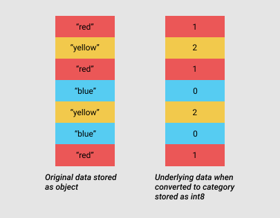

# Pandas optimization

Primary docs:

  - <https://pandas.pydata.org/pandas-docs/stable/user_guide/enhancingperf.html>
  - <https://pandas.pydata.org/pandas-docs/stable/user_guide/scale.html>

Performance deps for Pandas:

  - <https://pandas.pydata.org/pandas-docs/stable/getting_started/install.html#install-recommended-dependencies>

<!-- Use Numba for JIT optimizations. -->

<!-- https://github.com/modin-project/modin -->

## Notes
### Chunking
`chunksize` parameter in Pandas functions.

### Data types
Use `to_numeric` (<https://pandas.pydata.org/pandas-docs/stable/reference/api/pandas.to_numeric.html>) for downcasting

### Categoricals
<https://pandas.pydata.org/pandas-docs/stable/user_guide/categorical.html>

### Memory usage

- use `DataFrame.memory_usage(deep=True)` func.
- use `DataFrame.info()` func

## Storage optimization

We'll get the sample dataset from <https://www.kaggle.com/datasets/anthonytherrien/depression-dataset>.

```{python}
import pandas as pd

dd = pd.read_csv('_files/depression_data.csv')
dd.head()
```

Let's see some memory usage stats:
```{python}
dd.info(memory_usage='deep')
```

**Note:** Pandas stores memory in blocks, managed by `BlockManager` class. There is a separate block class for each type, like `ObjectBlock` or `FloatBlock`.

Nice write-up here: <https://uwekorn.com/2020/05/24/the-one-pandas-internal.html>.

Let's examine memory usage for each type:
```{python}
for dtype in ['float','int','str']:
    selected_dtype = dd.select_dtypes(include=[dtype])
    mean_usage_b = selected_dtype.memory_usage(deep=True).mean()
    mean_usage_mb = mean_usage_b / 1024 ** 2
    print("Average memory usage for {} columns: {:03.2f} MB".format(dtype,mean_usage_mb))
```
### Numeric types optimization

Let's first use `iinfo` to check ranges for different subtypes:

```{python}
import numpy as np
int_types = ["uint8", "int8", "int16", "int32", "int64"]
for it in int_types:
    print(np.iinfo(it))
```

We can use `pd.to_numeric()` to downcast numeric types.

First, let's write a helper function for memory usage display:

```{python}
def mem_usage(pandas_obj):
    if isinstance(pandas_obj,pd.DataFrame):
        usage_b = pandas_obj.memory_usage(deep=True).sum()
    else: # we assume if not a df it's a series
        usage_b = pandas_obj.memory_usage(deep=True)
    usage_mb = usage_b / 1024 ** 2 # convert bytes to megabytes
    return "{:03.2f} MB".format(usage_mb)
```

Note that "Age" and "Number of Children" columns can be presented as unsigned ints. Let's convert:

```{python}
dd_int = dd.select_dtypes(include=['int'])
converted_int = dd_int.apply(pd.to_numeric,downcast='unsigned')
print("Before: ", mem_usage(dd_int))
print("After: ", mem_usage(converted_int))
compare_ints = pd.concat([dd_int.dtypes,converted_int.dtypes],axis=1)
compare_ints.columns = ['before','after']
compare_ints.apply(pd.Series.value_counts)
```

Nice. Now let's process `float` columns (`Income`):

```{python}
dd_float = dd.select_dtypes(include=['float'])
converted_float = dd_float.apply(pd.to_numeric,downcast='float')
print("Before: ", mem_usage(dd_float))
print("After: ", mem_usage(converted_float))
compare_floats = pd.concat([dd_float.dtypes,converted_float.dtypes],axis=1)
compare_floats.columns = ['before','after']
compare_floats.apply(pd.Series.value_counts)
```

Nothing spectacular.

Now let's create a new optimized `DataFrame`:

```{python}
optimized_dd = dd.copy()
optimized_dd[converted_int.columns] = converted_int
optimized_dd[converted_float.columns] = converted_float
print(mem_usage(dd))
print(mem_usage(optimized_dd))
```

Just a bit. Let's proceed with string columns (dtype `str` in pandas 3, `object` in pandas 2).

First, read <https://jakevdp.github.io/blog/2014/05/09/why-python-is-slow/>.

Now, back to the dataset.

We can use categoricals (<https://pandas.pydata.org/pandas-docs/stable/categorical.html>) to optimize string columns.



Let's look at the number of unique values for each string column:
```{python}
dd_obj = dd.select_dtypes(include=['object', 'str']).copy()
dd_obj.describe()
```

Let's start with one column first: "Education Level"
```{python}
edu_level = dd_obj["Education Level"]
print(edu_level.head())
edu_level_cat = edu_level.astype('category')
print(edu_level_cat.head())
```

We can look at the category codes:

```{python}
edu_level_cat.head().cat.codes
```

Compare memory usage:

```{python}
print(mem_usage(edu_level))
print(mem_usage(edu_level_cat))
```
We should only convert objects to categoricals if most values are repeated. We have to pick a threshold, say, 25% of unique values.

**Note:** when reading a csv, we can also provide a `dtype` dictionary param with preferred types.

Converting all string columns and creating a new optimized DataFrame is left as part of **Exercise 1**.

## Vectorization & query performance

We can also optimize by modifying the actual operation. Let's derive a simple "risk score" from `Age`, `Income`, and `Number of Children` four different ways, and time each.

```{python}
import numpy as np

def risk_score(age, income, children):
    return age * 0.5 - income / 10_000 + children * 2
```

**`.apply(axis=1)`** -- calls a Python function once per row:
```{python}
%timeit dd.apply(lambda row: risk_score(row["Age"], row["Income"], row["Number of Children"]), axis=1)
```

**`.iterrows()`** -- iterates row by row, unpacking into a `Series` each time (notoriously slow):
```{python}
def with_iterrows(df):
    out = []
    for _, row in df.iterrows():
        out.append(risk_score(row["Age"], row["Income"], row["Number of Children"]))
    return out

%timeit with_iterrows(dd)
```

**`.itertuples()`** -- same idea, but yields lightweight namedtuples instead of `Series`:
```{python}
def with_itertuples(df):
    out = []
    for row in df.itertuples():
        out.append(risk_score(row.Age, row.Income, row._5))  # "Number of Children" -> _5 (spaces aren't valid attribute names)
    return out

%timeit with_itertuples(dd)
```

**Vectorized** -- no Python-level loop at all, the whole computation runs in C/numpy:
```{python}
%timeit risk_score(dd["Age"], dd["Income"], dd["Number of Children"])
```

Let's tabulate and plot the four timings:
```{python}
import matplotlib.pyplot as plt
import time

def time_it(fn, n=5):
    start = time.perf_counter()
    for _ in range(n):
        fn()
    return (time.perf_counter() - start) / n

timings = {
    ".apply(axis=1)": time_it(lambda: dd.apply(lambda row: risk_score(row["Age"], row["Income"], row["Number of Children"]), axis=1), n=3),
    ".iterrows()": time_it(lambda: with_iterrows(dd), n=3),
    ".itertuples()": time_it(lambda: with_itertuples(dd), n=3),
    "vectorized": time_it(lambda: risk_score(dd["Age"], dd["Income"], dd["Number of Children"])),
}

plt.figure(figsize=(6, 4))
plt.barh(list(timings.keys()), list(timings.values()))
plt.xlabel("seconds (lower is better)")
plt.title("Row-wise computation: four approaches")
plt.tight_layout()
plt.show()
```

### Filtering: `.query()` / `.eval()` vs. boolean masks

```{python}
%timeit dd[(dd["Income"] < 30000) & (dd["Age"] > 50)]
```

```{python}
%timeit dd.query("Income < 30000 and Age > 50")
```

`.query()`/`.eval()` parse the expression and can use the `numexpr` engine under the hood (one of pandas' "recommended performance dependencies").

## Chunked processing

`depression_data.csv` is small enough (47MB) - let's generate a synthetic dataset. 

```{python}
import pandas as pd
import numpy as np

def make_transactions(n_rows=5_000_000, seed=0):
    rng = np.random.default_rng(seed)
    categories = ["electronics", "grocery", "apparel", "home", "toys", "books"]
    return pd.DataFrame({
        "transaction_id": np.arange(n_rows),
        "customer_id": rng.integers(0, 200_000, n_rows),
        "product_category": rng.choice(categories, n_rows),
        "amount": rng.gamma(2.0, 25.0, n_rows).round(2),
        "timestamp": pd.date_range("2023-01-01", periods=n_rows, freq="s"),
        "is_fraud": rng.random(n_rows) < 0.01,
    })
```

Store it to file:

```{python}
transactions = make_transactions()
transactions.to_csv("_files/transactions.csv", index=False)
print(mem_usage(transactions))
```

Now let's load.

**Naive approach** -- load everything, then aggregate:
```{python}
%load_ext memory_profiler
```

```{python}
%%memit
whole = pd.read_csv("_files/transactions.csv")
naive_totals = whole.groupby("product_category")["amount"].sum()
del whole
```

**Chunked approach** -- read and aggregate incrementally, never holding the full file in memory at once:
```{python}
%%memit
partial_totals = pd.Series(dtype="float64")
for chunk in pd.read_csv("_files/transactions.csv", chunksize=500_000):
    chunk_totals = chunk.groupby("product_category")["amount"].sum()
    partial_totals = partial_totals.add(chunk_totals, fill_value=0)
```

```{python}
partial_totals.sort_index().equals(naive_totals.sort_index())
```

`%%memit` (from `memory_profiler`, already installed) reports **peak** memory for each cell -- compare the two numbers above. The chunked version trades a bit of extra bookkeeping code for a peak memory footprint that no longer scales with total file size, only with `chunksize`.

## Polars

[Polars](https://pola.rs) is a newer, Rust-based dataframe library: multi-threaded by default, built on the Arrow memory format, and offering both an eager and a **lazy** API. Install it:

```bash
uv add polars
```

```{python}
import polars as pl
```

**Eager API** -- looks a lot like pandas:
```{python}
pl_transactions = pl.read_csv("_files/transactions.csv", try_parse_dates=True)
pl_transactions.head()
```

```{python}
print(f"{pl_transactions.estimated_size('mb'):.2f} MB")
```

Compare that against `mem_usage(transactions)` from the pandas load above -- Polars tends to infer tighter default dtypes out of the box, without any manual downcasting step.

**Lazy API** -- instead of executing immediately, build a query plan and only run it when you call `.collect()`:
```{python}
query = (
    pl.scan_csv("_files/transactions.csv", try_parse_dates=True)
    .filter(pl.col("is_fraud"))
    .group_by("product_category")
    .agg(pl.col("amount").sum().alias("total_amount"))
)
print(query.explain())
```

```{python}
query.collect()
```

`.explain()` prints the *optimized* query plan, with no execution yet.

### Streaming / larger-than-RAM

Everything above still comfortably fits in memory. `bigdata_lec1.qmd`'s "Dataframe libraries, compared" table describes Polars as scaling beyond RAM only "**partially**" -- let's see what that means in practice, using a file deliberately built to be too big to casually load whole.

Rather than materializing one huge pandas `DataFrame`, we build the file the same way `## Chunked processing` taught us to *read* one -- just applied to writing instead, reusing `make_transactions()` chunk by chunk:

```{python}
import os

def write_transactions_chunked(path, total_rows=40_000_000, chunk_rows=5_000_000, seed=0):
    # This file is multi-GB. Regenerating it on every `quarto preview` re-render is
    # slow and, if a render is interrupted mid-write, leaves a corrupt file. So:
    #   - skip if it already exists
    #   - write to a temp path and rename atomically, so readers never see a partial file
    if os.path.exists(path) and os.path.getsize(path) > 0:
        return
    tmp = path + ".tmp"
    for i, start in enumerate(range(0, total_rows, chunk_rows)):
        n = min(chunk_rows, total_rows - start)
        chunk = make_transactions(n_rows=n, seed=seed + i)
        chunk["transaction_id"] += start  # keep IDs unique across chunks
        chunk.to_csv(tmp, mode="w" if i == 0 else "a", header=(i == 0), index=False)
        del chunk
    os.replace(tmp, path)

write_transactions_chunked("_files/transactions_large.csv")
```

```{python}
import os
print(f"{os.path.getsize('_files/transactions_large.csv') / 1024**3:.2f} GB on disk")
```

**We deliberately do not run `pd.read_csv()` on this file.** This is exactly the case where an eager load starts to strain a laptop -- `## Chunked processing` already showed the pandas-side answer (`chunksize`); here's the Polars-side one.

Polars' lazy `.collect()` now takes an `engine` argument -- `engine="streaming"` processes the query in bounded chunks instead of loading everything up front, `engine="in-memory"` is the regular fully-materialized path:

```{python}
%%memit
streaming_result = (
    pl.scan_csv("_files/transactions_large.csv")
    .filter(pl.col("is_fraud"))
    .group_by("product_category")
    .agg(pl.col("amount").sum())
    .collect(engine="streaming")
)
```

```{python}
%%memit
in_memory_result = (
    pl.scan_csv("_files/transactions_large.csv")
    .filter(pl.col("is_fraud"))
    .group_by("product_category")
    .agg(pl.col("amount").sum())
    .collect(engine="in-memory")
)
```

```{python}
a = streaming_result.sort("product_category")["amount"]
b = in_memory_result.sort("product_category")["amount"]
print("exact .equals():", streaming_result.sort("product_category").equals(in_memory_result.sort("product_category")))
print("max abs difference:", (a - b).abs().max())
```

`.equals()` reports `False` - the streaming engine sums `amount` in a different chunk order than the in-memory engine, and floating-point addition isn't associative: `(a + b) + c` and `a + (b + c)` can differ in their last bit. 


## Pandas vs. Polars

Let's compare. First, three functions:
```{python}
def pandas_task():
    df = pd.read_csv("_files/transactions.csv")
    return df[df["is_fraud"]].groupby("product_category")["amount"].sum()

def polars_eager_task():
    df = pl.read_csv("_files/transactions.csv")
    return df.filter(pl.col("is_fraud")).group_by("product_category").agg(pl.col("amount").sum())

def polars_lazy_task():
    return (
        pl.scan_csv("_files/transactions.csv")
        .filter(pl.col("is_fraud"))
        .group_by("product_category")
        .agg(pl.col("amount").sum())
        .collect()
    )

```

Run benchmark:

```{python}
from memory_profiler import memory_usage as _memory_usage

def benchmark(fn, n=3):
    times = []
    peak_mems = []
    for _ in range(n):
        start = time.perf_counter()
        mem_trace = _memory_usage((fn,), interval=0.01, max_usage=True)
        times.append(time.perf_counter() - start)
        peak_mems.append(mem_trace if isinstance(mem_trace, float) else mem_trace[0])
    return {"seconds": sum(times) / len(times), "peak_mb": max(peak_mems)}

results = {
    "pandas": benchmark(pandas_task),
    "polars (eager)": benchmark(polars_eager_task),
    "polars (lazy)": benchmark(polars_lazy_task),
}
results
```

```{python}
fig, axes = plt.subplots(1, 2, figsize=(10, 4))
names = list(results.keys())
axes[0].bar(names, [results[n]["seconds"] for n in names])
axes[0].set_title("Time (s, lower is better)")
axes[1].bar(names, [results[n]["peak_mb"] for n in names])
axes[1].set_title("Peak memory (MB, lower is better)")
for ax in axes:
    ax.tick_params(axis="x", rotation=20)
plt.tight_layout()
plt.show()
```

## Exercises

1. Pick your own dataset from 
  - Kaggle 
  - HuggingFace
  - or <https://archive.ics.uci.edu>.

<!-- 3. Create a data type describing the data structures you're working with in your Pandas DataFrame. -->
<!--    Use mypy for type annotations. -->

<!-- :::{.callout-note} -->
<!-- mypy does not improve performance. However, it makes the code easier to understand. -->
<!-- ::: -->

2. Perform numeric and string type conversions aimed at minimizing storage space, as outlined above.

3. Measure performance impact and plot it via e.g. `matplotlib`.

4. Compare Pandas against Polars for at least one filter and one group-by operation. Plot and briefly discuss the results -- where did Polars win, where didn't it, and why?

5. Re-implement `risk_score` (from `## Vectorization & query performance`) using Polars expressions (`.with_columns()` + `pl.col(...)` arithmetic) instead of the pandas/numpy version. Benchmark it with `time_it()` against your fastest pandas result from that section -- does the ranking change?

6. `transactions_large.csv` was likely too small relative to your machine's RAM to show a clean memory-usage gap between `engine="streaming"` and `engine="in-memory"`. Using `write_transactions_chunked`, generate a noticeably bigger file -- push `total_rows` up (watch your free disk space) until you can see `engine="in-memory"`'s peak memory climb well past `engine="streaming"`'s, or until the in-memory path starts to visibly struggle. Report the sizes and readings where the gap finally becomes clear on your machine, and explain in a sentence or two what would likely happen if you tried to load that same file eagerly with `pd.read_csv()` instead -- you don't need to actually run that if your machine can't spare the memory.

