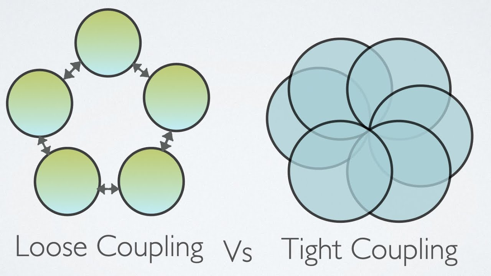
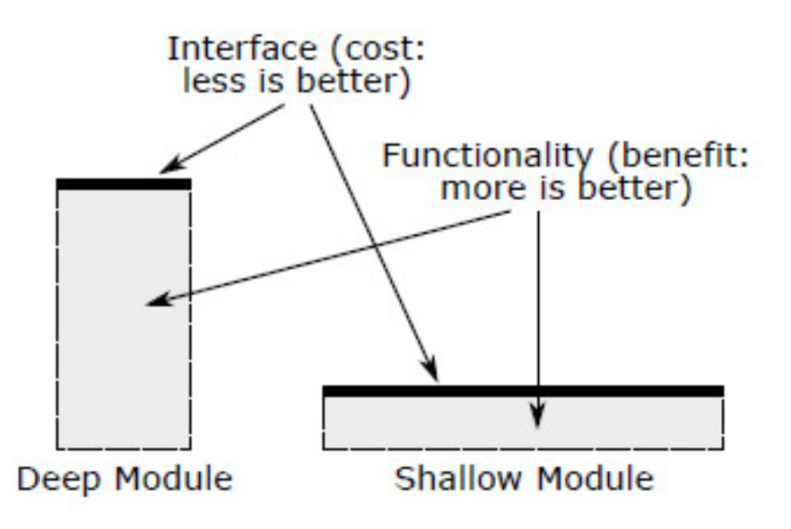

## What is Big Data?
:::{.callout-important icon=false}
## Definition
 Big Data is a set of technologies designed to store, manage and analyze data that is:

- too large to fit on a single machine 
- while accommodating for the issue of growing discrepancy between capacity, throughput and latency.
:::

# A brief history of Big Data

## Origins
:::{.callout-note icon=false}
## Before the term existed
- 1944: librarian Fremont Rider warns of an "information explosion" in library holdings.
- 1960s-80s: relational databases and early data warehousing emerge to manage growing, structured business data.
- 1997: NASA researchers Michael Cox and David Ellsworth use the term **"big data"** in a paper on visualization challenges that exceed memory, disk, and even local disk capacity.
:::

## Related earlier terms
:::{.callout-note icon=false}
## Before "Big Data" caught on
- **VLDB** (Very Large Databases) -- a research community and conference (est. 1975) already tackling data-at-scale problems.
- **Decision support systems** and early **data warehousing** (1980s-90s) laid groundwork for large-scale analytics.
- The label "Big Data" mostly popularized existing problems under a catchier name.
:::

## 2001: The 3 Vs
:::{.callout-important icon=false}
## Doug Laney (META Group / Gartner)
Analyst Doug Laney publishes *"3D Data Management"*, framing data growth challenges along three dimensions:

- **Volume**
- **Velocity**
- **Variety**

This framing still anchors how the field talks about Big Data today.
:::

## 2003-2006: Google's papers
:::{.callout-tip icon=false}
## Foundational systems papers
- **2003**: *The Google File System* -- a distributed filesystem for very large files across commodity hardware.
- **2004**: *MapReduce: Simplified Data Processing on Large Clusters* -- a programming model for parallel processing at scale.
- **2006**: *Bigtable: A Distributed Storage System for Structured Data*.

These papers directly inspired the open-source Big Data ecosystem.
:::

## 2006-2008: Hadoop
:::{.callout-note icon=false}
## Open source catches up
- Doug Cutting and Mike Cafarella build **Hadoop** at Yahoo!, implementing GFS and MapReduce ideas in the open.
- 2008: Hadoop becomes a top-level Apache project.
- The term "Big Data" starts appearing regularly in industry press.
:::

## 2010s: NoSQL, cloud, and Spark
:::{.callout-tip icon=false}
## The ecosystem widens
- NoSQL databases (Cassandra, MongoDB, DynamoDB) address workloads that don't fit relational models well.
- Public cloud storage (S3, ~2006 onward) makes elastic, pay-as-you-go storage mainstream.
- 2014: **Apache Spark** overtakes MapReduce as the dominant batch engine, thanks to in-memory processing.
:::

## 2020s: streaming and the lakehouse
:::{.callout-note icon=false}
## Where we are now
- Real-time streaming platforms (Kafka, Flink) become standard for continuously arriving data.
- The **lakehouse** pattern blends data lake flexibility with data warehouse guarantees (e.g. Delta Lake, Iceberg).
- Big Data infrastructure increasingly underpins machine learning and AI pipelines.
:::

## Timeline, at a glance

```{.tikz}
\usetikzlibrary{arrows.meta}
\begin{tikzpicture}[
  dot/.style={circle, fill=black, minimum size=2.5mm, inner sep=0pt},
  yearlabel/.style={font=\bfseries\normalsize},
  desc/.style={font=\small, align=center, text width=2.7cm}
]
  \draw[very thick, -{Latex[length=3mm]}] (-0.5,0) -- (14.5,0);

  \node[dot] at (0,0) {};
  \node[yearlabel, anchor=south] at (0,0.25) {1944};
  \node[desc, anchor=south] at (0,0.85) {"information\\explosion" warning};

  \node[dot] at (2.3,0) {};
  \node[yearlabel, anchor=north] at (2.3,-0.25) {1997};
  \node[desc, anchor=north] at (2.3,-0.85) {term "big data"\\coined (NASA)};

  \node[dot] at (4.6,0) {};
  \node[yearlabel, anchor=south] at (4.6,0.25) {2001};
  \node[desc, anchor=south] at (4.6,0.85) {Laney's\\3 Vs paper};

  \node[dot] at (6.9,0) {};
  \node[yearlabel, anchor=north] at (6.9,-0.25) {2003--06};
  \node[desc, anchor=north] at (6.9,-0.85) {GFS, MapReduce,\\Bigtable papers};

  \node[dot] at (9.2,0) {};
  \node[yearlabel, anchor=south] at (9.2,0.25) {2006--08};
  \node[desc, anchor=south] at (9.2,0.85) {Hadoop};

  \node[dot] at (11.5,0) {};
  \node[yearlabel, anchor=north] at (11.5,-0.25) {2010s};
  \node[desc, anchor=north] at (11.5,-0.85) {NoSQL, cloud,\\Spark};

  \node[dot] at (13.8,0) {};
  \node[yearlabel, anchor=south] at (13.8,0.25) {2020s};
  \node[desc, anchor=south] at (13.8,0.85) {streaming,\\lakehouse};
\end{tikzpicture}
```

## Prefixes
:::{.callout-important icon=false}
## Prefixes

- **kilo (k)** 1,000 (3 zeros)
- **Mega (M)** 1,000,000 (6 zeros)
- **Giga (G)** 1,000,000,000 (9 zeros)
- **Tera (T)** 1,000,000,000,000 (12 zeros)
- **Peta (P)** 1,000,000,000,000,000 (15 zeros)
- **Exa (E)** 1,000,000,000,000,000,000 (18 zeros)
- **Zetta (Z)** 1,000,000,000,000,000,000,000 (21 zeros)
- **Yotta (Y)** 1,000,000,000,000,000,000,000,000 (24 zeros)
- **Ronna (R)** 1,000,000,000,000,000,000,000,000,000 (27 zeros)
- **Quetta (Q)** 1,000,000,000,000,000,000,000,000,000,000 (30 zeros) 
:::

## Total estimate
:::{.callout-important icon=false}
## Estimate
The total amount of data stored digitally worldwide is estimated to be getting close to 100 ZB as of 2021 (zettabytes) 
:::


## Growth trend
:::{.callout-tip icon=false}
## Where is it headed?
Data volumes keep compounding:

- IDC estimates the "Global Datasphere" more than doubles roughly every 4-5 years.
- Machine-generated data (sensors, logs, video) is growing faster than human-generated data.
- Falling storage cost per GB is part of what makes such growth economically viable.
:::

# The three Vs of Big Data

## Three Vs
:::: {.columns}

::: {.column width="30%" background-color="lightgray"}
- **Volume**
- **Variety**
- **Velocity**
:::

::: {.column width="70%"}

:::

::::

## Volume
:::{.callout-important icon=false}
## Issue
Data volume has exponentially increased in recent decades.
:::

:::{.callout-tip icon=false}
## Wait but why?

- Internet-of-Things sensor data
- Social networks
- Storage device progress
:::

## Variety
:::{.callout-important icon=false}
## Types

- **trees** - XML, JSON, Parquet, Avro, etc
- **unstructured** - text, pictures, audio, video
- **data cubes**
- **graphs**
:::

## Velocity
:::{.callout-note icon=false}
## Definion
Speed at which data is being generated, collected, and processed. 
:::
:::{.callout-important icon=false}
## Attributes

- **Capacity**: how much data can we store per unit of volume?
- **Throughput**: how many bytes can we read per unit of time?
- **Latency**: how much time do we need to wait until the bytes start arriving?
:::

## Velocity
Evolution since 1950s


# Beyond the three Vs

## The expanded Vs
:::{.callout-note icon=false}
## Why extend the model?
Practitioners kept finding that Volume, Variety, and Velocity alone didn't capture everything that makes data "big" and hard to work with. Several extra Vs are commonly added.
:::

## Veracity
:::{.callout-important icon=false}
## Definition
The **trustworthiness** and **quality** of data.

- Sensor noise, human error, and inconsistent formats erode veracity.
- Garbage in the pipeline still means garbage out, no matter the volume.
:::

## Value
:::{.callout-tip icon=false}
## Definition
The **usefulness** extracted from data relative to the cost of storing and processing it.

- Not all data is worth keeping forever.
- Big Data investments are ultimately justified by the value they unlock, not by size alone.
:::

## Variability
:::{.callout-note icon=false}
## Definition
How the **meaning** and **format** of data can shift over time or context.

- The same field name might mean different things across systems.
- Data drift can silently break assumptions made by downstream models.
:::

## A few more Vs
:::{.callout-note icon=false}
## Sometimes mentioned
- **Visualization**: making sense of results is itself a challenge at scale.
- **Validity**: is the data correct and applicable for the intended use, distinct from raw quality (Veracity)?
- Treat these as useful lenses, not a definitive checklist.
:::

## The Vs, summarized
:::{.callout-tip icon=false}
## Core vs. extended
- **Core three**: Volume, Variety, Velocity -- still the anchor of the field.
- **Commonly added**: Veracity, Value, Variability (and sometimes Visualization, Validity).
- No single canonical list exists -- treat the Vs as a checklist for "what makes this data hard", not a rigid taxonomy.
:::

## The Vs, visualized

```{.tikz}
\begin{tikzpicture}[
  core/.style={draw, very thick, rounded corners, fill=gray!15, font=\bfseries, minimum width=2.4cm, minimum height=1cm, align=center},
  ext/.style={draw, thick, dashed, rounded corners, font=\normalsize, minimum width=2.4cm, minimum height=1cm, align=center},
  centerbox/.style={draw, very thick, circle, fill=gray!35, font=\Large\bfseries, minimum size=2.4cm, align=center}
]
  \node[centerbox] (hub) at (0,0) {Big\\Data};

  \node[core] (volume) at (0,3.2) {Volume};
  \node[ext]  (veracity) at (2.77,1.6) {Veracity};
  \node[core] (variety) at (2.77,-1.6) {Variety};
  \node[ext]  (value) at (0,-3.2) {Value};
  \node[core] (velocity) at (-2.77,-1.6) {Velocity};
  \node[ext]  (variability) at (-2.77,1.6) {Variability};

  \draw[very thick] (hub) -- (volume);
  \draw[very thick] (hub) -- (variety);
  \draw[very thick] (hub) -- (velocity);
  \draw[dashed] (hub) -- (veracity);
  \draw[dashed] (hub) -- (value);
  \draw[dashed] (hub) -- (variability);

  \node[font=\small, align=left] at (5.4,0.4) {\textbf{Solid} = core three};
  \node[font=\small, align=left] at (5.4,-0.4) {\textit{Dashed} = extended};
\end{tikzpicture}
```

# Features of Big Data systems

## Features
:::{.callout-note icon=false}
## Features

- **Reliability**
- **Scalability**
- **Maintainability**
:::

## Reliability
:::{.callout-important icon=false}
## Kleppmann's definition
The system should continue to work correctly (performing the correct function at the desired level of performance) even in the face of adversity

- hardware faults
- software faults
- and even human error
:::

## Reliability
:::{.callout-warning icon=false}
## Faults
Basically, theses are things that could go wrong.

Systems that can anticipate faults are called **fault-tolerant** or **resilient**.

Fault can be defined as one component of the system deviating from the spec.
:::

:::{.callout-important icon=false}
## Failures
Failures occur when system stops providing services to the user.
:::

**Faults** *might* degenerate into [**failures**]{style="color:red;"}.


## Reliability
:::{.callout-tip icon=false}
## Types of errors

- Hardware
- Software
- Human
:::

## Reliability

<!-- https://www.salvationdata.com/knowledge/8-most-common-reasons-for-data-loss/ -->

## Scalability
:::{.callout-note icon=false}
## Kleppmann
As the system grows (in data volume, traffic volume, or complexity), there should be reasonable ways of dealing with that growth.

In other words, **scalability** is a system’s ability to cope with increased load.
:::

::: aside
Note that scalability is a multi-dimensional term. When saying "system scales well", it's important to state exactly along which axis.
:::

## Scalability
:::{.callout-tip icon=false}
## What is **load**?
Load is described by **load parameters**. These might include:

- **data set size**
- **data write speed**
- **data read speed**
- **computational complexity**
- etc...
:::

## Scalability
:::{.callout-important icon=false}
## Performance
Increasing **load** affects **performance**. There are several meanings to this term:

- **throughput** -- time required to process a dataset of certain size
- **response time** -- time between sending a request and receiving a response
- **latency** -- duration of waiting for a request to be processed. Included in response time.

:::

::: aside
Performance might be more strictly defined by service level objectives (*SLOs*) and service level agreements (*SLAs*).
:::

## Scalability
:::{.callout-note icon=false}
## How to deal with load

- **vertical scaling** - scaling up
- **horizontal scaling** - scaling out
- **architectural changes**
:::

:::{.callout-tip icon=false}
## Elasticity
An approach to load handling whereby a system automatically adds resources in case of load increase, and can decrease resources if load decreases. 
:::

## Scalability
:::{.callout-tip icon=false}
## Common wisdom
- Keep your **database** on a **single node** (scale up) until scaling cost or high-availability requirements forces you to make it **[distributed]{style="color:blue;"}**.
- **Optimize code** so that it can run on a **single node**.
:::

# The CAP theorem

## Motivation
:::{.callout-important icon=false}
## Why does this matter?
The Scalability discussion above assumed we can just add more nodes. But distributed systems face a fundamental tradeoff once a network can fail.
:::

## CAP: the three properties
:::{.callout-note icon=false}
## Definitions (Brewer, 2000; Gilbert & Lynch, 2002)
- **Consistency (C)**: every read receives the most recent write, or an error.
- **Availability (A)**: every request receives a (non-error) response, without guarantee it contains the most recent write.
- **Partition tolerance (P)**: the system continues to operate despite an arbitrary number of dropped or delayed messages between nodes.
:::

## The theorem
:::{.callout-warning icon=false}
## Pick two... sort of
A distributed system can provide at most **two** of the three properties **at the same time** -- but only when a network partition is actually happening.

Since partitions are unavoidable at scale, the real-world choice is between **C** and **A** *during a partition*.
:::

## The CAP triangle

```{.tikz}
\begin{tikzpicture}[
  vertex/.style={font=\Large\bfseries, align=center},
  elabel/.style={font=\normalsize\bfseries, fill=white, inner sep=2pt},
  example/.style={font=\small, align=center}
]
  \coordinate (C) at (0,0);
  \coordinate (A) at (6,0);
  \coordinate (P) at (3,5.2);

  \draw[very thick] (C) -- (A) -- (P) -- cycle;

  \node[vertex, anchor=north, yshift=-2mm] at (C) {Consistency};
  \node[vertex, anchor=north, yshift=-2mm] at (A) {Availability};
  \node[vertex, anchor=south, yshift=2mm] at (P) {Partition\\Tolerance};

  \node[elabel] at (3,0) {CA};
  \node[elabel, rotate=60] at (1.5,2.6) {CP};
  \node[elabel, rotate=-60] at (4.5,2.6) {AP};

  \node[example] at (3,-1.2) {traditional RDBMS\\(single node)};
  \node[example] at (0.2,3.4) {HBase\\MongoDB};
  \node[example] at (5.8,3.4) {Cassandra\\DynamoDB};
\end{tikzpicture}
```

## CP vs AP
:::{.callout-tip icon=false}
## CP systems
Favor consistency: reject or block requests that can't be guaranteed correct.

*Example flavor*: traditional single-leader relational databases under strict settings.
:::

:::{.callout-note icon=false}
## AP systems
Favor availability: keep responding, possibly with stale data, and reconcile later.

*Example flavor*: Dynamo-style leaderless databases (Cassandra, Riak).
:::

## CAP in practice
:::{.callout-tip icon=false}
## Caveats
- CAP describes a worst case (an active partition), not everyday operation.
- Many systems are tunable per-operation (see **quorum reads/writes**, covered when we look at replication later in the course).
- CAP says nothing about **latency**, which matters just as much in practice.
:::

## Beyond CAP: PACELC
:::{.callout-tip icon=false}
## Extending the model (Daniel Abadi, 2010)
CAP only describes behavior **during a partition**. PACELC adds the normal-operation tradeoff:

- **P**artition: choose **A**vailability or **C**onsistency (as in CAP)
- **E**lse (no partition): choose **L**atency or **C**onsistency

Even healthy, partition-free systems trade latency for consistency.
:::

::: aside
This connects forward to replication and consistency models discussed in the Distributed Systems lecture later in the course.
:::

## Maintainability
:::{.callout-tip icon=false}
## Kleppmann
Over time, many different people will work on the system

- engineering
- operations
- both maintaining current behavior and adapting the system to new use cases),

and they should all be able to work on it **productively**.
:::

## Maintainability
:::{.callout-note icon=false}
## Principles

- **Operability** -- make it easy for operations teams to keep the system running smoothly.
- **Simplicity** -- make it easy for new engineers to understand the system, by removing as much complexity as possible from the system.
- **Evolvability** -- Make it easy for engineers to make changes to the system in the future, adapting it for unanticipated use cases as requirements change. Also known as **extensibility**, **modifiability**, or **plasticity**.
:::

## Maintainability
:::{.callout-note icon=false}
## Operability

- Health monitoring
- Good deployment practices
- Configuration management
- Visibility into the internals of the system
- Knowledge preservation -- **documentation** **[(!)]{style="color:red;"}**.
- etc...
:::

## Maintainability
:::{.callout-important icon=false}
## Complexity symptoms

- Lots of hidden state
- Loose cohesion, tight coupling
- Bad naming (!)
- Unnecessary hacks
- etc...
:::

## Maintainability: Complexity
<!-- https://storage.googleapis.com/dzkocnicjyofie/loose-coupling-vs-tight-coupling-java.html -->


## Maintainability: Complexity
:::{.callout-tip icon=false}
## Types
- **incidental**
- **accidental**
:::

## Maintainability: Complexity

:::{.callout-tip icon=false}
## Incidental
> Easy things can be complex. There can be complex constructs that are succinctly described, familiar, available and easy to use. That is incidental complexity.

Rich Hickey talk "Simple made easy": [https://www.youtube.com/watch?v=SxdOUGdseq4](https://www.youtube.com/watch?v=SxdOUGdseq4)
:::

## Maintainability: complexity
**However**:  Complexity is often caused by

:::{.callout-important icon=false}
## Accidental complexity
Moseley and Marks define complexity as accidental if it is not inherent in the problem that the software solves (as seen by the users) but arises only from the implementation.
:::

:::{.callout-tip icon=false}
## How to remove?
By providing proper **abstractions**.
:::

## Maintainability: abstractions
:::{.callout-note}
## Definition (Ousterhout)
An abstraction is a simplified view of an entity, which omits unimportant details.

In modular programming, each module provides an abstraction in the
form of its **interface.**
:::



## Maintainability: abstractions
:::{.callout-note}
## What can abstractions do?

- Hide implementation details
- Provide reusable building blocks
:::


## Maintainability
:::{.callout-tip icon=false}
## Evolvability
One needs to adapt their big data system to possible future requirements changes.

However, keep in mind the following:

- Inability to foresee exact nature of changes
- Need to strike the balance of flexibility and fitness for a particular task
:::

## Types of big data analytics
:::{.callout-important icon=false}
## Types

- Prescriptive
- Diagnostic
- Descriptive
- Predictive
:::

## Types: Prescriptive
:::{.callout-important icon=false}
## Prescriptive

- Forward looking
- Optimal decisions for future situations
:::

## Types: Diagnostic
:::{.callout-important icon=false}
## Diagnostic

- Backward looking
- Focused on causal relationships 
:::

## Types: Descriptive
:::{.callout-tip icon=false}
## Descriptive

- Backward looking
- Focused on descriptions and comparisons
:::

## Types: Descriptive
:::{.callout-note icon=false}
## Predictive

- Forward looking
- Focused on the prediction of future states, relationship, and patterns
:::

# Processing paradigms

## Batch processing
:::{.callout-note icon=false}
## Definition
Processing a **bounded**, finite dataset as a single job.

- High throughput, higher latency (minutes to hours).
- Simple to reason about: same input always gives the same output.
- *Example flavor*: nightly ETL jobs, end-of-day reporting.
:::

## Stream processing
:::{.callout-important icon=false}
## Definition
Processing an **unbounded** sequence of events as they arrive.

- Low latency (milliseconds to seconds), continuous computation.
- Must handle out-of-order and late-arriving events.
- *Example flavor*: fraud detection, real-time dashboards, alerting.
:::

## Batch vs. stream
| Aspect | Batch | Stream |
|---|---|---|
| Data | bounded | unbounded |
| Latency | high | low |
| Throughput | high | variable |
| Complexity | lower | higher |
| Typical use | reporting, training | monitoring, alerting |

## Which to choose?
:::{.callout-tip icon=false}
## Rule of thumb
- Need a fresh answer within seconds? **Stream**.
- Need to crunch the full history accurately? **Batch**.
- Need both? Read on.
:::

## Lambda architecture
:::{.callout-note icon=false}
## Idea (Nathan Marz)
Run **both** a batch and a speed (stream) layer, then merge results in a serving layer:

- **Batch layer**: recomputes accurate views over all historical data.
- **Speed layer**: provides low-latency approximate views over recent data.
- **Serving layer**: merges both for queries.
:::

## Lambda architecture: tradeoffs
:::{.callout-warning icon=false}
## The catch
- Every piece of logic must be implemented **twice** -- once for batch, once for streaming.
- Keeping the two implementations consistent is a real maintenance burden.
:::

## Kappa architecture
:::{.callout-tip icon=false}
## Idea (Jay Kreps)
Treat **everything as a stream**, including historical data (replayed through the same pipeline).

- One code path instead of two.
- Reprocessing = replaying the stream from an earlier offset.
- Requires a log that can retain and replay history (e.g. Kafka-style).
:::

## Lambda vs. Kappa
:::{.callout-note icon=false}
## Summary
- **Lambda**: proven, flexible, but duplicated logic.
- **Kappa**: simpler mental model, but depends on your streaming platform being able to replay history efficiently.
- Neither is "correct" -- the choice depends on your latency needs and operational maturity.
:::

## Lambda vs. Kappa, visualized

```{.tikz}
\usetikzlibrary{arrows.meta}
\begin{tikzpicture}[
  box/.style={draw, very thick, rounded corners, minimum width=2.6cm, minimum height=1cm, align=center, font=\small},
  arr/.style={-{Latex[length=2.5mm]}, thick},
  archtitle/.style={font=\bfseries\normalsize}
]
  % --- Lambda architecture ---
  \node[archtitle] at (4.8,9.0) {Lambda architecture};

  \node[box] (src1) at (0,6) {Data\\Source};
  \node[box] (batch) at (3.2,7.4) {Batch\\Layer};
  \node[box] (speed) at (3.2,4.6) {Speed\\Layer};
  \node[box] (serve1) at (6.4,6) {Serving\\Layer};
  \node[box] (query1) at (9.6,6) {Queries};

  \draw[arr] (src1) -- (batch);
  \draw[arr] (src1) -- (speed);
  \draw[arr] (batch) -- (serve1);
  \draw[arr] (speed) -- (serve1);
  \draw[arr] (serve1) -- (query1);

  \node[font=\scriptsize, align=center] at (3.2,8.35) {recomputed,\\accurate};
  \node[font=\scriptsize, align=center] at (3.2,3.65) {low-latency,\\approximate};

  % --- divider ---
  \draw[dashed] (-0.8,2.8) -- (10.4,2.8);

  % --- Kappa architecture ---
  \node[archtitle] at (4.8,2.2) {Kappa architecture};

  \node[box] (src2) at (0,0.3) {Event\\Log};
  \node[box] (stream) at (3.2,0.3) {Stream\\Processing};
  \node[box] (serve2) at (6.4,0.3) {Serving\\Layer};
  \node[box] (query2) at (9.6,0.3) {Queries};

  \draw[arr] (src2) -- (stream);
  \draw[arr] (stream) -- (serve2);
  \draw[arr] (serve2) -- (query2);

  \draw[arr] (stream.south) to[out=-90,in=-90,looseness=1.6]
    node[below,font=\scriptsize]{replay from earlier offset} (src2.south);
\end{tikzpicture}
```

## Challenges

There are 2 main challenges associated with Big Data.

:::{.callout-important icon=false}
## Challenges

- how do we store and manage such a **huge volume of data** efficiently?
- how do we process and extract valuable information from the data within the given **time frame**?
:::

# Big Data in the wild

## Why look at use cases?
:::{.callout-tip icon=false}
## Motivation
Every concept in this lecture exists to solve real problems. Here's a quick tour across industries.
:::

## Healthcare
:::{.callout-note icon=false}
## Examples
- Genomic sequencing pipelines process terabytes per patient.
- Medical imaging (MRI/CT) archives at population scale.
- Real-time monitoring in ICUs generates continuous sensor streams.
:::

## Finance
:::{.callout-important icon=false}
## Examples
- Fraud detection on card transactions, scored in milliseconds.
- Algorithmic trading reacting to market data streams.
- Risk modeling over years of historical transaction data.
:::

## Retail & e-commerce
:::{.callout-tip icon=false}
## Examples
- Recommendation engines built from clickstream and purchase history.
- Demand forecasting and inventory optimization.
- Dynamic pricing driven by real-time competitor and demand signals.
:::

## Social media
:::{.callout-note icon=false}
## Examples
- Feed ranking over billions of daily interactions.
- Ad targeting from behavioral and interest data.
- Content moderation at a scale no human team could review manually.
:::

## IoT & sensors
:::{.callout-important icon=false}
## Examples
- Industrial equipment emitting continuous telemetry for predictive maintenance.
- Smart grids balancing electricity supply and demand in real time.
- Connected vehicles streaming location and diagnostic data.
:::

## Science & geospatial
:::{.callout-tip icon=false}
## Examples
- Satellite and remote-sensing imagery archives (petabyte-scale).
- Climate and weather simulation output.
- We'll spend several lectures later in this course on geospatial Big Data specifically.
:::

## Common thread
:::{.callout-tip icon=false}
## What connects them?
Every example above still comes down to the same two challenges from before: storing and managing huge volumes efficiently, and extracting value within a useful time frame.
:::

# The Big Data ecosystem

## A landscape, by category
:::{.callout-note icon=false}
## Rough map
- **Compute & scaling**: multi-core, GPU, and cluster techniques for speeding up computation.
- **Fast dataframes**: single-node engines that outrun pandas without going distributed.
- **Distributed/parallel processing frameworks**: tools like Dask that spread work across cores and machines.
- **Storage & table formats**: how data is laid out on disk, and how ACID guarantees get layered on top of it.
- **Databases & query engines**: systems for querying large structured datasets, locally or across a cluster.
- **Orchestration & streaming**: scheduling pipelines, and handling data that never stops arriving.
- **ML tooling**: tracking, serving, and scaling machine learning on top of all of the above.
:::

## Columnar storage
:::{.callout-tip icon=false}
## Row vs. column layout
- Row-oriented formats (CSV, JSON) store a record's fields together -- good for reading whole rows.
- **Columnar** formats (**Parquet**, **ORC**) store each column together -- good for reading a few columns out of many, and for compression.
- Analytical ("OLAP") workloads scan a handful of columns over huge tables, so columnar storage dominates the Big Data world.
:::

::: aside
Parquet is covered in depth in the Data Formats lecture later in the course.
:::

## Apache Arrow
:::{.callout-important icon=false}
## A shared in-memory format
Arrow defines a **columnar, in-memory** layout that many tools agree on.

- Data can move between Pandas, Polars, DuckDB, Spark, and others **without copying or re-serializing** it.
- It's a big reason today's "fast dataframe" tools interoperate so easily.
:::

## Fast, single-node dataframes
:::{.callout-note icon=false}
## Why look beyond pandas?
Pandas is single-threaded and loads everything into RAM. A newer generation of tools targets the same "fits on one machine, but not comfortably in pandas" gap:

- multi-threaded execution
- lazy, optimized query plans
- Arrow-native memory layout
:::

## Polars
:::{.callout-tip icon=false}
## Rust-powered dataframes
- Implemented in **Rust**, exposes a Python (and Rust) API.
- **Multi-threaded** by default, unlike pandas.
- Offers a **lazy API**: build a query plan, let an optimizer rewrite it, then execute.
- Built on the Arrow memory format.
:::

## DuckDB
:::{.callout-important icon=false}
## "SQLite for analytics"
- An **in-process**, embeddable **OLAP SQL** database -- no server to run.
- Can query **Parquet, CSV, and Arrow data directly**, including files sitting in cloud storage.
- Vectorized, columnar execution engine tuned for analytical queries over local files.
:::

## GPU & out-of-core dataframes
:::{.callout-tip icon=false}
## More flavors of "faster than pandas"
- **cuDF** (part of NVIDIA RAPIDS): a pandas-like API that runs on the **GPU**.
- **Modin**: a near drop-in pandas replacement that parallelizes execution (backed by Dask or Ray).
- **Vaex**: designed for **out-of-core** work -- datasets bigger than RAM, via memory-mapping.
:::

## Dataframe libraries, compared
:::{.callout-note icon=false}
## Quick comparison
| Library | Execution | Scales beyond RAM? | Best for |
|---|---|---|---|
| Pandas | single-thread | no | small/medium data, ubiquity |
| Polars | multi-thread | partially | fast single-node analytics |
| DuckDB | multi-thread, SQL | partially (spills) | ad-hoc SQL over files |
| Dask | multi-thread/-process, distributed | yes | pandas-like API at cluster scale |
| cuDF | GPU | no | GPU-accelerated analytics |
:::

::: aside
Dask is covered in depth over several lectures later in the course.
:::

## Table formats: the lakehouse idea
:::{.callout-important icon=false}
## The problem
A folder of Parquet files on cheap storage is fast and cheap -- but has no transactions, no schema enforcement, and no easy way to update or delete rows.
:::

:::{.callout-tip icon=false}
## The fix
**Table formats** -- **Apache Iceberg**, **Delta Lake**, **Apache Hudi** -- add a metadata layer on top of plain files to bring ACID transactions, schema evolution, and time travel to a data lake.
:::

## Lakehouse architecture
:::{.callout-note icon=false}
## Putting it together
- **Storage**: cheap object storage (S3-style), holding columnar files.
- **Table format**: Iceberg/Delta/Hudi metadata, giving ACID guarantees over those files.
- **Query engine**: something that reads the table format and runs SQL over it.

The result is called a **lakehouse**: warehouse-style guarantees on lake-style storage.
:::

::: aside
Table formats and the lakehouse pattern are covered in more depth in the Databases and Data Formats lectures.
:::

## Lakehouse stack, visualized

```{.tikz}
\usetikzlibrary{arrows.meta}
\begin{tikzpicture}[
  layer/.style={draw, very thick, rounded corners, minimum width=9cm, minimum height=1.8cm, align=center},
  arr/.style={-{Latex[length=3mm]}, very thick},
  consumer/.style={draw, thick, rounded corners, minimum width=2.4cm, minimum height=0.9cm, align=center, font=\small}
]
  \node[layer, fill=gray!10] (storage) at (0,0)
    {\textbf{Storage}\\[2pt]\small object storage (S3, GCS, \dots) --- Parquet / ORC files};

  \node[layer, fill=gray!20] (table) at (0,2.9)
    {\textbf{Table format}\\[2pt]\small Iceberg / Delta Lake / Hudi --- ACID, schema evolution, time travel};

  \node[layer, fill=gray!30] (engine) at (0,5.8)
    {\textbf{Query engine}\\[2pt]\small Trino / Spark SQL / DuckDB};

  \draw[arr] (storage.north) -- (table.south);
  \draw[arr] (table.north) -- (engine.south);

  \node[consumer] (bi) at (-2.8,8.3) {BI\\dashboards};
  \node[consumer] (sql) at (0,8.3) {Ad-hoc\\SQL};
  \node[consumer] (ml) at (2.8,8.3) {ML\\training};

  \draw[arr] (engine.north) -- (bi.south);
  \draw[arr] (engine.north) -- (sql.south);
  \draw[arr] (engine.north) -- (ml.south);
\end{tikzpicture}
```

## Query engines
:::{.callout-tip icon=false}
## Reading it all back
- **Trino / Presto**: distributed SQL engines that federate queries across many data sources.
- **Spark SQL**: SQL on top of Spark's distributed compute engine.
- **DuckDB**: single-node SQL, increasingly used as a lightweight query engine over lakehouse tables too.
:::

## SQL-based transformation: dbt & SQLMesh
:::{.callout-important icon=false}
## The idea
Instead of hand-writing pipeline code, describe transformations as **SQL `select` statements** and let the tool compile them into a dependency-ordered set of queries run by your warehouse or engine.

- **dbt** and **SQLMesh** don't touch data directly -- your query engine does the actual work.
- Models can reference each other; the tool builds a **DAG** and runs everything in the correct order.
:::

## Why not just write SQL by hand?
:::{.callout-tip icon=false}
## Benefits
- **Modularity**: break a big transformation into small, reusable, testable models.
- **Dependency tracking**: change a source table, and the tool knows what needs to rerun.
- **Testing & docs**: built-in data tests and auto-generated documentation.
- Sits between raw SQL and full orchestration -- often triggered *by* an orchestrator like Airflow.
:::

## Cloud data warehouses
:::{.callout-note icon=false}
## Fully managed alternatives
- **Snowflake**, **BigQuery**, **Redshift**: managed, elastic SQL warehouses -- storage and compute billed and scaled separately.
- Trade some control and portability for far less operational overhead than running your own cluster.
:::

::: aside
These are covered further in the DBs for Analytics lecture.
:::

## Orchestration & pipelines
:::{.callout-tip icon=false}
## Who runs all this, and when?
- **Airflow**, **Dagster**, **Prefect**: schedule and monitor pipelines of dependent jobs (extract, transform, load, train...).
- Pipelines are typically expressed as a **DAG** (directed acyclic graph) of tasks.
:::

## Streaming platforms
:::{.callout-important icon=false}
## Handling data that never stops
- **Kafka**: a distributed log -- the most common backbone for streaming pipelines.
- **Flink**, **Spark Structured Streaming**: stream-processing engines that consume from logs like Kafka.
- Ties back to the **Stream processing** and **Kappa architecture** ideas covered earlier in this lecture.
:::

## ML tooling on Big Data
:::{.callout-note icon=false}
## The last mile
Once data is stored, queried, and streaming, machine learning tooling takes over: preparing features, tracking experiments, and serving models at scale.
:::

## Feature stores & experiment tracking
:::{.callout-tip icon=false}
## Keeping ML pipelines sane
- **Feature stores** (e.g. Feast): a shared, versioned source of ML features for both training and serving, so the two don't drift apart.
- **Experiment tracking** (e.g. MLflow): logs parameters, metrics, and model artifacts across many training runs.
:::

## Distributed ML
:::{.callout-important icon=false}
## Scaling training and inference
- **Ray**: a general-purpose framework for distributing Python compute, popular for ML training and serving.
- **Spark MLlib**: machine learning algorithms built on top of Spark's distributed engine.
- **Dask-ML**: scales familiar scikit-learn-style workflows using Dask.
:::

## Course roadmap
:::{.callout-tip icon=false}
## What's ahead
| Topic | Lectures |
|---|---|
| Speeding up computation | Lec 2-3 |
| Dask (parallel/distributed compute) | Lec 4-6 |
| GeoScience / geospatial Big Data | Lec 7-10 |
| Databases & query languages | Lec 11-13 |
| Data storage formats | Lec 14 |
| Distributed systems | Lec 15 |
:::

::: aside
See `bigdata.qmd` for the full lecture and lab list.
:::

## How to choose
:::{.callout-note icon=false}
## Quick heuristics
- Fits on one machine? Don't distribute it -- see **Common wisdom** under Scalability.
- Ad-hoc SQL over some Parquet/CSV files? Reach for **DuckDB** before spinning up a cluster.
- pandas too slow, but data still fits on one machine? Try **Polars** first.
- Need ad-hoc queries over structured data at scale? Look at the Databases lectures.
- Need to process more data than fits in memory, across many machines, in Python? That's what Dask is for.
- Need geospatial-specific tooling? That's a whole unit of its own.
:::

# Common myths about Big Data

## Myth: more data always wins
:::{.callout-warning icon=false}
## Myth
"More data always beats a better model or method."
:::
:::{.callout-tip icon=false}
## Reality
Data quality, relevance, and sampling bias often matter more than raw volume. A huge biased dataset can be worse than a small representative one.
:::

## Myth: Big Data replaces statistics
:::{.callout-warning icon=false}
## Myth
"With enough data, we don't need sampling, hypothesis testing, or statistical rigor."
:::
:::{.callout-tip icon=false}
## Reality
Statistical thinking matters *more* at scale: spurious correlations multiply, and biased collection processes don't disappear just because N is large.
:::

## Myth: Volume is the only V that matters
:::{.callout-warning icon=false}
## Myth
"If it's not huge, it's not Big Data."
:::
:::{.callout-tip icon=false}
## Reality
A small, fast-moving, highly varied, or unreliable dataset can pose exactly the same engineering challenges as a huge one. Volume is just the most visible V.
:::

## Myth: correlation implies causation
:::{.callout-warning icon=false}
## Myth
"We found a strong correlation in the data, so we found the cause."
:::
:::{.callout-tip icon=false}
## Reality
Large datasets make it *easier*, not harder, to find spurious correlations by chance. Causal claims still require careful study design.
:::

## Myth: Big Data alone solves ML
:::{.callout-warning icon=false}
## Myth
"If we just feed a model enough data, it will learn the right thing automatically."
:::
:::{.callout-tip icon=false}
## Reality
Feature engineering, problem framing, and evaluation design still matter. Scale helps, but doesn't replace them.
:::

# Ethics and privacy

## Why this matters
:::{.callout-important icon=false}
## The tradeoff
The same techniques that create value from data can also cause real harm if used carelessly. Big Data practitioners carry that responsibility.
:::

## Privacy & surveillance
:::{.callout-warning icon=false}
## Concerns
- Aggregating data across sources can re-identify "anonymized" individuals.
- Continuous collection (location, browsing, IoT) enables detailed behavioral profiles.
- Data breaches expose sensitive information at massive scale.
:::

## Algorithmic bias
:::{.callout-important icon=false}
## Concerns
- Models trained on historical data can encode and amplify past discrimination.
- Underrepresented groups in the data lead to worse outcomes for them.
- Bias can enter at collection, labeling, or modeling stages.
:::

## Consent & ownership
:::{.callout-note icon=false}
## Concerns
- Who owns data generated by a user's activity?
- Is consent to collect data actually informed?
- Secondary use of data can go far beyond what was originally agreed to.
:::

## Regulatory context
:::{.callout-tip icon=false}
## A moving target
- Regulations like the EU's **GDPR** and similar laws elsewhere set rules around consent, storage, and the right to deletion.
- Compliance is a real engineering constraint, not just a legal formality: it affects retention, access control, and system design.
:::

::: aside
Ethical and legal considerations aren't a footnote -- they shape architecture decisions from day one.
:::

# References

## Books
:::{.callout-note icon=false}
## Core reading
- Martin Kleppmann, *Designing Data-Intensive Applications*, O'Reilly, 2017.
- Viktor Mayer-Schönberger & Kenneth Cukier, *Big Data: A Revolution That Will Transform How We Live, Work, and Think*, 2013.
:::

## Foundational papers
:::{.callout-tip icon=false}
## Systems papers
- S. Ghemawat, H. Gobioff, S.-T. Leung, *The Google File System*, SOSP 2003.
- J. Dean, S. Ghemawat, *MapReduce: Simplified Data Processing on Large Clusters*, OSDI 2004.
- F. Chang et al., *Bigtable: A Distributed Storage System for Structured Data*, OSDI 2006.
:::

## Theory papers
:::{.callout-tip icon=false}
## Foundational theory
- E. Brewer, *Towards Robust Distributed Systems* (keynote), PODC 2000.
- S. Gilbert, N. Lynch, *Brewer's Conjecture and the Feasibility of Consistent, Available, Partition-Tolerant Web Services*, ACM SIGACT News, 2002.
- D. Laney, *3D Data Management: Controlling Data Volume, Velocity, and Variety*, META Group, 2001.
:::

## Architecture references
:::{.callout-note icon=false}
## Further reading
- N. Marz, J. Warren, *Big Data: Principles and Best Practices of Scalable Realtime Data Systems*, Manning, 2015. (Lambda architecture)
- J. Kreps, *Questioning the Lambda Architecture*, O'Reilly Radar, 2014. (Kappa architecture)
:::

## Data & statistics
:::{.callout-note icon=false}
## Reports
- IDC, *Global DataSphere* forecast reports (annual).
- G. Reinsel, J. Gantz, J. Rydning, *The Digitization of the World -- From Edge to Core*, IDC White Paper, 2018.
:::

## Online resources
:::{.callout-note icon=false}
## Useful starting points
- Apache Software Foundation project pages (Hadoop, Spark, Kafka, Flink).
- Cloud provider architecture blogs (AWS, GCP, Azure) for real-world case studies.
- `bigdata.qmd` in this course for the full lecture/lab index.
:::
