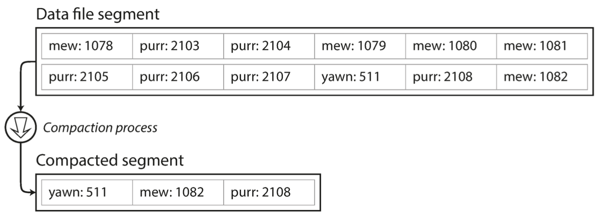
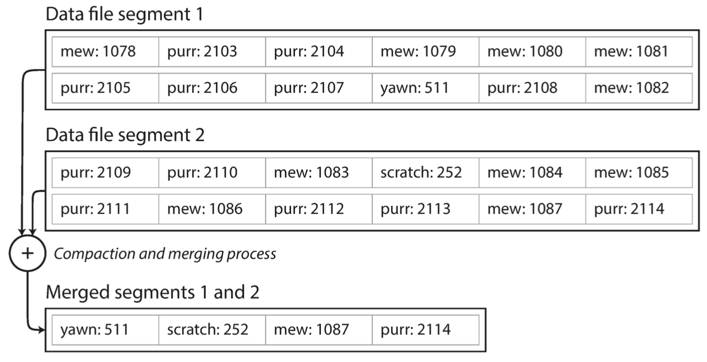
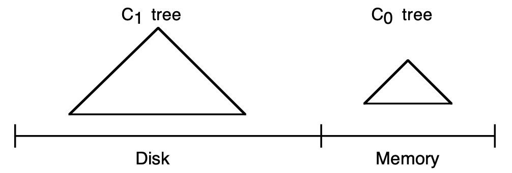
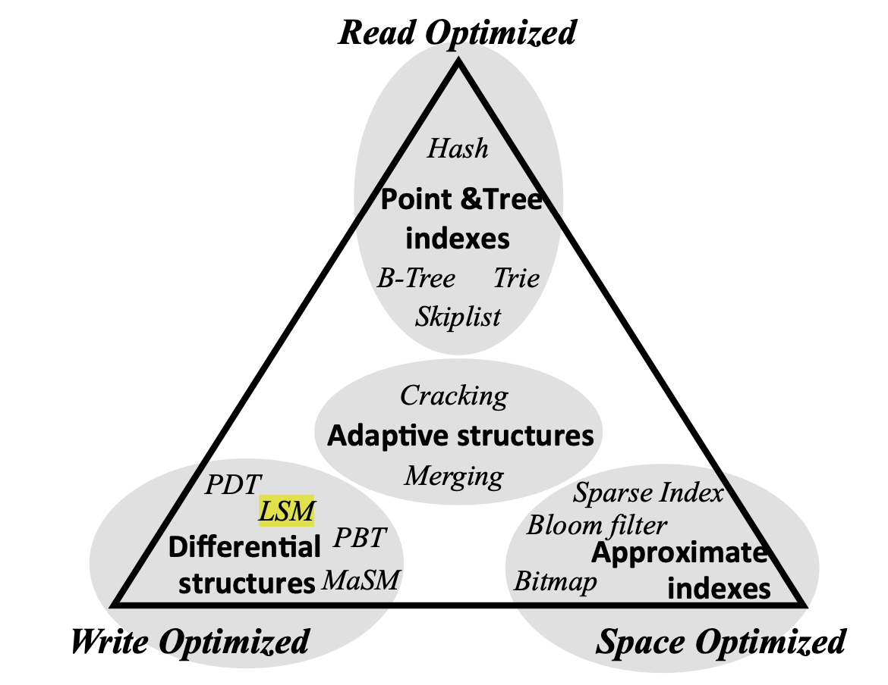

# Query languages

## Query languages
:::{.callout-tip icon=false}
## SQL History

- Developed in **1974.** Originally named SEQUEL, for Structured English QUEry
Language. Changed to SQL due to trademark issues.
- In **1977** System R sells SQL to its first customer: Pratt & Whitney (aerospace)
- Software Development Laboratories (**1977**) -> Relational Software (**1979**) -> Oracle (**1982**)
- **1986:** POSTGRES project at the University of California at Berkeley
:::

## Query languages
:::{.callout-note icon=false}
## DBMS ranking, June 2024
{height=500}
:::

## Query languages: SQL
:::{.callout-important icon=false}
## SQL Features

- Declarative (IMS and CODASYL where **imperative**)
- Set-based
- Functional
:::

:::{.callout-tip icon=false}
## Pros of declarative approach

- more concise. Describe the pattern of desired data, not the sequence of steps required to get it
- leaves room for automatic optimizations (e.g. query optimizer)
- lends itself better for parallel execution
:::

## Query languages: SQL
:::{.callout-note icon=false}
## Example
```sql
SELECT c.century AS cent,
       COUNT(c.name) AS num_captains,
       SUM(s.id) AS ships
FROM captains c, ships s
WHERE c.id = s.captain
GROUP BY century
HAVING COUNT(c.name) >= 3
ORDER BY century DESC
LIMIT 3 OFFSET 2
```
:::

## SQL
:::{.callout-important icon=false}
## Clauses

-  The **FROM** clause selects from which tables to read the data, in
this case two tables, `captains` and `ships.` Implicitly the Cartesian
product is computed.
- The **WHERE** clause performs a selection: it only keeps the records
for which the captain (from the `captains` table) is the captain of the
ship (from the `ships` table). If you pay attention, you will recognize that
this filter together with the Cartesian product is actually a **theta join**.
Any reasonable SQL implementation will be smart enough to detect
this and evaluate this query efficiently (joins can be computed in linear
time rather than quadratic!).
- The **SELECT** clause is also where projections are made: it lists the
columns to include in the results. Renames are also made in this clause
with **AS**.
:::
 
## SQL
:::{.callout-important icon=false}
## Clauses
- The **GROUP BY** clause performs an aggregation, with century as
a grouping key. Aggregations on the captain name (**COUNT**) and the
ship id (**SUM**) are done in the **SELECT** clause.
- The **HAVING** clause is in fact like the **WHERE** clause, but performs
a selection after, rather than before, the grouping.
- The **ORDER BY** clause reorders the output rows according to the
specified keys.
- The **LIMIT** and **OFFSET** clauses allow pagination of the output:
**OFFSET** specifies how many records to skip, and **LIMIT** specifies how
many records to output after the skipped ones.
- All clauses are optional except for **SELECT** and **FROM.**
:::

## Query languages: SQL


## Query languages: SQL

  <!-- % http://www.interdb.jp/pg/pgsql03/01.html -->

:::{.callout-important icon=false}
## Postgres example
{height=600}
:::

## Query languages: SQL

  <!-- % http://www.interdb.jp/pg/pgsql03/01.html -->

:::{.callout-important icon=false}
## Postgres example
```sql
SELECT id, data FROM tbl_a WHERE id < 300 ORDER BY data;
```

:::

## Query languages: SQL

  <!-- % http://www.interdb.jp/pg/pgsql03/01.html -->

:::{.callout-important icon=false}
## Postgres example

:::

## Query languages: SQL
:::{.callout-tip icon=false}
## Postgres example

:::

## Query languages: SQL
:::{.callout-important icon=false}
## Map-reduce example
      
```sql
SELECT date_trunc('month', observation_timestamp) AS observation_month,
sum(num_animals) AS total_animals
FROM observations
WHERE family = 'Sharks'
GROUP BY observation_month;
```
:::

## Query languages: MongoDB API
:::{.callout-important icon=false}
## Map-reduce example
```json
db.observations.mapReduce(
  function map() {
    var year = this.observationTimestamp.getFullYear();
    var month = this.observationTimestamp.getMonth() + 1;
    emit(year + "-" + month, this.numAnimals);
  },
  function reduce(key, values) {
    return Array.sum(values);
  },
  {
    query: { family: "Sharks" },
    out: "monthlySharkReport"
  }
);
```
:::

## Query languages: MongoDB API
:::{.callout-warning icon=false}
## Map-reduce example: aggregation pipeline
```json
db.observations.aggregate([
  { $match: { family: "Sharks" } },
  { $group: {
    _id: {
    year: { $year: "$observationTimestamp" },
    month: { $month: "$observationTimestamp" }
    },
    totalAnimals: { $sum: "$numAnimals" }
  } }
]);
```
:::

## Query languages: Cypher
:::{.callout-tip icon=false}
## Cypher query: create
```sql
CREATE
  (NAmerica:Location {name:'North America', type:'continent'}),
  (USA:Location {name:'United States', type:'country' }),
  (Idaho:Location {name:'Idaho', type:'state' }),
  (Lucy:Person {name:'Lucy' }),
  (Idaho) -[:WITHIN]-> (USA) -[:WITHIN]-> (NAmerica),
  (Lucy) -[:BORN_IN]-> (Idaho)
```
:::

## Query languages: Cypher
:::{.callout-important icon=false}
## Cypher query: find
```sql
MATCH
  (person) -[:BORN_IN]-> () -[:WITHIN*0..]-> (us:Location {name:'United States'}),
  (person) -[:LIVES_IN]-> () -[:WITHIN*0..]-> (eu:Location {name:'Europe'})
RETURN person.name
```
:::


## Query languages: Cypher {.scrollable}
:::{.callout-note icon=false}
## Cypher vs SQL: find
```sql
WITH RECURSIVE
  -- in_usa is the set of vertex IDs of all locations within the United States
  in_usa(vertex_id) AS (
    SELECT vertex_id FROM vertices WHERE properties->>'name' = 'United States'
    UNION
    SELECT edges.tail_vertex FROM edges
    JOIN in_usa ON edges.head_vertex = in_usa.vertex_id
    WHERE edges.label = 'within'
  ),
  -- in_europe is the set of vertex IDs of all locations within Europe
  in_europe(vertex_id) AS (
    SELECT vertex_id FROM vertices WHERE properties->>'name' = 'Europe'
    UNION
    SELECT edges.tail_vertex FROM edges
    JOIN in_europe ON edges.head_vertex = in_europe.vertex_id
    WHERE edges.label = 'within'
  ),
  -- born_in_usa is the set of vertex IDs of all people born in the US
  born_in_usa(vertex_id) AS (
    SELECT edges.tail_vertex FROM edges
    JOIN in_usa ON edges.head_vertex = in_usa.vertex_id
    WHERE edges.label = 'born_in'
  ),
  -- lives_in_europe is the set of vertex IDs of all people living in Europe
  lives_in_europe(vertex_id) AS (
    SELECT edges.tail_vertex FROM edges
    JOIN in_europe ON edges.head_vertex = in_europe.vertex_id
    WHERE edges.label = 'lives_in'
  )
  SELECT vertices.properties->>'name'
  FROM vertices
  -- join to find those people who were both born in the US *and* live in Europe
  JOIN born_in_usa ON vertices.vertex_id = born_in_usa.vertex_id
  JOIN lives_in_europe ON vertices.vertex_id = lives_in_europe.vertex_id;
```
:::

## Query languages: SPARQL
:::{.callout-tip icon=false}
## SPARQL query: find
```sql
SELECT ?personName WHERE {
  ?person :name ?personName.
  ?person :bornIn / :within* / :name "United States".
  ?person :livesIn / :within* / :name "Europe".
}
```
:::

:::{.callout-note icon=false}
## Cypher vs SPARQL
```json
(person)-[:BORN_IN]->()-[:WITHIN*0..]->(location) #Cypher
?person :bornIn / :within* ?location. #SPARQL
```
:::

## Query languages: Datalog
:::{.callout-tip icon=false}
## Datalog
Uses a generalized version of triple-store model: **predicate(subject, object)**
```prolog
name(namerica, 'North America').
type(namerica, continent).
name(usa, 'United States').
type(usa, country).
within(usa, namerica).
name(idaho, 'Idaho').
type(idaho, state).
within(idaho, usa).
name(lucy, 'Lucy').
born_in(lucy, idaho).
```
:::

## Query languages: Datalog
:::{.callout-note icon=false}
## Definition
A Datalog **program** is a collection of Datalog **rules**, each of which is of the form:
$$
A :- B_1,B_2,\ldots,B_n,
$$
where $n \geq 0$, 
A is the **head** of the rule, 
and the conjunction of $B_1,\ldots,B_n$ is the **body** of the rule.

The rule can be read informally as "$B_1$ and $B_2$ and $\ldots$ and $B_n$ implies $A$".
:::

## Query languages: Datalog


## Query languages: Datalog
:::{.callout-important icon=false}
## Datalog: define data
```prolog
name(namerica, 'North America').
type(namerica, continent).
name(usa, 'United States').
type(usa, country).
within(usa, namerica).
name(idaho, 'Idaho').
type(idaho, state).
within(idaho, usa).
name(lucy, 'Lucy').
born_in(lucy, idaho).
```
:::

## Query languages: Datalog
:::{.callout-important icon=false}
## Datalog query
```prolog
within_recursive(Location, Name) :- name(Location, Name). /* Rule 1 */
within_recursive(Location, Name) :- within(Location, Via), within_recursive(Via, Name). /* Rule 2 */
migrated(Name, BornIn, LivingIn) :- name(Person, Name), /* Rule 3 */
            born_in(Person, BornLoc),
            within_recursive(BornLoc, BornIn),
            lives_in(Person, LivingLoc),
            within_recursive(LivingLoc, LivingIn).
?- migrated(Who, 'United States', 'Europe').
```
:::

## Query languages: Datalog
:::{.callout-tip icon=false}
## Datalog: determine if Idaho is in NA

:::

# Storage engines

## Storage engines
:::{.callout-important icon=false}
## User view

- **data model** - how to **store** the data
- **query lang** - how to **query** the data
:::

:::{.callout-tip icon=false}
## DB view

- **storage engine internals** - how to **store** the data
- **storage engine/DB API** - how to **find** the data
:::

## Storage engines
:::{.callout-important icon=false}
## Storage engine optimizations

- for **transactional workloads**
- for **analytics**
:::

## Storage engines
:::{.callout-important icon=false}
## Two families of storage engines

- **log-structured**
- **page-oriented**
:::

## Storage engines: logs
:::{.callout-note icon=false}
## Log definition
An append-only sequence of records.
:::

:::{.callout-important icon=false}
## Still need to think about

- concurrency control
- disk space
- and handling errors and partial writes
:::


## Storage engines: logs
:::{.callout-important icon=false}
## Simple log-based db
```bash
#!/bin/bash

db_set () {
  echo "$1,$2" >> database
}

db_get () {
  grep "^$1," database | sed -e "s/^$1,//" | tail -n 1
}
```
:::

## Storage engines: logs
:::{.callout-important icon=false}
## Write
```bash
$ db_set 123456 '{"name":"London","attractions":["Big Ben","London Eye"]}'
$ db_set 42 '{"name":"San Francisco","attractions":["Golden Gate Bridge"]}'
```
:::

:::{.callout-tip icon=false}
## Read
```bash
$ db_get 42
{"name":"San Francisco","attractions":["Exploratorium"]}
```
:::

## Storage engines: logs
:::{.callout-note icon=false}
## Pros and cons

- **Pros:** writes are **fast** $O(1)$
- **Cons:** reads are **slow** $O(n)$

How to speed up writes: use an **index**.
:::

:::{.callout-tip}
## Index
Index is an additional structure that is derived from the primary data.

- **any kind** of index slows down writes
- necessary to **choose manually** based on typical query patterns.
:::


## Storage engines: logs
:::{.callout-important icon=false}
## Index structure
Consider key-value data type (akin to Python dictionary).

:::

## Storage engines: logs

:::{.callout-important icon=false}
## Limitations

- all keys should fit into available memory
- what if db file becomes too large?
:::

:::{.callout-tip icon=false}
## Solution: Segmentation and Compaction

- break the log into segments
- write only to the newest segment
- perform compaction on older segments
:::

## Storage engines: logs
:::{.callout-note icon=false}
## Solution: Compaction

:::

## Storage engines: logs
:::{.callout-tip icon=false}
## Solution: Compaction

:::

## Storage engines: logs
:::{.callout-tip icon=false}
## Compaction querying

- separate hash table for each segment 
- first check the most recent segment
- if not found, check the second-most-recent segment
- merging process will make sure there's not too many segments
:::

## Storage engines: logs
:::{.callout-important icon=false}
## Compaction caveats

- **deletions:** use a **tombstone** record
- **crash recovery:** store hash tables in disk files for faster recovery
- **log corruption:** use **checksums**
- **concurrency:** single writer, multiple readers
:::

## Storage engines: logs
:::{.callout-tip icon=false}
## Append vs in-place: Pros

- appending and segmenting are sequential writes
- concurrency and crash recovery become much simpler
- segment merge does away with fragmentation
:::

:::{.callout-important icon=false}
## Append vs in-place: Cons

- hash table size limitations
- range queries become slow

**Solutions**: SSTable and LSM-tree, B-tree
:::

## Storage engines: logs
:::{.callout-important icon=false}
## Definition
Sorted string table (**SSTable**): sort key-value entries by key.

**Advantages:**

- Merge is faster
- No need to keep hashes for all entries
- Records can be grouped into blocks and compressed

Introduced in **Bigtable: A Distributed Storage System for Structured Data**, Google (2006).
:::

## Storage engines: logs


## Storage engines: logs


## Storage engines: logs
:::{.callout-important icon=false}
## How to sort data on disk?

- When a write comes in, add it to an in-memory balanced tree data structure (a **memtable**)
- When the memtable gets bigger than some threshold—typically a few megabytes
—write it out to disk as an SSTable file. 
- In order to serve a read request, first try to find the key in the memtable, then in
the most recent on-disk segment, then in the next-older segment, etc.
- From time to time, run a merging and compaction process in the background
:::

## Storage engines: logs
:::{.callout-tip icon=false}
## SSTable uses

- LevelDB
- RocksDB
- Cassandra
- HBase
- Google BigTable users: Google Earth, Google Finance
:::

## Storage engines: logs
:::{.callout-important icon=false}
## Log-Structured Merge-Tree
LSM-tree: introduced in **The Log-Structured Merge-Tree**, Patrick O’Neil et al. (1996). 

Storage engines that are based on this principle of merging and compacting sorted files are often called **LSM storage engines**.

**Basic idea:** keeping a cascade of SSTables that are merged in the background.
:::

## Storage engines: logs
:::{.callout-important icon=false}
## Log-Structured Merge-Tree

:::

## Storage engines: logs
:::{.callout-tip icon=false}
## Performance optimizations

- Use **Bloom filters** for segment checks
- size-tiered compaction: newer and smaller SSTables are successively merged into older and larger
SSTables.
- leveled compaction: the key range is split up into smaller SSTables and
older data is moved into separate “levels,” which allows the compaction to proceed
more incrementally and use less disk space.
:::


## Storage engines: trees
:::{.callout-tip icon=false}
## B-trees
Introduced in **Organization and Maintenance of Large Ordered Indices**, Bayer et al, Boeing Scientific Research Laboratories, 1970.

- B-trees break the database down into fixed-size **blocks** or **pages**, traditionally 4 KB in size (sometimes bigger), and read or write one page at a time.

- Each page contains several keys and references to child pages.
  
- Number of references to child pages in one page of the B-tree is called the **branching factor**.
:::

## Storage engines: trees
:::{.callout-important icon=false}
## Definition
Let $h \geq 0$ be an integer, $k$ a natural number.
A directed tree $T$ is in the class $\tau(k,h)$ of **B-trees** if $T$ is either empty ($h=0$)
or has the following properties:

1. Each path from the root to any leaf has the same length $h$, also called the **height** of $T$, i.e., $h$ = number of nodes in path.
2. Each node except the root and the leaves has at least $k + 1$ sons. The root is a leaf or has at least two sons.
3. Each node has at most $2k + 1$ sons.
:::

## Storage engines: trees


## Storage engines: trees
:::{.callout-warning icon=false}
## B-tree Update

1. search for the leaf page containing that key 
2. change the value in that page
3. write the page back to disk (any references to that page remain valid)
:::

:::{.callout-note icon=false}
## B-tree Insert

1. find the page whose range encompasses the new key 
2. add it to that page.
3. If there isn’t enough free space in the page to accommodate the new key, it is split into two half-full pages, and the parent page is updated to account for the new subdivision of key ranges
:::

## Storage engines: trees


## Storage engines: trees


## Storage engines: trees
:::{.callout-important icon=false}
## Balancing
This algorithm ensures that the tree remains **balanced:**

- a B-tree with $n$ keys always has a depth of $O(\log n)$
- most databases can fit into a B-tree that is three or four levels deep
- four-level tree of 4 KB pages with a branching factor of 500 can store up to
256 TB.
:::

## Storage engines: trees
:::{.callout-important icon=false}
## B-tree optimizations

- **write-ahead log (WAL)**. This is an append-only file to which every B-tree modification
must be written before it can be applied to the pages of the tree itself.
- **latches** (lightweight locks): solve concurrency issues by protecting the tree’s data structures
- **copy-on-write** for new page creation
- **key abbreviation**. Especially in pages on the interior of the tree, keys only need to provide enough information to act as boundaries between key ranges. Packing more keys into a page allows the tree to have a higher branching factor, and thus fewer levels
- additional **tree pointers**, e.g. siblings
:::

## Storage engines: index comparison
:::{.callout-note}
## LSM-trees vs B-trees

- LSM-trees are typically faster for writes
- B-trees are thought to be faster for reads
- Compaction process interferes with ongoing read/write performance
- LSM-trees: lower storage overhead
- LSM-trees: issue of **write amplification**
- B-trees: each key exists exactly in one place in the index
:::

## Storage engines: index comparison


## Storage engines: index comparison
:::{.callout-warning icon=false}
## Other index types

- Secondary indexes
- Clustered indexes
- Covering indexes
- Multi-column indexes
- Fuzzy search indexes
:::

## Storage engines: in-memory DBs

