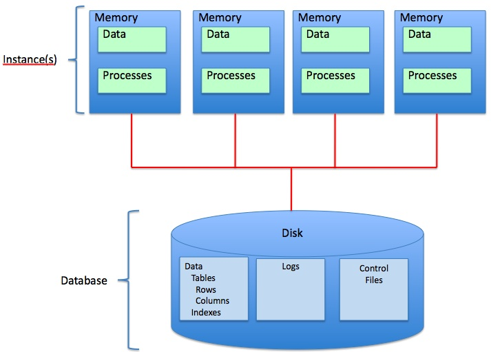
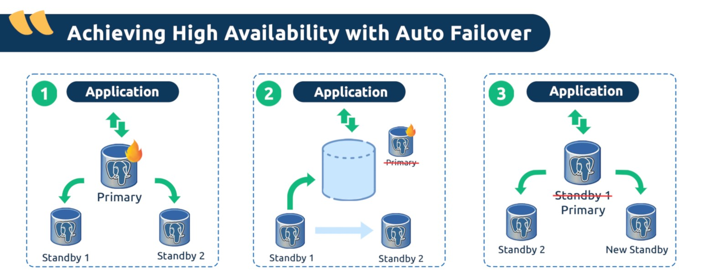

## Distributed Systems Overview
:::{.callout-tip icon=false}
## Why?

- **Scalability**:
If data volume, read load, or write load grows bigger than a single machine
can handle, it can be spread across multiple machines.
- **Fault tolerance/high availability**:
If application needs to continue working even if machine(s) go down, one can use multiple machines to give redundancy. When one fails, another one can take over.
- **Latency**:
With users around the world, it is desirable to have servers at various
locations.
:::

## Distributed Systems Overview
:::{.callout-tip icon=false}
## Sharing types

- shared-memory 
- shared-disk
- shared-nothing
:::

## Shared memory

## Shared memory: UMA vs NUMA
:::{.callout-important icon=false}
## Uniform Memory Access

- architecture of multicore processors
- used in modern database servers
:::      

:::{.callout-tip icon=false}
## Non-Uniform Memory access

- used in tightly-coupled microprocessors
- some banks of memory are closer to one CPU than to others
- used in modern servers  
:::

## Shared memory: UMA vs NUMA

## Shared memory
:::{.callout-tip icon=false}
## Pros

- easy to program
- no complex distributed locking
:::

:::{.callout-important icon=false}
## Cons

- all I/O and memory requests share the same bus
- require customized hardware to keep L2 caches consistent
- scalability limitations
:::

## Shared disk

## Shared disk

## Shared disk
:::{.callout-tip icon=false}
## Pros

- simpler storage
- can use shared-cache approach for OLTP workloads
:::

:::{.callout-important icon=false}
## Cons

- I/O bottleneck
- no obvious place for the lock table
:::

## Shared nothing

## Comparison table {.font8 .scrollable}

| Type | Shared nothing | Shared memory | Shared disk |
|---|---|---|---|
| Concurrency | 2 | 2 | 3 |
| Crash recovery | 2 | 1 | 3 |
| DB design | 3 | 2 | 2|
| Load balancing | 3 | 1 | 2|
| High availability | 1 | 3 | 2|
| Message count | 3 | 1 | 2|
| Bandwidth | 1 | 3 | 2 |
| Scaling | 1 | 3 | 2 |
| Large distances | 1 | 3 | 2 |
| Critical sections | 1 | 3 | 2 |
| Image count | 3 | 1 | 3 |
| Hot spots | 3 | 3 | 3 |

## Data distribution strategies
:::{.callout-tip icon=false}
## Distribution
There are two common ways data is distributed across multiple nodes:

- **Replication:**
keeping a copy of the same data on several different nodes, potentially in different locations.
- **Partitioning:** splitting a big database into smaller subsets called partitions so that different partitions can be assigned to different nodes (also known as **sharding**).

Both methods provide:

- **Redundancy**
- **Performance**
:::

# Replication

## Replication
:::{.callout-tip icon=false}
## Why?

- Keep data **geographically close** to your users (and thus reduce latency)
- Allow the system to **continue working** even if some of its parts have failed
(and thus increase availability)
- **Scale out** the number of machines that can serve read queries (and thus
increase read throughput)
:::

:::{.callout-important}
## Assumption
Dataset is **small** enough so that it can fit on one machine.
:::

## Replication
:::{.callout-tip icon=false}
## S3 example
Types:

- **Live replication**
- **On-demand replication**
- **Cross-Region Replication**
- **Same-Region Replication**

S3 Replication Time Control (S3 RTC): replicates 99.99 percent of new objects stored in Amazon S3 within 15 minutes (backed by a service-level agreement). 
:::

## Replication
:::{.callout-tip icon=false}
## How to handle changes?
Three algorithms:

- single-leader
- multi-leader
- leaderless
:::

## Replication
:::{.callout-tip icon=false}
## Single-leader replication flow

- One of the replicas is designated the **leader** (also known as **master** or **primary**). When clients want to write to the database, they must send their requests to the
leader, which first writes the new data to its local storage.
- The other replicas are known as **followers** (**read replicas**, **slaves**, **secondaries**, or **hot standbys**). Whenever the leader writes new data to its local storage, it also sends
the data change to all of its followers as part of a **replication log** or **change stream**.
- When a client wants to read from the database, it can query either the leader or
any of the followers. However, writes are only accepted on the leader.
:::

## Replication
:::{.callout-tip icon=false}
## Leader replication

:::

## Replication
:::{.callout-tip icon=false}
## Single-leader replication users

- PostgreSQL (since version 9.0)
- MySQL
- Oracle Data Guard
- SQL Server’s AlwaysOn Availability Groups
- MongoDB
- RethinkDB
- Espresso
- Kafka
- RabbitMQ
:::

## Replication

## Replication
:::{.callout-tip icon=false}
## Synchronous vs asynchronous
Synchronous replication pros and cons:

- **Pros:** follower is guaranteed to have
an up-to-date copy of the data that is consistent with the leader. 

- **Cons:** if the synchronous follower doesn’t respond (for whatever reason), the write cannot be processed.

The leader must block all writes and wait until the synchronous replica is available.
:::

## Replication
:::{.callout-tip icon=false}
## Semi-synchronous replication

- It is impractical for all followers to be synchronous: any one node
      outage would cause the whole system to grind to a halt. 
- One of the followers is synchronous, and the others are asynchronous. 
- If the synchronous follower becomes unavailable or slow, one of the asynchronous followers is made synchronous.
- This guarantees that you have an up-to-date copy of the data on at least two nodes: the leader and one synchronous follower.
:::

## Replication

## Replication
:::{.callout-tip icon=false}
## Chain replication
Chain replication is a special primary backup system, in which the servers are linearly ordered to form a chain with the primary at the end. 

<!-- % In “classic” primary backup systems, the topology resembles a star with the primary at the center. --> 

The goal: "to achieve high throughput and availability without sacrificing strong consistency".
:::

:::{.callout-note icon=false}
## Chain replication protocol

- All read requests are sent to the tail (primary) of the chain
- All write requests are sent to the head (a backup), which then passes the update along the chain. 
- Only the result of the write is passed down the chain. 
- Strong consistency naturally follows, because all requests are ordered by the primary at the tail of the chain.
:::

## Replication
:::{.callout-note icon=false}
## Chain replication protocol
The chain replication protocol considers only three failure cases, all of which are fail-stop failures:

- Fail-stop of the head
- Fail-stop of the tail (primary)
- Fail-stop of a middle server
:::

## Replication

## Replication
:::{.callout-important icon=false}
## Problem: how to add a new follower?
Simple copy is not enough, because:

- clients are constantly writing
- hence, data is always in flux
- locking the database would jeopardise high availability
:::

## Replication
:::{.callout-tip icon=false}
## Adding a follower

- Take a consistent snapshot of the leader’s DB at some point in time
- Copy the snapshot to the new follower node.
- The follower connects to the leader and requests all the data changes that have
happened since the snapshot was taken. (Using a **replication log position**) 
- When the follower has processed the backlog of data changes since the snapshot,
we say it has caught up. 
:::

:::{.callout-note icon=false}
## Replication log position

- **PostgreSQL:** log sequence number
- **MySQL:** binlog coordinates
:::

## Replication
:::{.callout-tip icon=false}
## Follower failure: catch-up recovery

1. **Fetch** the last transaction from local log
2. **Connect** to the leader and request all the missing data changes
3. Once changes are applied, **continue** functioning normally
:::

:::{.callout-note icon=false}
## Leader failure: failover

1. **Determine** that the leader has failed. E.g., use a timeout. 
2. **Choose** a new leader. Use election process or controller node. This is a **consensus problem**.
3. **Reconfigure** the system to use the new leader. 
:::

## Replication

## Replication
:::{.callout-tip icon=false}
## Failover: what can go wrong

- asynchronous replication: new leader might be stale
- discarding writes might cause problems in secondary storage systems
- **split brain:** two nodes believe they are the leader
- unnecessary failovers due to wrong timeout
:::

## Replication logs
:::{.callout-tip icon=false}
## Statement-based
Log each write request (**statement**) and send it to followers.

Possible issues:

- **nondeterministic** functions like RAND() or NOW()
- **broken order** (autoincrement columns, WHERE clauses)
- statements might have **side effects**
:::

## Replication
:::{.callout-tip icon=false}
## Write-ahead log shipping
For log-structured storage: log already is the main place of storage.

For B-trees: use write-ahead log.

Possible issues:

- too **low-level**
- storage engine **coupling**
:::

## Replication
:::{.callout-tip icon=false}
## Logical (row-based) log replication
A logical log for a relational database is usually a sequence of records describing
writes to database tables at the granularity of a row:

- For an **inserted** row, the log contains the new values of all columns.
- For a **deleted** row, the log contains enough information to uniquely identify the
row that was deleted.
- For an **updated** row, the log contains enough information to uniquely identify the updated row, and the new values of all columns.
:::

## Replication
:::{.callout-tip icon=false}
## Replication lag: consistency
Client-side consistency has to do with **how** and **when** observers see updates made to a data object in the storage systems.

Types:

- **Strong consistency**: after the update completes, any
subsequent access will return the updated value.
- **Weak consistency**: the system does not guarantee that
subsequent accesses will return the updated value; for this 
number of conditions need to be met. The required timeout is called **inconsistency window**.
- **Eventual consistency**: the storage system guarantees that if no new
updates are made to the object, eventually all accesses
will return the last updated value. 
:::

## Replication
:::{.callout-tip icon=false}
## Replication lag: eventual consistency types
Types:

- **Causal**: if process A has communicated to
process B that it has updated a data item, the latter will always get updated values, and writes will supersede earlier ones
- **Read-your-writes**: a process A, after it has updated a data item,
will never see an older value.
- **Session**: as long as the session exists, the system guarantees read-your-writes consistency.
- **Monotonic read**: if a process has seen a particular value for the object, any subsequent accesses will never return any previous values.
- **Monotonic write**: writes by the same process are serialized.
:::

## Replication

## Replication

## Replication
:::{.callout-tip icon=false}
## Multi-leader replication
Advantages:

1. **Performance**
2. **Tolerance of datacenter outages**
3. **Tolerance of network problems**
:::

## Replication

## Replication

## Replication
:::{.callout-tip icon=false}
## Convergent conflict resolution

- Give each write a unique ID, pick the write with the highest ID as the winner. Last write wins (LWW).
- Give each replica a unique ID, and let writes that originated at a higher-numbered replica always take precedence over writes that originated at a lower- numbered replica. 
- Somehow merge the values together - for instance, order them alphabetically and then concatenate them.
- Record the conflict in an explicit data structure that preserves all information,
and write application code that resolves the conflict at some later time (perhaps
by prompting the user).
:::

## Replication
:::{.callout-tip icon=false}
## Automatic conflict resolution

- Conflict-free replicated datatypes (CRDTs) (Riak).
- Mergeable persistent data structures, using a three-way merge function (whereas CRDTs use two-way merges).
- Operational transformation (Google Docs).
:::

## Replication

## Replication

## Replication
:::{.callout-tip icon=false}
## Leaderless replication
Clients:

- write from several nodes in parallel
- read from several nodes in parallel

Examples:

- Amazon Dynamo
- Riak
- Cassandra
:::

## Replication

## Replication
:::{.callout-tip icon=false}
## Quorum

1. If there are $n$ replicas, every write must be confirmed by $w$ nodes to
be considered successful, and we must query at least $r$ nodes for each read. 

2. As long as $w + r > n$, we expect to get an up-to-date
value when reading, because at least one of the $r$ nodes we’re reading from must be
up to date. 
3. Reads and writes that obey these $r$ and $w$ values are called **quorum reads and writes**.
4. One can think of $r$ and $w$ as the minimum number of votes required
for the read or write to be valid.
:::

## Replication
:::{.callout-tip icon=false}
## Quorum: tolerating unavailable nodes
$w + r > n$ is called a **quorum condition.**

1. If $w < n$, we can still process writes if a node is unavailable.
2. If $r < n$, we can still process reads if a node is unavailable.
3. With $n = 3, w = 2, r = 2$ we can tolerate one unavailable node.
4. With $n = 5, w = 3, r = 3$ we can tolerate two unavailable nodes. 
5. Normally, reads and writes are always sent to all $n$ replicas in parallel. The
parameters $w$ and $r$ determine how many nodes we wait for.
:::

## Replication

# Partitioning

## Partitioning
:::{.callout-tip icon=false}
## Definition
Partitioning is a way of intentionally breaking a large database down into smaller ones. Also called **sharding**.

Partitions are defined in such a way that each piece of data belongs to **exactly one** partition.
:::

:::{.callout-important icon=false}
## Why partitions?

- Scalability
- Fault tolerance: partitions can be copied
:::      

## Partitioning

## Partitioning
:::{.callout-tip icon=false}
## Goal
**Even distribution** of load.

Unfair partitioning is called **skewed**.

Partition with disproportionately high load - **hot spot**.
:::

:::{.callout-important icon=false}
## How to solve

- Random
- Continuous key ranges
- Hashes
:::

## Partitioning

## Partitioning
:::{.callout-tip icon=false}
## Hashes pros and cons

- **Pros:** even key distribution
- **Cons:** inefficient range queries
:::

:::{.callout-note icon=false}
## Solution
Compound primary key: hash the first key column only, use the rest as the concatenated index (e.g. Cassandra).
:::

## Partitioning

## Partitioning

## Partitioning
:::{.callout-tip icon=false}
## Global (term-partitioned)

- efficient **reads**
- **writes** slower and more complicated
- Amazon DynamoDB, Oracle data warehouse 
:::

:::{.callout-note icon=false}
## Local (document-partitioned)

- **reads** on secondary indexes quite expensive
- simple **writes** 
- Riak, Cassandra, ElasticSearch
:::

## Partitioning
:::{.callout-tip icon=false}
## Rebalancing

1. The load (data storage, read and write requests) should be
shared fairly between the nodes in the cluster.
2. While rebalancing is happening, the database should continue accepting reads
and writes.
3. No more data than necessary should be moved between nodes, to make rebalanc‐
ing fast and to minimize the network and disk I/O load.
:::

## Partitioning
:::{.callout-tip icon=false}
## Rebalancing strategies

- hash $mod$ $N$: not good when $N$ (number of nodes) changes
- create fixed number of partitions $P$,  $P \gg N$ (used in Riak, ElasticSearch, Couchbase)
- dynamic partitioning: split in two if too large (HBase, RethinkDB, MongoDB, Cassandra)
:::

## Partitioning

## Partitioning
:::{.callout-tip icon=false}
## Request routing

1. Allow clients to contact any node (e.g. via load balancer).
2. Send all client requests to a routing tier.
3. Require clients be aware of partioning and node assignment.
:::

## Partitioning

