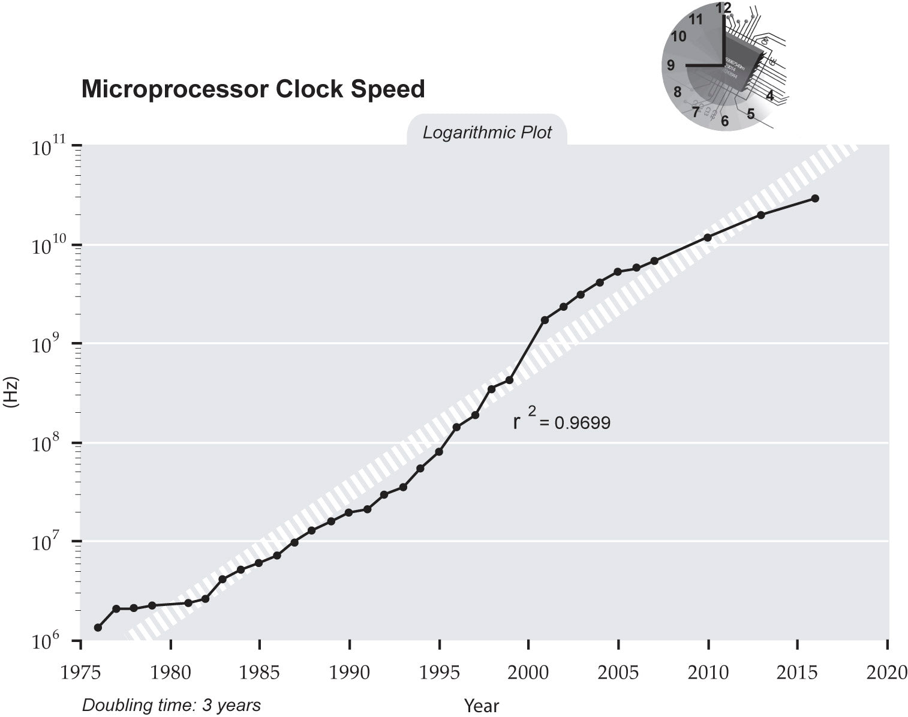
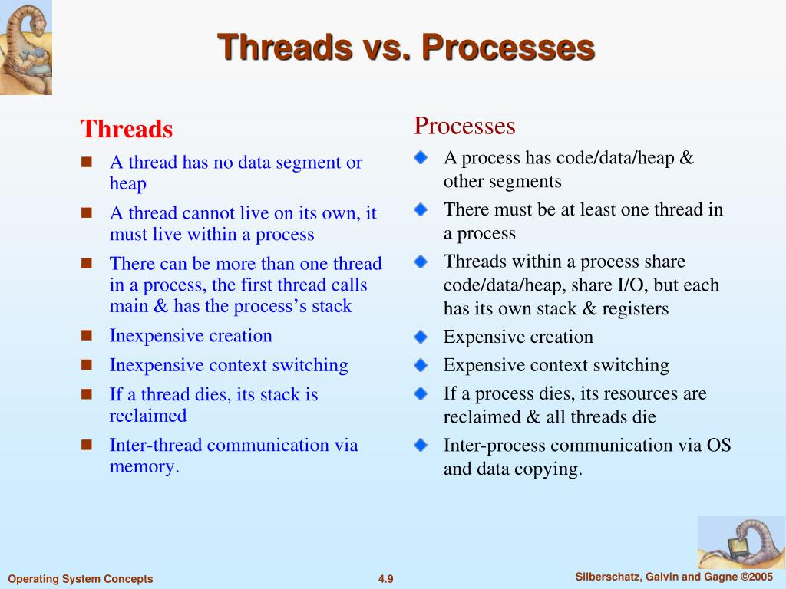
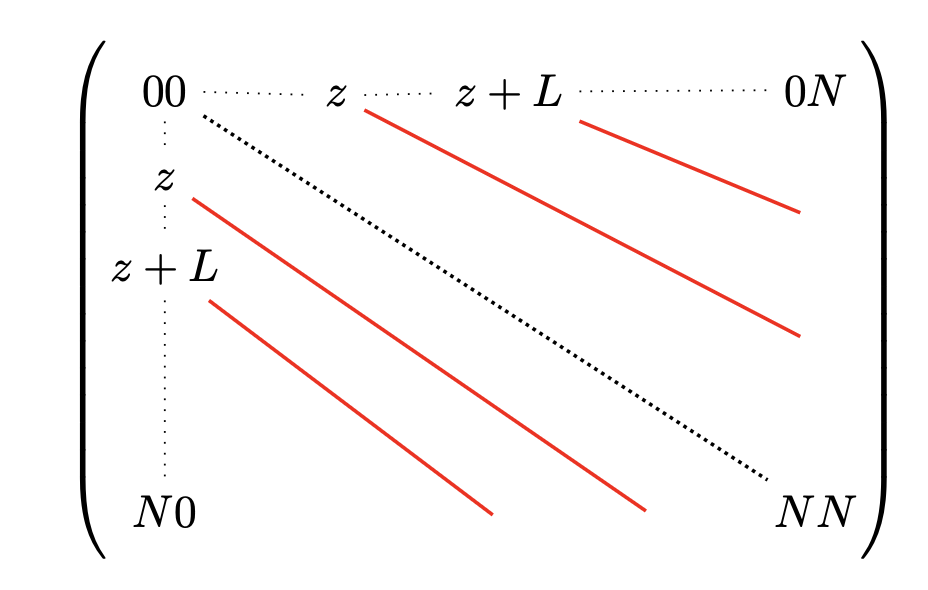
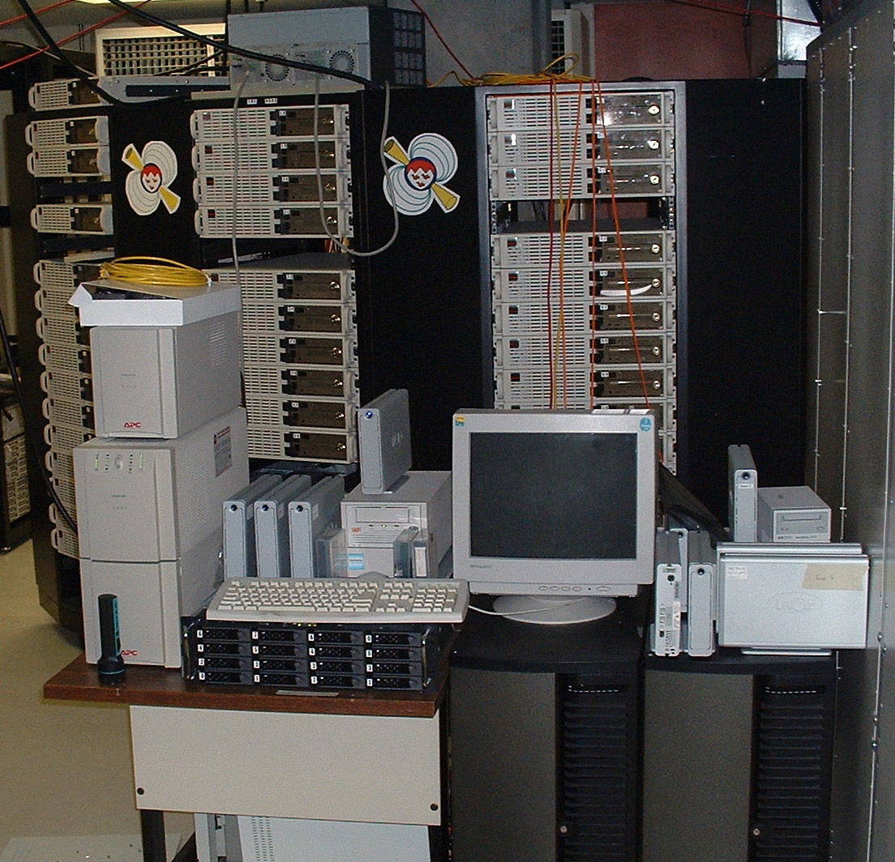

# Computational improvements

## Moore's Law
:::{.callout-important icon=false}
## Definition (1965)
Number of transistors in an integrated circuit (IC) doubles about every two years. 
:::


## Moore's Law


## Moore's Law


## Moore's Law
:::{.callout-tip icon=false}
## Trends

- Gordon Moore: Moore's law will end by around 2025. 
- Nvidia CEO Jensen Huang: declared Moore's law dead in 2022.
:::

:::{.callout-note icon=false}
## Pat Gelsinger, Intel CEO, end of 2023
> We're no longer in the golden era of Moore's Law, it's much, much harder now, so we're probably doubling effectively closer to every three years now, so we've definitely seen a slowing.
:::

## Edholm's law
:::{.callout-tip icon=false}
## Definition (2004)

- three categories of telecommunication, namely 
  - wireless (mobile),
  - nomadic (wireless without mobility)
  - and wired networks (fixed),

  are in lockstep and gradually converging
- the bandwidth and data rates double every 18 months, which has proven to be true since the 1970s
:::


## Edholm's law


## Edholm's law


:::{.callout-warning icon=false}
## Data deluge

- 90\% of data humankind has produced happened in the last two years.
- 80\% of data could be unstructured
- 99\% of data produced is never analyzed
:::


## Dennard scaling
:::{.callout-important icon=false}
## Definition (Robert Dennard, 1974)
As transistors get smaller, their power density stays roughly **constant** -- smaller transistors run at proportionally lower voltage and current.
:::

:::{.callout-tip icon=false}
## Why it mattered
For ~30 years this is what let clock speeds climb *alongside* Moore's Law: each new process node gave you more transistors **and** a higher safe clock at the same power budget. Software got faster for free.
:::

## The power wall
:::{.callout-important icon=false}
## Dennard scaling broke down (~2006)
Below roughly 65 nm, leakage current and heat stopped shrinking with the transistors. More switching in the same area now means more power and more heat than the chip can dissipate.
:::

:::{.callout-warning icon=false}
## Consequence
Clock speed hit a ceiling. The Pentium 4 reached ~3.8 GHz in 2004; twenty years later, mainstream CPUs still run at ~3--5 GHz.
:::

:::{.callout-note icon=false}
## "The Free Lunch Is Over" -- Herb Sutter, 2005
Single-thread performance now grows only a few percent per year. Making code faster became a **parallelism** problem, not a "wait for next year's CPU" problem.
:::

## The multicore pivot
:::{.callout-tip icon=false}
## Same transistors, spent differently
Moore's Law kept delivering transistors -- vendors just stopped spending them on *faster* cores and started spending them on *more* cores.

- 2005: first mainstream dual-core desktop chips (Athlon 64 X2, Pentium D)
- today: 8--16 cores on a laptop, 64--192 in a server socket
:::

## Beyond more cores
:::{.callout-note icon=false}
## Data-level parallelism: SIMD
One instruction, many elements:

- SSE (128-bit) 
- AVX2 (256)
- AVX-512 (512)
- ARM NEON / SVE 
:::

:::{.callout-tip icon=false}
## Domain-specific hardware:

- **GPUs** (thousands of simple cores, huge memory bandwidth)
- **TPUs** (matrix-multiply units)
- **FPGAs**.
:::

## What to do now?
:::{.callout-important icon=false}
## Choices
1. **Use all the cores** -- threads / processes *(next section)*
2. **Use SIMD** -- via vectorised libraries: NumPy, Polars, DuckDB
3. **Use accelerators** -- GPUs for the right workloads
4. **Be smart** -- better algorithms, cache-friendly data layout, better data formats
:::

# Multithreading vs multiprocessing

## Core counts


## Concurrency vs Parallelism


:::: {.columns}

::: {.column width="50%" background-color="lightgray"}
:::{.callout-tip icon=false}
## Concurrency
Individual steps of both tasks are executed in an *interleaved* fashion
:::

:::
::: {.column width="50%" background-color="lightgray"}
:::{.callout-note icon=false}
## Parallelism
Task statements are executed *at the same time*.
:::

:::
::::


## Process
:::{.callout-note icon=false}
## Definition
A process can be defined as an instance of a running program with its own memory. 

Alternatively: a context maintained for an executing program.

Processes have:

- lifetimes
- parents
- children.
- memory/resources allocated.
:::

## Process


## Threads
:::{.callout-tip icon=false}
## Definition
A lightweight unit of execution within a process that can operate independently.

Thread is a basic unit to which the operating system allocates processor time.
  
Managed with help of **thread context**, which consists of processor context and information required for thread management.
:::

## Threads


## Comparison table


## Green threads/Coroutines
:::{.callout-tip icon=false}
## Definition
These are threads managed by the process runtime, *multiplexed* onto OS threads.
:::

<!--  -->


## The GIL
:::{.callout-important icon=false}
## Global Interpreter Lock
CPython uses one lock that a thread must hold to execute Python bytecode.

- protects reference counts and interpreter state from data races
- **consequence:** only *one* thread runs Python bytecode at a time (in the default build)
:::

:::{.callout-note icon=false}
## So what does `threading` give you?
**Concurrency**, not CPU **parallelism**, for *pure Python* code -- unless you run a **free-threaded build** (below).
:::

## When threads still help
:::{.callout-tip icon=false}
## The GIL is released...
- during blocking **I/O** (network, disk, database) -- so I/O-bound work does scale on threads
- inside C extensions that explicitly drop it: **NumPy**, parts of **pandas**, **scikit-learn**, `zlib`, Numba `nogil=True`
:::

:::{.callout-important icon=false}
## Data-science nuance
A NumPy/BLAS-heavy workload *can* get real speedup from `threading` -- the heavy lifting runs with the GIL released.
:::

## multiprocessing
:::{.callout-tip icon=false}
## Real parallelism for pure-Python CPU work
Each process gets its own interpreter and its own GIL.
:::

:::{.callout-important icon=false}
## ...but it isn't free
- process **startup** cost
- **everything crossing the boundary is pickled** -- expensive for large arrays / DataFrames
:::


## concurrent.futures & asyncio
:::{.callout-note icon=false}
## `concurrent.futures` -- one API, two backends
```python
from concurrent.futures import ThreadPoolExecutor, ProcessPoolExecutor

# ThreadPoolExecutor  -> I/O-bound, or GIL-releasing native code
# ProcessPoolExecutor -> CPU-bound pure Python
with ProcessPoolExecutor() as ex:
    results = list(ex.map(work, tasks, chunksize=100))
```
:::

:::{.callout-tip icon=false}
## `asyncio`
Single thread, cooperative multitasking. Built for **thousands of concurrent I/O calls** (HTTP, DB). Never for CPU-bound work.
:::

## Amdahl's law
:::{.callout-important icon=false}
## The ceiling on speedup
If a fraction $p$ of the work is parallelisable (and $1-p$ is serial), then with $n$ workers:
$$ S(n) = \frac{1}{(1-p) + \dfrac{p}{n}} $$

Even with infinite cores, $S \le \dfrac{1}{1-p}$. A **5% serial fraction caps you at 20x**, no matter the hardware.
:::

## Amdahl's law

```{.tikz}
\usetikzlibrary{arrows.meta}
\begin{tikzpicture}[scale=1.4, every node/.style={scale=1.4}]
  % axes
  \draw[very thick,-{Latex[length=3mm]}] (0,0) -- (11,0) node[right]{cores};
  \draw[very thick,-{Latex[length=3mm]}] (0,0) -- (0,7.6) node[above]{speedup};
  % x ticks (cores 4,8,12,16 -> x = cores*0.625)
  \foreach \c/\x in {4/2.5, 8/5.0, 12/7.5, 16/10.0}{
    \draw (\x,0.1) -- (\x,-0.1) node[below]{\c};}
  % y ticks (speedup 2,4,6,8,10 -> y = spd*0.7)
  \foreach \s/\y in {2/1.4, 4/2.8, 6/4.2, 8/5.6, 10/7.0}{
    \draw (0.1,\y) -- (-0.1,\y) node[left]{\s};}
  % ideal / linear
  \draw[dashed] (0,0) -- (6.25,7) node[above left,font=\small]{linear (ideal)};
  % p = 0.9  -> ceiling 10
  \draw[very thick] (0.625,0.7) -- (1.25,1.27) -- (2.5,2.16) -- (5.0,3.30) -- (10.0,4.48)
    node[right,font=\small]{90\% parallel ($\to$ 10x)};
  % p = 0.75 -> ceiling 4
  \draw[very thick] (0.625,0.7) -- (1.25,1.12) -- (2.5,1.60) -- (5.0,2.04) -- (10.0,2.36)
    node[right,font=\small]{75\% ($\to$ 4x)};
  % p = 0.5  -> ceiling 2
  \draw[very thick] (0.625,0.7) -- (1.25,0.93) -- (2.5,1.12) -- (5.0,1.25) -- (10.0,1.32)
    node[right,font=\small]{50\% ($\to$ 2x)};
\end{tikzpicture}
```

## Gustafson's law 

:::{.callout-tip icon=false}
## Optimistic counterpart
As you add cores you usually also grow the *problem size*, while the serial part stays roughly fixed.

Real-world scaling is often better than Amdahl's fixed-size view predicts.
:::

## Sharing data without pickling
:::{.callout-tip icon=false}
## Zero-copy between processes
- `multiprocessing.shared_memory.SharedMemory` -- back a NumPy array with a shared buffer
- **Arrow IPC** -- the on-wire format *is* the in-memory format, so no serialization step
- memory-mapped files (`np.memmap`)

This is how Dask and Ray move large arrays between workers cheaply.
:::

## Removing the GIL: free threading
:::{.callout-note icon=false}
## Free-threaded CPython (PEP 703)
A build with the GIL compiled out.

- **experimental in 3.13**, **officially supported in 3.14** (PEP 779)
- still opt-in (`python3.14t`); the GIL build stays the default
- single-threaded overhead: ~40% in 3.13 -> under ~10% in 3.14
- pure-Python threads finally run in parallel
:::

:::{.callout-tip icon=false}
## How to check if present?
`sys._is_gil_enabled()`
:::

## Removing the GIL: sub-interpreters
:::{.callout-note icon=false}
## Multiple interpreters, one process (PEP 684, PEP 734)
Each interpreter gets its **own** GIL, so several can run Python bytecode at once -- without the cost of separate OS processes.

- per-interpreter GIL: C-API since 3.12 (PEP 684)
- `concurrent.interpreters` -- a pure-Python API, **new in 3.14** (PEP 734)
- talk over channels / shared `memoryview`; no pickling on the fast path
:::

## Which approach?

```{.tikz}
\usetikzlibrary{arrows.meta}
\begin{tikzpicture}[
  scale=1.4, every node/.style={scale=1.4},
  qbox/.style={draw, very thick, rounded corners, align=center, font=\small, minimum width=3.6cm, minimum height=1.0cm, fill=gray!12},
  abox/.style={draw, very thick, rounded corners, align=center, font=\small, minimum width=3.8cm, minimum height=1.0cm, fill=gray!25},
  arr/.style={-{Latex[length=2.5mm]}, thick}
]
  \node[qbox] (n2)  at (0,9)    {hot path is\\CPU-bound?};
  \node[abox] (n3)  at (5.8,9)  {I/O-bound:\\\texttt{threading} / \texttt{asyncio}};
  \node[qbox] (n4)  at (0,6.9)  {work is in NumPy /\\GIL-releasing native code?};
  \node[abox] (n5)  at (5.8,6.9) {\texttt{threading} may suffice\\(BLAS, joblib already do this)};
  \node[qbox] (n4b) at (0,4.8)  {free-threaded build?\\(\texttt{python3.14t})};
  \node[abox] (n5b) at (5.8,4.8) {\texttt{threading} now works\\for pure Python too};
  \node[qbox] (n6)  at (0,2.7)  {fits on one machine?};
  \node[abox] (n7)  at (-3.6,0.4) {\texttt{multiprocessing} /\\\texttt{ProcessPoolExecutor}\\(mind pickling)};
  \node[abox] (n8)  at (3.6,0.4)  {Dask / Ray / Spark};

  \draw[arr] (n2)  -- (n3)  node[midway,above,font=\scriptsize]{no};
  \draw[arr] (n2)  -- (n4)  node[midway,left,font=\scriptsize]{yes};
  \draw[arr] (n4)  -- (n5)  node[midway,above,font=\scriptsize]{yes};
  \draw[arr] (n4)  -- (n4b) node[midway,left,font=\scriptsize]{no};
  \draw[arr] (n4b) -- (n5b) node[midway,above,font=\scriptsize]{yes};
  \draw[arr] (n4b) -- (n6)  node[midway,left,font=\scriptsize]{no};
  \draw[arr] (n6)  -- (n7)  node[midway,left,font=\scriptsize]{yes};
  \draw[arr] (n6)  -- (n8)  node[midway,right,font=\scriptsize]{no};
\end{tikzpicture}
```

# Programming paradigms

## Imperative
:::{.callout-important icon=false}
## Wikipedia definition
A programming paradigm of software that uses statements that change a program's state.

Imperative program is a step-by-step description of program's algorithm.
:::
  
:::{.callout-note icon=false}
## Examples

- Fortran
- COBOL
- C
- Python
- Go
:::

## Imperative
:::{.callout-important icon=false}
## Cons

- Difficult to **parallelize**
- Lots of state management
:::

:::{.callout-tip icon=false}
## Pros

- Intuitive concept, maps well to how people think, program as a recipe.
- Easy to optimize by the compiler
:::

## Functional
:::{.callout-important icon=false}
## Wikipedia definition
A programming paradigm where programs are constructed by applying and composing functions.
:::

:::{.callout-note icon=false}
## Examples

- ML (Ocaml)
- Lisp
- Haskell
- Julia
:::

## Functional
:::{.callout-important icon=false}
## Cons

- Often non-intuitive to reason about
- Depending on a specific algorithm, might be slower
:::

:::{.callout-tip icon=false}
## Pros

- Easier to parallelize
- Lend themselves beautifully to certain types of problems
:::

## Object-oriented
:::{.callout-important icon=false}
## Wikipedia definition
A programming paradigm based on the concept of objects, which can contain data and code: data in the form of fields (often known as attributes or properties), and code in the form of procedures (often known as methods).
:::

:::{.callout-note icon=false}
## Examples

- Smalltalk
- Java
- C++
- Python
- C\#
:::

## Object-oriented


## Object-oriented


:::: {.columns}

::: {.column width="50%" background-color="lightgray"}
:::{.callout-important icon=false}
## Cons

- Does not map well to many problems
- Lots of state management
:::

:::

::: {.column width="50%" background-color="lightgray"}
:::{.callout-tip icon=false}
## Pros

- Intuitively easy to grasp, as human thinking is largely **noun**-oriented
- Useful for UIs
:::
:::
::::

{height=250}

::: aside
https://yegge.ai/essays/execution-kingdom-of-nouns/
:::

## Symbolic
:::{.callout-tip icon=false}
## Wikipedia definition
A programming paradigm in which the program can manipulate its own formulas and program components as if they were plain data.
:::

:::{.callout-note icon=false}
## Examples

- Lisp
- Prolog
- Julia
:::

## Lisp


## Prolog


# Typing

## Typing
:::{.callout-tip icon=false}
## Static vs dynamic

- **static:** types are known and checked before running the program
- **dynamic:** types become known when the program is running
:::

:::{.callout-note icon=false}
## Strong vs weak

- **strong:** variable types are not changed easily
- **weak:** types can be changed by the compiler if necessary
:::

## Typing


## Memory management

:::: {.columns}

::: {.column width="50%" background-color="lightgray"}
:::{.callout-important icon=false}
## Manual

- C/C++
- Pascal
- Forth
- Fortran
- Zig
:::
:::

::: {.column width="50%" background-color="lightgray"}

:::{.callout-note icon=false}
## Automatic

- Lisp
- Java
- Python
- Go
- Julia
:::
:::
::::

## Memory management

:::{.callout-important icon=false}
## Code

```python
import os
import gc
import psutil

proc = psutil.Process(os.getpid())
gc.collect()
initial_memory = proc.memory_info().rss

## Allocate memory by creating large lists
foo = ['abc' for _ in range(10**7)]
allocated_memory = proc.memory_info().rss

## Deallocate memory
del foo
gc.collect()
final_memory = proc.memory_info().rss
```
:::


## Memory management

:::{.callout-tip icon=false}
## Print memory statistics
```python
increase = lambda x2, x1: 100.0 * (x2 - x1) / initial_memory
print("Allocated Memory Increase: %0.2f%%" % increase(allocated_memory, initial_memory))
print("Memory After Deletion: %0.2f%%" % increase(final_memory, allocated_memory))

>>> Allocated Memory Increase: 23.35%
>>> Memory After Deletion: -10.78%
```
:::

## Memory management
<!-- https://realpython.com/python-memory-management -->
:::{.callout-note}
## Python internals

- pools
- blocks
- arenas
:::

::: aside
1. https://docs.python.org/3/c-api/memory.html
2. https://realpython.com/python-memory-management
:::


## Memory management

<!-- mage from: https://www.honeybadger.io/blog/memory-management-in-python/ -->

# The memory hierarchy

## The memory wall
:::{.callout-important icon=false}
## Why caches exist
For decades CPU throughput grew far faster than DRAM *latency*. That widening gap -- the **memory wall** -- is why modern chips spend most of their transistors on cache.
:::

:::{.callout-tip icon=false}
## Consequence
"Speeding up single-node computation" is very often really: **stop waiting on memory.**
:::

## The hierarchy
:::{.callout-note icon=false}
## Latency ladder (rough, modern x86)
| Level | Size | Latency |
|---|---|---|
| register | ~KB | < 1 ns |
| L1 cache | ~32-64 KB | ~1 ns (~4 cycles) |
| L2 cache | ~256 KB - 2 MB | ~4 ns |
| L3 cache | ~8-64 MB | ~15 ns |
| DRAM | GBs | ~80-100 ns |
| NVMe SSD | TBs | ~100 us |
| network / spinning disk | -- | ms+ |
:::

::: aside
"If an L1 hit took 1 second, a DRAM access would take ~1.5 minutes and an SSD read ~1 day."
:::

## Latency ladder {.scrollable}


::: aside
https://cs.brown.edu/courses/csci1310/2020/assign/labs/lab4.html
:::

## Cache lines
:::{.callout-important icon=false}
## Memory moves in blocks
The CPU never fetches a single byte -- it pulls in a **cache line** (64 bytes) at a time.
:::

:::{.callout-tip icon=false}
## Locality
- **spatial** -- touch an address and you'll likely touch its neighbours: lay data out contiguously, walk it in order
- **temporal** -- touch an address and you'll likely touch it again soon: reuse before it's evicted
:::

## Sequential vs strided
:::{.callout-note icon=false}
## Same element count, very different speed
```python
a = np.zeros((10_000, 10_000))   # C-contiguous: row-major
a.sum(axis=1)   # walks each row contiguously  -- cache-friendly
a.sum(axis=0)   # jumps 10_000 floats per step -- a new cache line every access
```
Summing *down columns* of a row-major array can be several times slower, purely from cache misses -- the arithmetic is identical.
:::

## Row-major vs column-major
:::{.callout-tip icon=false}
## It's a layout question, everywhere
- NumPy: `order='C'` (row-major) vs `order='F'` (column-major) -- iterate along the contiguous axis
- **array-of-structs vs struct-of-arrays** -- SoA keeps each field contiguous
- columnar formats (Parquet, Arrow -- Lec 1) are SoA on disk: analytics scans touch a few columns over many rows, so column layout means fewer cache lines read
:::

## Python object overhead
:::{.callout-important icon=false}
## Why a plain `list` is the slow default
- a Python `int` is a heap object: ~28 bytes, not 8
- a `list` of ${10}^7$ ints is ${10}^7$ *pointers*, each to a boxed int scattered across the heap -- terrible locality
- a NumPy `int64` array is 8 bytes/element in one contiguous block
:::

```python
sys.getsizeof(10**6)                   # ~28   (the int object alone)
sys.getsizeof([0] * 1_000_000)         # ~8 MB of pointers
np.zeros(1_000_000, np.int64).nbytes   # 8 MB, contiguous and unboxed
```

:::{.callout-note}
## The general lesson
Vectorised NumPy/pandas isn't just "C is fast" -- it's **contiguous, unboxed data that the cache can stream.**
:::

## Views vs copies
:::{.callout-important icon=false}
## Allocation is not free
- NumPy **slicing returns a view** -- no copy, no allocation
- `.copy()`, fancy / boolean indexing, `astype`, most reshapes that can't alias -> a new allocation
- `np.shares_memory(a, b)` to check
- pandas' `SettingWithCopyWarning` is exactly this distinction leaking through
:::

# Code execution

## Python Options

|Libraries|Low-level langs|Alt Python Impls|JIT|
|---|---|---|---|
|NumPy, <br/> SciPy | C,<br/> Rust,<br/> Cython,<br/> PyO3 | PyPy, <br/>Jython | Numba, <br/>PyPy|


::: aside
**Options above are not mutually exclusive!**
:::


## Interpreters
:::{.callout-tip icon=false}
## Wikipedia definition
An interpreter is a computer program that directly executes instructions written in a programming or scripting language, without requiring them previously to have been compiled into a machine language program.
:::

:::{.callout-note icon=false}
## Examples

- Python
- Ruby
- Lua
- Javascript
:::

## CPython


:::{.callout-note icon=false}
## Flow

- Read Python code
- Convert Python into bytecode
- Execute bytecode inside a VM
- VM converts bytecode to machine code
:::

## CPython


## Compilers
:::{.callout-tip icon=false}
## Wikipedia definition
Source code is compiled - in this context, translated into machine code for better performance.
:::

:::{.callout-note icon=false}
## Examples

- C/C++
- Go
- Python (to intermediate VM code)
- Java
- Cython
:::

## Compilers


## Cython
:::{.callout-important icon=false}
## Definition
Cython is an optimising static compiler for the Python programming language.

- converts Python code to C
- supports static type declarations
:::

## Cython


## Cython


## Cython
:::{.callout-tip icon=false}
## Python code
    

:::

## Cython
:::{.callout-tip icon=false}
## Annotated Python code

:::

## Cython
:::{.callout-important icon=false}
## Cython code

:::

## Parallel Cython


## Parallel Cython


## JIT
:::{.callout-tip icon=false}
## Wikipedia definition
A compilation (of computer code) during execution of a program (at run time) rather than before execution.
:::

:::{.callout-note icon=false}
## Features

- **warm-up time:** JIT causes a slight to noticeable delay in the initial execution of an application, due to the time taken to load and compile the input code. 
- **statistics collection:** performed by the system during runtime, shows how the program is actually running in the environment it is in; helps JIT to rearrange and recompile for optimum performance. 
- particularly suited for **dynamic** programming languages
:::

## JIT
:::{.callout-note icon=false}
## Examples

- HotSpot Java Virtual Machine
- LuaJIT
- Numba
- PyPy
:::

## Numba


## Numba
:::{.callout-note icon=false}
## Description

- Numba translates Python byte-code to machine code immediately before execution to improve the execution speed. 
- For that we add a `@jit` decorator
- Works well for numeric operations, NumPy, and loops
:::

## Numba
:::{.callout-tip icon=false}
## Steps

- read the Python bytecode for a decorated function 
- combine it with information about the types of the input arguments to the function
- analyze and optimize the code 
- use the LLVM compiler library to generate a machine code version of the function, tailored to specific CPU capabilities.
:::

## Numba
:::{.callout-tip icon=false}
## Works great

:::

## Numba
:::{.callout-important icon=false}
## Nope

:::

## Numba


<!-- ## Numba -->
<!-- :::{.callout-important icon=false} -->
<!-- ## Sequential -->
<!-- {height=400} -->
<!-- ::: -->

<!-- ## Numba -->
<!-- :::{.callout-note icon=false} -->
<!-- ## Parallel -->
<!-- {height=400} -->
<!-- ::: -->

## Numpy
:::{.callout-important icon=false}
## Why so fast?

- Optimized C code
- Densely packed arrays
- Uses BLAS - Basic Linear Algebra Subroutines. 
:::

# Rust/PyO3 example

## Rust/PyO3 example
:::{.callout-note icon=false}
## Description
We show an example of a simple algebraic cipher that utilizes PyO3 bindings to speed up encoding/decoding.
:::

:::{.callout-tip icon=false}
## Cipher definition
The basic mechanism for encrypting a message using a shared secret key is called a cipher (or
encryption scheme)
:::


## Rust/PyO3 example
::: {.hidden}
\newcommand{\bb}[1]{\boldsymbol{#1}}
\newcommand{\bi}[1]{\textbf{\textit{{#1}}}}
:::

:::{.callout-tip icon=false}
## Definition
Encryption and decryption use the same secret key.
:::

:::{.callout-important icon=false}
## Examples

- AES
- Salsa20
- Twofish
- DES

:::

## Rust/PyO3 example

:::{.callout-tip icon=false}
## Types

- block ciphers
- stream ciphers
- hash functions
:::


## Rust/PyO3 example
:::{.callout-tip icon=false}
## Overview
$$
f: \mathcal{K}\times\mathcal{D} \rightarrow C
$$
where

- $\mathcal{K}$ is **key space**
- $\mathcal{D}$ is **domain** (or **message space**)
- $\mathcal{C}$ is **co-domain** (or **ciphertext space**)
:::

## Rust/PyO3 example
:::{.callout-tip icon=false}
## Shannon cipher
A **Shannon cipher** is a pair $\mathcal{E} = (E,D)$ of functions:

- The function $E$ (the **encryption function**) takes as input a **key** $k$ and **message** $m$ (also called **plaintext**) and produces as output a **ciphertext** $c):
$$
c = E(k,m)
$$

$c$ is the **encryption** of $m$ **under** $k$.

- The function $D$ (the **decryption function**) takes as input a key $k$ and ciphertext $c$, and produces a message $m$:
$$
m = D(k,c)
$$

$m$ is the **decryption** of $c$ **under** $k$.
:::


## Rust/PyO3 example
:::{.callout-tip icon=false}
## Correctness property
For all keys $k$ and messages $m$, we have
$$
D(k, E(k,m)) = m
$$
:::


## Rust/PyO3 example

:::{.callout-important icon=false}
## Parameters
Now we describe the cipher.

First, we define cipher *parameters*:

- An alphabet $A$ with size $L \equiv |A|$.
- A matrix $M$ with size $N \gg L$
- $\sigma_1, \sigma_2$ are some permutations $N \rightarrow N$ 
- $\phi$ is some bit sequence of length $P$: $\phi \in \{0,1\}^P$

A triple $(\sigma_1, \sigma_2, \phi)$  will be our **secret key**.

We define each symbol $z$ by a corresponding set of diagonals $D$ in the matrix $M$, so that $\forall (x,y) \in D: x - y = z (\mod L)$ (see Figure 1).
:::

## Rust/PyO3 example



## Rust/PyO3 example
:::{.callout-tip icon=false}
## Encoder flow
Suppose we receive some text $T$ containing symbols to be encoded.

For each $t_i \in T$, obtain its numeric representation $z_i$.
$$
z_i \in [0,L)
$$
Then we map each $z_i$ to a pair of matrix coordinates $(x_i, y_i)$ such that:

1. First, we pick a random $x_i \in [0,N)$ (e.g., horizontal coordinate in a matrix)

2. Then, we randomly pick some $y_i \in [0,N)$ such that:
$$
x_i - y_i = z_i (\mod L)
$$
:::

## Rust/PyO3 example
:::{.callout-tip icon=false}
## Encoder flow
Having thus obtained a sequence $\{(x_i, y_i), \, i \in [0, |T|) \}$, we now apply
permutations $\sigma_k: [0,N) \rightarrow [0,N), \, k=1,2$:
$$
\text{ciphertext } (\xi,\eta) := (\sigma_j(x),\sigma_{j+1}(y))
$$
where
$$
\sigma_j = \begin{cases}
\sigma_1, \; \text{if}\; \phi_j=0,\\
\sigma_2\; \text{otherwise}
\end{cases}
$$
:::

## Rust/PyO3 example
:::{.callout-note icon=false}
## Decoder flow
Below are steps executing during decoding phase:


1. Receive encoded ciphertext $\{(\xi_i, \eta_i)\}$.

2. Apply inverse permutations $\sigma_j^{-1}, \sigma_{j+1}^{-1}$:
$$
(x_i,y_i) = (\sigma_j^{-1}(\xi_i), \sigma_{j+1}^{-1}(\eta_i))
$$

3. Find $z_i$:
$$
z_i = x_i - y_i \; (\mod L)
$$
:::

## Rust/PyO3 example

:::{.callout-note icon=false}
## Implementation: PyO3

- Rust bindings for Python extension modules
:::

:::{.callout-tip icon=false}
## Users
- Qiskit <https://www.ibm.com/quantum/qiskit>
- Python Cryptography package <https://github.com/pyca/cryptography>
- Scallop <https://www.scallop-lang.org>
- HuggingFace Tokenizers <https://github.com/huggingface/tokenizers>
:::

## Rust/PyO3 example

:::{.callout-note icon=false}
## Rust wrapper
```rust
/// A Python module implemented in Rust.
#[pymodule]
fn cipher(m: &Bound<'_, PyModule>) -> PyResult<()> {
    m.add_function(wrap_pyfunction!(encode, m)?)?;
    m.add_function(wrap_pyfunction!(decode, m)?)?;
    Ok(())
}
```
:::

## Rust/PyO3 example

:::{.callout-important icon=false}
## Encoding
```rust
// Generate random permutation of N integers
let mut numbers: Vec<usize> = (0..N).collect();
let mut rng = thread_rng();
numbers.shuffle(&mut rng);
let permutation = numbers;

// Generate pairs for each z
let mut pairs = Vec::with_capacity(zs.len());
for &z in &zs {
    // Generate random x between 0 and N-1
    let x = rng.gen_range(0..N);

    // Compute y such that x - y = z (mod L)
    let y = if x >= z {
        (x - z) % L
    } else {
        ((x + L) - z) % L
    };

    // Apply permutation to x and y
    let px = permutation[x];
    let py = permutation[y];
    pairs.push((px, py));
```
:::

## Rust/PyO3 example

:::{.callout-important icon=false}
## Decoding
```rust
// Create inverse permutation
let mut inverse = vec![0; N];
for (i, &p) in permutation.iter().enumerate() {
    inverse[p] = i;
}

// Recover z for each pair
let mut zs = Vec::with_capacity(pairs.len());
for &(px, py) in pairs {
    // Apply inverse permutation to get x and y
    let x = inverse[px];
    let y = inverse[py];

    // Compute z = x - y (mod L)
    let z = if x >= y {
        (x - y) % L
    } else {
        ((x + L) - y) % L
    };
    zs.push(z);
}
```
:::

## Rust/PyO3 example
:::{.callout-tip icon=false}
## Python
```python
mkdir cipher; cd cipher
python -m venv venv
. venv/bin/activate
!pip install maturin
maturin init
maturin develop
```
:::

:::{.callout-note icon=false}
## Usage
```python
import cipher
encoded = cipher.encode("Whazzuuupppp??!!")
decoded = cipher.decode(encoded)
```
:::

# Distributed computing
## Distributed computing
:::{.callout-note icon=false}
## Types

- **Cluster computing:** collection of similar workstations
- **Grid computing**: federation of different computer systems
- **Cloud computing:** provide the facilities to dynamically construct an infrastructure and compose what is needed from available services. Not only providing lots of resources.
:::

## Distributed computing
:::{.callout-tip icon=false}
## Original Beowulf cluster at NASA (1994)
{height=500}
:::

## Distributed computing
:::{.callout-important icon=false}
## Beowulf cluster diagram

:::

## Distributed computing
:::: {.columns}

::: {.column width="50%" background-color="lightgray"}

:::{.callout-note icon=false}
## Grid architecture diagram (Foster et al. 2001)

:::

:::

::: {.column width="50%" background-color="lightgray"}

:::{.callout-tip icon=false}
## Notation
<div style="font-size: 0.8em;">
- **fabric:** interfaces to local resources at a specific site
- **connectivity**: communication protocols for supporting grid transactions that span the usage of multiple resources
- **resource:** responsible for managing a single resource
- **collective:** handling access to multiple resources and typically consists of services for resource discovery, allocation and scheduling of tasks onto multiple resources, data replication, and so on
- **application:** applications that operate within a virtual organization 
</div>
:::
:::
::::

## Distributed computing
:::{.callout-important icon=false}
## Cloud architecture

:::

