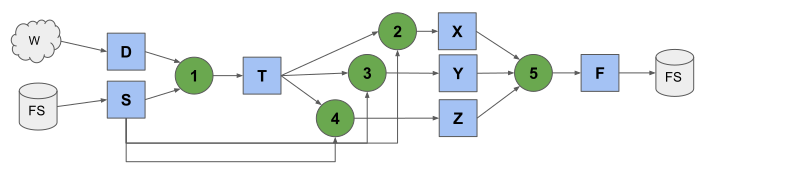
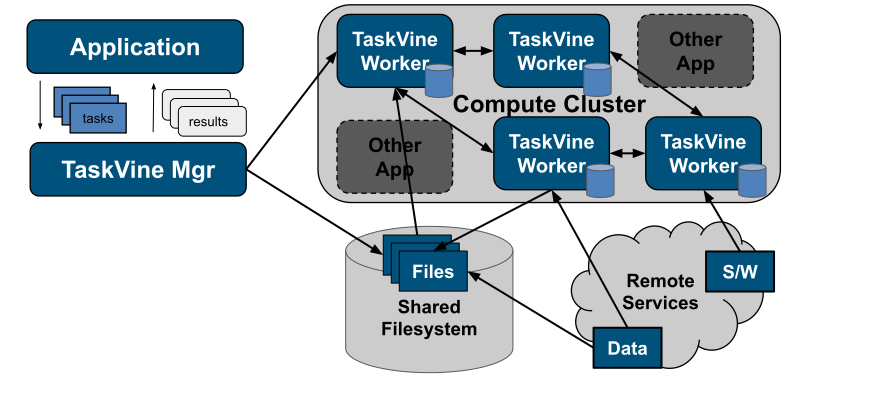
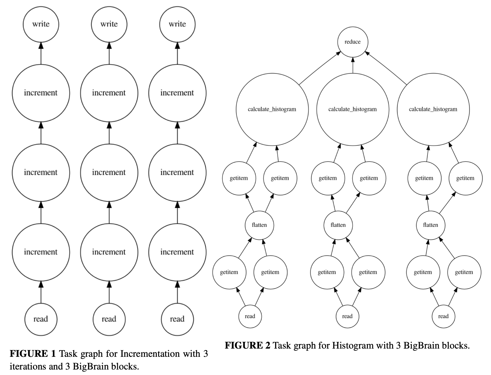
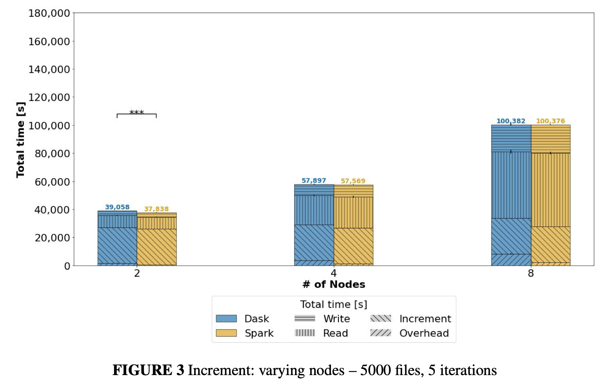
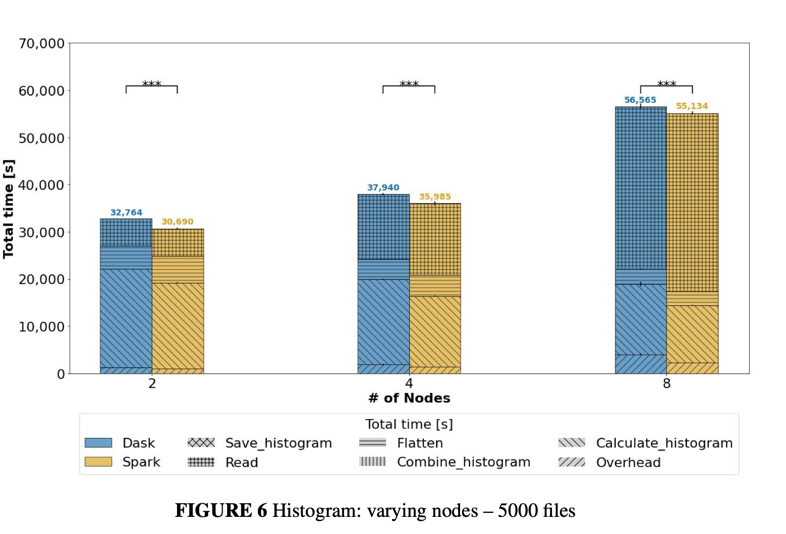

# What is Dask?

## Where we are

:::{.callout-tip icon=false}
## From theory to a system

- a program is a **DAG of tasks**
- a **scheduler** maps tasks to processors
- real schedulers are **dynamic**

**Dask is a Python library implementing the above.**
:::

## The problem

:::{.callout-important}
## NumPy and pandas hit two walls

- **One core.** Most NumPy and pandas operations run on a single core
- **In memory.** The whole dataset must fit in RAM - and intermediate results need room too. `x + x.T` on an 18 GB array needs space for the result as well.

:::

:::{.callout-tip}
## Dask's answer

Keep the NumPy and pandas **APIs**. Change the internals:

- cut the data into pieces (**chunking**)
- describe the work as a task graph
- let a scheduler run the pieces in parallel.
:::

## Dask {.scrollable}

:::{.callout-important icon=false}
## Two things under one name

1. **Collections** --- Array, DataFrame, Bag, Delayed. They look like NumPy arrays, pandas DataFrames and Python lists, but each one is really a **recipe**: a task graph over many small pieces.
2. **Schedulers** --- the machinery that executes a task graph, on the threads of one laptop or the workers of a cluster.

- Collections produce task graphs
- Schedulers consume them
:::

## The architecture

```{.tikz}
\usetikzlibrary{arrows.meta}
\begin{tikzpicture}[
  scale=1.5, every node/.style={scale=1.3},
  box/.style={draw, very thick, rounded corners, minimum width=3.1cm, minimum height=1.0cm, fill=gray!12, font=\small, align=center},
  mid/.style={draw, very thick, rounded corners, minimum width=3.1cm, minimum height=1.0cm, fill=gray!40, font=\small, align=center},
  arr/.style={-{Latex[length=2.4mm]}, very thick}
]
  \node[box] (c1) at (0, 1.5)  {Array};
  \node[box] (c2) at (0, 0.5)  {DataFrame};
  \node[box] (c3) at (0,-0.5)  {Bag};
  \node[box] (c4) at (0,-1.5)  {Delayed / Futures};
  \node[font=\small] at (0, 2.4) {\textbf{collections}};

  \node[mid] (g) at (4.2, 0) {task graph};

  \node[box] (s1) at (8.4, 1.0)  {threads};
  \node[box] (s2) at (8.4, 0.0)  {processes};
  \node[box] (s3) at (8.4,-1.0)  {distributed cluster};
  \node[font=\small] at (8.4, 2.4) {\textbf{schedulers}};

  \foreach \n in {c1,c2,c3,c4} \draw[arr] (\n.east) -- (g.west);
  \foreach \n in {s1,s2,s3}    \draw[arr] (g.east) -- (\n.west);
\end{tikzpicture}
```

Everything on the left **builds** a graph. Everything on the right **runs** one. 

## It looks like NumPy {.scrollable}

:::{.callout-tip icon=false}
## Huge array

```python
import dask.array as da

x = da.ones((50_000, 50_000), chunks=(5_000, 5_000))
x
```

```
dask.array<ones_like, shape=(50000, 50000), dtype=float64,
           chunksize=(5000, 5000), chunktype=numpy.ndarray>
```

That is **18.6 GiB** of `float64`, on a machine with 19 GB of RAM. Creating it took no time and no memory, because nothing was created: `x` is 100 chunks of 190 MiB each that *could* be built on demand.
:::

## Nothing happens until you ask {.scrollable}

:::{.callout-important icon=false}
## Lazy evaluation

```python
y = (x + x.T).mean()
y
```

```
dask.array<mean_agg-aggregate, shape=(), dtype=float64, chunksize=(), ...>
```

Still nothing computed. `y` is a graph of **439 tasks** describing how to get the answer. Only `.compute()` hands that graph to a scheduler:

```python
y.compute()      # 2.0, in 1.5 seconds
```

In NumPy the same line needs `x` *and* the sum in memory at once --- about 37 GiB --- and simply fails here. Dask streams 190 MiB chunks through 12 cores and never holds more than a few at a time.
:::

:::{.callout-note icon=false}
## Parallel *and* out-of-core

One mechanism buys both: chunks are independent tasks, so they can run on different cores; and chunks are small, so only the ones in flight need to be in memory.
:::

## The collections

:::{.callout-tip icon=false}
## Pick the one that matches your data

| collection | mimics | made of | for |
|---|---|---|---|
| `dask.array` | NumPy | many NumPy arrays | images, grids, simulations |
| `dask.dataframe` | pandas | many pandas DataFrames | tabular data, logs, CSV/Parquet |
| `dask.bag` | lists, iterators | many Python lists | JSON, text, semi-structured records |
| `dask.delayed` | ordinary functions | one task per call | custom pipelines that fit none of the above |
| Futures | `concurrent.futures` | tasks submitted eagerly | real-time and evolving workloads |

The first three are **big versions of things you know**. The last two are the general-purpose escape hatch: any Python function can become a task.
:::

## `dask.delayed`: function $\rightarrow$ task {.scrollable}

:::{.callout-tip icon=false}
## The smallest possible Dask program

```python
from dask import delayed

@delayed
def inc(i):
    return i + 1

@delayed
def add(a, b):
    return a + b

y = inc(1)
z = add(y, 10)
z
```

```
Delayed('add-189e31a5-7d42-48fd-a586-f96cab664107')
```

Calling `inc(1)` did **not** run `inc`. It recorded "call `inc` with 1" as a node and returned a placeholder. `add(y, 10)` recorded a second node with an edge from the first.

```python
z.compute()      # 12
```
:::

## Which scheduler?

:::{.callout-important icon=false}
## Same graph, different executors

| scheduler | runs tasks in | good for |
|---|---|---|
| **threads** | a thread pool, one process | NumPy/pandas code that releases the GIL --- the default for arrays and dataframes |
| **processes** | a process pool | pure-Python code that holds the GIL --- the default for bags |
| **synchronous** | the calling thread | debugging: `pdb` and profilers work |
| **distributed** | workers on one machine or many | clusters, and the diagnostic dashboard even on a laptop |

```python
y.compute(scheduler="threads")       # pick per call
```

The first three are the **single-machine** schedulers --- simple, no setup. The distributed scheduler is the one that does the things Lecture 3 called dynamic scheduling: data locality, work stealing, resilience to lost workers.
:::

## Dask {.scrollable}

:::{.callout-warning icon=false}
## Every task pays the scheduler

Measured on this machine, 20 000 do-nothing tasks:

| | per unit of work |
|---|---|
| Dask task (threaded scheduler) | **~0.7 ms** |
| plain Python loop iteration | 15 ns |

A factor of roughly 45 000.
:::

:::{.callout-important}
## Rule
**A scheduling decision must be cheaper than the task it schedules.**

So tasks must be **big** --- aim for at least ~100 ms of real work each. A million tiny tasks is a slow program with a large graph.
:::

## Dask {.scrollable}
:::{.callout-tip icon=false}
## When not to use Dask

- **The data fits in memory and the code is fast enough.** Use NumPy or pandas. Dask is the more complicated tool and will often be slower.
- **The work is a tight loop of tiny operations.** Use Numba or Cython (Lecture 2); the overhead above will eat any gain.
- **You need a database.** Indexed lookups and transactions are not what a task scheduler is for.

Reach for Dask when the data outgrows RAM, or the cores sit idle on work that splits into chunky independent pieces.
:::

# Dask Internals

## Dask {.scrollable}
:::{.callout-tip icon=false}
## Parallel
We refer to algorithms that use multiple cores simultaneously as **parallel**. 
:::

:::{.callout-note icon=false}
## Out-of-core
We refer to systems that efficiently use disk as extensions
of memory as **out-of-core**.
:::

## Dask {.scrollable}
:::{.callout-note icon=false}
## How to execute parallel code?

- represent the structure of our program explicitly as data
within the program itself
- encode task schedules programmatically within a framework
:::

## Dask {.scrollable}
:::{.callout-important icon=false}
## Dask Graph definition

- **A Python dictionary** mapping keys to tasks or values. 
- **A key** is any Python hashable 
- **a value** is any Python object that is not a **task**
- **a task** is a Python tuple with a callable first element.
:::

## Dask {.scrollable}
```python
def inc(i):
  return i + 1

def add(a, b):
  return a + b

x = 1
y = inc(x)
z = add(y, 10)
```

## Dask {.scrollable}


## Dask {.scrollable}
:::{.callout-tip icon=false}
## Dictionary representation
```python
d = {'x': 1,
     'y': (inc, 'x'),
     'z': (add, 'y', 10)}
```
:::

## Dask {.scrollable}
:::{.callout-important icon=false}
## Dask computation
Dask represents a computation as a directed acyclic graph of tasks
with data dependencies. 

It can be said that Dask is a specification to encode such a
graph using ordinary Python data structures, namely dicts, tuples,
functions, and arbitrary Python values.
:::

## Dask {.scrollable}
```python
{'x': 1,
 'y': 2,
 'z': (add, 'x', 'y'),
 'w': (sum, ['x', 'y', 'z'])}
```

:::{.callout-tip icon=false}
## Examples

- **key**: `'x'`, `('x', 2, 3)`
- **task**: `(add, 'x', 'y')`
- **task argument**: `'x'`, `1`, `(inc, 'x')`, `[1, 'x', (inc, 'x')]`
:::

## Dask {.scrollable}
:::{.callout-tip icon=false}
## Valid tasks in a Dask graph
```python
(add, 1, 2)
(add, 'x' , 2)
(add, (inc, 'x'), 2)
(sum, [1, 2])
(sum, ['x', (inc, 'x')])
(np.dot, np.array([...]), np.array([...]))
```
:::

# Arrays

## Dask {.scrollable}
:::{.callout-important icon=false}
## Dask Array
The `dask.array` submodule uses dask graphs to create a
NumPy-like library that uses all of your cores and operates on
datasets that do not fit in memory. 

It does this by building up a
dask graph of **blocked array algorithms**.

Dask array functions produce Array objects that hold on to Dask
graphs. These Dask graphs use several NumPy functions to achieve
the full result.
:::

## Dask {.scrollable}
:::{.callout-note icon=false}
## Blocked Array Algorithms
Blocked algorithms compute a large result like 

- "take the sum of these trillion numbers"

with many small computations like

- "break up the trillion numbers into one million chunks of size one million",
- "sum each chunk", 
- "then sum all of the intermediate sums."

Through tricks like this we can evaluate one large problem by solving very many small problems.

Blocked algorithm organizes a computation so that it works on contiguous chunks of data.
:::

## Dask {.scrollable}
:::{.callout-tip icon=false}
## Blocked Array Algorithms
{height=600}
:::

## Dask {.scrollable}
:::{.callout-tip icon=false}
## Unblocked
```python
for i in range(N):
 for k in range(N):
   r = X[i,k]
   for j in range(N):
     Z[i,j] += r*Y[k,j]
```
:::

:::{.callout-important icon=false}
## Blocked
```python
for kk in range(N/B):
 for jj in range(N/B): 
   for i in range(N):
     for k in range(kk, min(kk+B-1, N)):
       r = X[i,k]
       for j in range(jj, min(jj+B-1,N)):
         Z[i,j] += r*Y[k,j]
```
:::

## Dask {.scrollable}

:::{.callout-note}
It is well known that the memory hierarchy can be better utilized if scientific algorithms are blocked.

Blocking is also known as **tiling**. 

In matrix multiplication example: instead of operating on individual matrix entries, the calculation is performed on submatrices.

`B` is a **blocking factor**.
:::

## Dask {.scrollable}
:::{.callout-important icon=false}
## Blocking features

- Blocking is a general optimization technique for increasing the effectiveness of a memory hierarchy. 
- By reusing data in the faster level of the hierarchy, it cuts down the average **access latency**.
- It also reduces the **number of references** made to slower levels of the hierarchy. 
- Blocking is superior to optimization such as **prefetching**, which hides the latency but does not reduce the memory bandwidth requirement. 
- This reduction is especially im portant for multiprocessors since memory bandwidth is often the bottleneck of the system. 
:::

## Dask {.scrollable}
```python
import dask.array as da
x = da.arange(15, chunks=(5,))
```


## Dask {.scrollable}
:::{.callout-important icon=false}
## Metadata
```python
x # Array object metadata
dask.array<x-1, shape=(15,), chunks=((5, 5, 5)), dtype=int64>
```
:::

:::{.callout-tip icon=false}
## Dask Graph
```python
x.dask # Every dask array holds a dask graph
{('x' , 0): (np.arange, 0, 5),
 ('x', 1): (np.arange, 5, 10),
 ('x' , 2): (np.arange, 10, 15)}
```
:::


## Dask {.scrollable}
:::{.callout-tip icon=false}
## More complex graph
```python
z = (x + 100).sum()
z.dask
{('x', 0): (np.arange, 0, 5),
('x', 1): (np.arange, 5, 10),
('x', 2): (np.arange, 10, 15),
('y', 0): (add, ('x', 0), 100),
('y', 1): (add, ('x', 1), 100),
('y', 2): (add, ('x', 2), 100),
('z', 0): (np.sum, ('y', 0)),
('z', 1): (np.sum, ('y', 1)),
('z', 2): (np.sum, ('y', 2)),
('z',): (sum, [('z', 0), ('z', 1), ('z', 2)])}
```
:::

:::{.callout-note icon=false}
## Execute the Graph
```python
z.compute()
1605
```
:::


## Dask {.scrollable}
:::{.callout-important icon=false}
## dask.array.Array objects
`x` and `z` are both `dask.array.Array` objects containing:

- Dask graph `.dask`
- array shape and chunk shape `.chunks`
- a name identifying which keys in the graph correspond
to the result, `.name`
- a dtype
:::

## Dask {.scrollable}
:::{.callout-note icon=false}
## Chunks
    
A normal NumPy array knows its shape, a dask array must
know its shape and the shape of all of the internal NumPy blocks
that make up the larger array. 

These shapes can be concisely
described by a tuple of tuples of integers, where each internal
tuple corresponds to the lengths along a single dimension.

In the example above we have a 20 by 24 array cut into
uniform blocks of size 5 by 8. The chunks attribute describing
this array is the following:

```python
chunks = ((5, 5, 5, 5), (8, 8, 8))
```
:::


## Dask {.scrollable}
:::{.callout-important icon=false}
## Chunks need not be uniform!
```python
x[::2].chunks
((3, 2, 3, 2), (8, 8, 8))
x[::2].T.chunks
((8, 8, 8), (3, 2, 3, 2))
```
:::


## Dask {.scrollable}
:::{.callout-tip icon=false}
## Dask Array operations

- arithmetic and scalar math: `+`, `*`, `exp`, `log`
- reductions along axes: `sum()`, `mean()`, `std()`, `sum(axis=0)`
- tensor contractions / dot products / matrix multiplication: `tensordot`
- axis reordering / transposition: `transpose`
- slicing: `x[:100, 500:100:-2]`
- utility functions: `bincount`, `where`
:::


## Dask {.scrollable}
:::{.callout-important icon=false}
## Ahead-of-time shape limitations
```python
x[x > 0]
```
:::

# Dask Task Scheduling

## Dask {.scrollable}
Three layers: **collections** build the graph, the **scheduler** decides what runs where, **workers** execute.


## Scheduling {.scrollable}
:::{.callout-important icon=false}
## What does Dask scheduler do?

- execute DAGs on parallel hardware
- manage resource allocation across DAG nodes
:::


## Dask Scheduling
:::{.callout-note icon=false}
## Dask Scheduler types

- **Single-machine scheduler:** This scheduler provides basic features on a local process or thread pool. This scheduler was made first and is the default. It is simple and cheap to use, although it can only be used on a single machine and does not scale
- **Distributed scheduler:** This scheduler is more sophisticated, offers more features, but also requires a bit more effort to set up. It can run locally or distributed across a cluster
:::

## DAG


## Dask Scheduling


## Scheduling {.scrollable}
:::{.callout-tip icon=false}
## Single-thread scheduler
```python
import dask
dask.config.set(scheduler='synchronous')  # overwrite default with single-threaded scheduler
```
:::

:::{.callout-important icon=false}
## Notes

- Useful for debugging or profiling
- No parallelism at all
:::

## Scheduling {.scrollable}
:::{.callout-tip icon=false}
## Thread scheduler
```python
import dask
dask.config.set(scheduler='threads')  # overwrite default with threaded scheduler 
```
:::

:::{.callout-important icon=false}
## Notes

- Small overhead of 50 microseconds per task
- Only provides parallelism when executing non-Python code (because of GIL)
:::

## Scheduling {.scrollable}
:::{.callout-tip icon=false}
## Process scheduler
```python
import dask
dask.config.set(scheduler='processes')  # overwrite default with multiprocessing scheduler
```
:::

:::{.callout-important icon=false}
## Notes

- Performance penalties when inter-process communication is heavy
- Can provide parallelism when executing Python code
:::

## Scheduling {.scrollable}
:::{.callout-note icon=false}
## Distributed (local) scheduler
```python
from dask.distributed import Client
client = Client()
# or
client = Client(processes=False)
```
:::

:::{.callout-important icon=false}
## Notes

- Can be more efficient than the multiprocessing scheduler on workloads that require multiple processes
- Diagnostic dashboard and async API
:::

## Scheduling {.scrollable}
:::{.callout-tip icon=false}
## Distributed (cluster) scheduler
```python
# You can swap out LocalCluster for other cluster types

from dask.distributed import LocalCluster
from dask_kubernetes import KubeCluster

# cluster = LocalCluster()
cluster = KubeCluster()  # example, you can swap out for Kubernetes

client = cluster.get_client()
```
:::

:::{.callout-important icon=false}
## Notes
- Can be setup either locally, or e.g. on a pre-existing Kubernetes cluster
- Different cluster backends easy to swap
:::

## Scheduling {.scrollable}


## Issues
:::{.callout-important icon=false}
## Issues

- Resource starvation
- Worker failures
- Data loss
:::

## Dask {.scrollable}
Graph creation and graph scheduling are separate problems!

Current Dask scheduler is **dynamic**.

:::{.callout-important icon=false}
## Current Dask scheduler logic

- A worker reports that it has completed a task and that it
is ready for another.
- We update runtime state to record the finished
task, 
- mark which new tasks can be run, which data can be released,
etc. 
- We then choose a task to give to this worker from among the
set of ready-to-run tasks. This small choice governs the macroscale performance of the scheduler.
:::

## Dask {.scrollable}
:::{.callout-tip icon=false}
## Out-of-core computation - which task to choose?

- last in, first out 
- select tasks whose data dependencies were most recently made available. 
- this causes a behavior where long chains of related tasks trigger each other
- it forces the scheduler to finish related tasks before starting new ones. 
- **implementation:** a simple stack, which can operate in constant time.
:::

## Dask {.scrollable}


## Dask {.scrollable}


## Dask Scheduling
:::{.callout-important icon=false}
## What the scheduler actually has to decide
Every one of these is a scheduling decision, made thousands of times a second:

- which task runs **next** (ordering)
- on **which worker** (placement)
- whether to **move** a task to data, or data to a task
- what to **keep** in memory and what to **spill** to disk
- what to **recompute** after a worker dies
- when to ask for **more workers**, and which ones to retire
:::

## Ordering: the static pass
:::{.callout-note icon=false}
## `dask.order`
Before *any* task runs, Dask walks the whole graph once and assigns every key an integer priority. Both the local and the distributed scheduler use it.

This is the one genuinely **static** step in Dask -- and note what it optimizes: not makespan, but **memory**.
:::

:::{.callout-tip icon=false}
## Objectives
1. finish chains you have started, so intermediate results can be **released**
2. prefer tasks that **unblock** many dependents, or complete an output
3. do all of this in roughly linear time -- the pass runs on every `compute()`
:::

## Ordering: why memory, not makespan
```{.tikz}
\usetikzlibrary{arrows.meta}
\begin{tikzpicture}[
  scale=1.15, every node/.style={scale=1.15},
  big/.style={draw, very thick, rounded corners, minimum width=1.5cm, minimum height=0.8cm, fill=gray!30, font=\scriptsize, align=center},
  sml/.style={draw, very thick, circle, minimum size=0.75cm, fill=gray!12, font=\scriptsize},
  res/.style={draw, very thick, rounded corners, minimum width=1.3cm, minimum height=0.7cm, fill=gray!45, font=\scriptsize},
  arr/.style={-{Latex[length=2mm]}, thick},
  ord/.style={font=\scriptsize\bfseries, inner sep=1pt}
]
 % ---- left: breadth-first
 \node[font=\small\bfseries] at (2.2,4.6) {breadth-first};
 \foreach \i/\x in {1/0.4, 2/2.2, 3/4.0} {
   \node[big] (l\i) at (\x,3.5) {read\\{\scriptsize 100\,MB}};
   \node[sml] (m\i) at (\x,2.0) {$f$};
   \draw[arr] (l\i) -- (m\i);
 }
 \node[res] (lr) at (2.2,0.7) {sum};
 \foreach \i in {1,2,3} {\draw[arr] (m\i) -- (lr);}
 \node[ord] at (-0.45,3.5) {1};  \node[ord] at (1.35,3.5) {2}; \node[ord] at (3.15,3.5) {3};
 \node[ord] at (-0.15,2.0) {4};  \node[ord] at (1.65,2.0) {5}; \node[ord] at (3.45,2.0) {6};
 \node[font=\small] at (2.2,-0.1) {peak: \textbf{300\,MB} live};

 % ---- right: depth-first
 \node[font=\small\bfseries] at (8.6,4.6) {depth-first};
 \foreach \i/\x in {1/6.8, 2/8.6, 3/10.4} {
   \node[big] (r\i) at (\x,3.5) {read\\{\scriptsize 100\,MB}};
   \node[sml] (n\i) at (\x,2.0) {$f$};
   \draw[arr] (r\i) -- (n\i);
 }
 \node[res] (rr) at (8.6,0.7) {sum};
 \foreach \i in {1,2,3} {\draw[arr] (n\i) -- (rr);}
 \node[ord] at (5.95,3.5) {1};  \node[ord] at (7.75,3.5) {3}; \node[ord] at (9.55,3.5) {5};
 \node[ord] at (6.25,2.0) {2};  \node[ord] at (8.05,2.0) {4}; \node[ord] at (9.85,2.0) {6};
 \node[font=\small] at (8.6,-0.1) {peak: \textbf{100\,MB} live};
\end{tikzpicture}
```

## Ordering: why memory, not makespan {.scrollable}
:::{.callout-important icon=false}
## The trade-off
- pure **breadth-first** maximises available parallelism -- and holds every intermediate result at once
- pure **depth-first** minimises memory -- and can leave processors with nothing ready to run

`dask.order` is a hybrid, and getting it right is genuinely hard: the ordering pass has been rewritten several times, and a regression there shows up to users as *"my job used to fit in memory"*.
:::

:::{.callout-tip icon=false}
## Priorities at run time
The distributed scheduler orders ready tasks by a **triple**:
$$
(\text{user priority},\; \text{submission generation},\; \texttt{dask.order}\ \text{index})
$$
so later-submitted work does not starve earlier work, and within one graph the static order decides.
:::

## Placement: `decide_worker` {.scrollable}
:::{.callout-note icon=false}
## The candidate set
When a task becomes ready, the scheduler looks at the workers that **already hold its dependencies**. If it has none, any worker will do.
:::

:::{.callout-tip icon=false}
## The objective
For each candidate, estimate
$$
\text{start time} \;\approx\; \underbrace{\frac{\sum \text{expected durations of queued tasks}}{\text{n\_threads}}}_{\text{occupancy}} \;+\; \underbrace{\frac{\text{bytes of missing dependencies}}{\text{measured bandwidth}}}_{\text{transfer}}
$$
and take the minimum. This is list scheduling's *processor selection* phase -- with **measured** rather than given costs.
:::

## Placement: where the numbers come from
:::{.callout-important icon=false}
## The scheduler is also a measurement system
- every task is tagged with a **prefix** (`'read_parquet'`, `'add'`, ...); Dask keeps a rolling average of observed durations per prefix and uses it to predict the next one
- **bandwidth** between every pair of workers is measured from actual transfers
- **`nbytes`** of every result in memory is tracked, so transfer cost is known

None of this exists in the classical model. All of it has to be maintained, at every task completion, for the life of the cluster.
:::

## Work stealing in Dask {.scrollable}
:::{.callout-note icon=false}
## The loop
Every **100 ms** the scheduler compares saturated workers against idle ones and moves *pending* tasks between them. Enabled by default:
```yaml
distributed:
  scheduler:
    work-stealing: true
    work-stealing-interval: 100ms
```
:::

:::{.callout-tip icon=false}
## What may be stolen
Tasks are bucketed by the ratio
$$
\frac{\text{cost to move the dependencies}}{\text{expected compute time}}
$$
Cheap-to-move, expensive-to-run tasks are stolen freely. A task whose inputs are a gigabyte and whose body takes 5 ms is never worth stealing -- and tasks with explicit **worker restrictions** are never stolen at all.
:::

## When greedy goes wrong: root task overproduction
:::{.callout-important icon=false}
## A real, expensive bug class
```python
df = dd.read_parquet("s3://.../*.parquet")   # 10 000 partitions
df.map_partitions(expensive).sum().compute()
```
A greedy scheduler sees 10 000 **ready** root tasks and no reason not to run them. Workers cheerfully load far more data than the downstream tasks can consume, and the cluster dies of memory exhaustion -- while doing nothing wrong by the greedy principle.
:::

:::{.callout-tip icon=false}
## The fix: don't be greedy
Dask added a `queued` task state and the `worker-saturation` knob: a worker is given roughly $1.1 \times$ its thread count of root tasks, and the rest **wait on the scheduler**.

Deliberately leaving work unassigned, to protect memory.
:::

## The task state machine
```{.tikz}
\usetikzlibrary{arrows.meta}
\begin{tikzpicture}[
  scale=1.25, every node/.style={scale=1.25},
  st/.style={draw, very thick, rounded corners, minimum width=2.1cm, minimum height=0.85cm, fill=gray!15, font=\small, align=center},
  term/.style={draw, very thick, rounded corners, minimum width=2.1cm, minimum height=0.85cm, fill=gray!40, font=\small, align=center},
  arr/.style={-{Latex[length=2mm]}, thick, font=\scriptsize}
]
  \node[st]   (forg) at (-2.5,2.6) {forgotten};
  \node[st]   (rel)  at (0,2.6)    {released};
  \node[st]   (wait) at (3.0,2.6)  {waiting};
  \node[st]   (proc) at (6.4,2.6)  {processing};
  \node[term] (mem)  at (9.4,2.6)  {memory};

  \node[st]   (held) at (4.3,0.8)  {queued /\\no-worker};
  \node[st]   (err)  at (7.9,0.8)  {erred};

  \draw[arr] (rel)  -- (forg);
  \draw[arr] (rel)  -- (wait);
  \draw[arr] (wait) -- (proc) node[midway,above]{deps ready};
  \draw[arr] (proc) -- (mem)  node[midway,above]{done};
  \draw[arr] (wait) -- (held) node[pos=0.65,left,inner sep=1pt]{held back};
  \draw[arr] (held) -- (proc);
  \draw[arr] (proc) -- (err)  node[pos=0.6,right,inner sep=1pt]{raised};
  \draw[arr] (mem) to[out=90,in=90,looseness=0.6]
      node[midway,above]{dependents done / worker lost} (rel);
  \draw[arr] (err) to[out=-90,in=-90,looseness=0.45]
      node[midway,below]{retry} (rel);
\end{tikzpicture}
```

## The task state machine
:::{.callout-note icon=false}
## And that is only the scheduler's half
`queued` and `no-worker` are distinct: `queued` means *the scheduler is deliberately holding this back* (see root task overproduction), `no-worker` means *no worker satisfies its restrictions*.

The **worker** runs its own state machine in parallel, with states like `waiting`, `ready`, `constrained`, `executing`, `long-running`, `fetch`, `flight`, `memory`, `cancelled`, `resumed`.

Both machines exchange messages over an unreliable network, so every transition has to be idempotent and every message has to tolerate arriving late, twice, or after the worker it refers to has already died.
:::

:::{.callout-important icon=false}
## This is the honest answer to "what is a scheduler?"
Not an algorithm. A **distributed state machine** with a cost model bolted on.
:::

## Memory: the other resource
:::{.callout-tip icon=false}
## Worker memory thresholds (fractions of the limit)

| threshold | default | action |
|---|---|---|
| `target` | 0.60 | spill least-recently-used results to disk |
| `spill` | 0.70 | spill based on *process* memory, not tracked bytes |
| `pause` | 0.80 | stop accepting new tasks; keep serving data |
| `terminate` | 0.95 | the nanny kills the worker |

:::

:::{.callout-important icon=false}
## Unmanaged memory
Dask knows the size of results it holds. It does **not** know about a C library's arena, a leaked buffer, or memory freed by Python but never returned to the OS. Much real-world Dask debugging is exactly this gap.
:::

## Failure: the graph is the backup
:::{.callout-note icon=false}
## What happens when a worker dies
1. the scheduler marks every result that lived only on that worker as **lost**
2. the tasks that produced them go back to `released` $\to$ `waiting`
3. their *dependencies* may now also be missing -- so the recovery cascades backwards through the graph
4. everything is recomputed and the job continues

The DAG is not just a schedule. It is the **lineage** that makes recovery possible -- the same idea as Spark's RDDs.
:::

:::{.callout-tip icon=false}
## Guardrails
`retries=` per task, `allowed-failures` (default 3) before a task is declared poisonous, and a `Nanny` process that restarts workers. Without the failure counter, one segfaulting task kills the cluster one worker at a time.
:::

## Steering the scheduler {.scrollable}
:::{.callout-tip icon=false}
## What users can annotate
```python
with dask.annotate(priority=10):          # jump the queue
    urgent = expensive(x)

with dask.annotate(resources={"GPU": 1}): # abstract semaphore
    y = train(urgent)

with dask.annotate(workers=["tcp://10.0.0.5:8786"],
                   allow_other_workers=True):
    z = reads_local_file()

future = client.submit(f, x, retries=3, priority=-1)
```
:::

:::{.callout-important icon=false}
## Note
`resources` are **not enforced**. They are counters the scheduler respects -- nothing stops your task from using two GPUs.
:::

## Elasticity
:::{.callout-note icon=false}
## Adaptive scaling
```python
cluster.adapt(minimum=2, maximum=100)
```
The scheduler watches occupancy and asks the cluster manager for more workers, or gives them back.
:::

:::{.callout-important icon=false}
## Retiring a worker is a scheduling problem of its own
You cannot just switch it off -- it holds results other tasks need. **Graceful retirement** replicates its data elsewhere *first*, then removes it. Do that badly and autoscaling turns into an unbounded recomputation storm.

Meanwhile $P$ changes underneath every estimate the scheduler has made. Recall Graham's anomalies.
:::

## When the graph itself is the problem
:::{.callout-important icon=false}
## Shuffles
An all-to-all shuffle of $n$ partitions is $O(n^2)$ edges. At 10 000 partitions that is $10^8$ tasks -- the scheduler runs out of memory before a single row moves.

Dask's answer was to stop expressing it as a graph: **P2P shuffle** makes the exchange a *side service* that workers run among themselves, appearing to the scheduler as $O(n)$ tasks.
```yaml
dataframe:
  shuffle:
    method: p2p     # the alternative is the old "tasks" graph
```
Now the default on distributed clusters -- the graph-based shuffle is the fallback.
:::

## Scheduler overhead
:::{.callout-important icon=false}
## The budget
- threaded scheduler: **~50 $\mu$s** per task
- distributed scheduler: **~1 ms** per task round trip; a single central scheduler saturates somewhere in the low thousands of tasks per second
:::

:::{.callout-tip icon=false}
## What follows from that number
- a task should do **at least ~100 ms** of work, or you are paying more to schedule it than to run it
- prefer chunks around **100 MB**; graphs beyond $10^5$--$10^6$ tasks start to hurt the scheduler itself
- "my Dask job is slow" is, very often, "my tasks are too small"

The greedy scheduling principle has no term for this. Real systems are dominated by it.
:::

## Diagnostics
:::{.callout-note icon=false}
## You cannot schedule what you cannot see
- the **dashboard**: task stream, progress, worker memory, per-worker profiles
- `client.profile()` -- statistical profiler across all workers
- `performance_report()` -- a self-contained HTML record of a run
- `dask.visualize()` / `.dask` -- look at the graph before you run it
:::

:::{.callout-tip icon=false}
## What to look for in the task stream
white gaps (starvation), red bars (data transfer), a long thin tail (stragglers), or one colour dominating (a fused task hiding everything else).
:::

## Taskvine {.scrollable}
:::{.callout-note icon=false}
## Description
TaskVine is a framework for building large scale data intensive dynamic workflows for:

- high performance computing (HPC) clusters
- GPU clusters
- cloud service providers
- and other distributed computing systems.

TaskVine is our third-generation workflow system, built on our twenty years of experience creating scalable applications in fields such as

- high energy physics
- bioinformatics
- molecular dynamics
- and machine learning.

:::

## Taskvine {.scrollable}
:::{.callout-note icon=false}
## Workflow
A **workflow** is a collection of programs and files that are organized in a graph structure, allowing parts of the workflow to run in a parallel, reproducible way.



:::

## Taskvine {.scrollable}
:::{.callout-note icon=false}
## Steps

- A TaskVine workflow requires:
  - a **manager** 
  - and a large number of **worker** processes.
- The application generates a large number of small tasks, which are distributed to workers.
- As tasks access external data sources and produce their own outputs, more and more data is pulled into local storage on cluster nodes.
- This data is used to accelerate future tasks and avoid re-computing existing results. The application gradually grows "like a vine" through the cluster.
:::

## Taskvine {.scrollable}
:::{.callout-note icon=false}
## Architecture

:::


## Taskvine {.scrollable}
:::{.callout-note icon=false}
## Features and error handling

- While an application is running, workers may be added or removed as computing resources become available. (**elasticity**)
- Newly added workers will gradually accumulate data within the cluster.
- Removed (or failed) workers are handled gracefully, and tasks will be **retried** elsewhere as needed. 
- If a worker failure results in the loss of files, tasks will be re-executed as necessary to re-create them.
:::

## Taskvine {.scrollable}
:::{.callout-note icon=false}
## Coding it

- Individual tasks can be simple Python functions, complex Unix applications, or serverless function invocations.
- The **key idea** is that you declare file objects, and then declare tasks that consume them and produce new file objects.
  <!-- For example, this snippet draws an input file from the Project Gutenberg repository and runs a Task to search for the string "needle", producing the file output.txt: -->
```python
f = m.declare_url("https://www.gutenberg.org/cache/epub/2600/pg2600.txt")
g = m.declare_file("myoutput.txt")

t = Task("grep needle warandpeace.txt > output.txt")
t.add_input(f, "warandpeace.txt")
t.add_output(g, "output.txt")
```
:::

## Taskvine {.scrollable}
:::{.callout-tip icon=false}
## Task options

- Each task can be labelled with the resources (CPU cores, GPU devices, memory, disk space) that it needs to execute. 
- If you don't know the resources needed, you can enable a resource monitor to automatically track, report, and allocate what each task uses.
- This allows each worker to pack the appropriate number of tasks. For example, a worker running on a 64-core machine could run 32 dual-core tasks, 16 four-core tasks, or any other combination that adds up to 64 cores. 
:::

## Taskvine {.scrollable}
:::{.callout-note icon=false}
## As Dask Scheduler
TaskVine manager can be used as Dask scheduler:
```python
try:
    import dask
    import awkward as ak
    import dask_awkward as dak
    import numpy as np
except ImportError:
    print("You need dask, awkward, and numpy installed")
    print("(e.g. conda install -c conda-forge dask dask-awkward numpy) to run this example.")

behavior: dict = {}

@ak.mixin_class(behavior)
class Point:
    def distance(self, other):
    return np.sqrt((self.x - other.x) ** 2 + (self.y - other.y) ** 2)


if __name__ == "__main__":
    # data arrays
    points1 = ak.Array([
    [{"x": 1.0, "y": 1.1}, {"x": 2.0, "y": 2.2}, {"x": 3, "y": 3.3}],
    [],
    [{"x": 4.0, "y": 4.4}, {"x": 5.0, "y": 5.5}],
    [{"x": 6.0, "y": 6.6}],
    [{"x": 7.0, "y": 7.7}, {"x": 8.0, "y": 8.8}, {"x": 9, "y": 9.9}],
    ])

    points2 = ak.Array([
    [{"x": 0.9, "y": 1.0}, {"x": 2.0, "y": 2.2}, {"x": 2.9, "y": 3.0}],
    [],
    [{"x": 3.9, "y": 4.0}, {"x": 5.0, "y": 5.5}],
    [{"x": 5.9, "y": 6.0}],
    [{"x": 6.9, "y": 7.0}, {"x": 8.0, "y": 8.8}, {"x": 8.9, "y": 9.0}],
    ])
    array1 = dak.from_awkward(points1, npartitions=3)
    array2 = dak.from_awkward(points2, npartitions=3)

    array1 = dak.with_name(array1, name="Point", behavior=behavior)
    array2 = dak.with_name(array2, name="Point", behavior=behavior)

    distance = array1.distance(array2)

    m = vine.DaskVine(port=9123, ssl=True)
    m.set_name("test_manager")
    print(f"Listening for workers at port: {m.port}")

    f = vine.Factory(manager=m)
    f.cores = 4
    f.max_workers = 1
    f.min_workers = 1
    with f:
        with dask.config.set(scheduler=m.get):
            result = distance.compute(resources={"cores": 1}, resources_mode="max", lazy_transfers=True)
            print(f"distance = {result}")
        print("Terminating workers...", end="")
    print("done!")
```
:::

# Other Dask collections

## Dask {.scrollable}
:::{.callout-important icon=false}
## Collections

- **dask.array** = numpy+ threading
- **dask.bag** = toolz+ multiprocessing
- **dask.dataframe** = pandas+ threading
:::

## Dask {.scrollable}
:::{.callout-tip icon=false}
## Dask Bag - Definition
A **bag** is an unordered collection with repeats. 

It is like a Python list but does not guarantee the order of elements. 

The `dask.bag` API contains functions like **map** and **filter** and generally follows the PyToolz API. 

<!-- %We find that it is particularly useful on the front lines of data analysis, particularly in parsing and cleaning up initial data dumps like JSON or log files because it combines the streaming properties and solid performance of projects like cytoolz. -->
:::

## Dask {.scrollable}
```python
>>> import dask.bag as db
>>> import json
>>> b = db.from_filenames('2014-*.json.gz').map(json.loads)
>>> alices = b.filter(lambda d: d['name'] == 'Alice')
>>> alices.take(3)
({'name': 'Alice', 'city': 'LA', 'balance': 100},
{'name': 'Alice', 'city': 'LA', 'balance': 200},
{'name': 'Alice', 'city': 'NYC', 'balance': 300},)

>>> dict(alices.pluck('city').frequencies())
{'LA': 10000, 'NYC': 20000, ...}
```

## Dask {.scrollable}
:::{.callout-important icon=false}
## S3 example
```python
>>> import dask.bag as db
>>> b = db.from_s3('githubarchive-data', '2015-01-01-*.json.gz')
          .map(json.loads)
          .map(lambda d: d['type'] == 'PushEvent')
          .count()
```
:::

## Dask {.scrollable}
  <!-- %https://blog.dask.org/2015/06/26/Complex-Graphs -->


## Dask {.scrollable}
:::{.callout-note icon=false}
## Dask DataFrame - Definition
The **dask.dataframe** module implements a large dataframe
out of many Pandas DataFrames.

It uses a threaded scheduler.
:::

## Dask {.scrollable}
:::{.callout-important icon=false}
## Partitioned datasets
The dask dataframe can compute efficiently on **partitioned datasets** where the different blocks are well separated along an index. 

For example in time series data we may know that all of
January is in one block while all of February is in another.

`Join`, `groupby`, and `range` queries along this index are significantly faster
when working on partitioned datasets.
:::

## Dask {.scrollable}
:::{.callout-tip icon=false}
## Dask DataFrame `join`
{height=550}
:::

## Dask {.scrollable}
:::{.callout-important icon=false}
## Out-of-core parallel SVD example
```python
>>> import dask.array as da
>>> x = da.ones((5000, 1000), chunks=(1000, 1000))
>>> u, s, v = da.svd(x)
```
Out-of-core parallel non-negative matrix factorizations on top of `dask.array`.
:::

## Dask {.scrollable}
:::{.callout-tip icon=false}
## Out-of-core parallel SVD
{height=600}
:::

# Usage

## Usage


## Usage


  <!-- %https://medium.com/pangeo/using-kerchunk-with-uncompressed-netcdf-64-bit-offset-files-cloud-optimized-access-to-hycom-ocean-9008ba6d0d67 -->
  <!-- %https://www.earthdata.nasa.gov/learn/articles/pangeo-project -->

## Usage
  <!-- %\textsc{Pangeo - open, reproducible, scalable geoscience} -->
  <!-- %https://stories.dask.org/en/latest/network-modeling.html -->
{height=600}

# Dask vs Spark

## Comparison with Spark
:::{.callout-important icon=false}
## Setup

- BigBrain20, a 3-D image of the human brain, **total data size** of 606 GiB. 
- dataset provided by the Consortium for Reliability and Reproducibility, entire dataset is 379.83 GiB, used all 3,491 anatomical images, representing 26.67 GiB overall.
<!-- %containing anatomical, diffusion, and functional images of 1,654 subjects acquired in 35 sites, -->
:::

## Comparison with Spark

{height=600}

## Comparison with Spark
{height=600}

## Comparison with Spark
{height=600}

